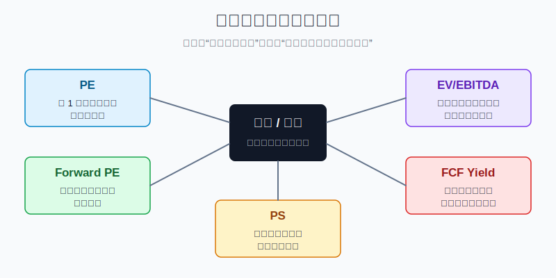
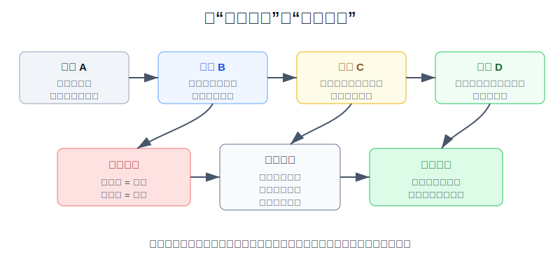
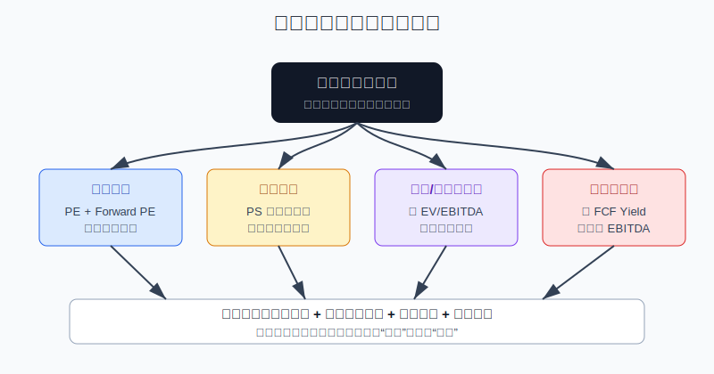

## 散户投资小白金融全品种操盘手册 - 11.6 估值指标 - PE、Forward PE、PS、EV/EBITDA、FCF Yield
  
### 作者  
digoal  
  
### 日期  
2026-06-07   
  
### 标签  
金融产品 , 金融工具 , 散户 , 投资小白 , 全品操盘手册  
  
----  
  
## 背景 
  


> 适用读者: 已经能读美股财报里的收入、利润和现金流, 但看到一堆估值倍数就不知道该看哪个的小白投资者。  
> 本文定位: 投资教育框架, 不构成个性化投资建议。数据口径按 2026-06-06 可核查公开资料整理, 实盘前仍要以 SEC、公司最新披露和券商实时数据为准。

## 先问一个反直觉的问题

同一只股票, 你用 PE 看可能很贵, 用 Forward PE 看可能没那么贵, 用 PS 看又像还行, 用 FCF Yield 看却很危险。不是指标在吵架, 而是它们问的根本不是同一个问题。



## 核心概念: 估值指标不是答案, 是不同的尺

**PE** 是市盈率, 最直白的理解是: 你为公司每 1 美元当前利润付多少钱。SEC Investor.gov 对 P/E 的解释也很朴素: 用当前股价除以当前每股收益, 用来观察股价相对公司盈利是高还是低。公式可以写成:

```text
PE = 股价 / 每股收益
```

**Forward PE** 是远期市盈率, 分母换成未来 12 个月或下一财年的预期每股收益。它比 PE 更贴近市场预期, 但弱点也在这里: 如果分析师预测太乐观, Forward PE 会把贵股票包装得没那么贵。

**PS** 是市销率, 用市值除以收入。它适合利润暂时失真、还在扩张期的公司, 例如软件、平台、电商、早期成长股。但 PS 有一个硬伤: 收入不是利润。100 亿美元收入如果最后留不下现金, 高 PS 就只是买了一个很大的流水账。

**EV/EBITDA** 是企业价值除以 EBITDA。EV 是企业价值, 可以粗略理解为“买下整家公司要付的价格”, 通常等于市值加债务再减现金。EBITDA 是扣除利息、税、折旧和摊销前的利润。这个指标适合比较债务和现金结构差异较大的公司, 但它会弱化资本开支压力, 所以不能替代现金流。

**FCF Yield** 是自由现金流收益率。自由现金流常见算法是经营现金流减资本开支, FCF Yield 则是自由现金流除以市值。它问的是: 扣掉维持和扩张业务所需投入后, 股东用今天的价格能买到多少现金回报。

本节的行动结论先写在前面: **不要问“哪个估值指标最好”, 要按公司状态换尺。稳定盈利看 PE 和 Forward PE; 暂时亏损看 PS, 但必须追问利润路径; 债务和现金差异大看 EV/EBITDA; 资本开支重、利润和现金流脱节时看 FCF Yield。任何一个指标单独给出买入结论, 都不合格。**



## 逻辑推导链

【论证链标题】: 因为每个估值倍数只回答一个局部问题, 而股价反映的是未来现金流、风险和预期的组合, 所以小白不能用单一低倍数判断便宜, 必须用“估值漏斗”逐层排除错配。

### 第一步: 前提陈述

前提A: 股价不是一个孤立数字, 它买的是未来利润和现金流的预期。这是常量。买一家公司, 本质上不是买今天屏幕上的红绿涨跌, 而是买它未来能不能持续赚钱、把钱留下来、再分给股东或投入更高回报的项目。

前提B: 不同估值倍数的分母不同, 所以它们问的问题不同。这是常量。PE 问当前利润, Forward PE 问未来预期利润, PS 问收入规模, EV/EBITDA 问整家公司经营利润, FCF Yield 问真实现金回报。把这些指标混成一句“贵不贵”, 就像拿体重秤量身高。

前提C: 分母会被扭曲。这是变量。利润可能受一次性收益或亏损影响, Forward PE 依赖分析师预测, 收入可能没有利润质量, EBITDA 不扣资本开支, 自由现金流也不是统一会计准则下的净利润指标。分母不干净, 倍数就会给你错觉。

前提D: 行业和公司阶段决定可比性。这是变量。成熟消费公司、云软件公司、银行、能源公司、半导体设备公司, 商业模式完全不同。低 PE 的周期股不一定便宜, 高 PS 的软件股也不一定泡沫; 关键是增长、利润率、资本开支、债务和竞争格局能不能解释这个倍数。

### 第二步: 逻辑推导

由A+B可得: 因为股价买的是未来现金流, 而每个指标只截取一段财务信息, 所以“PE低”不能自动推出“股票便宜”, “PS高”也不能自动推出“股票泡沫”。

由B+C可得: 因为每个分母都有失真点, 所以使用指标前必须先检查分母质量。看 PE 要问利润是否可持续; 看 Forward PE 要问预期是否在上修; 看 PS 要问未来利润率路径; 看 EV/EBITDA 要问资本开支和债务; 看 FCF Yield 要问现金流是否稳定。

再由A+B+C+D可得: 因为公司阶段和行业结构不同, 所以小白真正需要的不是一个神奇倍数, 而是一套顺序: 先判断公司有没有稳定盈利, 再判断利润和现金流是否匹配, 再和同业、自身历史区间、市场预期变化比较。

最后得到核心结论: **估值不是找最低倍数, 而是找“价格、质量、增长、现金流、风险”是否匹配。匹配才进入观察或小仓试错; 不匹配就停手。**

### 第三步: 正常情景下的操作结论

✅ 正常情景: 你研究的是一只普通美股个股, 公司有公开财报, 你能查到收入、净利润、经营现金流、资本开支、债务、现金和分析师预期。

对应操作: 用五问估值漏斗。

1. 公司是否稳定盈利? 是, 先看 PE; 否, PE 失效, 只能暂用 PS。
2. 市场预期利润是否可信? 可信, 再看 Forward PE; 预期正在下修, Forward PE 要打折。
3. 收入能不能变成利润? 能, PS 才有意义; 不能, PS 只是热闹。
4. 债务、现金、折旧差异是否很大? 是, 加看 EV/EBITDA; 金融股不要硬套这个指标。
5. 利润能不能变成自由现金流? 能, FCF Yield 才能支持估值; 不能, 仓位必须降级。

### 第四步: 数据和案例证实

证据1: P/E 的定义本身就限制了它的用途。SEC Investor.gov 的 P/E 词条说明, P/E 是用当前股价除以当前每股收益, 用来比较股价相对盈利高低。这个证据对应前提B: PE 的分母是每股收益, 所以公司亏损、利润一次性波动或盈利质量差时, PE 不是好尺。

证据2: 估值倍数确实受增长、风险、分红、债务和资本回报影响。Aswath Damodaran 的 2026 年 1 月市场回归数据中, 美国公司 PE 回归式把 beta、预期 EPS 增长和派息率作为解释变量, R Squared 为 38.7%; 美国公司 EV/EBITDA 回归式把预期收入增长、债务资本比和资本回报作为解释变量, R Squared 为 45.9%。这个证据对应前提D: 合理倍数不是固定数字, 而是公司基本面的函数。

证据3: 市场整体估值也会随预期摆动。FactSet 在 2025 年 10 月的 Earnings Insight 中记录, 2025 年 10 月 29 日 S&P 500 的 forward 12-month P/E 为 23.1, 高于当时 5 年、10 年、15 年、20 年和 25 年平均值。这个证据对应前提C: Forward PE 看起来精确, 但本质依赖未来 EPS 预期; 预期一旦下修, “不贵”的结论会立刻失效。

证据4: PS 不能替代利润和现金流。Amazon 2022 年报显示, 2022 年净销售额为 5140 亿美元, 但净亏损 27 亿美元; 同年经营现金流为 467.52 亿美元, 扣除相关资本开支后的 free cash flow 为 -115.69 亿美元。这个案例不是说 Amazon 没价值, 而是说明: 只看收入或 PS, 看不到利润波动和资本开支压力。

证据5: SEC 对非 GAAP 指标一直强调谨慎。SEC 关于 Non-GAAP Financial Measures 的解释提到, free cash flow 不应被用来不恰当地暗示它代表可自由支配的剩余现金流, 因为公司还有债务服务等非自由支配支出。这个证据对应前提C: FCF Yield 很有用, 但必须回到现金流表和债务表核对。

历史数据不代表未来。上面这些证据仍有参考价值, 因为它们验证的不是某只股票必涨必跌, 而是估值机制本身: 指标有边界, 分母会失真, 预期会变化, 行业结构会决定倍数。

### 第五步: 前提变化时的替代结论

若前提C改变, 也就是分析师下修利润预期, 推导路径变为: 因为 Forward PE 的分母下降, 所以同样股价对应的 Forward PE 会上升。新结论: 不用“看起来便宜”加仓, 先等新指引和新财报确认。

若前提D改变, 也就是公司从轻资产软件变成重资本开支 AI 算力公司, 推导路径变为: 因为 EBITDA 不扣资本开支, 所以 EV/EBITDA 会低估真实投入压力。新结论: FCF Yield 和资本开支计划优先级上升。

若前提B被误用, 也就是用 PS 给一家成熟低毛利公司找理由, 推导路径变为: 因为收入增长不能自动变成利润, 所以高 PS 没有足够支撑。新结论: 只有在毛利率、经营杠杆和现金流改善被数据证实时, PS 才能继续使用。

失败案例: 只用单一指标买成长股。2022 年的 Amazon 仍有 5140 亿美元收入, 但净利润为负、自由现金流也为负。如果投资者只说“收入这么大, PS 不高”, 就跳过了利润质量和资本开支两道门。后果不是一定亏钱, 而是买入理由不完整; 一旦市场开始重视现金流, 你不知道该持有、减仓还是承认前提失效。



## 实操例子: 10万元账户研究一只美股软件公司

这个例子对应论证链的正常结论: **用估值漏斗逐层判断, 而不是拿最低的那个倍数安慰自己。**

假设小林有 10 万元人民币等值的全球资产账户, 美股个股学习仓上限是总资产的 10%, 单只个股上限是 2%。他研究一只美股软件公司, 股价 100 美元, 每股过去 12 个月收益 2 美元, 明年预期每股收益 4 美元, 每股收入 20 美元。

第一步, 算 PE。100 / 2 = 50 倍。结论: 只看当前利润不便宜, 不能直接买。

第二步, 算 Forward PE。100 / 4 = 25 倍。结论: 如果明年利润真的翻倍, 估值压力会下降; 但小林必须确认利润预期是否来自公司 guidance 和分析师上修, 不是社区想象。

第三步, 算 PS。100 / 20 = 5 倍。结论: 5 倍销售额是否合理, 要看毛利率、续费率和经营利润率。如果收入增长 25%, 但销售费用吞掉大部分毛利, PS 不能单独支持买入。

第四步, 算 EV/EBITDA。假设公司市值 500 亿美元, 债务 50 亿美元, 现金 100 亿美元, 企业价值就是 450 亿美元; EBITDA 为 30 亿美元, EV/EBITDA = 15 倍。结论: 因为现金多于债务, EV 比市值低, 用 EV/EBITDA 能比 PE 更完整地看企业价格。

第五步, 算 FCF Yield。假设经营现金流 45 亿美元, 资本开支 10 亿美元, 自由现金流 35 亿美元; FCF Yield = 35 / 500 = 7%。结论: 如果这 35 亿美元现金流稳定且不是一次性因素, 这家公司不是只靠故事撑估值。

最后动作: 小林不因为 Forward PE 从 50 降到 25 就立刻满仓。他只允许最多 2% 单票学习仓, 并写下三个失效条件: 下季 guidance 下修, 自由现金流转负, 或收入增长放缓但费用率没有下降。任何一条触发, 估值前提作废, 从“可观察”切换为“暂停加仓或减仓”。

如果操作错误, 常见后果是这样的: 小林只看到 Forward PE 25 倍, 觉得比当前 PE 50 倍便宜一半, 于是买到 8% 仓位。下一季公司把预期 EPS 从 4 美元下修到 3 美元, 股价不变时 Forward PE 立刻变成 33 倍; 如果市场同时降低成长股估值, 股价会承受双重压力。纠偏方法不是继续找新指标, 而是承认前提C变化, 先降仓位。

## 可复用框架

【五问估值法】

适用前提: 你研究的是非金融类美股个股, 能拿到最近 10-K、10-Q、公司 IR 数据和券商估值指标。

核心逻辑: 因为不同倍数只回答不同局部问题, 所以先判断公司状态, 再选择指标, 最后检查分母质量。

操作步骤:

1. 有稳定利润, 先看 PE; 没有稳定利润, PE 不作为核心依据。
2. 有可信预期, 再看 Forward PE; 预期下修时, 估值结论降级。
3. 利润暂时失真, 才用 PS; 使用 PS 必须同时写出利润率改善路径。
4. 债务和现金差异大, 加看 EV/EBITDA; 重资本开支公司不能只看 EBITDA。
5. 最后看 FCF Yield; 利润不能变现金, 仓位不能做大。

前提失效时: 如果公司是银行、保险、券商等金融企业, 不要硬套 EV/EBITDA 和普通 FCF Yield; 如果公司商业模式改变, 重新选择指标。

举一反三: 这个框架也适用于 A 股成长股、港股互联网公司和跨境 ETF 的成分股研究。只要你买的是公司, 就要问价格和现金流是否匹配。

【分母体检】

适用前提: 你已经看到一个看起来很便宜或很贵的倍数。

核心逻辑: 因为估值倍数等于价格除以某个财务指标, 所以先检查分母有没有失真, 再谈倍数高低。

操作步骤:

1. PE 分母: 净利润是否有一次性收益、税收影响、投资损益。
2. Forward PE 分母: EPS 预期是否在上修, 还是刚被下修。
3. PS 分母: 收入是否能带来毛利和经营利润。
4. EV/EBITDA 分母: EBITDA 是否掩盖折旧、资本开支和债务压力。
5. FCF Yield 分母: 经营现金流是否稳定, 资本开支是否只是暂时压高或压低。

前提失效时: 如果你无法解释分母质量, 就不能用这个指标做买入理由。

举一反三: 任何“低估值陷阱”都先从分母体检开始。便宜股票真正危险的地方, 往往不是价格低, 而是分母正在变坏。

## 本节行动清单

| 动作 | 合格标准 |
|---|---|
| 先判公司阶段 | 稳定盈利、暂时亏损、高增长、重资本开支、金融企业分开处理 |
| PE 不单独使用 | 只在利润可持续时使用, 并和自身历史及同业比较 |
| Forward PE 看预期变化 | 记录 EPS 预期是上修、持平还是下修 |
| PS 必须配利润路径 | 写清毛利率、经营利润率和现金流改善依据 |
| EV/EBITDA 看资本结构 | 同时检查债务、现金、折旧和资本开支 |
| FCF Yield 回到现金流表 | 用经营现金流减资本开支, 并检查债务服务压力 |
| 写失效条件 | 指引下修、现金流恶化、估值无法被增长解释时降仓 |

## 一句话总结

估值指标不是给你一个“买”或“卖”的按钮, 而是让你检查价格、利润、增长、债务和现金流是否匹配; 小白只要坚持先选尺、再查分母、最后比同业, 就能少掉进“低倍数就是便宜”的坑。

## 参考资料

- SEC Investor.gov: Price-earnings (P/E) Ratio, https://www.investor.gov/introduction-investing/investing-basics/glossary/price-earnings-pe-ratio
- SEC: Non-GAAP Financial Measures, Compliance and Disclosure Interpretations, https://www.sec.gov/rules-regulations/staff-guidance/corporation-finance-interpretations/non-gaap-financial-measures
- Aswath Damodaran, NYU Stern: Market-wide Regressions of Multiples, January 2026, https://pages.stern.nyu.edu/adamodar/New_Home_Page/datafile/MReg26.html
- Aswath Damodaran, NYU Stern: Data for current year, last full update January 9, 2026, https://pages.stern.nyu.edu/~adamodar/New_Home_Page/datacurrent.html
- FactSet: Highest Forward 12-Month P/E Ratio For the S&P 500 in More Than 5 Years, 2025, https://insight.factset.com/highest-forward-12-month-p/e-ratio-for-the-sp-500-in-more-than-5-years
- Amazon.com, Inc.: 2022 Annual Report, https://www.sec.gov/Archives/edgar/data/1018724/000110465923044716/tm233697d4_ars.pdf

> ⚠️ **声明**：本文内容为投资教育目的，所有历史数据、策略框架均为辅助学习工具，不构成证券投资建议。市场有风险，投资需谨慎。实际操作请结合自身风险承受能力，必要时咨询专业投顾。
  
#### [PostgreSQL 解决方案集合](../201706/20170601_02.md "40cff096e9ed7122c512b35d8561d9c8")
  
  
#### [德哥 / digoal's Github - 公益是一辈子的事.](https://github.com/digoal/blog/blob/master/README.md "22709685feb7cab07d30f30387f0a9ae")
  
  
#### [About 德哥](https://github.com/digoal/blog/blob/master/me/readme.md "a37735981e7704886ffd590565582dd0")
  
  

  
