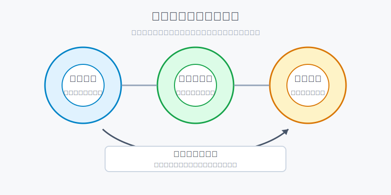
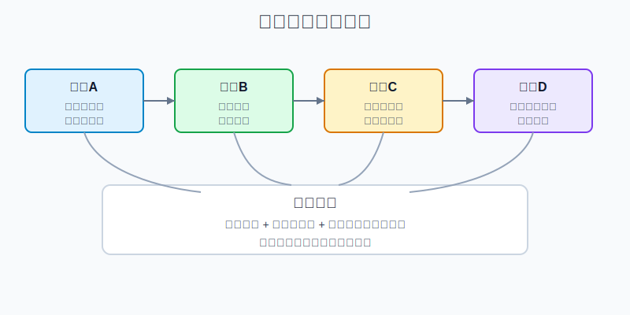
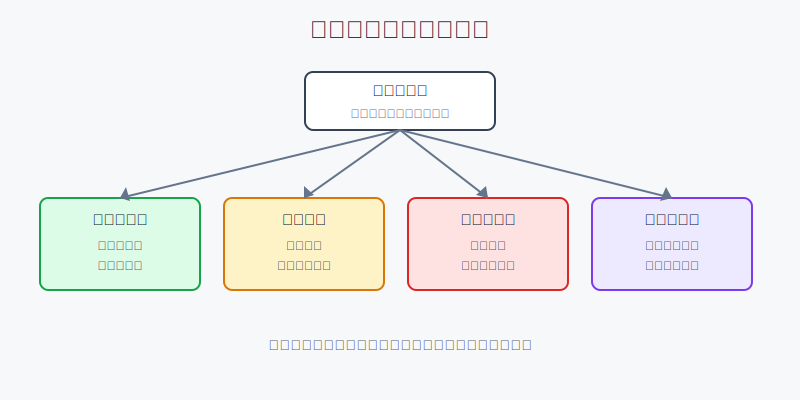

## 散户投资小白金融全品种操盘手册 - 11.7 成长股估值 - 收入增速、利润率改善、市场空间
  
### 作者  
digoal  
  
### 日期  
2026-06-07   
  
### 标签  
金融产品 , 金融工具 , 散户 , 投资小白 , 全品操盘手册  
  
----  
  
## 背景 
  

> 适用读者: 已经知道 PE、PS、Forward PE 这些基础估值词，但一看到美股成长股就不知道“贵得有道理”还是“贵得危险”的小白投资者。  
> 本文定位: 投资教育框架，不构成个性化投资建议。

## 先问一个反直觉的问题

成长股最容易骗人，不是因为它一定不好，而是因为它经常“看起来永远有未来”。问题在于，股票价格买的不是未来故事，而是未来故事能不能变成收入、利润和现金流。**成长股估值的核心，不是 PE 高不高，而是高 PE 背后的三只齿轮有没有一起转。**

## 核心概念: 成长股估值不是看一个数字，而是看未来现金流能不能长出来

PE，就是市盈率，意思是股价相当于每股盈利的多少倍。PS，就是市销率，意思是股价相当于每股收入的多少倍。Forward PE，是用市场预期的未来一年盈利来算 PE。上一节讲估值指标时，我们把这些词拆过；这一节只解决一个更实际的问题: **为什么有些公司 PE 很高，市场还愿意买；有些公司 PE 看起来不算离谱，却一路跌。**

答案在三个变量上。

第一，收入增速。收入是公司生意的水管，水管里的水如果不继续变大，后面的利润和现金流就很难扩张。第二，利润率改善。利润率就是收入里最后能留下多少利润。只涨收入、不涨利润，就像饭店每天客人很多，但每桌都亏钱。第三，市场空间。市场空间决定增长还能跑多远。一个公司一年增长 50%，如果它已经快吃完整个市场，估值就不能按“长期 50% 增长”去想。

本节先给行动结论: **小白研究成长股，不要先问“这家公司是不是好公司”，而要先问三件事: 收入还能不能高增、利润率有没有改善路径、市场空间是否足够大。三件事同时成立，才允许小仓位分批研究；任意一件明显失效，就不要用“长期看好”掩盖估值风险。**

## 逻辑推导链

【论证链标题】: 因为成长股价格提前反映未来，所以只有收入增速、利润率改善和市场空间同时成立，高估值才有被业绩消化的路径；任一前提失效，价格就要被重新定价。

── 第一步: 前提陈述

前提A: 成长股价格买的是未来，而不是现在。这是常量。成长股像一张提前付款的电影票，你付高价，是因为你相信后面的剧情值得看。问题是，如果电影没有按预告片兑现，高票价就会被市场质疑。

前提B: 收入增速是成长股估值的第一齿轮。这是变量。收入持续高增，说明客户、订单、使用量或销量还在扩张；收入增速下滑，说明增长故事开始从“加速车道”进入“普通车道”。

前提C: 利润率改善是第二齿轮。这是变量。公司早期可以为了抢市场少赚钱，甚至亏钱；但到一定阶段，规模效应必须出现。规模效应的意思是: 同样一套研发、销售和管理体系，服务更多客户以后，单位成本下降，利润率上升。

前提D: 市场空间是第三齿轮。这是变量。市场空间越大，公司越有可能在多年里保持增长；市场空间越小，短期增速再漂亮，也容易很快撞到天花板。

前提E: 股价里已经包含市场预期。这是常量加变量。好公司不等于好股票，因为股价可能已经把好消息提前算进去了。成长股真正涨得动，往往不是“业绩不错”，而是“业绩比市场原来想的更强、更久、更赚钱”。

── 第二步: 逻辑推导

由A+B可得: 因为成长股价格买的是未来，所以收入增速不能只看过去一年漂亮不漂亮，而要看未来几个季度是否仍能维持。收入是估值消化的起点。

由B+C可得: 因为收入增长只有变成利润增长，才能让 PE、Forward PE 或自由现金流收益率变得更合理，所以只讲收入、不讲利润率，是不完整的成长股估值。

再由B+C+D可得: 因为高收入增速、高利润率改善和大市场空间同时成立时，未来利润和现金流可能连续多年放大，所以市场才可能容忍较高估值。

最后由B+C+D+E可得: 因为股价已经包含预期，所以成长股不是“好就买”，而是要检查: 当前价格要求公司交出什么成绩。如果价格要求它连续多年高增、高利润、低竞争，而现实只满足其中两项，风险就已经出现。

── 第三步: 正常情景下的操作结论

✅ 正常情景: 公司收入仍在高增长区间，利润率有清晰改善，市场空间由真实客户预算支撑，股价没有把未来十年的好消息一次性透支。

对应操作: 可以把它放入成长股观察池，先用小仓位研究，而不是一上来重仓。小白示例上，单只成长股先控制在总资产 2%-5% 以内，第一笔只买计划仓位的三分之一；后续必须等收入、利润率和市场空间继续验证，再考虑加到计划上限。

── 第四步: 数据和案例证实

证据1: NVIDIA 是三只齿轮同时转动的正面案例，但也正因为如此，市场对它的要求很高。NVIDIA 在 2026年5月公布的 2027财年第一季度结果显示，季度收入 816.15 亿美元，同比增长 85%；Data Center 收入 752 亿美元，同比增长 92%；GAAP 毛利率 74.9%；营业利润 535.36 亿美元，同比增长 147%。这组数据对应前提B和前提C: 收入高增没有单独存在，而是和高毛利、强营业利润一起出现。

证据2: 市场空间不是空口讲故事。Gartner 在 2026年5月发布预测，2026年全球 AI 支出预计达到 2.59 万亿美元，同比增长 47%；Gartner 在 2026年2月的 IT 支出预测中也写到，2026年全球 Data Center Systems 支出预计达到 6534.03 亿美元，同比增长 31.7%。这对应前提D: AI 基础设施确实有大市场空间，但这只说明赛道有水，不等于每家公司都能分到高利润。

证据3: Zoom 是“增长从爆发回到常态”后估值逻辑变化的案例。Zoom 2021财年收入 26.514 亿美元，同比增长 326%，GAAP 经营利润率 24.9%；但到 2026财年，Zoom 全年收入 48.688 亿美元，同比增长 4.4%，第四季度收入 12.470 亿美元，同比增长 5.3%。这不是说 Zoom 不是好公司，而是说明前提B改变后，市场不能再用疫情爆发期的增长速度给它估值。

证据4: Tesla 是“收入和利润率齿轮不同步”时需要重估的案例。Tesla 2025年全年总收入 948.27 亿美元，同比下降 3%；汽车收入 695.26 亿美元，同比下降 10%；营业利润率 4.6%，低于 2024年的 7.2% 和 2022年的 16.8%。这对应前提B和前提C: 如果主要业务收入承压、利润率下行，即使公司还有 AI、机器人、能源等长期叙事，传统成长股估值前提也已经变弱。

历史数据不代表未来。它们仍有参考价值，是因为它们验证的不是某只股票短线涨跌，而是同一条结构规律: **成长股估值靠未来业绩消化；未来业绩靠收入、利润率和市场空间共同支撑。**

── 第五步: 前提变化时的替代结论

若前提B改变，也就是收入增速明显放缓，推导路径变为: 因为估值消化的第一齿轮变慢，所以高 PE 或高 PS 需要重新解释。新结论: 停止加仓，等公司证明新产品、新客户或新市场能重新拉动收入。

若前提C改变，也就是收入还在涨，但毛利率、营业利润率或自由现金流率下降，推导路径变为: 因为增长没有变成利润，所以市场会怀疑公司是在用降价、补贴或高投入硬撑规模。新结论: 降低仓位上限，用更保守的估值看它。

若前提D改变，也就是市场空间不如预期，或竞争对手快速进入，推导路径变为: 因为未来增长年限缩短，所以高估值不能继续按长期高增假设成立。新结论: 从成长股观察池降级为普通行业股，只保留很小观察仓，甚至退出。

若前提E改变，也就是公司仍然优秀，但股价已经把未来多年好消息提前透支，推导路径变为: 因为好公司也可能买贵，所以不追高。新结论: 只观察，或用极小仓位跟踪，等待业绩继续验证、估值回落或市场情绪降温。

失败案例: 疫情高峰后的 Zoom 和近年利润率承压的 Tesla，都说明同一件事。成长叙事没有消失，但关键前提改变了。如果投资者还按旧增速、旧利润率、旧市场想象去估值，就容易把“公司还有故事”误读成“股票仍然便宜”。

## 实操例子: 10万元账户怎么研究一只美股成长股

这个例子对应论证链的正常结论: **只有收入增速、利润率改善和市场空间同时通过检查，成长股才允许小仓位分批；任何前提变坏，都先降风险。**

假设小林有 10万元长期投资资金，核心资产已经用美股宽基ETF打底。他准备拿其中最多 5000元研究一只 AI 软件公司或芯片公司。注意，这 5000元是单股上限，不是第一次下单金额。

第一步，查收入增速。小林打开公司 IR 页面或 SEC 文件，记录最近 8个季度收入同比增速。如果增速从 60%、55%、48%、40% 一路降到 20% 以下，他不能只说“AI 长期很大”，而要问: 是短期基数问题，还是客户需求变慢。如果公司没有给出清晰解释，他不加仓。

第二步，查利润率改善。小林记录毛利率、营业利润率和自由现金流率。毛利率告诉他产品有没有定价能力；营业利润率告诉他销售、研发、管理费用吃掉多少利润；自由现金流率告诉他公司赚到的钱能不能留下来。如果收入增长 40%，但营业利润率从 20% 掉到 8%，说明第二齿轮没跟上。

第三步，查市场空间。小林不接受一句“市场很大”就结束。他要找三个证据: 客户预算是否在增加，行业总支出是否在增长，公司产品是否正好卡在这笔预算里。比如 AI 基础设施公司，就要看数据中心、云厂商资本开支、企业 AI 支出；消费互联网公司，就要看用户规模、付费率和广告预算。

第四步，反推当前价格要求什么成绩。假设这家公司现在 Forward PE 是 60倍，未来收入预期增长 30%，营业利润率还能改善。小林不能只说“60倍很贵”或“AI 值得 60倍”，而要写一句可检查的话: “我买它，是因为未来两年收入仍能保持 25%-35% 增长，营业利润率继续提高，且市场空间足以支撑三年以上增长。”写不出这句话，就不买。

第五步，分批和写失效条件。小林计划上限 5000元，第一笔只买 1500元。加仓条件不是“股价涨了”，而是下一个财报继续证明收入增速、利润率、市场空间三项都成立。失效条件也提前写好: 连续两个季度收入增速明显低于预期，利润率改善停止，或管理层下调长期市场空间判断，就减仓或退出。

如果操作错误，后果很直接。最常见的错误是股价上涨后不断加仓，把 5000元上限变成 2万元重仓；或者公司收入放缓后，还用“长期空间很大”安慰自己。纠偏方法只有一个: 回到三只齿轮。齿轮一起转，才允许研究仓变成正式仓；齿轮卡住，就先降风险。

## 可复用框架

【三齿轮】

适用前提: 你研究的是高成长公司，估值明显高于普通成熟公司。

核心逻辑: 因为成长股高估值靠未来现金流消化，所以必须同时检查收入增速、利润率改善和市场空间。

操作步骤:

1. 看收入: 最近 8个季度收入同比增速是否仍在合理区间。
2. 看利润: 毛利率、营业利润率、自由现金流率是否有改善路径。
3. 看空间: 行业总需求是否足够大，公司是否有机会继续拿份额。
4. 看价格: 当前股价是否已经把三件事全部提前算满。

前提失效时: 收入放缓，先停止加仓；利润率下滑，降低估值假设；市场空间变小，降级为普通行业股；价格透支，只观察不追高。

举一反三: 这个框架也可以用在 SaaS、半导体、云计算、网络安全、医疗创新股和消费成长股上。品种不同，齿轮相同。

【预期差仓位】

适用前提: 你已经看懂公司业务，但不确定当前价格是否合理。

核心逻辑: 因为股价反映的是市场预期，所以仓位大小要取决于“现实业绩超过预期的概率”，而不是你对公司故事的喜欢程度。

操作步骤:

1. 写市场预期: 当前估值隐含公司未来要交出什么增长和利润率。
2. 写验证指标: 哪些收入、毛利率、订单、客户数能证明预期成立。
3. 写仓位上限: 单只成长股先设 2%-5% 上限，第一笔只用三分之一。
4. 写失效条件: 指标连续不达标时，先减仓，不用故事补漏洞。

前提失效时: 如果你说不清市场在期待什么，就不能重仓；如果你只是在追热门公司名字，仓位只能是观察仓。

举一反三: 这个框架也能用在主题ETF、行业龙头和中概成长股上。越是热门资产，越要先写清楚“市场已经相信了什么”。

## 本节行动清单

| 动作 | 合格标准 |
|---|---|
| 查收入增速 | 至少看最近 8个季度，不只看一年总数 |
| 查利润率 | 毛利率、营业利润率、自由现金流率至少看两个 |
| 查市场空间 | 找到客户预算、行业支出或销量空间的外部证据 |
| 反推估值要求 | 写清当前价格要求公司未来交出什么成绩 |
| 控制单股仓位 | 小白单只成长股先控制在总资产 2%-5% |
| 分批验证 | 第一笔只用计划仓位三分之一，等财报验证再加 |
| 写失效条件 | 收入放缓、利润率下滑、空间变小、价格透支时减仓或退出 |

## 一句话总结

成长股不是不能贵，而是贵必须有路径: 收入继续长，利润率继续改善，市场空间足够大；三只齿轮少一只，高估值就容易从“未来溢价”变成“现实风险”。

## 参考资料

- NVIDIA Investor Relations: NVIDIA Announces Financial Results for First Quarter Fiscal 2027，2026年5月，https://nvidianews.nvidia.com/_gallery/download_pdf/6a0e17dc3d633295d45282e6/
- NVIDIA Investor Relations: NVIDIA Announces Financial Results for Fourth Quarter and Fiscal 2026，2026年2月，https://investor.nvidia.com/news/press-release-details/2026/NVIDIA-Announces-Financial-Results-for-Fourth-Quarter-and-Fiscal-2026/
- Gartner: Gartner Forecasts Worldwide AI Spending to Grow 47% in 2026，2026年5月19日，https://www.gartner.com/en/newsroom/press-releases/2026-05-19-gartner-forecasts-worldwide-ai-spending-to-grow-47-percent-in-2026
- Gartner: Gartner Forecasts Worldwide IT Spending to Grow 10.8% in 2026, Totaling $6.15 Trillion，2026年2月3日，https://www.gartner.com/en/newsroom/press-releases/2026-02-03-gartner-forecasts-worldwide-it-spending-to-grow-10-point-8-percent-in-2026-totaling-6-point-15-trillion-dollars
- Zoom Communications: Reports Fourth Quarter and Fiscal Year 2026 Financial Results，2026年2月，https://news.zoom.com/zoom-communications-reports-fourth-quarter-and-fiscal-year-2026-financial-results/
- Zoom Video Communications: Reports Fourth Quarter and Fiscal Year 2021 Financial Results，2021年3月，https://news.zoom.com/zoom-video-communications-reports-fourth-quarter-and-fiscal-year-2021-financial-results/
- Tesla Investor Relations: Tesla Releases Fourth Quarter and Full Year 2025 Financial Results，2026年1月28日，https://ir.tesla.com/press-release/tesla-releases-fourth-quarter-and-full-year-2025-financial-results
- Tesla SEC filing: Form 10-K for year ended December 31, 2025，2026年，https://ir.tesla.com/_flysystem/s3/sec/000162828026003952/tsla-20251231-gen.pdf

> ⚠️ **声明**：本文内容为投资教育目的，所有历史数据、策略框架均为辅助学习工具，不构成证券投资建议。市场有风险，投资需谨慎。实际操作请结合自身风险承受能力，必要时咨询专业投顾。
  
#### [PostgreSQL 解决方案集合](../201706/20170601_02.md "40cff096e9ed7122c512b35d8561d9c8")
  
  
#### [德哥 / digoal's Github - 公益是一辈子的事.](https://github.com/digoal/blog/blob/master/README.md "22709685feb7cab07d30f30387f0a9ae")
  
  
#### [About 德哥](https://github.com/digoal/blog/blob/master/me/readme.md "a37735981e7704886ffd590565582dd0")
  
  

  
