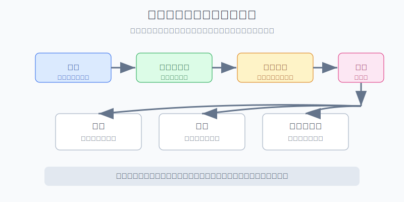
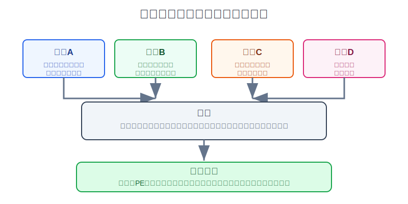
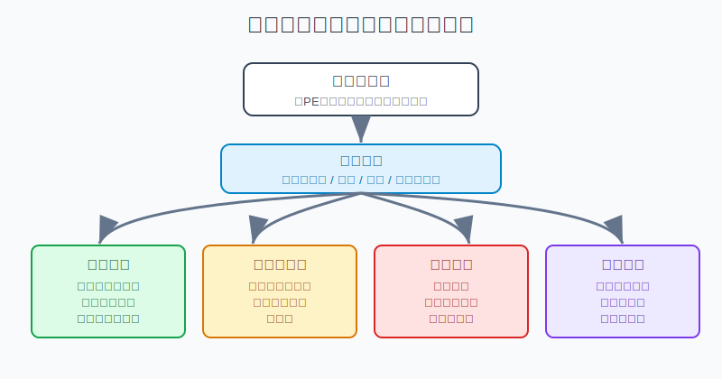

## 散户投资小白金融全品种操盘手册 - 11.8 价值股估值 - 现金流、分红、回购、资产负债表
  
### 作者  
digoal  
  
### 日期  
2026-06-07   
  
### 标签  
金融产品 , 金融工具 , 散户 , 投资小白 , 全品操盘手册  
  
----  
  
## 背景 
  

> 适用读者: 已经知道美股个股估值指标，但容易把“低PE”“高股息”“大回购”直接当成买入理由的小白投资者。  
> 本文定位: 投资教育框架，不构成个性化投资建议。规则口径按 2026-06-06 可核查公开资料整理。

## 先问一个反直觉的问题

价值股最容易骗人，因为它看起来很便宜。PE只有8倍，股息率有6%，公司还在回购股票，软件上一片“低估”。但如果分红靠借钱、回购买在高位、利润没有变成现金、债务马上到期，这种便宜不是机会，而是陷阱。

## 核心概念: 价值股不是便宜货，而是现金机器

成长股估值看未来空间，价值股估值看现有生意能不能稳定吐现金。用一个简单比喻: 成长股像还在扩张的新店，投资人愿意为未来排队买单；价值股像成熟奶牛，关键不是故事多漂亮，而是每天能不能稳定产奶。

这里的“奶”不是利润，而是自由现金流。自由现金流，就是公司经营收到的钱，扣掉维持业务必须花的钱以后，真正还能自由安排的钱。它可以拿去分红、回购、还债、收购，也可以留在账上防风险。

分红，是公司把一部分现金直接发给股东。股息率看起来越高越诱人，但高股息只有在自由现金流覆盖得住时才有质量。

回购，是公司用现金买回自己的股票。回购不是天然利好。只有当回购价格合理，并且总股数真的下降时，剩下股东每股拥有的公司份额才会变厚。

资产负债表，是这台现金机器的底盘。现金多、短债少、利息压力小，公司遇到衰退还有缓冲；负债高、利息重、未来几年债务集中到期，公司就算利润还在，也可能先被还债压力拖住。

本节的行动结论先放在前面: **价值股估值不能只看低PE、高股息和回购公告；必须按“自由现金流能否覆盖股东回报、资产负债表能否扛住周期、当前价格是否留出安全边际”三步验证。三步里有一步不合格，先不买。**

## 逻辑推导链

【论证链标题】: 因为价值股的主要回报来自成熟业务的现金流、分红和回购，所以只有现金流真实、股东回报可持续、资产负债表稳健且价格合理时，低估值才是机会。

### 第一步: 前提陈述

前提A: 价值股通常不是靠高增长讲故事，而是靠成熟业务产生现金。这是常量。它像一台已经投产的机器，投资人要看的不是“明年能不能翻倍”，而是“这台机器每年能稳定吐出多少钱”。

前提B: 分红和回购都要消耗现金。这是常量。分红是直接派钱，回购是拿钱买股票。它们看起来都对股东友好，但如果自由现金流不够，就只能靠卖资产、借债或吃账上现金维持。

前提C: 资产负债表决定现金流能不能留给股东。这是变量。公司可能今天现金流不错，但如果债务高、利息高、短期债集中到期，未来现金流会优先给债权人，不会优先给股东。

前提D: 价格决定安全边际。这是变量。好公司买太贵，回报会被估值压缩吃掉；普通公司看起来很便宜，也可能是市场提前看到了现金流下滑。

### 第二步: 逻辑推导

由A可得: 因为价值股主要靠成熟业务回报股东，所以不能只看收入故事和净利润，要看经营现金流。净利润是会计结果，经营现金流才说明客户有没有真付钱、公司有没有真收到钱。

由A+B可得: 因为分红和回购都要花现金，所以高股息和大回购不能单独证明公司好。必须把“分红 + 回购”放到自由现金流里看。覆盖得住，才是股东回报；覆盖不住，就是透支未来。

再由A+B+C可得: 因为债务和利息会优先拿走现金流，所以小白看价值股必须同时看资产负债表。现金流稳定但负债过高，分红和回购也会在某个时点被迫让路。

最后由A+B+C+D可得: 因为现金流质量、股东回报、债务压力和价格共同决定最终收益，所以价值股买入前要过四道门: **现金流门、分红门、回购门、负债门**。四道门过不去，低PE只是便宜的标签，不是买入理由。

### 第三步: 正常情景下的操作结论

✅ 正常情景: 一家公司增长不快，但经营现金流连续稳定，自由现金流能覆盖分红和多数回购，净债务和利息压力可控，回购后股数确实下降，并且当前价格对应的自由现金流收益率明显高于无风险或低风险替代品。

对应操作: 可以进入观察清单或小仓买入，但必须写清三条卖出条件: 第一，自由现金流连续恶化；第二，分红和回购开始明显超过自由现金流且债务上升；第三，估值修复后自由现金流收益率不再有吸引力。

对小白来说，直接规则更简单: **低PE不买，高股息不买，大回购也不买；只有现金流、分红、回购、负债四项同时合格，才有资格进入持仓。**

### 第四步: 数据和案例证实

证据1: SEC 的《Beginners' Guide to Financial Statements》说明，财务报表会展示公司的钱从哪里来、到哪里去、现在在哪里；其中资产负债表展示资产、负债和股东权益，现金流量表展示一段时间内公司和外部世界之间的现金交换。这个证据验证前提A和C: 小白研究价值股，不能只看利润表，必须同时看现金流量表和资产负债表。

证据2: Apple 2024 财年 10-K 显示，公司经营活动产生现金流 1182.54 亿美元，购置物业、厂房及设备支出 94.47 亿美元，支付股息及等价物 152.34 亿美元，回购普通股 949.49 亿美元。这个证据验证前提B: 分红和回购都是现金流分配问题，不能只看“公司回购很多”这句话，而要比较经营现金流、资本开支、分红和回购的完整链条。

证据3: S&P Dow Jones Indices 2025年12月发布的数据称，标普500成分股在2025年三季度回购金额为2490亿美元，12个月截至2025年9月的回购支出为1.020万亿美元，同期三季度分红为1681亿美元。这个证据验证前提B: 在美股市场，回购和分红都是股东回报的重要渠道，研究价值股必须把它们当成现金流使用，而不是当成新闻标题。

证据4: Berkshire Hathaway 2024年报披露，2024年经营利润为474.37亿美元；截至2024年末，保险及其他业务的现金及现金等价物为443.33亿美元，短期美国国库券为2864.72亿美元。这个证据验证前提C: 稳健资产负债表本身就是价值的一部分，因为它让公司在市场低迷、信贷收紧或机会出现时不用被迫做坏决策。

失败案例: AT&T 在 WarnerMedia 交易相关文件中披露，交易完成后预计按超过200亿美元的自由现金流，支付40%到43%的年度股息支付率。对只看历史高股息率的小白来说，这就是典型提醒: 分红不是债券票息，不是永远固定的承诺。业务结构变了、现金流分配优先级变了，董事会就会调整分红政策。

历史数据不代表未来每家公司都会重复同样结果，但它们说明一个稳定机制: **股东回报最终来自现金流，现金流优先受资产负债表约束，股价回报最后还要受买入价格约束。**

### 第五步: 前提变化时的替代结论

若前提B改变，也就是分红和回购连续超过自由现金流，公司还在加债维持股东回报，推导路径变为: 因为股东回报已经不是经营现金流自然产物，而是靠资产负债表透支，所以高股息和大回购反而是风险信号。新结论: 先不买，已有持仓要减仓或停止加仓。

若前提C改变，也就是公司债务上升、利息支出增加、未来两三年债务集中到期，推导路径变为: 因为现金流会优先用于还债和付息，所以分红和回购的可持续性下降。新结论: 即使PE低，也不要按“价值股”重仓。

若前提D改变，也就是股价上涨后自由现金流收益率已经不比短债、货币基金或同行便宜，推导路径变为: 因为安全边际被估值修复吃掉，所以继续持有的预期回报下降。新结论: 降低仓位或把它从买入清单移到持有清单。

若前提A改变，也就是公司原来的成熟业务开始被新技术、新竞争或监管规则破坏，推导路径变为: 因为现金机器的稳定性被破坏，过去的现金流不能直接外推。新结论: 重新按困境股研究，不再按稳定价值股研究。

## 实操例子: 一只高股息美股到底能不能买

这个例子对应论证链的正常结论: **只有自由现金流覆盖分红和回购、负债压力可控、价格仍有安全边际，高股息价值股才有资格进入持仓。**

假设小林看中一家成熟消费公司，股价40美元，每股年度股息2.40美元，股息率6%。行情软件显示PE为9倍，公司过去一年还宣布回购20亿美元股票。表面看，它很像价值股。

第一步，算自由现金流。小林打开公司10-K，找到经营现金流和资本开支。假设经营现金流为80亿美元，维持业务资本开支为20亿美元，自由现金流约60亿美元。判断依据是前提A: 价值股先看现金机器每年能吐出多少钱。

第二步，看分红能否覆盖。假设公司一年分红花掉36亿美元，自由现金流覆盖倍数是60 / 36 = 1.67倍。这个数字合格，因为分红没有吃光现金流。但如果分红花掉70亿美元，自由现金流只有60亿美元，就不合格。判断依据是前提B: 分红必须由自由现金流支撑。

第三步，看回购是否真有效。假设公司回购20亿美元，但员工股权激励新增股份很多，年末总股数只下降0.5%。这说明回购效果被稀释了，不能给高分。小林要看的是“回购后每股权益有没有变厚”，不是公告金额。判断依据仍是前提B。

第四步，看资产负债表。假设公司净债务为180亿美元，利息支出一年12亿美元，未来两年有大额债务到期。即使分红暂时覆盖得住，也要降低评分，因为衰退期收入一降，现金流会先去付息和还债。判断依据是前提C。

第五步，看价格边界。假设公司自由现金流60亿美元，市值500亿美元，自由现金流收益率是12%。如果业务稳定、负债可控，这个价格有吸引力；如果现金流正在下滑、债务压力高，12%也可能是市场给出的风险补偿，不是便宜。判断依据是前提D。

如果四步都合格，小林也只把它放进“价值股观察仓”，比如总账户5%以内；如果现金流连续两个季度弱化、债务继续上升、分红覆盖倍数跌到1倍以下，就停止加仓或减仓。如果他只因为6%股息率满仓买入，后果很直接: 一旦公司削减分红，股息收入和股价估值可能一起下修。

## 可复用框架

【四门估值】

适用前提: 你研究的是成熟美股公司，主要吸引力来自低估值、分红或回购，而不是高速增长。

核心逻辑: 因为价值股回报来自现金流分配，所以先验证现金流，再验证分红和回购，最后验证资产负债表和价格。

操作步骤:

1. 现金流门: 经营现金流是否稳定，自由现金流是否为正。
2. 分红门: 分红是否被自由现金流覆盖，而不是靠借钱维持。
3. 回购门: 回购价格是否合理，回购后总股数是否下降。
4. 负债门: 现金、短债、长期债和利息压力是否可控。

前提失效时: 任一门不合格，先不买；已经持有的，降低仓位并写清观察期限。

举一反三: 这个框架也能用在能源、金融、消费、公用事业、电信等成熟行业。行业不同，指标阈值不同，但现金流和负债逻辑不变。

【回报还原】

适用前提: 你看到一家公司宣传高分红、大回购、低估值，想判断这是不是价值机会。

核心逻辑: 因为股东最终拿到的是每股现金流和每股权益变化，所以把分红和回购统一还原成自由现金流使用。

操作步骤:

1. 算自由现金流: 经营现金流减去必要资本开支。
2. 算现金流分配: 分红 + 回购 + 还债 + 留存现金。
3. 看每股结果: 股数是否下降，每股自由现金流是否改善。
4. 看价格: 自由现金流收益率是否足够补偿业务和负债风险。

前提失效时: 如果分红和回购超过自由现金流，同时债务上升，不把它叫“股东友好”，而叫“透支股东回报”。

举一反三: 以后看到任何“股息率很高”的股票，先问现金从哪里来；看到任何“回购巨大”的公司，先问股数有没有降。

## 本节行动清单

| 动作 | 合格标准 |
|---|---|
| 先找现金流量表 | 找到经营现金流、资本开支、自由现金流 |
| 分红看覆盖 | 分红长期由自由现金流覆盖，不靠加债硬撑 |
| 回购看股数 | 不只看回购金额，还看总股数是否下降 |
| 负债看压力 | 现金、短债、长期债、利息支出一起看 |
| 价格看边际 | 自由现金流收益率要能补偿业务下滑和负债风险 |
| 不买假便宜 | 低PE、高股息、大回购任一项都不能单独成为买入理由 |

## 一句话总结

价值股估值的核心不是“看起来便宜”，而是证明这家公司能用真实自由现金流持续回报股东，并且资产负债表不会在坏年份把这台现金机器压坏。

## 参考资料

- SEC: Beginners' Guide to Financial Statements, https://www.sec.gov/reportspubs/investor-publications/investorpubsbegfinstmtguidehtm.html
- Apple Inc.: Form 10-K for fiscal year ended September 28, 2024, https://www.sec.gov/Archives/edgar/data/320193/000032019324000123/aapl-20240928.htm
- S&P Dow Jones Indices: S&P 500 Q3 2025 Buybacks Post Modest 6.2% Gain to $249.0 Billion, https://www.spglobal.com/spdji/en/corporate-news/article/sp-500-q3-2025-buybacks-post-modest-62-gain-to-249-0-billion-after-declining-20-1-amidst-uncertainty-in-q2/
- Berkshire Hathaway Inc.: 2024 Annual Report, https://www.berkshirehathaway.com/2024ar/2024ar.pdf
- AT&T / WarnerMedia transaction registration statement, 2022, https://investors.att.com/~/media/Files/A/ATT-IR-V2/events-and-presentations/s-4-as-filed.pdf

> ⚠️ **声明**：本文内容为投资教育目的，所有历史数据、策略框架均为辅助学习工具，不构成证券投资建议。市场有风险，投资需谨慎。实际操作请结合自身风险承受能力，必要时咨询专业投顾。
  
#### [PostgreSQL 解决方案集合](../201706/20170601_02.md "40cff096e9ed7122c512b35d8561d9c8")
  
  
#### [德哥 / digoal's Github - 公益是一辈子的事.](https://github.com/digoal/blog/blob/master/README.md "22709685feb7cab07d30f30387f0a9ae")
  
  
#### [About 德哥](https://github.com/digoal/blog/blob/master/me/readme.md "a37735981e7704886ffd590565582dd0")
  
  

  
