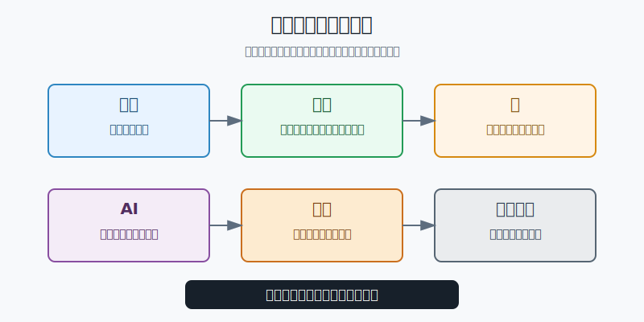
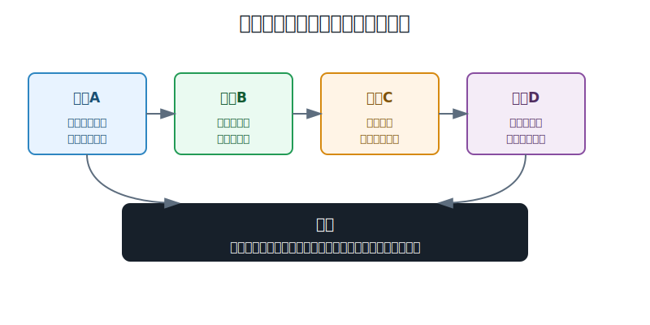
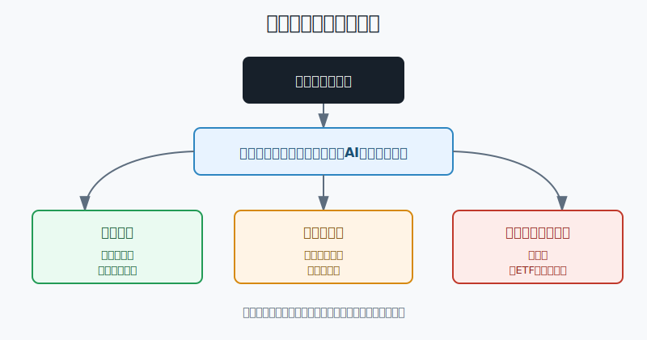

## 散户投资小白金融全品种操盘手册 - 11.9 科技股研究框架 - 产品、生态、云、AI、算力、订阅收入
  
### 作者  
digoal  
  
### 日期  
2026-06-07   
  
### 标签  
金融产品 , 金融工具 , 散户 , 投资小白 , 全品操盘手册  
  
----  
  
## 背景 
  

> 适用读者: 已经知道美股科技股很重要，但看新闻时容易被“AI、云、芯片、平台”这些词带着走，不知道怎么判断一家科技公司到底值不值得研究的小白投资者。  
> 本文定位: 投资教育框架，不构成个性化投资建议。

## 先问一个反直觉的问题

科技股最危险的地方，不是技术太难，而是故事太顺。一个故事听起来越像未来，散户越容易跳过最关键的问题: **这项技术有没有变成客户愿意反复付钱的产品和现金流？**

## 核心概念: 科技股不是买技术，是买技术变现能力

小白研究科技股，常见顺序是先问“它是不是AI龙头”“是不是云计算公司”“是不是有算力”。这个顺序太快。技术只是原材料，真正让股东赚钱的是商业化。

用餐厅打比方，技术像厨房设备，产品像菜单，生态像回头客和会员体系，云像按用量收费的外卖系统，AI像能提高翻台率的自动化工具，算力像租金和电费，订阅收入像稳定的月卡。厨房设备再先进，如果没有客人持续买单，餐厅还是不赚钱。

所以本节的行动结论很明确: **科技股研究先过六格: 产品、生态、云、AI、算力、订阅收入。六格不是六个买入理由，而是六道筛选门。至少四格能用财报数据验证，估值没有明显透支，仓位又在上限内，才进入个股候选池。**

## 逻辑推导链

【论证链标题】: 因为科技趋势只有变成可验证现金流才有投资价值，所以小白研究科技股要从“概念判断”改成“六格验证”。

── 第一步: 前提陈述

前提A: 云计算、AI、半导体、软件订阅这些技术趋势是真实存在的。这是变量。真实的意思不是“股价一定涨”，而是企业确实在把预算花到数据中心、软件工具、自动化和数字基础设施上。

前提B: 技术趋势不会平均奖励所有公司。这是常量。同样是AI，有公司卖芯片，有公司卖云，有公司把AI嵌进办公软件，有公司只是在发布会上讲概念。小白要分清“会讲未来”和“客户已经付款”。

前提C: 云和AI既能带来收入，也会带来巨额成本。这是变量。数据中心、GPU、服务器、电力、研发人才都要花钱。算力可以理解为运行AI和云服务的机器、电力和网络能力。算力投入没有错，但如果收入增长跟不上，利润和自由现金流会被挤压。

前提D: 市场经常提前给科技股定价。这是变量。所谓估值，就是市场愿意为公司未来利润付出的价格。科技叙事越火，未来好消息越容易提前写进股价。买得太贵，哪怕公司不错，投资结果也可能一般。

前提E: 小白没有能力稳定判断每一轮技术赢家。这是常量。小白真正能控制的是研究顺序、买入条件、仓位上限和失效条件，而不是猜谁一定成为下一个巨头。

── 第二步: 逻辑推导

由A+B可得: 因为技术趋势真实，但赢家不平均，所以不能听到“AI”“云”“芯片”就下单，必须先看产品有没有客户、生态有没有粘性、收入有没有兑现。

由B+C可得: 因为客户付款之后，公司还要承担研发、销售、算力和数据中心成本，所以只看收入增长不够，还要看毛利率、经营现金流和资本开支。毛利率就是收入扣掉直接成本后的比例，能反映生意本身赚不赚钱。

再由C+D可得: 因为AI和云的投入很重，而市场又会提前定价，所以科技股最怕两件事同时发生: 公司还在烧钱验证商业模式，股价却已经按“未来大成功”计价。

最后由A+B+C+D+E可得: 因为小白无法靠口号识别赢家，所以正确动作不是追最热的科技概念，而是用六格验证把公司分成三类: 现金流已经验证的候选股、需要继续观察的故事股、不能碰的概念股。

── 第三步: 正常情景下的操作结论

✅ 正常情景: 一家科技公司有真实产品，客户愿意持续付费，生态让用户不容易离开，云或AI收入能在财报里看到，算力投入没有把现金流压垮，订阅或服务收入占比稳定提升，估值也没有明显透支。

对应操作: 可以进入候选池，但个股仍然只是卫星仓。对小白示例而言，单只美股科技个股先控制在总资产1%-3%，很熟悉、长期跟踪且组合已有核心ETF打底时，单只上限也不宜超过5%。第一次买入只用计划仓位的三分之一，剩余仓位等财报继续验证。

── 第四步: 数据和案例证实

证据1: 云和AI确实能变成大规模收入。Microsoft 2025年报披露，Microsoft Cloud在2025财年收入为1689亿美元，高于2024财年的1377亿美元；微软2025财年第四季度公告还披露，Azure and other cloud services收入同比增长39%。这对应前提A和B: 云不是空概念，但它的价值来自企业客户持续使用和付款。

证据2: 算力需求能快速放大收入，但也会让公司高度依赖供需周期。NVIDIA 2025财年CFO Commentary披露，Data Center收入为1152亿美元，同比增长142%；NVIDIA 2026财年第四季度公告披露，单季Data Center收入达到623亿美元，同比增长75%。这说明AI算力需求真实，但对买股票的人来说，仍要继续检查客户集中度、供给扩张、毛利率和出口限制。

证据3: 生态和订阅能把一次性产品变成反复现金流。Apple 2025财年第四季度财务报表显示，2025财年Services净销售额为1091.58亿美元，高于2024财年的961.69亿美元；按公司披露的Services销售额和成本计算，2025财年Services毛利率约75.4%。Adobe 2025年报披露，2025财年总订阅收入为229.04亿美元，接近全年237.69亿美元总收入，同时全年经营现金流为100.3亿美元。这对应“生态 + 订阅收入”的价值: 用户持续使用，收入才有韧性。

证据4: 反例也很重要。Meta 2025年报披露，Reality Labs投资使公司2025年整体经营利润减少约191.9亿美元；Meta 2025年第四季度公告披露，2025年资本开支含融资租赁本金支付为722.2亿美元。这个案例说明，技术方向听起来再宏大，只要产品、生态和现金流没有跟上，长期投入就会先表现为利润压力。

历史不代表未来。上面的数据仍有参考价值，是因为它们验证的不是某一只股票短期涨跌，而是一条结构规律: **科技股的好生意，最终要在收入、毛利率、现金流和客户留存里留下痕迹；留不下痕迹的，只是叙事。**

── 第五步: 前提变化时的替代结论

若前提B改变，也就是公司技术很强但产品没人持续付费，推导路径变为: 因为技术没有转化为客户预算，所以收入和现金流无法验证。新结论: 不进入买入名单，只放观察。

若前提C改变，也就是AI和数据中心投入持续上升，但经营现金流没有跟上，推导路径变为: 因为算力投入变成利润压力，所以估值必须下调。新结论: 停止加仓，等下一季财报确认投入回报。

若前提D改变，也就是市场已经把公司按高增长、高利润、低风险全部定价，推导路径变为: 因为安全边际下降，所以即使公司优秀，也不适合小白追高重仓。新结论: 只观察，或者用宽基ETF间接持有。

失败案例: 把“AI会改变世界”直接等同于“任何AI概念股都值得买”，就是典型错误。前提A成立，只说明方向真实；前提B、C、D不成立时，买入逻辑照样失效。

## 实操例子: 10万元账户怎么研究一只科技股

这个例子对应论证链的正常结论: **科技股必须先过六格验证，再按小仓位试错，而不是看到热点就重仓。**

假设小林有10万元长期投资资金，已经用6万元买了美股宽基ETF和短债工具，现在想研究一只云和AI相关的科技股。

第一步，先定仓位。小林把单只科技股上限定为总资产3%，也就是3000元。第一次买入最多1000元。这一步对应前提E: 个股不能替代核心资产配置。

第二步，填六格表。产品格写清公司解决什么问题、客户是谁、使用频率高不高；生态格看用户、开发者、合作伙伴是否被留在体系内；云格看云收入增长和毛利率；AI格只认付费功能、客户案例和收入贡献，不认发布会口号；算力格看资本开支、数据中心成本和芯片供应；订阅格看ARR、RPO、续费和服务收入占比。ARR是年度经常性收入，RPO是尚未确认的合同收入，二者都能帮助判断未来收入可见度。

第三步，给每格打结论。六格里至少四格必须能用财报或公司公告验证；如果只有“AI很强”“故事很大”两格，那不是候选股，是观察名单。

第四步，看估值和失效条件。小林写下三条失效条件: 云收入增速明显下滑，AI投入导致毛利率和现金流连续恶化，或者股价上涨后估值已经要求未来多年高增长。一旦触发，不加仓，先复盘。

第五步，执行分批。若六格合格、估值不过热，小林买入1000元观察仓。下一次财报继续验证产品收入、现金流和资本开支后，再决定是否加第二笔。若财报证伪，哪怕股价短期没跌，也停止加仓。

如果操作错误，最常见的后果是把“研究仓”买成“信仰仓”。比如小林原计划买3000元，结果看到AI新闻连续追加到2万元。此时他承担的不是科技研究风险，而是单一个股集中风险。纠偏方法是把仓位降回上限，多余部分回到宽基ETF或现金管理，不靠猜顶部解决问题。

## 可复用框架

【六格入池】

适用前提: 你准备研究一只美股科技个股，但还没有决定是否买入。

核心逻辑: 因为技术趋势只有变成客户、收入、毛利率和现金流才有投资价值，所以先过六格，再谈买入。

操作步骤:

1. 看产品: 是否解决真实高频痛点。
2. 看生态: 用户和合作伙伴是否有切换成本。
3. 看云和AI: 收入是否能在财报里验证。
4. 看算力: 投入是否压垮现金流。
5. 看订阅: 收入是否稳定、可续费、可提价。

前提失效时: 六格里三格以上说不清，直接观察；现金流和估值同时不合格，不买；已经持有的，降到观察仓。

举一反三: 这个框架也适用于网络安全、数据库、SaaS、半导体设备和消费电子公司。

【现金流刹车】

适用前提: 公司故事很好，股价也很热，但你担心自己追高。

核心逻辑: 因为科技叙事容易提前定价，所以用现金流和资本开支给情绪踩刹车。

操作步骤:

1. 收入增长要能解释: 是客户增加、用量增加、提价，还是一次性因素。
2. 利润质量要能验证: 毛利率、经营利润率、经营现金流不能长期背离。
3. 投入回报要能跟踪: AI和数据中心投入要看到收入或效率改善。

前提失效时: 现金流恶化但估值仍按高增长定价，停止加仓；资本开支快速上升但收入没有跟上，等待下一季验证。

举一反三: 任何高成长资产都能用这个框架。成长不是问题，问题是用什么价格买、用多大仓位承受验证失败。

## 本节行动清单

| 动作 | 合格标准 |
|---|---|
| 先分清技术和生意 | 技术趋势真实，不等于公司一定赚钱 |
| 用六格筛选 | 产品、生态、云、AI、算力、订阅收入至少四格可验证 |
| 数据来自财报 | 不用社区截图代替10-K、10-Q、公司IR和财报电话会 |
| 检查现金流 | 收入增长不能长期靠牺牲现金流硬撑 |
| 写估值边界 | 好公司买太贵，也可能是差投资 |
| 控制单股仓位 | 小白单只科技股先按1%-3%试错，熟悉后也不宜超过5% |
| 写失效条件 | 产品、收入、毛利率、现金流、竞争格局变化时重新评估 |

## 一句话总结

研究科技股，不是看谁的未来故事最大，而是看谁能把产品、生态、云、AI、算力和订阅收入串成可验证的现金流；六格过不了，故事再好也只是观察名单。

## 参考资料

- Microsoft: 2025 Annual Report，2025年，https://www.microsoft.com/investor/reports/ar25/index.html
- Microsoft: FY25 Q4 Earnings Release，2025年7月30日，https://news.microsoft.com/source/2025/07/30/microsoft-cloud-and-ai-strength-fuels-fourth-quarter-results/
- NVIDIA: Q4 FY2025 CFO Commentary，2025年2月26日，https://investor.nvidia.com/files/doc_financials/2025/Q425/Q4FY25-CFO-Commentary.pdf
- NVIDIA: Q4 FY2026 Earnings Release，2026年2月25日，https://investor.nvidia.com/news/press-release-details/2026/NVIDIA-Announces-Financial-Results-for-Fourth-Quarter-and-Fiscal-2026/
- Apple: FY2025 Q4 Consolidated Financial Statements，2025年，https://images.apple.com/newsroom/pdfs/fy2025-q4/FY25_Q4_Consolidated_Financial_Statements.pdf
- Adobe: 2025 Annual Report，2026年，https://www.adobe.com/cc-shared/assets/investor-relations/pdfs/adbe-2025-annual-report.pdf
- Meta: 2025 Form 10-K，2026年，https://www.sec.gov/Archives/edgar/data/1326801/000162828026003942/meta-20251231.htm
- Meta: Q4 and Full Year 2025 Results，2026年1月28日，https://investor.atmeta.com/investor-news/press-release-details/2026/Meta-Reports-Fourth-Quarter-and-Full-Year-2025-Results/default.aspx

> ⚠️ **声明**：本文内容为投资教育目的，所有历史数据、策略框架均为辅助学习工具，不构成证券投资建议。市场有风险，投资需谨慎。实际操作请结合自身风险承受能力，必要时咨询专业投顾。
  
#### [PostgreSQL 解决方案集合](../201706/20170601_02.md "40cff096e9ed7122c512b35d8561d9c8")
  
  
#### [德哥 / digoal's Github - 公益是一辈子的事.](https://github.com/digoal/blog/blob/master/README.md "22709685feb7cab07d30f30387f0a9ae")
  
  
#### [About 德哥](https://github.com/digoal/blog/blob/master/me/readme.md "a37735981e7704886ffd590565582dd0")
  
  

  
