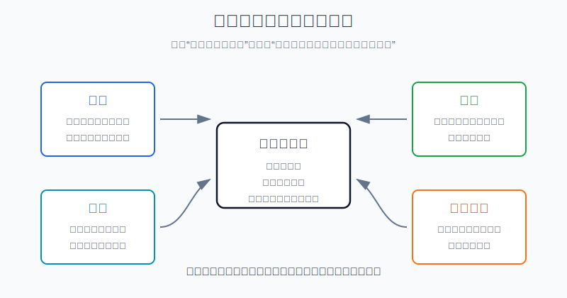
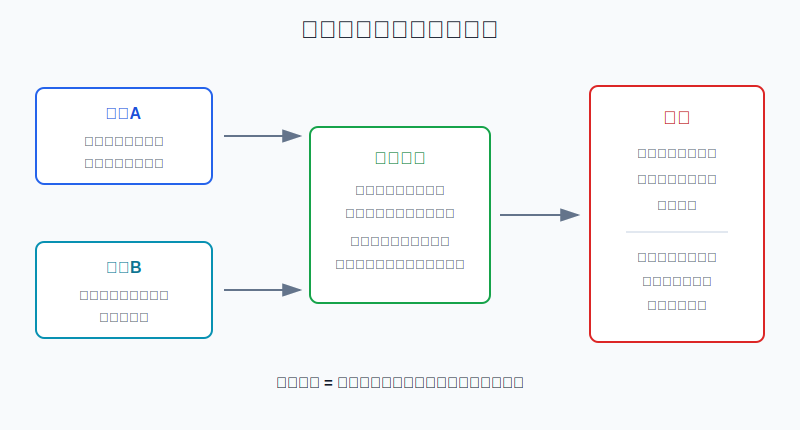
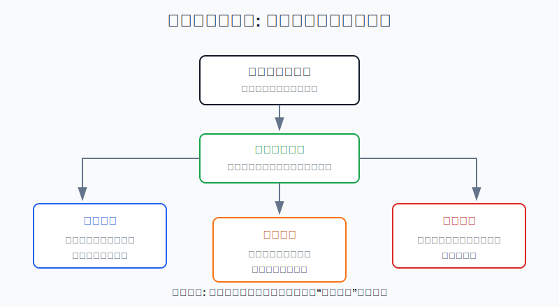

## 散户投资小白金融全品种操盘手册 - 11.10 消费股研究框架 - 品牌、渠道、复购、提价能力
  
### 作者  
digoal  
  
### 日期  
2026-06-07   
  
### 标签  
金融产品 , 金融工具 , 散户 , 投资小白 , 全品操盘手册  
  
----  
  
## 背景 
  

> 适用读者: 已经知道美股个股比ETF更难，想研究可口可乐、Costco、星巴克、耐克、宝洁这类消费公司，但容易把“我熟悉这个牌子”当成投资理由的小白投资者。  
> 本文定位: 投资教育框架，不构成个性化投资建议。

## 先问一个反直觉的问题

消费股最容易让小白产生错觉: 我天天喝、天天买、天天刷到，所以这家公司一定值得买。问题是，**你喜欢一个产品，和这家公司能不能持续赚钱，是两件事**。消费股研究的第一步，不是问“这个品牌火不火”，而是问: 品牌、渠道、复购、提价能力能不能一起把消费者习惯转成现金流。

## 核心概念: 消费股买的不是热闹，而是消费飞轮

消费股，就是主要向个人消费者卖产品或服务的公司。饮料、咖啡、运动鞋、会员制商超、日化用品、餐饮连锁，都可以放进这个大类。它们看起来离生活近，但研究难点不低，因为消费者的喜好会变、渠道会变、竞争会变，通胀和折扣也会不断挤压利润。

对小白来说，消费股可以先用四个词理解。

品牌，是消费者在一堆选择里先想到你。强品牌不只是广告响，而是消费者愿意少比较、快下单，甚至接受一点溢价。

渠道，是产品到达消费者的路。线下门店、批发商、商超、直营官网、会员店、电商平台，都算渠道。渠道越稳，公司越容易把需求变成收入；渠道成本失控，收入增长也可能不赚钱。

复购，是消费者会不会反复回来。每天喝的饮料、每月补货的日用品、每年续费的会员，比“一次性冲动购买”的收入更可预测。

提价能力，是公司涨价后销量和口碑会不会明显崩掉。它不是简单涨价，而是涨价后毛利率能守住，消费者还愿意买。

本节的行动结论先放在前面: **研究消费股时，先用“品牌、渠道、复购、提价能力”验证生意质量；四项能落到收入、毛利率、库存、现金流，再进入估值讨论；如果四项里有两项同时变坏，不要用“这是大品牌”安慰自己。**

## 逻辑推导链

【论证链标题】: 因为消费需求会反复发生，但消费者选择、渠道成本和价格敏感度会变化，所以消费股研究不能只看品牌名气，而要验证品牌、渠道、复购、提价能力是否共同转化为现金流。

── 第一步: 前提陈述

前提A: 消费需求会反复发生。这是常量。人会反复买饮料、食品、日用品、咖啡、运动装备，像家庭厨房里的水龙头，会一直有水流需求。

前提B: 消费者选择会变化。这是变量。年轻人可能换品牌，平台可能改变流量规则，竞争对手可能用折扣抢客。品牌不是护城河本身，持续被选择才是。

前提C: 渠道决定需求能不能变成收入。这是常量。货卖不出去、门店效率下降、线上获客成本太高，再强的品牌也会卡在路上。

前提D: 成本和通胀会挤压利润。这是变量。原材料、工资、租金、物流上涨时，公司如果不能提价，收入增长也可能换不来利润增长。

── 第二步: 逻辑推导

由A可得: 因为消费需求会反复发生，所以消费股有机会形成稳定收入；但这只说明赛道有需求，不说明某家公司一定赚钱。

由A+B可得: 因为消费者会反复买，也会改变选择，所以品牌必须通过复购来验证。只说“品牌有名”不够，必须看同店销售、会员续费、销量、订单频次、市场份额这些能证明用户回来的指标。

再由A+B+C可得: 因为用户愿意买还需要货能到达，所以渠道效率决定收入质量。直营渠道能加强用户关系，但成本更重；批发渠道覆盖广，但对终端控制弱。渠道变化必须和毛利率、库存、营销费用一起看。

最后由A+B+C+D可得: 因为成本会波动，竞争会打折，所以真正优质的消费股要能在不严重损害销量的情况下提价，并把提价转化为毛利率、经营现金流和自由现金流。**消费股研究顺序应该是: 先验证消费飞轮，再看估值，再定仓位。**

── 第三步: 正常情景下的操作结论

✅ 正常情景: 一家公司品牌认知稳定，渠道没有断裂，复购或同店销售保持健康，涨价没有明显打崩销量，利润率和现金流能跟上收入。

对应操作: 把它放入观察池，继续看估值和仓位。小白不要因为熟悉品牌就满仓，也不要在估值明显透支时追买。消费股的买入理由要写成可复核句子: “品牌仍被选择、渠道仍有效、复购仍稳定、提价仍能守住利润。”

── 第四步: 数据和案例证实

证据1: 复购能让收入更可预测。Costco 2025财年10-K披露，截至2025年8月31日，Costco有8100万付费会员，美国和加拿大会员续费率为92.3%，全球续费率为89.8%；2025财年会员费收入为53.23亿美元。这个数据对应前提A和B: 消费公司如果能让用户反复回来，收入就不完全依赖一次性拉新。

证据2: 提价能力要和销量一起看。The Coca-Cola Company 2025年全年业绩披露，全年有机收入增长5%，其中价格/组合贡献4%，浓缩液销售量贡献1%；公司还披露全年可比汇率中性经营利润增长13%。这说明提价确实能推高收入和利润，但也提醒小白: 提价能力不是只看涨价，还要看销量、市场份额和利润率有没有被伤到。

证据3: 日用品龙头也会遇到成本和销量的拉扯。Procter & Gamble 2025财年年报披露，全年有机销售增长2%，核心每股收益增长4%，经营现金流为178亿美元，调整后自由现金流生产率为87%。这个数据对应前提D: 成熟消费公司能通过价格、产品组合、成本管理和现金流纪律守住质量，但成长速度通常不会像高成长科技股那样爆发。

证据4: 渠道和库存失衡会破坏消费故事。NIKE 2025财年业绩披露，全年收入为463亿美元，同比下降10%；NIKE Direct收入为188亿美元，同比下降13%，批发收入为259亿美元，同比下降7%。同一财年公司毛利率下降190个基点至42.7%，原因包括更高折扣、渠道组合变化和更高库存减值准备。这个案例对应前提C: 强品牌如果渠道、库存和折扣压力处理不好，利润表会先反映出来。

失败案例: Starbucks 2025财年业绩披露，全年合并净收入增长3%至372亿美元，但GAAP经营利润率从上一财年的15.0%降到7.9%，主要受门店关闭和支持组织简化相关重组成本、经营去杠杆、Back to Starbucks相关投入和通胀影响。星巴克仍是全球知名品牌，但当门店效率、体验投入、价格敏感度和成本压力同时影响结果时，“大品牌”本身不能保护股价和利润。历史不代表未来，但它验证了一个稳定规律: **消费股的护城河必须体现在经营数据里，不能只停留在消费者印象里。**

── 第五步: 前提变化时的替代结论

若前提B改变，也就是消费者开始明显换品牌，推导路径变为: 因为需求还在，但公司不再是首选，所以品牌资产正在变弱。新结论: 不能继续按“强品牌”估值，先降低预期，观察市场份额、复购和同店销售是否恢复。

若前提C改变，也就是渠道效率下降，推导路径变为: 因为需求不能顺利变成高质量收入，所以销售增长可能靠打折、压库存或高营销费用换来。新结论: 不加仓，重点查库存周转、毛利率、直营和批发结构。

若前提D改变，也就是通胀上行但公司提价失败，推导路径变为: 因为成本上涨无法转嫁给消费者，所以收入可能增长，利润却下降。新结论: 从“好生意”观察名单降级为“待验证”，等毛利率和现金流恢复再讨论。

若估值前提改变，也就是四项经营指标都不错但股价已经把多年增长提前透支，推导路径变为: 因为好公司不等于好价格，所以预期收益被压低。新结论: 只保留观察仓或等待，不为了熟悉品牌追高。

## 实操例子: 怎么研究一只美股消费股

这个例子对应论证链的正常结论: **先验证消费飞轮，再看估值，再定仓位。**

假设小林有2万美元美股个股资金，其中单只个股上限10%，也就是任何一只消费股最多不超过2000美元。他看中一家咖啡连锁公司，原因是自己经常消费，门店也很多。

第一步，写品牌假设。小林不能只写“我喜欢它”，要写“消费者是否仍愿意优先选择它”。检查指标包括同店销售、交易量、客单价、会员活跃度、品牌搜索热度和门店排队情况。判断依据是前提B: 品牌要用复购和选择来验证。

第二步，写渠道假设。小林要分清收入来自直营店、加盟店、外卖、零售包装产品还是海外市场。如果直营门店扩张很快，但营业利润率下降，他要问: 是新店爬坡，还是租金、人工、折扣吞掉利润？判断依据是前提C: 渠道不是越多越好，渠道要能赚钱。

第三步，写复购假设。小林看最近8个季度的同店销售和交易量。如果销售增长主要来自涨价，而交易量连续下滑，他不能简单说“收入还在增长”。判断依据是前提A+B: 消费需求反复发生，但用户如果减少回来，飞轮会变慢。

第四步，写提价假设。小林检查毛利率、营业利润率和管理层对价格的解释。如果公司涨价后毛利率改善、销量稳定，说明提价有效；如果涨价后交易量明显下降、公司靠促销拉客，说明提价被消费者抵抗。判断依据是前提D: 提价能力必须落到利润，而不是只落到售价。

第五步，决定操作。若四项都过关，估值又没有明显透支，小林最多先用2%-3%账户资金建观察仓，也就是400-600美元，而不是直接打满10%。如果后续两个季度继续验证，才讨论加到5%；如果交易量继续下滑、利润率继续下降，就不加仓甚至退出观察。

如果操作错误，后果很清楚。只凭熟悉品牌买入，容易买在增长放缓和估值回落的阶段；只看收入不看交易量，容易忽视涨价把用户赶走；只看门店数量不看利润率，容易把扩张误判成质量。纠偏方法是把买入理由改成四句话: 品牌是否仍被选择，渠道是否仍赚钱，用户是否仍复购，提价是否仍有效。

## 可复用框架

【四格验证】

适用前提: 你研究的是美股消费个股，而不是宽基ETF或短线题材股。

核心逻辑: 因为消费需求反复发生，但消费者选择、渠道效率和成本会变化，所以要用四格验证生意质量。

操作步骤:

1. 品牌格: 写清消费者为什么选它，证据是市场份额、同店销售、会员续费、品牌指标。
2. 渠道格: 写清货怎么卖出去，证据是直营和批发结构、门店效率、库存、线上获客成本。
3. 复购格: 写清用户是否反复回来，证据是交易量、订单频次、续费率、留存率。
4. 提价格: 写清涨价后利润是否守住，证据是毛利率、营业利润率、销量和促销强度。

前提失效时: 任意两格同时变坏，暂停加仓；三格变坏，优先减仓或移出观察池。只有一格短期波动，可以给管理层一个财报周期解释，但必须写清复核日期。

举一反三: 这个框架也能用在A股白酒、乳制品、调味品、运动服饰、餐饮连锁和港股消费公司上。

【飞轮到现金】

适用前提: 你已经初步判断一家公司有品牌和用户基础。

核心逻辑: 因为消费故事最后要落到股东回报，所以任何品牌叙事都要穿过收入、利润、现金流三道门。

操作步骤:

1. 收入门: 收入增长来自销量、价格、门店、会员还是汇率。
2. 利润门: 毛利率和营业利润率有没有被折扣、成本、渠道费用压坏。
3. 现金门: 经营现金流和自由现金流是否跟利润同向，库存是否异常堆高。

前提失效时: 如果收入好看但利润和现金流跟不上，不把它当成高质量增长；如果利润改善主要来自一次性裁员或关店，也不能直接外推。

举一反三: 以后研究软件订阅、会员平台、游戏公司，也可以用“用户习惯能否转成现金流”这条线。

## 本节行动清单

| 动作 | 合格标准 |
|---|---|
| 不用熟悉代替研究 | 买入理由不能写“我经常用”，必须写经营证据 |
| 做四格表 | 品牌、渠道、复购、提价能力各有至少1个指标 |
| 看收入拆分 | 分清销量、价格、门店、会员、汇率分别贡献什么 |
| 看利润质量 | 毛利率、营业利润率、折扣、库存一起看 |
| 看估值约束 | 好公司也要有合理价格，不因品牌熟悉而追高 |
| 写失效条件 | 两格变坏暂停加仓，三格变坏减仓或退出观察 |

## 一句话总结

消费股不是买你熟悉的品牌，而是买一个能持续被选择、稳定触达用户、反复成交、并把价格权转成现金流的消费飞轮。

## 参考资料

- Costco Wholesale: Form 10-K for fiscal year ended August 31, 2025，SEC EDGAR，https://www.sec.gov/Archives/edgar/data/0000909832/000090983225000101/cost-20250831.htm
- The Coca-Cola Company: Fourth Quarter and Full-Year 2025 Results，2026年2月10日，https://www.coca-colacompany.com/media-center/coca-cola-reports-fourth-quarter-and-full-year-2025-results
- Procter & Gamble: Fiscal Year 2025 Results，2025年年报页面，https://us.pg.com/annualreport2025/introduction-and-fy-results/
- NIKE, Inc.: Fiscal 2025 Fourth Quarter and Full Year Results，2025年6月26日，https://investors.nikeinc.com/investors/news-events-and-reports/investor-news/investor-news-details/2025/NIKE-Inc--Reports-Fiscal-2025-Fourth-Quarter-and-Full-Year-Results/default.aspx
- Starbucks Corporation: Q4 and Full Fiscal Year 2025 Results，2025年10月29日，https://investor.starbucks.com/news/financial-releases/news-details/2025/Starbucks-Reports-Q4-and-Full-Fiscal-Year-2025-Results/default.aspx

> ⚠️ **声明**：本文内容为投资教育目的，所有历史数据、策略框架均为辅助学习工具，不构成证券投资建议。市场有风险，投资需谨慎。实际操作请结合自身风险承受能力，必要时咨询专业投顾。
  
#### [PostgreSQL 解决方案集合](../201706/20170601_02.md "40cff096e9ed7122c512b35d8561d9c8")
  
  
#### [德哥 / digoal's Github - 公益是一辈子的事.](https://github.com/digoal/blog/blob/master/README.md "22709685feb7cab07d30f30387f0a9ae")
  
  
#### [About 德哥](https://github.com/digoal/blog/blob/master/me/readme.md "a37735981e7704886ffd590565582dd0")
  
  

  
