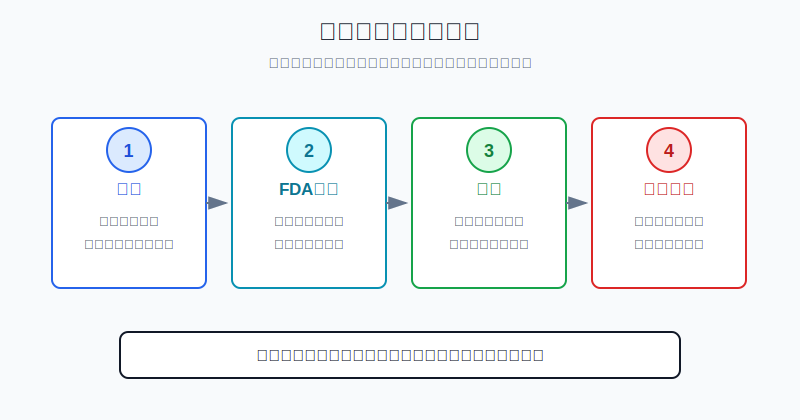
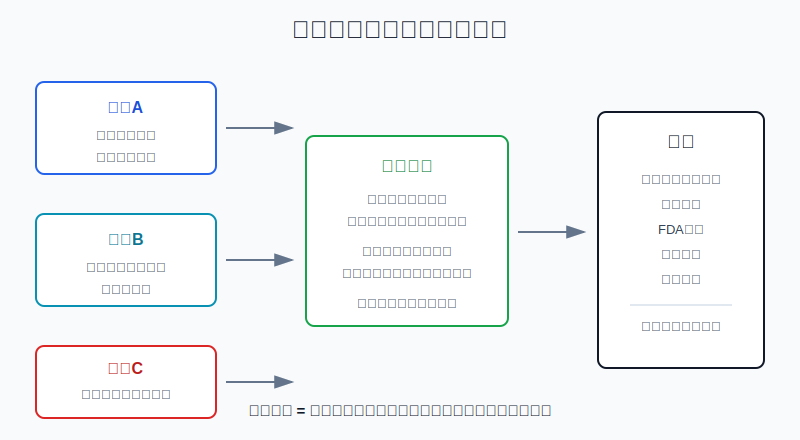
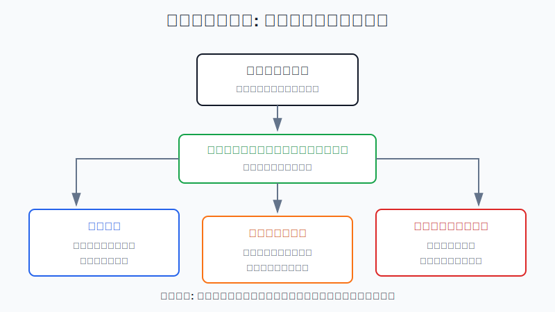

## 散户投资小白金融全品种操盘手册 - 11.11 医药股研究框架 - 管线、专利、FDA审批、单品依赖
  
### 作者  
digoal  
  
### 日期  
2026-06-07   
  
### 标签  
金融产品 , 金融工具 , 散户 , 投资小白 , 全品操盘手册  
  
----  
  
## 背景 
  

> 适用读者: 已经知道美股个股需要看财报，但一看到医药公司公告里的“Phase 3、FDA、突破性疗法、专利到期、重磅药”就不知道怎么判断的小白投资者。  
> 本文定位: 投资教育框架，不构成个性化投资建议。

## 先问一个反直觉的问题

医药股最容易让人误判的地方是: **一家公司说自己有很多管线，不等于它有很多未来收入**。管线像果园里的树苗，FDA审批像考试，专利像收费站，单品依赖像一棵大树撑起整片果园。小白研究医药股，第一步不是猜哪款药会爆，而是问这四件事能不能互相对上。

## 核心概念: 医药股买的不是“治病故事”，而是可验证的药品现金流

医药公司和普通消费公司不一样。饮料卖得好不好，消费者第二天就会用钱包投票；药品能不能卖，先要过临床试验和监管审批。临床试验，就是用分阶段的人体研究证明药物安全、有效。FDA，是美国食品药品监督管理局，负责审评药品能不能在美国上市。

医药股也和科技股不一样。科技产品可以边试边改，药品不行。药物一旦在关键临床试验中失败，市场不会说“下个版本再来”，而是直接重估这条管线的价值。

所以，本节的行动结论先放在前面: **研究医药股，先过四道门: 管线阶段、FDA节点、专利期限、单品依赖。四道门都能用公司文件和监管信息验证，再看估值和仓位；其中两道门说不清，就只放观察名单；如果临床失败、专利悬崖临近、收入又高度依赖单一产品，不要用“医药是刚需”安慰自己。**

## 逻辑推导链

【论证链标题】: 因为药品收入先受审批约束、再受专利保护、最后受产品结构影响，所以医药股研究必须从“管线故事”改成“四道门验证”。

── 第一步: 前提陈述

前提A: 药品上市需要监管审批。这是常量。没有FDA批准，候选药再有想象空间，也不能变成美国市场的正式销售收入。

前提B: 临床试验失败率高。这是常量。小白可以把管线理解成果园里的树苗，早期树苗多，只代表有机会，不代表每棵都会结果。

前提C: 药品上市后通常依靠专利和监管排他期保护价格和市场份额。这是变量。专利保护像收费站，保护期内竞争少；保护结束后，仿制药或生物类似药进场，价格和销量都会承压。

前提D: 大药企也会高度依赖少数重磅药。这是变量。所谓重磅药，就是年销售额很高、对公司业绩影响很大的药。如果一家公司收入主要靠一个药，任何审批、竞争、医保谈判、专利到期都会被放大。

── 第二步: 逻辑推导

由A+B可得: 因为候选药必须过临床和FDA审批，而且失败率高，所以不能把“公司有10条管线”直接等同于“未来有10个收入来源”。早期管线只能算选择权，后期管线才更接近潜在收入。

由A+B+C可得: 因为药品只有上市后才开始贡献收入，而收入质量还受专利保护影响，所以研究医药股必须同时看两个时间表: 一个是FDA审批时间表，一个是专利到期时间表。前者决定新收入能不能来，后者决定老收入会不会掉。

再由A+B+C+D可得: 因为单品依赖会放大专利和审批风险，所以真正稳健的医药公司，不是只有一个爆款，而是已上市产品、后期管线、专利期限、现金流能够接力。**医药股研究顺序应该是: 先看四道门，再看估值，再定仓位。**

── 第三步: 正常情景下的操作结论

✅ 正常情景: 一家公司已有多个上市药贡献现金流，核心产品专利保护还有足够时间，后期管线有明确FDA节点，单一产品收入占比没有高到失控，估值也没有提前透支多年成功。

对应操作: 可以进入观察池，但个股仍然是卫星仓。小白第一次买医药个股，不要按“赌FDA审批”下重仓，先用计划仓位的三分之一建立研究仓；每次FDA结果、临床读数、专利诉讼、仿制药进展出来后，都要复核四道门。

── 第四步: 数据和案例证实

证据1: FDA审批是医药收入的硬门槛。FDA CDER披露，2025年批准了46个此前未在美国批准或销售过的novel drugs，其中34个是新分子实体，12个是生物制品。这个数字说明，每年确实有新药上市，但能从管线走到批准的只是少数。

证据2: 临床管线不能按“全成功”估值。BIO、Informa Pharma Intelligence和QLS Advisors在《Clinical Development Success Rates and Contributing Factors 2011-2020》中统计，2011-2020年全部适应症从Phase I进入最终批准的总体成功概率为7.9%；其中肿瘤领域更低，整体约5.3%。这对应前提B: 早期管线的价值要打折，不能按确定收入来算。

证据3: 成功药品能带来巨大现金流，但也会形成单品依赖。Merck 2025年业绩披露，KEYTRUDA/KEYTRUDA QLEX全年销售额为317亿美元，同比增长7%；Merck 2025年10-K同时披露，Keytruda在美国的关键专利到期年份为2028，中国为2028，欧洲为2031。这说明大单品可以支撑业绩，但专利窗口必须被单独跟踪。

证据4: 专利悬崖会真实打到收入。Bristol Myers Squibb 2025年全年业绩披露，Legacy Portfolio收入为218亿美元，同比下降15%；Revlimid 2025年全球收入为30亿美元，同比下降49%，公司说明传统产品组合下降主要受仿制药影响。这个案例对应前提C和D: 老药失去保护后，即使公司仍有新产品增长，旧产品下滑也会拖累整体估值。

证据5: 管线和放量也能成功接力。Eli Lilly 2025年第四季度业绩披露，全年收入增长45%至652亿美元；Mounjaro和Zepbound共同推动增长，2025年合计销售额约365亿美元。这个案例说明，医药公司如果有真实需求、审批落地、产能和商业化跟上，管线可以变成高速收入。但历史不代表未来，它验证的是一条结构规律: **药品故事只有穿过审批、专利和销售兑现，才会变成股东能看见的现金流。**

── 第五步: 前提变化时的替代结论

若前提A改变，也就是FDA没有批准、要求补充试验，推导路径变为: 因为候选药不能按计划上市，所以未来收入要后移甚至归零。新结论: 不加仓，先下调管线价值，等待公司说明下一步试验计划和资金消耗。

若前提B改变，也就是关键Phase 2或Phase 3数据不达标，推导路径变为: 因为临床有效性没有被证明，所以“市场空间大”不再是投资理由。新结论: 从候选名单降级为观察，已持有的要按原失效条件减仓。

若前提C改变，也就是核心产品专利到期或仿制药、生物类似药提前冲击，推导路径变为: 因为老收入开始下降，所以必须看新产品增长能否覆盖缺口。新结论: 如果增长产品接不上，不按原估值持有。

若前提D改变，也就是单一产品收入占比过高，推导路径变为: 因为一个药的风险会变成整家公司风险，所以仓位必须更小。新结论: 只做小仓位观察，不把单品公司当成稳健医药蓝筹。

失败案例: 把“某个药治疗空间很大”直接等同于“股票值得买”，就是典型错误。治疗空间只是前提之一；没有临床数据、审批结果、专利保护和商业化能力，空间再大也不能自动变成收入。

## 实操例子: 怎么研究一只美股医药股

这个例子对应论证链的正常结论: **先过四道门，再看估值和仓位，不把FDA事件当成赌博。**

假设小林有10万元长期投资资金，其中8万元已经放在宽基ETF、债券ETF和现金管理里。他想研究一只美股医药公司，单只个股上限设为总资产3%，也就是最多3000元。第一次只允许买1000元观察仓。

第一步，画管线表。小林把公司管线按Preclinical、Phase 1、Phase 2、Phase 3、已递交NDA/BLA、已获批六类列出来。NDA是新药上市申请，BLA是生物制品上市申请。判断依据是前提A+B: 早期项目只算选择权，后期项目才更接近潜在收入。

第二步，标FDA节点。小林查公司IR、SEC文件和FDA公告，写清未来12个月有没有PDUFA日期。PDUFA日期可以简单理解为FDA计划给出审评决定的目标日期。如果公司未来涨跌主要压在一个PDUFA结果上，小林就不能把它当成普通蓝筹，而要当成事件风险股。

第三步，查专利表。小林在10-K里找核心药品的专利到期年份，同时标注是否有仿制药诉讼、生物类似药竞争、医保价格谈判风险。如果核心产品未来3年进入专利悬崖，后续管线又没有明确接力，他不加仓。

第四步，算单品依赖。小林把最大产品收入除以公司总收入。如果一个药贡献超过30%，就标黄；超过50%，就标红。标黄不是不能买，而是仓位要更小，复核频率要更高。判断依据是前提D: 单品依赖会把一个药的风险放大成整家公司风险。

第五步，决定操作。若四道门都过关，估值没有明显透支，小林可以买1000元观察仓。下一次加仓只能发生在两类情况: 新药获批并开始销售兑现，或者财报证明新产品增长能覆盖老产品下滑。若临床失败、FDA推迟、专利诉讼不利、单品收入下滑超预期，立即停止加仓，并按失效条件减仓。

如果操作错误，后果很直接。把Phase 1管线当成确定收入，容易在临床失败后承受大跌；只看“FDA批准”不看销售兑现，容易买到上市后放量不及预期；只看当前利润不看专利到期，容易撞上专利悬崖；只看一个爆款药，容易忽视公司整体组合没有接力。

## 可复用框架

【四门入池】

适用前提: 你准备研究一只美股医药个股，但还没有决定是否买入。

核心逻辑: 因为医药公司收入要穿过审批、专利和产品结构三层约束，所以先过四道门，再谈估值。

操作步骤:

1. 管线门: 列出项目阶段，Phase 1和Phase 2不按确定收入计算。
2. 审批门: 找出FDA、PDUFA、NDA、BLA等关键节点，判断未来12个月事件风险。
3. 专利门: 查核心产品专利到期年份和仿制药、生物类似药竞争。
4. 集中门: 算最大产品收入占比，超过30%标黄，超过50%标红。

前提失效时: 临床失败或FDA推迟，先降级观察；专利悬崖临近且新产品接不上，重新估值；单品占比过高，不做大仓位。

举一反三: 这个框架也能用在A股创新药、港股生物科技、医疗器械和疫苗公司上，只是监管机构和披露文件不同。

【新老接力】

适用前提: 公司已有成熟药品，同时也有新药管线。

核心逻辑: 因为老药会失去保护，新药又有审批风险，所以关键不是“有没有管线”，而是“新收入能不能接住老收入下滑”。

操作步骤:

1. 老药表: 写清前三大产品销售额、增速、专利到期年份。
2. 新药表: 写清后期管线的适应症、临床阶段、审批节点、竞争格局。
3. 接力表: 比较老产品未来下滑金额和新产品未来增长空间。

前提失效时: 如果老药下滑已经发生，新药还没有上市或放量，估值不能按“顺利接力”计算；如果新药上市但销售不达预期，也要下调接力假设。

举一反三: 消费股的新老品牌接力、科技股的新老产品线切换，也可以用这个框架。

## 本节行动清单

| 动作 | 合格标准 |
|---|---|
| 不把管线当收入 | Phase 1、Phase 2项目只按选择权看待 |
| 查监管节点 | 写清FDA、PDUFA、NDA、BLA等关键日期和结果 |
| 查专利期限 | 至少知道前三大产品的主要专利到期年份 |
| 算单品依赖 | 最大产品收入占比超过30%标黄，超过50%标红 |
| 看商业化兑现 | 获批后还要看销售、毛利率、费用和现金流 |
| 控制事件仓位 | 不为单一FDA结果重仓赌博 |
| 写失效条件 | 临床失败、审批推迟、专利冲击、新药放量不及预期都要复盘 |

## 一句话总结

医药股不是买“能治什么病”的故事，而是买管线能过审批、专利能保护利润、新药能接住老药、收入结构不会被单一产品拖垮的现金流系统。

## 参考资料

- FDA: Novel Drug Approvals for 2025，2026年，https://www.fda.gov/drugs/novel-drug-approvals-fda/novel-drug-approvals-2025
- FDA: Advancing Health Through Innovation: New Drug Therapy Approvals 2025，2026年，https://www.fda.gov/media/190705/download
- BIO, Informa Pharma Intelligence, QLS Advisors: Clinical Development Success Rates and Contributing Factors 2011-2020，2021年，https://go.bio.org/rs/490-EHZ-999/images/ClinicalDevelopmentSuccessRates2011_2020.pdf
- Merck: Fourth-Quarter and Full-Year 2025 Financial Results，2026年2月3日，https://www.merck.com/news/merck-highlights-progress-advancing-broad-diverse-pipeline/
- Merck: 2025 Form 10-K，2026年2月24日，https://www.merck.com/wp-content/uploads/sites/124/2026/02/MRK-12.31.2025-10K-FINAL.pdf
- Bristol Myers Squibb: Fourth Quarter and Full-Year Financial Results for 2025，2026年，https://www.bms.com/assets/bms/us/en-us/pdf/investor-info/doc_financials/quarterly_reports/2025/BMY-Q4-2025-Earnings-Press-Release.pdf
- Eli Lilly: Fourth-Quarter 2025 Financial Results and 2026 Guidance，2026年2月4日，https://investor.lilly.com/news-releases/news-release-details/lilly-reports-fourth-quarter-2025-financial-results-and-provides

> ⚠️ **声明**：本文内容为投资教育目的，所有历史数据、策略框架均为辅助学习工具，不构成证券投资建议。市场有风险，投资需谨慎。实际操作请结合自身风险承受能力，必要时咨询专业投顾。
  
#### [PostgreSQL 解决方案集合](../201706/20170601_02.md "40cff096e9ed7122c512b35d8561d9c8")
  
  
#### [德哥 / digoal's Github - 公益是一辈子的事.](https://github.com/digoal/blog/blob/master/README.md "22709685feb7cab07d30f30387f0a9ae")
  
  
#### [About 德哥](https://github.com/digoal/blog/blob/master/me/readme.md "a37735981e7704886ffd590565582dd0")
  
  

  
