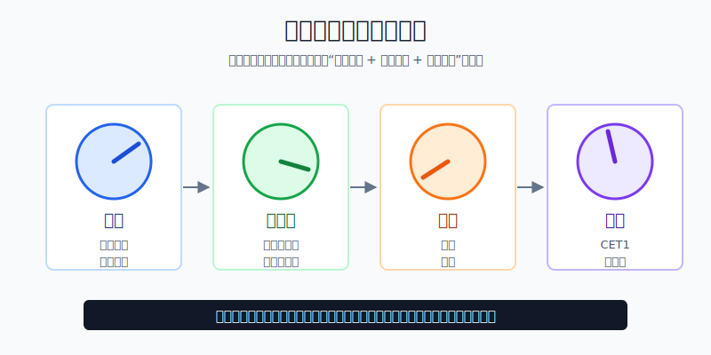
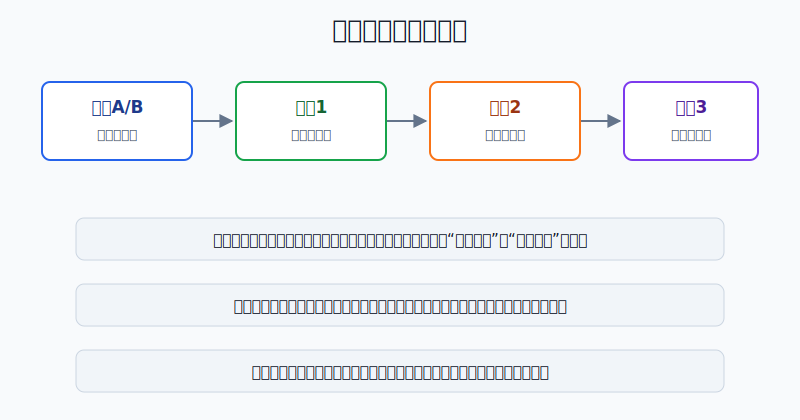
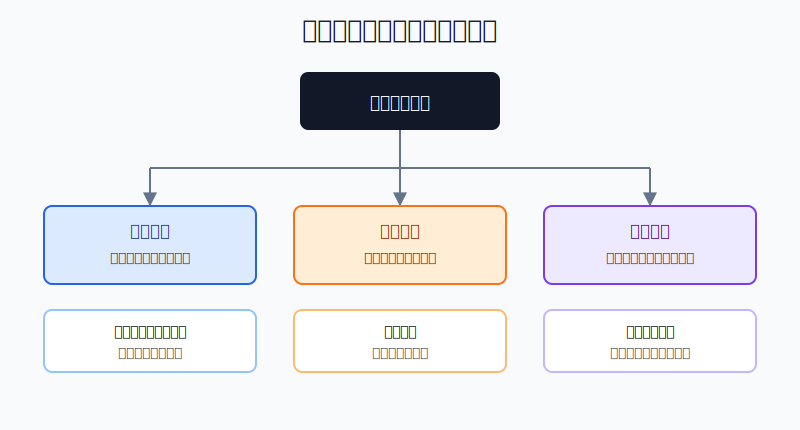

## 散户投资小白金融全品种操盘手册 - 11.12 金融股研究框架 - 利率、净息差、坏账、资本充足率
  
### 作者  
digoal  
  
### 日期  
2026-06-07   
  
### 标签  
金融产品 , 金融工具 , 散户 , 投资小白 , 全品操盘手册  
  
----  
  
## 背景 
  

> 适用读者: 已经学过美股财报和估值指标，想研究 JPMorgan Chase、Bank of America、Wells Fargo、区域银行这类金融股，但容易把“高股息”“低PB”“加息利好银行”直接当成买入理由的小白投资者。  
> 本文定位: 投资教育框架，不构成个性化投资建议。规则口径按 2026-06-06 可核查公开资料整理。

## 先问一个反直觉的问题

很多人以为银行最喜欢加息，因为贷款利息会涨。真正的难点在后半句: **如果存款成本涨得更快，坏账也开始上升，加息反而会把银行的风险暴露出来。**

金融股不是“低估值 + 高分红”的代名词。研究银行股，先别问它便不便宜，先问它这台机器能不能同时过四个仪表盘: 利率、净息差、坏账、资本充足率。

## 核心概念: 银行不是普通企业，而是借短放长的风险机器

本节讲的金融股，主要指商业银行和综合银行。保险公司要看承保利润和投资收益，券商要看交易量和投行业务，交易所要看市场成交和数据服务，不能把同一套指标硬套上去。

银行最核心的生意，可以用一句话讲清: 用较低成本吸收资金，再把钱贷出去或投到证券里，赚中间差价。

净息差，英文是 NIM，可以理解为银行资产收益率减去资金成本后的差。贷款和证券是资产端，存款、批发融资、债券融资是负债端。资产端利率上升、负债端成本不怎么涨，净息差扩大；存款客户要求更高利息，或者资金流出逼银行用更贵的钱融资，净息差就会被压缩。

坏账，就是借出去的钱收不回来。财报里常见两个词: 拨备和核销。拨备是银行提前为未来损失留钱，像下雨前准备伞；核销是损失已经落地，像伞已经被用坏了。银行利润表看起来赚钱，但如果坏账上升，利润会先被拨备吃掉。

资本充足率，是银行扛损失的安全垫。CET1 是普通股一级资本，主要由普通股和留存收益构成；CET1 比率就是 CET1 除以风险加权资产。它不是现金余额，而是监管用来判断银行能不能吸收损失的核心指标。

本节行动结论先放在前面: **研究银行股，按“利率和净息差 → 坏账和拨备 → 资本充足率和分红回购”三步走。三步里任何一步变红，低PB、高股息、回购计划都不能单独构成买入理由。**

## 逻辑推导链

【论证链标题】: 因为银行利润来自利差，但利差会被坏账和资本约束重新分配，所以金融股研究必须从“加息利好”改成“净息差、信用损失、资本缓冲三表同看”。

── 第一步: 前提陈述

前提A: 银行靠资产收益减负债成本赚钱。这是常量。它像开一家资金批发店，进货价是存款和融资成本，卖货价是贷款和证券收益率。

前提B: 利率变化会同时影响资产端和负债端。这是变量。贷款收益会随利率调整，存款成本也会随竞争上升；两边谁动得快，决定净息差方向。

前提C: 贷款天然带来信用损失。这是常量。银行不是把钱借给永远不会违约的人，而是在定价、抵押、分散和拨备之间管理风险。

前提D: 经济周期会改变坏账速度。这是变量。失业上升、企业现金流变差、商业地产承压、信用卡逾期增加，都会让拨备和核销上升。

前提E: 资本是银行的最后缓冲，也是分红和回购的约束。这是常量。资本够厚，银行能承受坏账和市场波动；资本接近监管红线，股东回报要让位于生存。

── 第二步: 逻辑推导

由A+B可得: 因为银行赚的是资产收益和负债成本之间的差，所以“加息利好银行”不是完整结论。正确问题是: 资产端收益是否比资金成本上升得更快。如果存款成本跟涨更快，净息差会收窄。

由A+B+C可得: 因为净息差只是贷款赚钱的一面，贷款还会带来信用损失，所以净息差扩大不等于净利润一定改善。必须继续看拨备、净核销率和不良贷款。

再由C+D可得: 因为坏账和经济周期相关，所以银行股不能只看一个季度的利润。信用卡、商业地产、企业贷款、房贷的风险节奏不同，坏账从“逾期”到“拨备”再到“核销”有时间差。

最后由A+B+C+D+E可得: 因为资本决定银行能否吸收损失，也决定分红和回购空间，所以银行股研究顺序应该是: **先判断净息差方向，再判断信用损失是否可控，最后判断资本缓冲是否足够。**

── 第三步: 正常情景下的操作结论

✅ 正常情景: 一家银行资产端收益稳定，资金成本没有失控，净息差没有连续恶化；净核销率和不良贷款率处于可解释范围；CET1 比率明显高于监管要求；分红和回购没有透支资本。

对应操作: 可以进入观察池或小仓位试错，但必须写清三条失效条件: 第一，净息差连续两个季度下降且管理层解释不清；第二，净核销率和拨备连续两个季度同步上升；第三，资本缓冲明显收窄，分红或回购开始挤压安全垫。

小白可以用一句硬规则约束自己: **银行股三灯全绿才看估值；净息差、坏账、资本任意两灯变黄，不加仓；任意一灯变红，先复盘，不用高股息安慰自己。**

── 第四步: 数据和案例证实

证据1: 利率和净息差必须两边看。FDIC《Quarterly Banking Profile》显示，2026年一季度美国 FDIC 保险机构净息差为3.31%，高于2025年一季度的3.25%；同一季度净利息收入为1921亿美元，高于2025年一季度的1791亿美元。但 FDIC 也说明，2026年一季度净息差较上一季度下降，是因为生息资产收益率下降21个基点，快于资金成本下降13个基点。这个证据对应前提A和B: 银行不是单纯受“利率高低”影响，而是受资产收益和资金成本的相对速度影响。

证据2: 坏账会重新分配利润。FDIC 同一份报告显示，2026年一季度行业净核销率为0.59%，比上一季度低4个基点，也比2025年一季度低8个基点；但30天以上逾期或非应计贷款比例为1.53%，其中信用卡、汽车贷款、多户住宅商业地产、非业主自用商业地产的压力仍然偏高。2026年一季度行业信用损失拨备为214亿美元，高于199亿美元净核销额。这个证据对应前提C和D: 利差赚到的钱，要先经过信用损失这一关。

证据3: 资本不是装饰指标。FDIC 报告显示，2026年一季度全部 FDIC 保险机构核心资本杠杆率为9.15%；社区银行核心资本杠杆率为11.15%，同时社区银行净息差为3.71%、净核销率为0.18%。这个证据对应前提E: 银行的利润质量不能脱离资本缓冲，尤其是小银行和区域银行更要看资本和信用风险是否匹配。

证据4: 大银行盈利强，也不能跳过坏账和资本。JPMorgan Chase 2025年全年材料披露，2025年净利息收入为959亿美元，高于2024年的931亿美元；同年信用成本为142亿美元，净核销为98亿美元；2025年四季度末标准化 CET1 比率为14.5%，高级法 CET1 比率为14.1%。这说明优质大银行也同时暴露在利差、信用损失和资本约束三张表里，不能只看收入增长。

失败案例: Silicon Valley Bank 的失败说明，利率风险和存款结构会把看似稳定的银行迅速推向危机。美联储2023年4月的 SVB 复盘报告指出，SVB 存在管理弱点、客户集中、依赖未保险存款，并在2022年至2023年遭遇利率上升和科技行业放缓的组合冲击。美联储监察长办公室2023年9月的材料损失复盘还指出，SVB 把大量存款投向长期证券，利率上升后形成显著未实现损失。这个案例对应前提B和E: 只看利润或账面资本，不看利率敏感度、存款稳定性和未实现损失，会误判银行股的真实风险。

历史不代表未来，但这些数据验证的是稳定机制: **银行股回报不是由单一指标决定，而是由利差、坏账和资本共同决定。利差是发动机，坏账是漏油口，资本是防撞梁。**

── 第五步: 前提变化时的替代结论

若前提B改变，也就是资金成本上升快于资产收益，推导路径变为: 因为贷款和证券收益没有覆盖存款竞争成本，所以净息差收窄。新结论: 不按“加息受益股”估值，先看存款流失、存款 beta 和批发融资占比。对应操作: 停止加仓，等净息差稳定。

若前提D改变，也就是经济走弱、逾期率和净核销率上升，推导路径变为: 因为信用损失会吃掉利差，所以净利息收入增长也不等于净利润质量变好。新结论: 银行股从“盈利改善”切换到“信用压力验证”。对应操作: 降低仓位，重点看拨备覆盖和高风险贷款组合。

若前提E改变，也就是 CET1 缓冲下降、杠杆率走低、未实现损失扩大，推导路径变为: 因为资本要先吸收风险，所以分红和回购的可持续性下降。新结论: 不能用高股息率给估值托底。对应操作: 移出买入清单，已有持仓减到观察仓。

若前提A也改变，也就是这家公司不是存贷款银行，而是保险、券商、资产管理或交易所，推导路径变为: 因为赚钱发动机变了，净息差框架不再是主框架。新结论: 换指标研究，不能把银行框架硬套到所有金融股。

## 实操例子: 怎么研究一只美国银行股

这个例子对应论证链的正常结论: **银行股先过净息差、坏账、资本三灯，再谈估值和仓位。**

假设小林有2万美元美股个股资金，核心资产已经放在宽基ETF里。他想研究一只美国银行股，计划单只银行股上限不超过账户5%，也就是1000美元；第一次买入最多使用计划仓位的一半，即500美元。

第一步，确认它是不是银行框架适用对象。小林先看收入结构，如果主要收入来自净利息收入、贷款、存款和银行卡业务，就用本节框架；如果主要来自保险承保、投行业务、交易佣金、资产管理费，就不能硬套。判断依据是前提A: 发动机不同，仪表盘不同。

第二步，看利率和净息差。小林把最近8个季度的净息差、净利息收入、平均存款、存款成本列出来。如果净利息收入增长，但净息差连续两个季度下滑，他不能简单说“收入还在涨”。他要问: 增长是靠贷款规模扩张，还是靠利差改善？资金成本有没有追上来？判断依据是前提B。

第三步，看坏账。小林检查净核销率、不良贷款率、逾期率、拨备覆盖率，以及贷款结构里商业地产、信用卡、汽车贷款、企业贷款的占比。小白硬规则是: 如果净息差下滑，同时净核销率和拨备连续两个季度上升，不加仓。判断依据是前提C和D。

第四步，看资本。小林查 CET1 比率、CET1 要求、杠杆率、AOCI 或证券未实现损失、分红和回购金额。对大型银行，小林要求 CET1 比率至少高于公司披露的监管要求2个百分点，才进入观察池；如果只高出很少，还在大额回购，就不买。判断依据是前提E。

第五步，决定操作。若三灯全绿，估值也没有明显透支，小林先买入500美元观察仓，并写下复核日期。下一次财报继续验证净息差、净核销率和 CET1。如果三灯里有两灯变黄，即使股息率有5%，也不加仓；如果资本灯变红，直接从买入清单移到风险清单。

如果操作错误，后果很直接。只因为低PB买入，容易买到市场正在惩罚的信用风险；只因为高股息买入，容易遇到分红下调和估值下修；只因为加息买入，容易忽视资金成本上升和未实现损失。纠偏方法不是猜股价底部，而是回到三灯表: 净息差有没有稳住，坏账有没有见顶，资本有没有足够缓冲。

## 可复用框架

【三灯过关】

适用前提: 你研究的是商业银行或综合银行，而不是保险、券商、交易所、纯资管公司。

核心逻辑: 因为银行利润先来自利差，再被坏账扣除，最后受资本约束，所以三灯同时合格才谈买入。

操作步骤:

1. 利差灯: 看净息差、净利息收入、存款成本、资金流入流出。
2. 信用灯: 看净核销率、不良贷款率、拨备、商业地产和信用卡风险。
3. 资本灯: 看 CET1、杠杆率、未实现损失、分红和回购是否消耗安全垫。

前提失效时: 一灯黄，只观察；两灯黄，不加仓；任一灯红，先降级为风险股。三灯没有重新转绿前，不用低PB或高股息做买入理由。

举一反三: 这个框架也能用在A股银行、港股银行和区域银行研究上，但不同市场的监管口径、会计规则和存款结构要单独核对。

【利差还原】

适用前提: 你看到“加息利好银行”“降息利空银行”这类简单说法，想判断是否成立。

核心逻辑: 因为银行赚的是资产收益减负债成本，所以利率判断必须还原到资产端和负债端。

操作步骤:

1. 资产端: 贷款收益率、证券收益率、贷款增长是否改善。
2. 负债端: 存款成本、无息存款占比、批发融资占比是否恶化。
3. 中间结果: 净息差和净利息收入是否同向改善。
4. 风险扣除: 拨备、核销、资本消耗是否吞掉利差。

前提失效时: 资产端改善但负债端更快恶化，不叫利好；净息差改善但坏账更快上升，也不叫高质量盈利。

举一反三: 以后看债券基金、REITs、保险公司，也要区分“利率方向”和“资产负债重定价速度”，不能只看一个宏观标签。

## 本节行动清单

| 动作 | 合格标准 |
|---|---|
| 先分清金融公司类型 | 银行用净息差框架，保险、券商、交易所不能硬套 |
| 查净息差 | 至少看最近8个季度 NIM、NII、存款成本 |
| 查坏账 | 同时看净核销率、不良贷款率、拨备和贷款结构 |
| 查资本 | 看 CET1、监管要求、杠杆率、未实现损失 |
| 看股东回报质量 | 分红和回购不能削弱资本缓冲 |
| 写三条失效条件 | 净息差恶化、坏账上升、资本收窄时停止加仓 |
| 控制仓位 | 小白单只银行股先用1%-2.5%观察，熟悉后也不宜超过5% |

## 一句话总结

金融股不是简单买低PB和高股息，而是先证明这家银行能用稳定净息差赚钱、用足够拨备覆盖坏账、用厚资本扛住坏年份；三灯不过关，估值再低也只是风险折扣。

## 参考资料

- FDIC: Quarterly Banking Profile - First Quarter 2026，2026年5月，https://www.fdic.gov/quarterly-banking-profile/quarterly-banking-profile-first-quarter-2026.pdf
- JPMorgan Chase & Co.: 4Q25 and FY2025 Financial Results / SEC filing，2026年，https://jpmorganchaseco.gcs-web.com/node/838396/html
- Federal Reserve: Annual Large Bank Capital Requirements，https://www.federalreserve.gov/supervisionreg/large-bank-capital-requirements.htm
- Federal Reserve: Review of the Federal Reserve's Supervision and Regulation of Silicon Valley Bank，2023年4月，https://www.federalreserve.gov/publications/review-of-the-federal-reserves-supervision-and-regulation-of-silicon-valley-bank.htm
- Office of Inspector General, Federal Reserve Board: Material Loss Review of Silicon Valley Bank，2023年9月，https://oig.federalreserve.gov/reports/board-material-loss-review-silicon-valley-bank-sep2023.htm

> ⚠️ **声明**：本文内容为投资教育目的，所有历史数据、策略框架均为辅助学习工具，不构成证券投资建议。市场有风险，投资需谨慎。实际操作请结合自身风险承受能力，必要时咨询专业投顾。
  
#### [PostgreSQL 解决方案集合](../201706/20170601_02.md "40cff096e9ed7122c512b35d8561d9c8")
  
  
#### [德哥 / digoal's Github - 公益是一辈子的事.](https://github.com/digoal/blog/blob/master/README.md "22709685feb7cab07d30f30387f0a9ae")
  
  
#### [About 德哥](https://github.com/digoal/blog/blob/master/me/readme.md "a37735981e7704886ffd590565582dd0")
  
  

  
