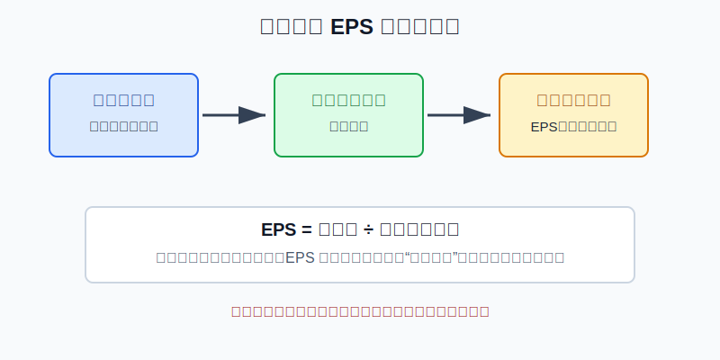
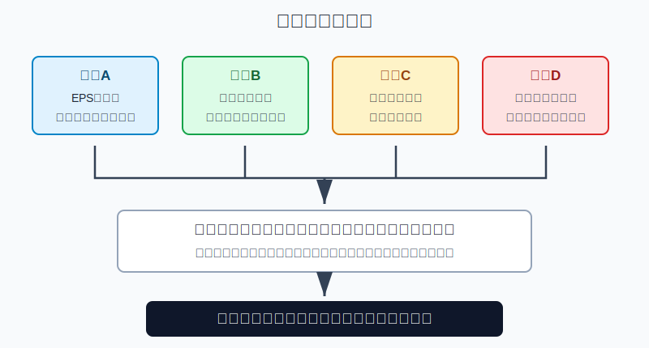
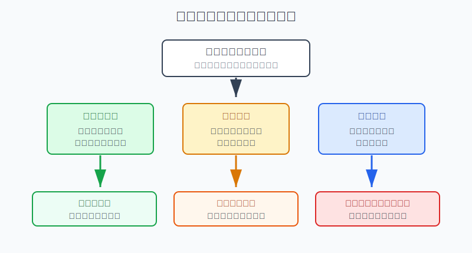

## 散户投资小白金融全品种操盘手册 - 11.13 美股回购制度 - 为什么回购会影响EPS和股价
  
### 作者  
digoal  
  
### 日期  
2026-06-07   
  
### 标签  
金融产品 , 金融工具 , 散户 , 投资小白 , 全品操盘手册  
  
----  
  
## 背景 
  

> 适用读者: 已经会看 EPS、PE 和财报，但看到“公司批准百亿美元回购”就容易直接当成利好的美股小白投资者。  
> 本文定位: 投资教育框架，不构成个性化投资建议。规则口径按 2026-06-06 可核查公开资料整理。

## 先问一个反直觉的问题

一家公司利润没有变，股价为什么也能因为回购上涨？答案很简单: **EPS 的分母变小了**。但更反直觉的是，分母变小不等于公司变好。回购可以让剩下股东每股占比变厚，也可以把宝贵现金花在高价股票上，最后变成“财务化妆”。

## 核心概念: 回购不是送钱，而是公司替你买股票

股票回购，就是上市公司拿自己的现金，去市场上买回自己的股票。买回来的股票通常会减少流通股数，或者放在库存股里不再参与每股收益计算。对小白来说，可以把它理解成: 公司用大家共有的钱，把一部分股东手里的股份买回来，留下来的股东在同一家公司里占的比例更高。

EPS，中文叫每股收益，计算方式是净利润除以股数。净利润像一锅饭，股数像吃饭的人数。饭没有变多，但吃饭的人少了，每个人分到的饭就多了。这就是回购影响 EPS 的第一层机制。

但回购还有第二层机制: 公司买股票要花现金。现金本来可以拿去研发、开店、还债、分红、收购，或者留着等低谷期用。公司选择回购，本质上是在说: “我认为买自己的股票，比其他用途更划算。”这句话只有在股票价格合理、现金流充足、业务没有恶化时才成立。

本节的行动结论先放在前面: **看到美股回购，不要先问股价会不会涨，先问四件事: 股数是否真的下降，回购是否由自由现金流支撑，平均回购价格是否合理，业务和资产负债表是否仍然健康。四项里有两项不合格，回购不能作为买入理由。**

## 逻辑推导链

【论证链标题】: 因为回购会减少 EPS 的分母，但同时消耗现金并承担买贵的风险，所以回购只有在股数真降、现金流覆盖、价格合理、业务健康时才是高质量股东回报。

### 第一步: 前提陈述

前提A: EPS 有一个分母。这是常量。SEC 的投资者教育材料也用最简单的方式说明: EPS 是把净利润分到每一股上。只要分母减少，即使净利润不变，EPS 也会上升。

前提B: 回购只有在总股数真的下降时，才会让剩余股东变厚。这是变量。公司一边回购，一边给员工发股票期权或限制性股票，最后总股数只降一点点，甚至不降，这种回购对小股东的实际效果就很弱。

前提C: 回购要消耗现金。这是常量。现金不是免费的，它可以被用于还债、分红、再投资或防守。拿现金回购，相当于公司替股东做了一次资本配置选择。

前提D: 回购价格决定价值创造还是价值毁灭。这是变量。如果公司在低估时回购，剩下股东每股内在价值上升；如果公司在高估时回购，等于用股东的钱买贵了自己的股票。

前提E: 美股回购有规则和披露要求。这是常量。Rule 10b-18 给发行人在满足方式、时间、价格、数量条件时提供市场回购的安全港；Regulation S-K Item 703 要求公司披露回购数量、平均价格、公开计划内回购数量和剩余额度。小白不需要背法规，但要知道: 回购不是一句新闻标题，10-K、10-Q 里能查到执行细节。

### 第二步: 逻辑推导

由A+B可得: 因为 EPS = 净利润 / 股数，所以回购减少股数会推高 EPS。这个推高可能来自真实经营改善，也可能只是分母变小。**因此，看到 EPS 增长，要同时看净利润增长和股数变化。**

由B+C可得: 因为回购要花现金，所以公司不能只靠公告金额证明股东友好。真正要看的是: 自由现金流能不能同时覆盖必要投资、分红、回购和债务压力。如果靠举债硬回购，短期 EPS 好看，长期风险变大。

再由C+D可得: 因为回购等于公司替你买股票，所以平均买入价格非常关键。低估时回购是把便宜股份收回来；高估时回购是把现金换成昂贵股份。

最后由A+B+C+D+E可得: **回购的正确研究顺序不是“公告金额越大越好”，而是“先看股数，再看现金流，再看价格，再看业务是否支持长期持有”。**

### 第三步: 正常情景下的操作结论

✅ 正常情景: 公司业务稳定，自由现金流充足，回购后总股数持续下降，平均回购价格没有明显高于合理估值，资产负债表没有因为回购变脆弱。

对应操作: 可以把回购当成加分项，但不能把它当成唯一买入理由。买入计划要写清三句话: 第一，公司靠什么赚钱；第二，回购为什么比其他现金用途更合理；第三，什么情况下回购逻辑失效。

对小白来说，更直接的规则是: **利润增长 + 股数下降 + 估值合理，回购加分；利润下滑 + 借钱回购 + 股数没怎么降，回购扣分。**

### 第四步: 数据和案例证实

证据1: SEC 的《Beginners' Guide to Financial Statements》说明，EPS 是用净利润除以公司流通股数得出的每股收益。这个证据验证前提A: 回购影响 EPS，首先是分母机制，不是公司产品自动变好。

证据2: SEC 对 Rule 10b-18 的说明显示，发行人回购若要进入安全港，需要满足方式、时间、价格、数量四类条件；Regulation S-K Item 703 还要求披露总回购股数、平均价格、计划内回购股数和剩余授权额度。这个证据验证前提E: 回购不是只看新闻稿，投资者可以回到定期报告里查实际执行。

证据3: S&P Dow Jones Indices 2025年12月发布的标普500回购数据称，2025年三季度标普500成分股回购金额为2490亿美元，较二季度增长6.2%；截至2025年9月的12个月回购金额达到1.020万亿美元。这个证据验证前提C: 在美股市场，回购是极重要的股东回报方式，小白必须学会判断质量，而不是简单忽略。

证据4: Apple 2025财年10-K显示，公司2025财年经营活动产生现金流1114.82亿美元，回购普通股现金流出907.11亿美元；同时披露2025年回购402百万股，金额893亿美元，期末普通股从上一财年末的151.16786亿股降到147.73260亿股。这个案例验证前提B和C: 高质量回购要同时看现金流、回购金额和股数变化。

失败案例: Bed Bath & Beyond 2021财年10-K显示，公司当年回购约2830万股，成本约5.894亿美元；同一年公司净亏损5.596亿美元，经营活动现金流只有1790万美元，资本开支为3.542亿美元。2023年4月，公司披露进入 Chapter 11 破产程序。这个案例不是说回购直接导致破产，而是说明当前提C和业务质量前提失效时，回购保护不了股东。

历史数据不代表未来每家公司都会重复同样结果，但它们验证了一个稳定机制: **回购能改变每股数字，不能替代真实经营；回购能提高每股占比，不能修复错误价格和坏资产负债表。**

### 第五步: 前提变化时的替代结论

若前提B改变，也就是公司回购很多，但员工股权激励、并购发股或其他增发把股数稀释掉，推导路径变为: 因为分母没有明显减少，所以 EPS 改善有限。新结论: 不把回购公告当成强利好，只把它当成抵消稀释的成本。

若前提C改变，也就是自由现金流不足，公司靠加债、卖资产或压缩必要投资来回购，推导路径变为: 因为回购在透支现金安全垫，所以短期 EPS 提升换来长期风险上升。新结论: 不买；已有持仓要降低仓位并观察债务和现金流。

若前提D改变，也就是公司在估值很高、业务增速放缓时大额回购，推导路径变为: 因为公司用现金买贵了自己的股票，所以剩余股东未必受益。新结论: 回购不能抵消估值过热，先等价格回到合理区间。

若业务前提改变，也就是收入、利润率、自由现金流连续恶化，推导路径变为: 因为锅里的饭在变少，即使吃饭的人也变少，每个人分到的饭也不一定增加。新结论: 先重新评估基本面，不用回购安慰自己。

## 实操例子: 看到百亿美元回购公告后怎么判断

这个例子对应论证链的正常结论: **只有股数真降、现金流覆盖、价格合理、业务健康，回购才是加分项。**

假设小林有2万美元美股个股资金，单只个股上限10%，也就是最多2000美元。他看到一家软件公司宣布100亿美元回购计划，股价当天上涨4%，社区里都说“公司自己都觉得便宜”。

第一步，先不下单，打开最近的10-K或10-Q，找 Item 703 或“Share Repurchase”表格。假设公司过去一年实际回购60百万股，但同期员工股权激励和并购发股新增45百万股，期末总股数只从1000百万股降到985百万股。判断依据是前提B: 公告金额不重要，净股数下降才重要。这里净减少只有1.5%，不是60百万股看起来的6%。

第二步，算自由现金流覆盖。假设公司经营现金流120亿美元，资本开支30亿美元，自由现金流约90亿美元；同年分红20亿美元、回购50亿美元，合计70亿美元。这个结构可以继续观察。反过来，如果自由现金流只有30亿美元，却分红20亿美元、回购50亿美元，缺口就要靠现金储备或借债补，回购质量下降。判断依据是前提C。

第三步，看平均回购价格。假设公司披露平均回购价为80美元，而小林按收入增速、利润率和现金流估出的合理价格区间是55-65美元。即使 EPS 被推高，也不能给高分，因为公司在用股东的钱买贵股票。判断依据是前提D。

第四步，看 EPS 是怎么涨的。假设公司净利润同比只增长2%，但 EPS 增长8%。这时小林要把多出来的6个百分点拆开: 有多少来自股数下降，有多少来自业务改善。如果业务增长停滞，EPS 增长主要靠回购，估值就不能按高成长公司给。

第五步，决定操作。若业务仍增长、自由现金流覆盖、平均回购价合理、股数持续下降，小林可以把它放入观察池，先用2%-3%账户资金建观察仓，也就是400-600美元。如果后续两个季度继续验证，再讨论加到5%。如果自由现金流恶化、股数没降、公司还继续高价回购，就不买；已经持有的，按“回购逻辑失效”减仓。

如果操作错误，后果很直接。只看100亿美元公告买入，容易把公司短期托价当成长期价值；只看 EPS 增长，容易忽视净利润没有增长；只看回购，不看债务和现金流，容易在公司现金紧张时还以为管理层“股东友好”。

## 可复用框架

【四问回购】

适用前提: 你研究的是已经盈利、有现金流、会通过回购回报股东的美股公司。

核心逻辑: 因为回购既影响每股数字，又消耗公司现金，所以必须同时验证分母、现金、价格和业务。

操作步骤:

1. 问股数: 过去4个季度总股数是否真实下降。
2. 问现金: 自由现金流是否覆盖分红、回购和债务压力。
3. 问价格: 平均回购价是否低于或接近合理估值。
4. 问业务: 收入、利润率、自由现金流是否仍然健康。

前提失效时: 四问里有两问不合格，回购不能作为买入理由；三问不合格，已有持仓也要降风险。

举一反三: 这个框架也能用在A股、港股的回购公告上。市场规则不同，但“股数、现金、价格、业务”四个问题不变。

【分母陷阱】

适用前提: 你看到一家公司 EPS 增长快于净利润增长，想判断这是经营改善还是回购效果。

核心逻辑: 因为 EPS 的分母可以被回购改变，所以每股收益增长必须拆成“利润增长”和“股数减少”两部分。

操作步骤:

1. 看净利润增长率。
2. 看稀释后加权平均股数变化。
3. 看 EPS 增长率与净利润增长率的差距。
4. 差距主要来自股数下降时，降低对业务增长的评分。

前提失效时: 如果净利润下降、EPS 靠回购维持增长，不把它当作高质量增长。

举一反三: 以后看 PE、Forward PE、EPS 指引时，都先问一句: 这个每股数字是不是被分母处理过？

## 本节行动清单

| 动作 | 合格标准 |
|---|---|
| 查回购执行 | 不只看公告额度，查10-K或10-Q里的实际回购数量和平均价格 |
| 查股数变化 | 期初、期末总股数连续下降，而不是被股权激励抵消 |
| 查现金来源 | 自由现金流能覆盖分红、回购和必要投资 |
| 查回购价格 | 平均回购价没有明显高于你的合理估值区间 |
| 查业务质量 | 收入、利润率、自由现金流没有持续恶化 |
| 写失效条件 | 股数不降、现金流不够、高价回购、业务变坏，任意两项出现就暂停加仓 |

## 一句话总结

美股回购的核心不是“公司买了自己股票”，而是公司有没有用真实现金流，在合理价格上减少真实股数，让剩下股东每股拥有的生意变厚。

## 参考资料

- SEC: Beginners' Guide to Financial Statements, https://www.sec.gov/about/reports-publications/investorpubsbegfinstmtguide
- SEC: Rule 10b-18 and Purchases of Certain Equity Securities by the Issuer and Others, https://www.sec.gov/rules-regulations/2002/12/rule-10b-18-purchases-certain-equity-securities-issuer-others
- Cornell LII: 17 CFR 229.703, Purchases of equity securities by the issuer and affiliated purchasers, https://www.law.cornell.edu/cfr/text/17/229.703
- S&P Dow Jones Indices: S&P 500 Q3 2025 Buybacks Post Modest 6.2% Gain to $249.0 Billion, https://www.spglobal.com/spdji/en/corporate-news/article/sp-500-q3-2025-buybacks-post-modest-62-gain-to-249-0-billion-after-declining-20-1-amidst-uncertainty-in-q2
- Apple Inc.: Form 10-K for fiscal year ended September 27, 2025, https://www.sec.gov/Archives/edgar/data/320193/000032019325000079/aapl-20250927.htm
- Bed Bath & Beyond Inc.: Form 10-K for fiscal year ended February 26, 2022, https://www.sec.gov/Archives/edgar/data/886158/000088615822000047/bbby-20220226.htm
- Bed Bath & Beyond Inc.: Form 8-K filed April 24, 2023, https://www.sec.gov/Archives/edgar/data/886158/000119312523111754/0001193125-23-111754-index.htm

> ⚠️ **声明**：本文内容为投资教育目的，所有历史数据、策略框架均为辅助学习工具，不构成证券投资建议。市场有风险，投资需谨慎。实际操作请结合自身风险承受能力，必要时咨询专业投顾。
  
#### [PostgreSQL 解决方案集合](../201706/20170601_02.md "40cff096e9ed7122c512b35d8561d9c8")
  
  
#### [德哥 / digoal's Github - 公益是一辈子的事.](https://github.com/digoal/blog/blob/master/README.md "22709685feb7cab07d30f30387f0a9ae")
  
  
#### [About 德哥](https://github.com/digoal/blog/blob/master/me/readme.md "a37735981e7704886ffd590565582dd0")
  
  

  
