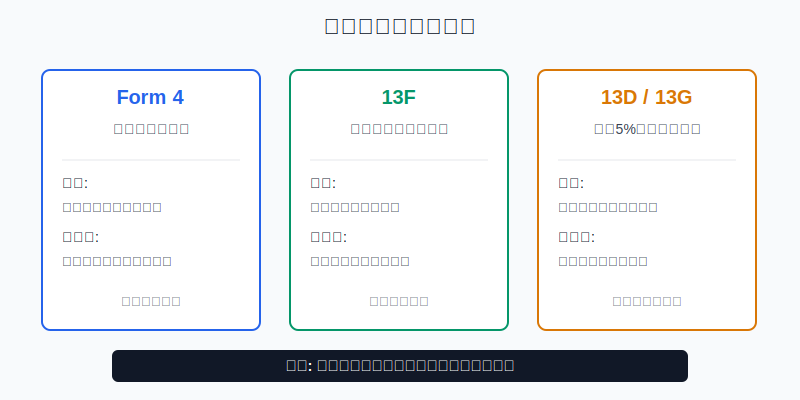
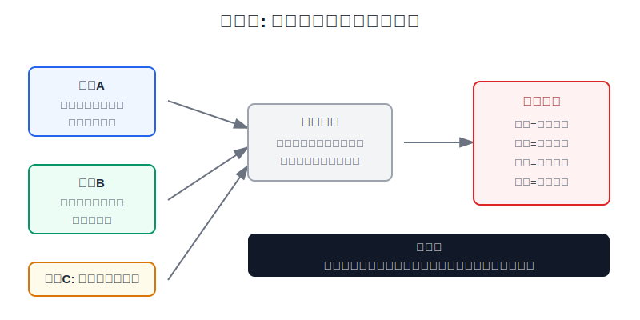
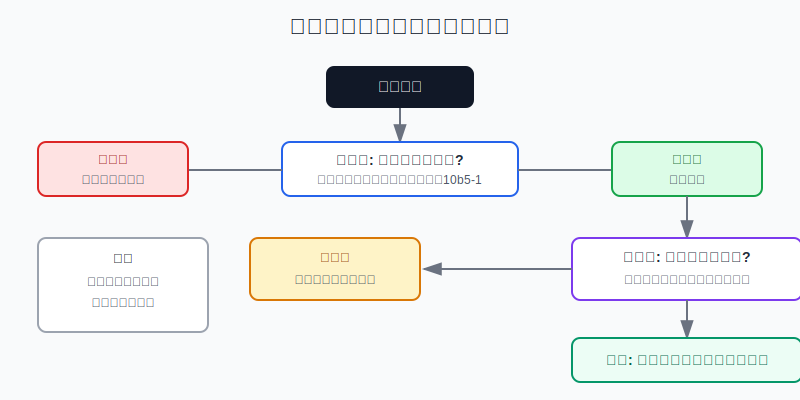

## 散户投资小白金融全品种操盘手册 - 11.14 Insider交易、机构持仓、13F - 能看什么，不能迷信什么
  
### 作者  
digoal  
  
### 日期  
2026-06-07   
  
### 标签  
金融产品 , 金融工具 , 散户 , 投资小白 , 全品操盘手册  
  
----  
  
## 背景 
  

> 适用读者: 已经会看美股财报和估值，但经常被“CEO买入”“某基金建仓”“巴菲特持仓曝光”这类消息吸引的小白投资者。  
> 本文定位: 投资教育框架，不构成个性化投资建议。

## 先问一个反直觉的问题

看到内部人买入、机构加仓，你第一反应很容易是: 聪明钱都动了，我是不是也该跟？真正危险的地方在这里: **披露信号能告诉你“谁做了什么”，但不能告诉你“你该不该用现在的价格买”。**

## 核心概念: 信号是体温计，不是处方药

Insider交易，中文常叫内部人交易披露。这里的“内部人”不是违法内幕交易的意思，而是公司高管、董事、持有超过10%股权的人，按规则需要披露自己买卖公司证券的情况。小白最常看的文件是Form 4，它会写交易人、身份、买卖数量、价格、交易代码。

机构持仓，通常指基金、投顾、保险、银行、养老基金等大资金的持仓披露。最常见的是13F: 资产管理规模达到门槛的大机构，每个季度披露一次部分美国上市证券持仓。还有13D和13G: 当某个投资者或一组投资者持有公司某类有投票权证券超过5%时，需要披露受益所有权。受益所有权，就是直接或间接拥有投票权或卖出权。

这些东西都值得看，但必须先把边界说清楚。**内部人买入可以提高你复核公司的优先级；机构持仓可以告诉你哪些大资金在关注；13D可以提示大股东或激进投资者的意图。但三者都不能替代财报、估值、竞争格局和仓位上限。**

本节行动结论: **把Insider、机构持仓和13F当成“复核触发器”，不要当成“买入按钮”。只有当信号质量高、基本面同向、估值不透支、仓位可控时，才允许进入小仓位试错；任意一环不过关，只记录，不交易。**

## 逻辑推导链

【论证链标题】: 因为披露信号有价值但不完整，所以小白只能用它触发复核，不能用它替代买入决策。

── 第一步: 前提陈述

前提A: 披露信号是真实公开资料。这是常量。SEC公开的Form 4、13F、13D/13G不是社区传闻，像医院里的体温计，至少告诉你某个可验证事实发生了。

前提B: 内部人和机构的视角通常比散户更接近公司或行业。这是变量。CEO、CFO、董事、大型基金经理拥有更多行业经验和研究资源，但他们的目标、期限、税务安排、客户约束和你的账户不同。

前提C: 披露信号天然不完整。这是常量。Form 4能看到交易行为，但看不到完整动机；13F能看到季度末部分多头持仓，但看不到空头、现金、很多非13F证券，也看不到季度内调仓。

前提D: 股票最终靠基本面、估值和仓位决定你的结果。这是常量。收入、利润、现金流、竞争格局和买入价格，才决定一笔交易是不是站得住。

── 第二步: 逻辑推导

由A+B可得: 因为披露信号真实，且披露主体通常更接近信息，所以它值得进入观察名单。看到CEO用自有资金买入，看到长期机构新建仓，都不是垃圾信息。

再由B+C可得: 因为披露主体的动机和约束与你不同，且披露有延迟和盲区，所以不能把“别人买了”直接推成“我也该买”。同一笔内部人卖出，可能是看空，也可能是缴税、分散风险、按10b5-1计划自动执行；同一笔13F持仓，可能已经在披露日之前被调掉。

最后由C+D可得: 因为信号不完整，而投资结果取决于基本面、估值和仓位，所以正确动作不是跟单，而是复核: 先判断信号质量，再查财报和估值，最后用小仓位验证。**信号只负责点灯，不能负责开车。**

── 第三步: 正常情景下的操作结论

✅ 正常情景: 你看到一条高质量信号，比如CEO或CFO用现金在公开市场买入，交易代码是P，金额相对其持股和收入不算小，且不是明显的期权行权、缴税或计划性卖出；同时公司收入、利润、现金流和估值没有和信号冲突。

对应操作: 把公司放入候选池，最多用计划仓位的三分之一建立观察仓，并写下失效条件。小白不能因为一条Form 4或一份13F直接满仓，也不能复制机构组合。

── 第四步: 数据和案例证实

证据1: Form 4是快信号，但不是动机说明书。SEC投资者公告说明，公司高管、董事和超过10%持有人需要披露持股、买入和卖出；多数情况下，内部人交易后需要在两个工作日内提交Form 4。Form 4常见交易代码包括P（公开市场买入）、S（卖出）、M（行权或转换）、F（用股票支付行权价或税款）、G（赠与）。SEC同一公告也提醒，内部人卖出有很多原因，包括流动性和分散风险。这组规则对应前提A和C: 交易事实很快公开，但动机不能从“卖出”两个字直接推出。

证据2: 13F是标准化机构快照，但天然滞后。SEC Form 13F FAQ说明，管理超过1亿美元Section 13(f)证券、并具有投资决策权的机构投资经理需要提交13F；披露内容包括发行人名称、证券类别、持有股数和季度末公允价值。SEC同时列明，13F季度披露通常在季度结束后45天内提交，2026年一季度的截止日是2026年5月15日。这对应前提C: 你在披露日看到的，是季度末快照，不是当天持仓。

证据3: 13F看不到全貌。SEC FAQ明确说明，13F不报告空头头寸，也不把空头从同一证券的多头中扣除；写出的卖出期权和卖出看跌/看涨期权也不在13F里报告。这验证了一个关键边界: 机构披露的“持有某股”，不等于它对这只股票没有对冲，也不等于它的组合风险和你一样。

证据4: 13D/13G比普通机构持仓更接近“控制权线索”。Investor.gov说明，当个人或一组人持有公司某类有投票权证券超过5%时，通常需要向SEC提交Schedule 13D；13D要在买入后五天内披露，13G则适用于符合条件的更简略披露。这个数据对应前提B: 大股东披露值得重视，但仍要继续读目的、身份和是否被动持有。

失败案例: 把13F当实时买入清单。Berkshire Hathaway在SEC披露的2026年一季度13F，提交日期是2026年5月15日，报告期是2026年3月31日。也就是说，散户在5月15日看到这份文件时，看到的是45天前季度末的部分持仓快照；4月和5月发生的买卖、现金安排、非13F证券和空头对冲，都不在这份表里。历史不代表未来，但这个案例验证的是规则本身: **13F适合研究机构风格和历史变化，不适合当日跟单。**

── 第五步: 前提变化时的替代结论

若前提B变弱，也就是披露主体的动机和你明显不同，推导路径变为: 因为对方可能在做税务、薪酬、客户赎回或组合再平衡，所以信号强度下降。新结论: 不交易，只记录。

若前提C变强，也就是披露延迟、盲区或交易代码显示信息质量低，推导路径变为: 因为看到的事实不完整，所以不能形成买入理由。新结论: 等下一份10-Q、10-K、财报电话会或下一季13F再复核。

若前提D不支持，也就是公司基本面变坏、估值已经透支，推导路径变为: 因为股票收益不靠别人买入本身，而靠未来现金流和价格关系，所以信号失效。新结论: 继续观察，不加仓。

## 实操例子: 看到CEO买入后怎么做

这个例子对应论证链的正常结论: **高质量信号只允许触发复核，复核通过后才允许小仓位试错。**

假设小林有2万美元美股个股资金，单只个股上限设为5%，也就是最多1000美元。他看到一家软件公司的CEO提交Form 4，显示用公开市场买入方式买入100万美元股票。

第一步，确认信号质量。小林先看交易代码是不是P，交易日期和提交日期是否接近，是否勾选10b5-1交易计划，买入是直接持有还是间接持有。如果代码不是P，而是M、F或G，就不能按“主动看好买入”理解。这一步对应前提C。

第二步，核对金额是否有意义。100万美元听起来很大，但小林还要看CEO原本持股规模。如果CEO原本持股价值是5亿美元，这笔买入只是0.2%；如果原本持股很少，这笔买入才更像明确表态。判断依据是前提B: 披露主体更接近信息，但动机和约束要拆开看。

第三步，回到财报。小林查最近两份10-Q和一份10-K: 收入是否还增长，毛利率和经营利润率有没有恶化，自由现金流是否转正或扩大，客户留存和Guidance是否支持增长。这一步对应前提D: 股票不是靠Form 4上涨，而是靠基本面兑现。

第四步，看估值。若公司基本面同向，但估值已经要求未来多年高速增长，小林只保留观察；若估值合理，才进入试错。判断依据是前提D: 好信号买贵了，也会变成差交易。

第五步，执行仓位。小林的单股上限是1000美元，第一次最多买入300美元。剩余仓位等下一季财报验证后再决定。失效条件写三条: 收入增速明显低于Guidance，经营现金流继续恶化，或管理层买入后公司又下调全年预期。

如果操作错误，后果也很清楚。小林如果看到CEO买入就直接买满1000美元，甚至追加到3000美元，他承担的不是“跟随内部人”的优势，而是单一信号失效后的集中风险。纠偏方法是把仓位降回上限，并把买入理由改写成: 信号质量、基本面、估值、仓位四项是否同时合格。

## 可复用框架

【三门过滤】

适用前提: 你看到内部人交易、13F、机构持仓或13D/13G披露，但还没有决定是否买入。

核心逻辑: 因为披露信号真实但不完整，所以必须过三道门。

操作步骤:

1. 信号门: 看身份、金额、交易代码、日期、是否10b5-1、直接或间接持有。
2. 基本面门: 看10-K、10-Q、Earnings Call，确认收入、利润、现金流和竞争格局是否同向。
3. 价格仓位门: 看估值是否透支，单股仓位是否低于上限，第一次是否只用试错仓。

前提失效时: 任意一道门不过，不交易；信号强但基本面不支持，只观察；基本面支持但价格太贵，等估值回到计划区间。

举一反三: 这个框架也能用于A股董监高增减持、港股主要股东披露和基金季报重仓股。

【反向读表】

适用前提: 你正在读一份具体披露文件。

核心逻辑: 因为披露表格会让人只看“买了还是卖了”，所以要反向问“这张表没告诉我什么”。

操作步骤:

1. 读Form 4: 先问交易代码和脚注，再问金额，最后问是否能说明主动买入。
2. 读13F: 先问报告期和提交日，再问这是否只是多头快照，最后问空头、现金和非13F资产是否缺失。
3. 读13D/13G: 先问是否超过5%，再问主动还是被动，最后读目的和后续修订。

前提失效时: 如果你说不清这张表缺了什么，就不能根据这张表下单。

举一反三: 读任何市场数据都要这样做。先看数据告诉你什么，再看数据没有告诉你什么。

## 本节行动清单

| 动作 | 合格标准 |
|---|---|
| 不把信号当按钮 | Insider、13F、13D/13G只能触发复核 |
| 先看交易代码 | Form 4重点区分P、S、M、F、G和脚注 |
| 识别计划交易 | 看到10b5-1计划，降低对“临时看法”的解读强度 |
| 检查13F日期 | 同时记录报告期和提交日，不把季度末快照当实时仓位 |
| 查披露盲区 | 13F不覆盖空头、现金、很多非13F资产和盘中调仓 |
| 回到基本面 | 每条信号都要用财报、估值、竞争格局复核 |
| 控制仓位 | 第一次只用观察仓，不因单条信号突破单股上限 |

## 一句话总结

Insider交易、机构持仓和13F都值得看，但它们只是让你知道“哪里值得复核”，不是替你回答“现在该买多少”。

## 参考资料

- SEC Office of Investor Education and Advocacy: Insider Transactions and Forms 3, 4, and 5，SEC Investor Bulletin，https://www.sec.gov/files/forms-3-4-5.pdf
- SEC: Frequently Asked Questions About Form 13F，2026年更新，https://www.sec.gov/rules-regulations/staff-guidance/division-investment-management-frequently-asked-questions/frequently-asked-questions-about-form-13f
- Investor.gov: Schedules 13D and 13G，https://www.investor.gov/additional-resources/general-resources/glossary/schedules-13d-13g
- SEC: Modernizing Rule 10b5-1 Insider Trading Plans，2023年1月20日，https://www.sec.gov/newsroom/modernizing-rule-10b5-1-insider-trading-plans
- SEC EDGAR: Berkshire Hathaway Inc. Form 13F-HR，报告期2026年3月31日，提交日2026年5月15日，https://www.sec.gov/Archives/edgar/data/1067983/000119312526226661/0001193125-26-226661-index.htm

> ⚠️ **声明**：本文内容为投资教育目的，所有历史数据、策略框架均为辅助学习工具，不构成证券投资建议。市场有风险，投资需谨慎。实际操作请结合自身风险承受能力，必要时咨询专业投顾。
  
#### [PostgreSQL 解决方案集合](../201706/20170601_02.md "40cff096e9ed7122c512b35d8561d9c8")
  
  
#### [德哥 / digoal's Github - 公益是一辈子的事.](https://github.com/digoal/blog/blob/master/README.md "22709685feb7cab07d30f30387f0a9ae")
  
  
#### [About 德哥](https://github.com/digoal/blog/blob/master/me/readme.md "a37735981e7704886ffd590565582dd0")
  
  

  
