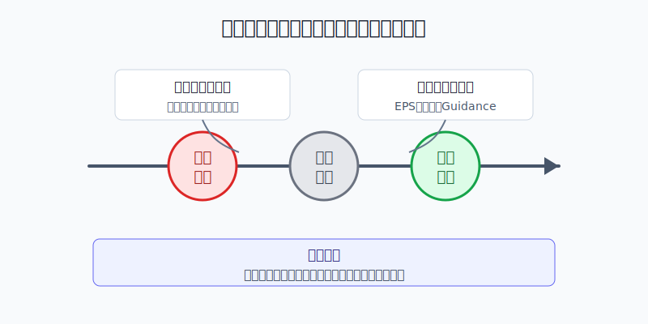
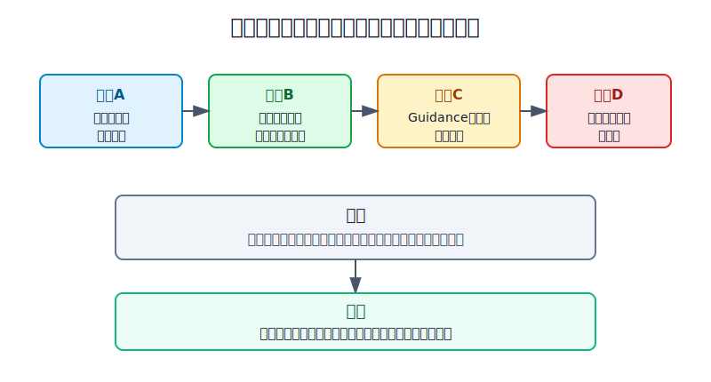
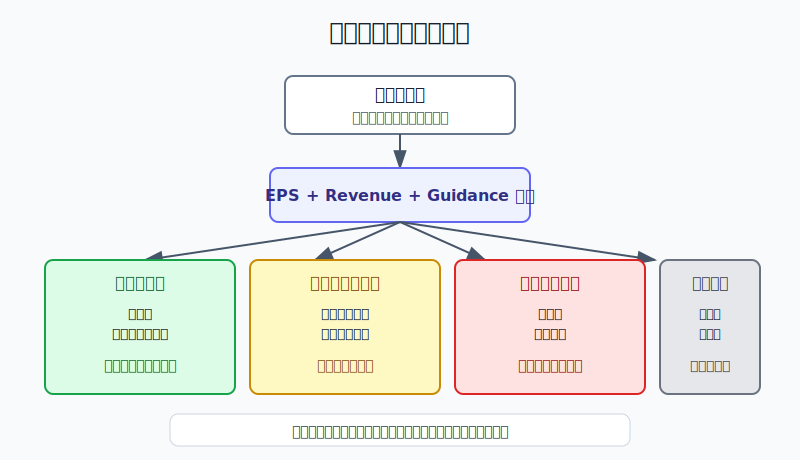

## 散户投资小白金融全品种操盘手册 - 11.15 财报后大涨大跌 - 预期差比绝对好坏更重要
  
### 作者  
digoal  
  
### 日期  
2026-06-07   
  
### 标签  
金融产品 , 金融工具 , 散户 , 投资小白 , 全品操盘手册  
  
----  
  
## 背景 
  

> 适用读者: 已经能看懂 EPS、Revenue、Guidance 这三个词，但一到财报后股价暴涨暴跌就困惑的小白投资者。  
> 本文定位: 投资教育框架，不构成个性化投资建议。

## 先问一个反直觉的问题

为什么有的公司财报很好，股价反而大跌；有的公司业绩不好，股价却大涨？

答案不是市场疯了，而是你看的是“成绩单”，市场看的是“成绩单有没有超过原来剧本”。**财报后真正驱动股价的，不是绝对好坏，而是预期差。**

## 核心概念: 财报不是考试成绩，而是和市场剧本对答案

小白看财报，常见顺序是: EPS 高不高、收入涨不涨、公司赚不赚钱。这个顺序没有错，但少了一步: **这些数字公布前，市场原来以为会是多少？**

用考试打比方。一个学生考了90分，如果全班和老师原来都以为他会考98分，这就是低于预期；另一个学生考了70分，如果大家原来以为他只能考55分，这就是超预期。分数本身重要，但价格反应更在意“和预期差多少”。

放到美股财报里，市场剧本通常由四件事组成: 分析师一致预期、公司过去给的 Guidance、财报前股价涨跌、估值里隐含的增长要求。公司公布财报后，市场会立刻比较三张答案: EPS、Revenue、Guidance。EPS 是每股收益，Revenue 是收入，Guidance 是公司对下一季或全年业绩的展望。

本节行动结论先放在前面: **财报后不要先问“好不好”，先问“差在哪”。EPS、收入、指引同时超预期，且估值没有过度透支，才有加仓讨论；当季好但指引弱，先暂停加仓；当季和指引都低于预期，优先降级或退出；如果只是不理解盘后波动，不交易。**

## 逻辑推导链

【论证链标题】: 因为财报公布前股价已经包含市场预期，所以财报后大涨大跌来自“实际结果和原来剧本的差距”，不是来自数字本身的绝对好坏。

── 第一步: 前提陈述

前提A: 财报前市场已经有一套预期。这是常量。分析师会给 EPS 和收入预测，公司会给 Guidance，股价会提前反映投资者的乐观或悲观。它像开饭前大家已经点好菜，财报只是端上来的菜是不是对味。

前提B: 股价买的是未来现金流，不只是过去一个季度。这是常量。财报里的当季 EPS 和收入是已经发生的结果，但股价更在意下一季、下一年、未来几年是否更好。

前提C: Guidance 会改写未来剧本。这是变量。公司管理层如果上调收入、利润率或资本开支计划，市场会重新计算未来；如果下调指引，哪怕当季漂亮，股价也会重新定价。

前提D: 估值决定容错率。这是变量。一家公司如果估值已经很高，市场要求它持续交出超预期结果；一家公司如果财报前已经跌得很惨，只要未来剧本修复一点，股价也能反弹。

前提E: 小白没有能力稳定押中财报。 这是常量。财报后几分钟内的盘后交易、期权波动和机构算法反应，不是小白的优势区。

── 第二步: 逻辑推导

由A可得: 因为市场早就有预期，所以“收入增长”“利润增长”本身不够，必须看它们是否超过原来的预期。增长低于预期，仍然会跌；亏损低于预期，也能涨。

由A+B可得: 因为股价买的是未来，所以当季成绩只是第一层答案。真正影响持续涨跌的是未来收入增速、利润率、现金流、订单、用户增长、资本开支和管理层口径。

再由A+B+C可得: 因为 Guidance 会改写未来剧本，所以“当季 beat + 指引弱”不是强信号，而是矛盾信号；“当季 miss + 指引修复”也不是纯坏信号，而是未来预期改善。

最后由A+B+C+D+E可得: 因为小白无法稳定押中财报，而估值又会放大预期差，所以正确动作不是赌财报，而是财报后用三问复盘: **差在哪、影响多久、估值是否已经反映。**

── 第三步: 正常情景下的操作结论

✅ 正常情景: 公司 EPS、收入、Guidance 同时超预期，管理层解释能落到订单、用户、毛利率、现金流或明确需求上，估值没有把未来多年高增长全部提前透支。

对应操作: 可以从观察池升级为候选股，但只允许小仓位分批。小白的单只美股个股上限仍应服从第十一章后续的仓位规则；财报后第一次动作只用计划仓位的三分之一，不在盘后情绪波动里一次打满。

── 第四步: 数据和案例证实

证据1: 预期差确实会影响股价反应。FactSet 2026年5月11日统计显示，当时已公布 Q1 2026 财报的 S&P 500 公司中，84% 的公司 EPS 高于均值预期；正 EPS 惊喜公司的股价在财报日前两天到财报日后两天平均上涨1.1%，负 EPS 惊喜公司的股价平均下跌4.9%。这说明市场不是只看“赚钱没赚钱”，而是奖惩“相对预期”的差距。

证据2: 超预期会形成正向反馈。Microsoft 2025财年第三季度财报显示，季度收入701亿美元，同比增长13%；摊薄 EPS 为3.46美元，同比增长18%；Azure and other cloud services 收入增长33%。FactSet 同期统计还指出，Microsoft 当季 GAAP EPS 3.46美元高于3.22美元均值预期，股价在2025年4月28日至5月2日期间上涨11.3%。这对应正常情景: 当季数字、云业务动能和市场预期差同向。

证据3: 当季好但未来剧本变弱，股价照样下跌。Meta 2024年第一季度收入364.55亿美元，EPS 为4.71美元；AP 报道称，分析师预期为 EPS 4.32美元、收入361.4亿美元。但公司给出的第二季度收入指引为365亿至390亿美元，其中位数低于市场预期附近，同时把2024年资本开支预期从300亿至370亿美元上调到350亿至400亿美元。CNBC 报道 Meta 次日股价下跌10%。这说明“当季 beat”被“未来成本和增速的不确定”压过。

证据4: 收入和指引低于预期，会直接触发估值重估。Salesforce 2025财年第一季度收入91.3亿美元，同比增长11%，经营现金流62.5亿美元，同比增长39%；这些绝对数字不差。但公司给出的第二季度收入指引为92.0亿至92.5亿美元，全年收入指引为377亿至380亿美元，并下调全年订阅与支持收入增长口径。CNBC 报道 Salesforce 2024年5月30日收跌20%，为近20年来最差单日表现。这个案例对应前提C和D: 高估值软件股一旦未来增长剧本变弱，市场会迅速重估。

证据5: 业绩差但未来剧本修复，也会反弹。Tesla 2024年第一季度财报收入213亿美元，低于市场预期；CNBC 报道其调整后 EPS 0.45美元也低于0.51美元预期。但管理层表示更平价车型的生产可能早于原先沟通的2025年下半年，CNBC 报道 Tesla 次日上涨12%。这个案例不是说差财报可以买，而是说明市场反应的核心仍是未来剧本是否被修复。

历史数据不代表未来，但这些案例有参考价值，因为它们验证的是一条稳定机制: **股价不是按财报标题交易，而是按“原来预期 - 实际答案 - 未来指引 - 当前估值”这四者的差额重新定价。**

── 第五步: 前提变化时的替代结论

若前提C改变，也就是公司当季好但 Guidance 下修，推导路径变为: 因为过去成绩不错，但未来剧本变弱，所以不能把当季好直接外推。新结论: 暂停加仓，等下一季验证收入、利润率和现金流是否恢复。

若前提D改变，也就是财报前股价已经大涨、估值已经很高，推导路径变为: 因为市场已经把好消息提前写进股价，所以普通 beat 不够。新结论: 不追高，除非公司给出明确高于市场预期的未来证据。

若前提A改变，也就是市场预期极低、股价已经大幅下跌，推导路径变为: 因为坏消息已经部分反映，所以轻微 miss 不一定继续大跌。新结论: 先复盘预期是否修复，不把“跌得多”当买入理由。

失败案例: 把“财报 beat”直接等于“可以买”，就是错误。Meta 和 Salesforce 都说明，EPS 或收入单点超预期不能替代 Guidance、资本开支、订单和估值检查。前提C或D失效时，买入逻辑也失效。

## 实操例子: 2万美元账户怎么处理财报后大涨大跌

这个例子对应论证链的正常结论: **财报后先解释预期差，再决定动作，不靠盘后涨跌直接下单。**

假设小林有2万美元美股个股资金，单只个股上限为8%，也就是1600美元。他已经持有某科技股800美元，财报公布后盘后上涨12%。

第一步，不看涨幅，先填三问表。EPS 是超预期、符合预期还是低于预期？收入是超预期、符合预期还是低于预期？Guidance 是上调、维持还是下调？这一步对应前提A: 先找实际答案和市场剧本的差距。

第二步，判断上涨来源。如果上涨来自 EPS 一次性税率、裁员或回购，而收入和指引没有变强，小林不加仓；如果上涨来自订单、云收入、用户增长、毛利率和现金流同时改善，才进入加仓讨论。这一步对应前提B和C: 股价买未来，不买单季漂亮。

第三步，检查估值容错率。如果财报前股价已经涨了40%，Forward PE 已经明显高于同类公司，而本次只是小幅 beat，小林不追。因为前提D告诉他: 高估值需要更大的超预期。

第四步，执行仓位动作。若 EPS、收入、Guidance 三项都强，估值仍可接受，小林最多加400美元，把持仓从800美元加到1200美元，仍低于1600美元上限。剩下400美元等下一季验证，不在盘后一次打满。

第五步，写失效条件。如果下一季收入增速低于公司指引，或管理层下调全年 Guidance，或资本开支大幅增加但现金流没有跟上，小林停止加仓；若两个季度连续证伪，降回观察仓或退出。

如果操作错误，最常见的后果是把“财报后上涨”误读成“风险消失”。盘后上涨12%后追满仓，一旦第二天正式交易回落，或者下一季指引变弱，账户会从研究风险变成仓位风险。纠偏方法是把动作拆成三步: 先解释，再小仓验证，最后等下一季复核。

## 可复用框架

【三问复盘】

适用前提: 公司刚发布财报，股价出现明显涨跌，你想判断是否操作。

核心逻辑: 因为财报后价格按预期差重估，所以先问差距来源，再决定仓位。

操作步骤:

1. 问 EPS: 是超预期、符合预期还是低于预期，差距来自主营业务还是一次性项目。
2. 问收入: 是真实需求变强，还是价格、汇率、并购、会计口径影响。
3. 问 Guidance: 管理层对下一季和全年是上调、维持还是下调。

前提失效时: 如果 Guidance 弱于预期，哪怕 EPS 好，也暂停加仓；如果 EPS 弱但 Guidance 修复，不立刻否定，先看修复证据是否具体。

举一反三: 这个框架也适用于港股、美股 ETF 成分股、A股财报季和中概股 ADR。

【四格定价】

适用前提: 你已经知道财报结果，想判断股价反应是否合理。

核心逻辑: 因为股价由预期、实际、未来和估值共同决定，所以单看财报标题会误判。

操作步骤:

1. 预期格: 财报前市场原来期待什么，看分析师预期、公司上次指引和财报前涨跌。
2. 实际格: 本次 EPS、收入、利润率、现金流实际交了什么答案。
3. 未来格: Guidance、订单、用户、资本开支和管理层口径是否改变。
4. 估值格: 当前价格是否已经透支未来好消息。

前提失效时: 四格里有两格变坏，不加仓；三格变坏，优先降级或减仓。只有一格短期波动，可以保留观察，但必须写复核日期。

举一反三: 这个框架也能用在非财报事件上，例如新产品发布、监管处罚、并购公告和行业政策变化。

## 本节行动清单

| 动作 | 合格标准 |
|---|---|
| 不赌财报 | 财报前不为了押涨跌临时重仓 |
| 先找预期差 | 每次财报后写清 EPS、收入、Guidance 分别差在哪里 |
| 区分过去和未来 | 当季 beat 不等于未来变强，Guidance 必须单独看 |
| 检查估值 | 高估值公司需要更大的超预期，普通好消息不够 |
| 小仓分批 | 财报后第一次动作不超过计划仓位三分之一 |
| 写失效条件 | 指引下修、现金流恶化、资本开支失控、增长逻辑证伪时停止加仓 |

## 一句话总结

财报后大涨大跌不是看公司“好不好”，而是看实际答案有没有超过市场原来剧本；小白的正确动作不是押财报，而是用预期差复盘，把涨跌翻译成可执行的仓位纪律。

## 参考资料

- FactSet: Market Is Punishing Negative EPS Surprises More Than Average for Q1，2026年5月11日，https://insight.factset.com/market-is-punishing-negative-eps-surprises-more-than-average-for-q1
- FactSet: Market Is Rewarding Positive EPS Surprises More Than Average for Q1，2025年5月12日，https://insight.factset.com/market-is-rewarding-positive-eps-surprises-more-than-average-for-q1
- Microsoft: FY25 Q3 Earnings Release，2025年4月30日，https://www.microsoft.com/en-us/Investor/earnings/FY-2025-Q3/press-release-webcast
- Meta: Q1 2024 Results，2024年4月24日，https://investor.atmeta.com/investor-news/press-release-details/2024/Meta-Reports-First-Quarter-2024-Results/default.aspx
- AP: Meta more than doubles Q1 profit but revenue guidance pulls shares down after-hours，2024年4月24日，https://apnews.com/article/378d5a7e487b7b17bf89c2ad0cad4a6c
- CNBC: Meta stock down on weak revenue forecast，2024年4月25日，https://www.cnbc.com/2024/04/25/meta-stock-down-15percent-on-weak-revenue-forecast.html
- Salesforce: Q1 FY25 Results，2024年5月29日，https://investor.salesforce.com/news/news-details/2024/Salesforce-Announces-First-Quarter-Fiscal-2025-Results/default.aspx
- CNBC: Salesforce stock notches worst day since 2004，2024年5月30日，https://www.cnbc.com/2024/05/30/salesforce-stock-fall-earnings-revenue-miss.html
- CNBC: Tesla stock up after Elon Musk says new affordable EV models coming，2024年4月24日，https://www.cnbc.com/2024/04/24/tesla-stock-up-after-elon-musk-says-new-affordable-ev-models-coming.html

> ⚠️ **声明**：本文内容为投资教育目的，所有历史数据、策略框架均为辅助学习工具，不构成证券投资建议。市场有风险，投资需谨慎。实际操作请结合自身风险承受能力，必要时咨询专业投顾。
  
#### [PostgreSQL 解决方案集合](../201706/20170601_02.md "40cff096e9ed7122c512b35d8561d9c8")
  
  
#### [德哥 / digoal's Github - 公益是一辈子的事.](https://github.com/digoal/blog/blob/master/README.md "22709685feb7cab07d30f30387f0a9ae")
  
  
#### [About 德哥](https://github.com/digoal/blog/blob/master/me/readme.md "a37735981e7704886ffd590565582dd0")
  
  

  
