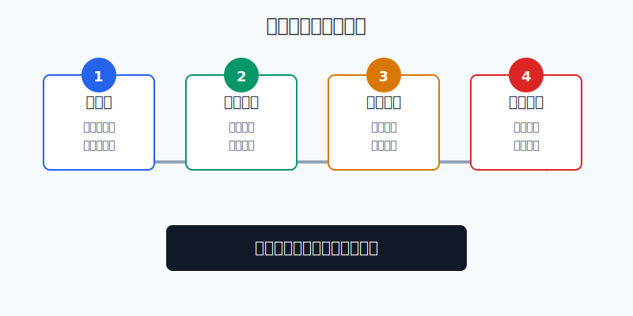
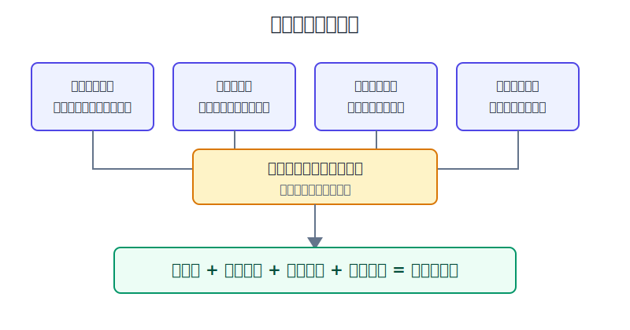
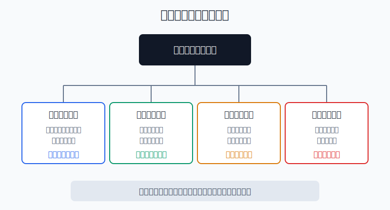

## 散户投资小白金融全品种操盘手册 - 11.16 个股买入框架 - 好公司、合理价格、明确仓位、失效条件
  
### 作者  
digoal  
  
### 日期  
2026-06-07   
  
### 标签  
金融产品 , 金融工具 , 散户 , 投资小白 , 全品操盘手册  
  
----  
  
## 背景 
  

> 适用读者: 已经学过美股财报、估值和行业研究框架，但一到下单就容易被“好公司”“大跌了”“别人都在买”带着走的小白投资者。  
> 本文定位: 投资教育框架，不构成个性化投资建议。数据口径按 2026-06-06 可核查公开资料整理。

## 先问一个反直觉的问题

个股买入最危险的时刻，不是你完全不懂一家公司，而是你刚好懂了一点。懂产品，容易忽视价格；懂财报，容易忽视仓位；懂行业，容易忘记写错了怎么办。**买入不是按下按钮，而是签下一份“我愿意承担什么风险”的合同。**

## 核心概念: 买入前先过四道门

这一节不是教你找“神股”。真正适合小白的买入框架，只有四句话:

**好公司**: 公司质量必须能被财报和竞争格局证明，不靠社区热帖证明。

**合理价格**: 股价对应的未来回报要覆盖业务风险，不是“跌过”就便宜，也不是“龙头”就可以随便买。

**明确仓位**: 单只个股必须有上限。研究再认真，也要承认自己会错。

**失效条件**: 下单前写清楚什么事实出现后，买入理由就不成立。没有失效条件的买入，本质是情绪持仓。

本节的行动结论先放在前面: **个股买入必须四道门同时通过；缺一门，不买；四门通过，也只允许先小仓试买，等下一次财报继续验证后再决定是否加仓。**

## 逻辑推导链

【论证链标题】: 因为个股收益高度偏态，好公司会变，好公司也会被买贵，仓位又会放大错误，所以小白买入个股必须同时验证公司、价格、仓位和失效条件。

### 第一步: 前提陈述

前提A: 个股收益高度偏态。这是常量。偏态可以理解为“少数赢家拉动整体成绩，多数股票表现平平甚至拖后腿”。买个股不是从一堆平均机会里挑一个，而是在少数大赢家和大量普通公司之间做选择。

前提B: 好公司不是永久标签。这是变量。产品会老化，竞争会加强，管理层会犯错，利率和周期会改变估值。今天的好公司，只能通过未来财报继续证明自己。

前提C: 好公司买贵了，预期收益会下降。这是常量。价格像入场门票，门票太贵，后面演出再精彩，你的回报也会被提前透支。

前提D: 仓位决定错误的伤害半径。这是常量。1%的仓位看错，是一笔学费；30%的仓位看错，会改变整个账户命运。

前提E: 失效条件必须先写。这是常量。人买入后会天然替自己辩护，所以卖出纪律不能等亏损后再临时编。

### 第二步: 逻辑推导

由A可得: 因为大多数个股不能稳定跑赢无风险替代品或市场平均，所以小白不能把“买个股”当成默认动作。默认核心资产应是宽基ETF或分散组合，个股只是卫星仓。

由A+B可得: 因为个股赢家少，而且公司质量会变化，所以“好公司”必须写成可复核证据: 收入来自哪里，利润率为什么守得住，自由现金流是否真实，竞争优势有没有被削弱。

再由A+B+C可得: 因为公司质量和买入价格共同决定收益，所以好公司不等于好买点。合理价格至少要回答一句话: 按当前价格买入，未来三到五年的预期回报是否足够补偿业务、估值和汇率风险。

最后由A+B+C+D+E可得: 因为研究会出错、价格会波动、公司会变化，所以买入前必须把仓位和失效条件写进计划。**只有“好公司、合理价格、明确仓位、失效条件”四个前提同时成立，买入才是决策；否则只是冲动。**

### 第三步: 正常情景下的操作结论

✅ 正常情景: 一家公司经营质量已被财报验证，价格没有透支未来多年增长，单股仓位不超过你的预设上限，并且失效条件写清楚。

对应操作: 允许建观察仓。小白可以把单只美股个股初始仓位控制在总资产1%-2%，非常熟悉且连续跟踪后也不宜超过5%；第一次买入只用计划仓位的三分之一，剩余仓位等待下一次财报验证。

直接规则是: **先写买入计划，再下单；没有计划，不下单。**

### 第四步: 数据和案例证实

证据1: Hendrik Bessembinder 2018年发表于《Journal of Financial Economics》的论文《Do Stocks Outperform Treasury Bills?》研究1926年以来CRSP数据库中的美国普通股，结论包括: 大约每7只股票中有4只的终身买入持有收益低于一个月美国国库券；从终身财富创造看，表现最好的约4%上市公司解释了美国股市1926年以来的整体净财富增量。这个证据对应前提A: 个股收益不是均匀分布，小白不能用“我挑一只好股票就行”低估难度。

证据2: SEC 的 Investor.gov 在“资产配置、分散化和再平衡”材料中提醒，分散化是在不同投资之间分散资金来降低风险；SEC 旧版投资者教育材料还明确说，如果股票部分只持有4到5只个股，并不算真正分散，至少需要一打经过仔细挑选的个股。这个证据对应前提D: 单只个股必须有仓位上限，否则一次判断错误就会穿透整个组合。

证据3: SEC 的《Beginners' Guide to Financial Statements》说明，财务报表展示公司资金从哪里来、到哪里去、现在在哪里；资产负债表、利润表和现金流量表合在一起，才给投资者提供有力信息。这个证据对应前提B: “好公司”不能靠印象判断，必须回到收入、利润、现金流和负债。

证据4: Cisco 2000财年第四季度公告显示，2000财年净销售额为189.3亿美元，同比增长55%；但Cisco 2001财年公告显示，2001财年净销售额为222.9亿美元，同比增长18%，实际净亏损10.1亿美元，而2000财年实际净利润为26.7亿美元。这个案例对应前提B和C: 一家公司可以在上一年高速增长，下一年仍遭遇盈利反转；如果买入时没有价格边界和失效条件，就会把“好公司”误当成“永远正确”。

证据5: Intel 2026年1月发布的2025全年业绩显示，2025年全年收入529亿美元，与2024年基本持平；GAAP口径归属于Intel的全年净亏损为3亿美元，2024年为亏损188亿美元；公司同时预计2026年一季度GAAP每股亏损0.21美元。这个案例对应前提B: 老牌龙头也要继续验证经营修复，不能因为公司名字熟悉就跳过买入框架。

历史数据不代表未来，但这些证据验证的是稳定机制: **个股选择难度高，经营质量会变化，价格会改变收益，仓位会改变风险后果。**

### 第五步: 前提变化时的替代结论

若前提B改变，也就是财报显示收入、利润率、现金流或竞争优势连续低于买入计划，推导路径变为: 因为“好公司”证据被削弱，所以买入理由不再成立。新结论: 停止加仓；触发失效条件时先减仓或清仓，再复盘。

若前提C改变，也就是股价上涨后预期收益无法覆盖业务风险，推导路径变为: 因为门票变贵，所以好公司变成好观察对象，不再是好买点。新结论: 不追买，只保留观察仓或等待。

若前提D改变，也就是单股仓位因上涨或补仓超过上限，推导路径变为: 因为错误伤害半径扩大，所以组合风险已经高于计划。新结论: 把仓位减回规则内，不用“我更有信心了”替代风控。

若前提E改变，也就是失效条件已经触发但你开始找理由拖延，推导路径变为: 因为计划被情绪接管，所以持仓从投资变成赌反弹。新结论: 先按计划执行，再写复盘。

失败案例: 只写“这家公司是龙头、长期看好”，却不写合理价格、仓位和失效条件。当前提B或C失效时，这句话没有任何操作含义，只会让你在亏损后继续补故事。

## 实操例子: 2万美元美股个股资金怎么下第一笔单

这个例子对应论证链的正常结论: **四道门全过，才允许小仓试买。**

假设小林有10万美元长期投资资金，其中8万美元已经配置在宽基ETF、短债和现金管理里，另外2万美元专门作为美股个股学习资金。他看中一家云软件公司，准备买入。

第一步，过“好公司”门。小林写下三条可验证证据: 最近4个季度收入仍在增长；毛利率没有被竞争打坏；经营现金流为正，并且管理层能解释客户续费、产品竞争和未来投入。判断依据是前提B: 公司质量必须由财报验证。若只能写出“AI空间很大、社区很看好”，这一门不通过。

第二步，过“合理价格”门。小林假设公司未来一年自由现金流为10亿美元，如果当前市值是250亿美元，自由现金流收益率约为4%。若同时期低风险美元资产收益率接近4%，而这家公司还要承担竞争、估值和汇率风险，这个价格不合格；如果市值降到160亿美元，自由现金流收益率约为6.25%，并且业务仍在改善，才进入观察。判断依据是前提C: 好公司也要有风险补偿。

第三步，过“明确仓位”门。小林规定单只个股最高不超过总资产5%，也就是5000美元；初始仓位不超过总资产1%，也就是1000美元。这一步对应前提D: 第一笔买入的目的不是赚满，而是让真实持仓逼自己跟踪，同时错误可控。

第四步，过“失效条件”门。小林写下三条: 连续两个季度收入增速低于自己计划且管理层解释不清；自由现金流由正转负且不是一次性投入；竞争对手导致续费率或客户增长明显恶化。任一触发，停止加仓；两条同时触发，减仓或退出。这一步对应前提E: 错了要有出口。

第五步，执行。四门通过后，小林只买1000美元。下一次财报继续验证三件事: 公司质量有没有变，价格是否仍合理，仓位是否仍在上限内。若股价上涨导致仓位超过5%，减回规则内；若财报证伪，先执行失效条件，不用“长期看好”抵消事实。

如果操作错误，后果很直接。没有价格门，会买到好公司但预期收益太低；没有仓位门，一次看错就拖垮账户；没有失效条件，亏损后会从投资者变成辩护律师。纠偏方法不是预测股价，而是回到四道门: 哪一门没过，就补哪一门；补不上，就不买。

## 可复用框架

【四门买入】

适用前提: 你准备买入单只美股个股，而不是买宽基ETF。

核心逻辑: 因为个股收益偏态、公司会变、价格会透支、仓位会放大错误，所以买入前必须四门同时通过。

操作步骤:

1. 好公司门: 用财报、竞争格局、现金流证明公司质量。
2. 价格门: 计算预期收益是否覆盖业务和估值风险。
3. 仓位门: 写清初始仓位、计划仓位和单股上限。
4. 失效门: 写清哪些事实出现后买入理由失效。

前提失效时: 任一门不合格，不买；买入后任一门失效，停止加仓；两门同时失效，优先减仓。

举一反三: 这个框架也能用在A股个股、港股个股、REITs单只产品和行业ETF卫星仓。

【先写后买】

适用前提: 你已经研究过公司，但还没有下单。

核心逻辑: 因为买入后人会替自己辩护，所以必须在情绪最少的时候写计划。

操作步骤:

1. 写买入理由: 不超过3条，每条都有证据。
2. 写买入价格: 不写“越跌越买”，只写价格区间和理由。
3. 写仓位上限: 初始仓位、加仓条件、总上限分开写。
4. 写失效条件: 失效条件触发后先执行，再复盘。

前提失效时: 计划写不完整，不下单；写完后发现价格不合理，移入观察清单。

举一反三: 以后做任何主动交易，都先把“为什么买、买多少、错了怎么办”写下来。

## 本节行动清单

| 动作 | 合格标准 |
|---|---|
| 先写计划 | 买入理由、价格、仓位、失效条件都写清楚 |
| 不用名字代替研究 | “龙头”“熟悉”“长期看好”不能单独成为买入理由 |
| 好公司看证据 | 收入、利润率、现金流、负债、竞争格局至少各有一个判断 |
| 合理价格看补偿 | 预期收益要明显覆盖业务风险、估值风险和汇率风险 |
| 仓位先设上限 | 初始仓位1%-2%，熟悉后单股也不宜超过5% |
| 触发失效先执行 | 财报或竞争证据证伪买入理由时，不用情绪拖延 |

## 一句话总结

个股买入不是找到一个让自己兴奋的理由，而是证明好公司、合理价格、明确仓位和失效条件四件事同时成立；四门不过，机会再热也不下单。

## 参考资料

- Hendrik Bessembinder: Do Stocks Outperform Treasury Bills?, Journal of Financial Economics, 2018, SSRN, https://papers.ssrn.com/sol3/papers.cfm?abstract_id=2900447
- Investor.gov: Asset Allocation, Diversification, and Rebalancing 101，2026-06-06访问，https://www.investor.gov/index.php/introduction-investing/getting-started/asset-allocation
- SEC: Beginners' Guide to Asset Allocation, Diversification, and Rebalancing，https://www.sec.gov/investor/pubs/assetallocation.htm
- SEC: Beginners' Guide to Financial Statements，2007年2月，https://www.sec.gov/reportspubs/investor-publications/investorpubsbegfinstmtguidehtm.html
- Cisco: Cisco Systems Reports Fourth Quarter Earnings，2000年8月8日，https://newsroom.cisco.com/c/r/newsroom/en/us/a/y2000/m08/cisco-systems-reports-fourth-quarter-earnings.html
- Cisco: Cisco Systems Reports Fiscal Year 2001 and Fourth Quarter Earnings，2001年8月7日，https://newsroom.cisco.com/press-release-content?articleId=8452
- Intel: Intel Reports Fourth-Quarter and Full-Year 2025 Financial Results，2026年1月22日，https://www.intc.com/news-events/press-releases/detail/1759/intel-reports-fourth-quarter-and-full-year-2025-financial

> ⚠️ **声明**：本文内容为投资教育目的，所有历史数据、策略框架均为辅助学习工具，不构成证券投资建议。市场有风险，投资需谨慎。实际操作请结合自身风险承受能力，必要时咨询专业投顾。
  
#### [PostgreSQL 解决方案集合](../201706/20170601_02.md "40cff096e9ed7122c512b35d8561d9c8")
  
  
#### [德哥 / digoal's Github - 公益是一辈子的事.](https://github.com/digoal/blog/blob/master/README.md "22709685feb7cab07d30f30387f0a9ae")
  
  
#### [About 德哥](https://github.com/digoal/blog/blob/master/me/readme.md "a37735981e7704886ffd590565582dd0")
  
  

  
