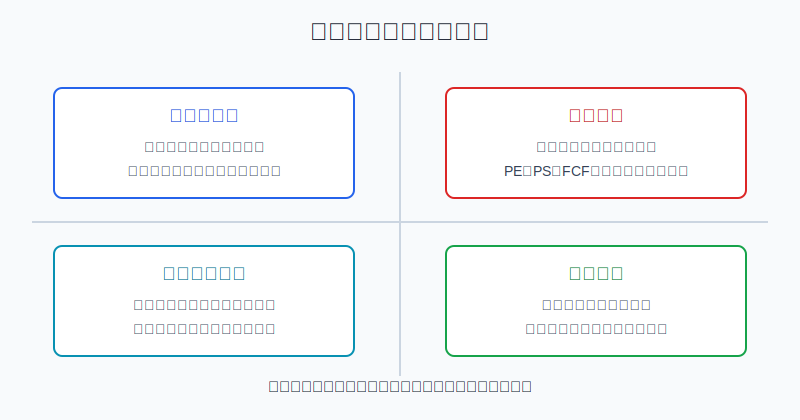
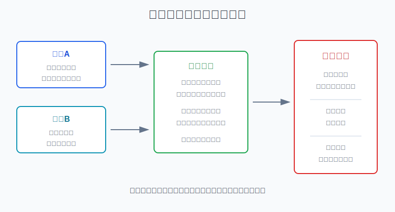
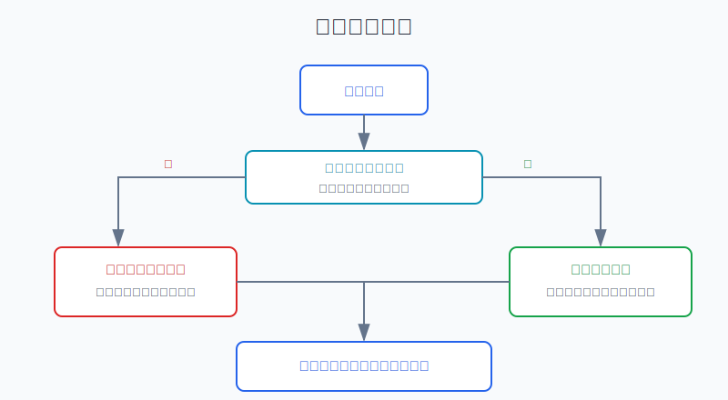

## 散户投资小白金融全品种操盘手册 - 11.17 个股卖出框架 - 基本面变坏、估值透支、竞争格局变化、仓位过重
  
### 作者  
digoal  
  
### 日期  
2026-06-07   
  
### 标签  
金融产品 , 金融工具 , 散户 , 投资小白 , 全品操盘手册  
  
----  
  
## 背景 
  

> 适用读者: 已经会写个股买入理由，但一到卖出就被“再等等”“跌了不甘心”“涨了怕踏空”拖住的小白投资者。  
> 本文定位: 投资教育框架，不构成个性化投资建议。规则口径按 2026-06-06 可核查公开资料整理。

## 先问一个反直觉的问题

很多人以为卖出最难的是判断顶部。其实不是。散户卖不好的核心原因，是买入时没有写清楚“什么变化会让我卖”。没有失效条件，卖出就会变成情绪题: 涨了怕卖飞，跌了怕认错，最后把个股拿成了信仰。

## 核心概念: 卖出不是认输，而是更新决策

买入一只美股个股，本质上买的是三件事: 公司未来能赚到的钱、当前价格是否合理、这只股票在你组合里的风险占比。卖出也必须围绕这三件事展开。

基本面变坏，就是公司原来支撑买入的经营事实变了。比如收入增速明显下台阶、利润率被压缩、自由现金流转弱、管理层下调指引。这里的“指引”，是公司管理层对未来收入、利润或经营指标给出的预期。

估值透支，就是公司仍然不错，但股价已经把太多未来增长提前算进去了。小白容易犯的错是: 好公司等于永远可以买。真正的规则是: 好公司也要有好价格。价格太贵时，未来几年公司做得不错，股价回报也可能普通。

竞争格局变化，就是原来的护城河被削弱。新对手出现、平台规则改变、技术路线转移、用户迁移、价格战加剧，都可能让过去的优势失效。竞争格局一旦变坏，不能只看“这家公司以前很强”。

仓位过重，是最容易被忽视的卖出理由。一只股票涨很多以后，即使公司没有变差，它在组合里的占比也可能变得太大。此时卖出不是看空公司，而是把组合风险拉回自己能承受的范围。

本节的行动结论先放在前面: **个股卖出只看四类触发器: 基本面变坏、估值透支、竞争格局变化、仓位过重。买入理由被基本面或竞争格局破坏时，退出或降为观察仓；公司没坏但估值透支时，分批减仓；公司没坏但单票超过仓位上限时，再平衡。**

## 逻辑推导链

【论证链标题】: 因为个股持有理由来自“事实、价格、仓位”三件事，所以卖出条件必须对应这三件事的变化，而不是对应情绪和短期涨跌。

### 第一步: 前提陈述

前提A: 买入理由应该由经营事实、估值价格和仓位上限组成。这是常量。它像开车前设定导航: 目的地、路线和油量都要写清楚，否则走偏了也不知道。

前提B: 公司经营事实会变化。这是变量。收入、利润、现金流、用户、竞争对手、监管和技术路线都不是永远不变的。

前提C: 股价会提前反映乐观预期。这是变量。市场情绪高时，投资人会愿意为未来多年增长付钱；当预期太满，风险不是公司马上变坏，而是回报空间被价格吃掉。

前提D: 单只个股的仓位越高，组合越容易被一个公司事件影响。这是常量。个股不是宽基ETF，它有财报雷、诉讼、管理层、竞争和监管等单点风险。

### 第二步: 逻辑推导

由A+B可得: 因为买入理由依赖经营事实，所以当关键事实失效时，持有理由也同步失效。小白不能用“已经跌了很多”替代判断。跌幅只说明价格变化，不说明买入逻辑还成立。

由A+C可得: 因为买入理由也包含价格，所以当估值已经提前透支未来增长时，即使公司仍然优秀，也要降低仓位。这里卖的是过高预期，不是卖公司质量。

由A+D可得: 因为买入理由还包含仓位上限，所以当单只股票涨成组合的主导风险时，必须再平衡。再平衡的目的不是预测它会跌，而是防止一次公司级事件伤到整个账户。

最后由A+B+C+D可得: **卖出框架不是“涨多少卖、跌多少卖”，而是“买入理由是否被破坏、估值是否透支、竞争是否变局、仓位是否超限”。**

### 第三步: 正常情景下的操作结论

✅ 正常情景: 你买入前已经写清楚这只股票的经营假设、估值区间、单票上限和复核日期。

对应操作:

1. 基本面变坏或竞争格局变化，并且已经破坏买入假设: 退出，或降到1%-3%的观察仓。观察仓就是保留少量仓位继续跟踪，不再让它影响组合结果。
2. 公司没坏，但估值明显高于自己写下的合理区间: 分两到三次减仓，把仓位降到正常持有区间。
3. 公司没坏，估值也没有明显失控，但单票超过上限: 卖出超过上限的部分，回到仓位规则。
4. 股价下跌，但基本面、估值和仓位规则都没失效: 不因为恐慌卖出，只把它放入下一次财报复核。

### 第四步: 数据和案例证实

证据1: 美国 SEC 投资者教育网站 Investor.gov 在资产配置页面说明，部分投资会比其他投资涨得更快，从而让持仓偏离原来的目标配置并改变组合风险；再平衡可能需要卖出一部分股票，或把资金投入其他资产类别。这个证据验证前提D: 仓位本身就是风险来源，卖出可以是风险校准。

证据2: Charles Schwab 在集中持仓风险材料中给出一个直观边界: 单只股票占投资组合超过10%-20%时，组合可能已经过度集中；Fidelity 也提醒，单一投资持仓达到总组合5%都可能对部分投资者过高。这个证据验证前提D: 小白不能把“我很看好”当成无限加仓理由。

证据3: Netflix 2022年一季度股东信披露，公司收入增长明显放缓；全球流媒体付费会员从2021年四季度的2.2184亿降到2022年一季度的2.2164亿，付费净新增为-20万，低于公司原先250万的指引，并预计2022年二季度付费净新增为-200万。公司同时提到账号共享、竞争和宏观因素。这个案例验证前提B: 当用户增长和增长叙事同时变坏，卖出判断要回到买入逻辑，而不是回到股价跌幅。

证据4: Intel 2024年10-K显示，公司总净收入从2022年的630.54亿美元降至2023年的542.28亿美元、2024年的531.01亿美元；综合毛利率从2022年的42.6%降至2023年的40.0%、2024年的32.7%；归属于 Intel 的净利润从2022年的80.14亿美元、2023年的16.89亿美元变为2024年净亏损187.56亿美元。这个案例验证前提B和竞争格局变化: 龙头公司也会因为产品周期、制造成本、竞争和资本开支压力，出现买入假设被重写的阶段。

证据5: Nasdaq Global Indexes 对互联网泡沫的复盘提到，Nasdaq-100 在1999年底的估算市盈率约104倍，2000年3月见顶后已经回撤50%时，2000年12月29日的追踪市盈率仍有113倍；泡沫顶点时，接近四分之三的 Nasdaq-100 成分公司市盈率高于60倍或没有盈利。这个证据验证前提C: 估值透支不是抽象词，它会把未来多年好消息提前塞进价格里。

历史数据不代表未来会重复同样路径，但它们共同证明一个稳定机制: **个股风险不是只来自下跌，风险还来自买入理由失效、价格透支和仓位失控。**

### 第五步: 前提变化时的替代结论

若前提B改变，也就是经营短期波动但买入假设没有被破坏，推导路径变为: 因为事实只是噪音，不是失效，所以不能把短期股价下跌直接当成卖出理由。新结论: 保持原仓位，等下一个财报或管理层指引验证。

若前提B被明确破坏，比如增长指标连续两个财报周期低于买入计划下限，或者管理层直接下调长期目标，推导路径变为: 因为买入理由已经失效，所以持有理由失效。新结论: 退出或降为观察仓。

若前提C改变，也就是公司仍然优秀但估值超过合理区间，推导路径变为: 因为预期收益被价格压低，所以卖出动作应是减仓，而不是非黑即白地清仓。新结论: 分批减仓，保留核心仓观察。

若前提D改变，也就是股价上涨后单票超过10%上限，推导路径变为: 因为组合风险已经被单一公司主导，所以卖出超出上限的部分。新结论: 再平衡，不讨论公司好坏。

失败案例提醒: 如果一个投资者在 Netflix 2022年会员增长拐点出现后，只用“这家公司以前很强”安慰自己，而不重新检查增长假设，他就会把基本面变化误判成短期波动。如果一个投资者在互联网泡沫中只说“互联网是未来”，而不检查估值，他就会把正确方向买成错误价格。

## 实操例子: 一只美股个股到底该不该卖

这个例子对应论证链的正常结论: **卖出动作必须对应触发器，而不是对应情绪。**

假设小林有2万美元美股个股资金，核心资产另放在宽基ETF里。他给自己的规则是: 单只个股正常上限8%，绝对上限10%。他持有一只软件公司，买入时写下三条理由: 收入增速保持25%以上，自由现金流率逐步改善，估值不超过未来12个月预期市盈率40倍。

第一步，复核基本面。最新财报显示，公司收入增速从28%降到16%，管理层下一季度指引是12%-14%，并解释说大客户续约周期拉长。判断依据是前提B: 买入理由里的“25%以上增长”已经被挑战。小林不能先问股价跌了多少，而要先问这是不是增长假设失效。

第二步，复核竞争格局。同行开始降价抢客户，公司销售费用率上升，但新增订单没有跟上。判断依据仍是前提B: 如果这是行业短期预算收缩，还可以观察一个财报周期；如果是竞争对手用更低成本产品替代它，就不是噪音，而是格局变化。

第三步，复核估值。股价前期上涨后，预期市盈率已经到65倍，自由现金流收益率低于2%。判断依据是前提C: 即使公司没有立刻变差，估值也已经高于买入计划的40倍上限。此时至少要停止加仓，并按计划减仓。

第四步，复核仓位。原来买入2000美元，占个股资金10%；上涨后变成3800美元，占个股资金19%。判断依据是前提D: 单票已经超过绝对上限。即使前三步都没有问题，也要卖出超出10%上限的部分，也就是至少把仓位降回2000美元以内。

第五步，决定动作。若小林确认增长假设被破坏、竞争格局也转弱，就把仓位从19%降到1%-3%的观察仓，等两次财报后再决定是否移出观察池。若只是估值高和仓位超限，公司基本面仍然健康，就把19%降到8%-10%，不是清仓。若只是股价下跌，但收入、现金流、竞争和估值都仍符合计划，就不因恐慌卖出。

如果操作错误，后果很直接: 把基本面破坏当成“洗盘”，会让亏损扩大；把估值透支当成“长期主义”，会让未来回报被提前消耗；把仓位过重当成“信心”，会让一个公司事件影响整个账户。纠偏方法只有一个: 回到买入记录，把变化映射到四个触发器。

## 可复用框架

【四闸卖出】

适用前提: 你买的是美股个股，并且买入前写过买入理由、估值区间和仓位上限。

核心逻辑: 因为个股持有理由来自事实、价格和仓位，所以卖出也只检查这三类变化。

操作步骤:

1. 基本面闸: 收入、利润、现金流、指引是否破坏买入假设。
2. 竞争闸: 份额、价格权、用户留存、技术路线是否变坏。
3. 估值闸: PE、PS、EV/EBITDA、FCF Yield 是否已经透支预期收益。
4. 仓位闸: 单票是否超过自己写下的上限。

前提失效时: 没有买入记录，就先补一张持仓复盘表；补不出买入理由的股票，默认不再加仓，先降到观察仓。

举一反三: 这个框架也能用在A股、港股和中概股个股上，只是不同市场还要额外加入汇率、监管和流动性规则。

【三档动作】

适用前提: 你已经识别出卖出触发器，但不确定该清仓还是减仓。

核心逻辑: 因为不同触发器破坏程度不同，所以卖出不是一个动作，而是三档动作。

操作步骤:

1. 停止加仓: 出现一个警示信号，但买入假设尚未破坏。
2. 减仓: 估值透支或仓位超限，但公司质量尚未破坏。
3. 退出或观察仓: 基本面或竞争格局已经破坏买入理由。

前提失效时: 如果你只是因为股价下跌而害怕，但四个触发器都没出现，不执行卖出；如果你只是因为浮盈很多而兴奋，但仓位已经超限，先执行再平衡。

举一反三: 基金、ETF、转债也可以用三档动作，只是触发器不同。ETF更重视估值和仓位，转债更重视价格、溢价率和强赎风险。

## 本节行动清单

| 动作 | 合格标准 |
|---|---|
| 买入时先写卖出条件 | 至少写清基本面、估值、仓位三个失效条件 |
| 财报后复核基本面 | 收入、利润、现金流、指引对应买入理由 |
| 估值高时不自我催眠 | 好公司超过合理区间，执行分批减仓 |
| 单票超限就再平衡 | 超过10%上限时卖出超出部分，除非你有更严格规则 |
| 竞争变坏要重写逻辑 | 新对手、价格战、技术替代出现时，不能沿用旧估值 |
| 不用涨跌替代理由 | 涨跌只触发复核，不能单独决定卖出 |

## 一句话总结

个股卖出的核心不是猜顶部，而是把“基本面、估值、竞争、仓位”四个变化翻译成清仓、减仓、停止加仓或再平衡。

## 参考资料

- SEC Investor.gov: Asset Allocation and Diversification, https://www.investor.gov/introduction-investing/getting-started/asset-allocation
- Charles Schwab: How to Manage Stock Concentration Risk, https://www.schwab.com/learn/story/3-strategies-highly-appreciated-stocks
- Fidelity: Do you hold too much in one investment?, https://www.fidelity.com/learning-center/trading-investing/too-much-one-investment
- Netflix: Q1 2022 Shareholder Letter, SEC Exhibit 99.1, https://www.sec.gov/Archives/edgar/data/1065280/000106528022000144/ex991_q122.htm
- Intel Corporation: 2024 Form 10-K, https://www.sec.gov/Archives/edgar/data/50863/000005086325000052/a2024arsform10-k.pdf
- Nasdaq Global Indexes: Is AI Another Bubble for the Nasdaq-100?, https://www.nasdaq.com/articles/is-ai-another-bubble-for-the-nasdaq-100

> ⚠️ **声明**：本文内容为投资教育目的，所有历史数据、策略框架均为辅助学习工具，不构成证券投资建议。市场有风险，投资需谨慎。实际操作请结合自身风险承受能力，必要时咨询专业投顾。
  
#### [PostgreSQL 解决方案集合](../201706/20170601_02.md "40cff096e9ed7122c512b35d8561d9c8")
  
  
#### [德哥 / digoal's Github - 公益是一辈子的事.](https://github.com/digoal/blog/blob/master/README.md "22709685feb7cab07d30f30387f0a9ae")
  
  
#### [About 德哥](https://github.com/digoal/blog/blob/master/me/readme.md "a37735981e7704886ffd590565582dd0")
  
  

  
