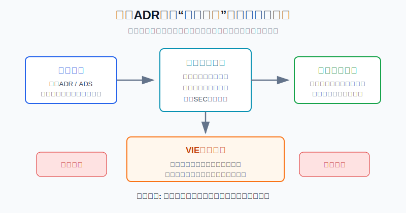
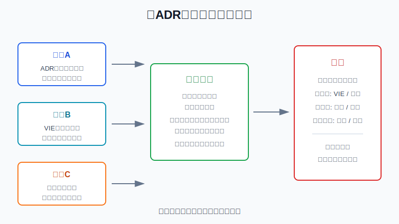
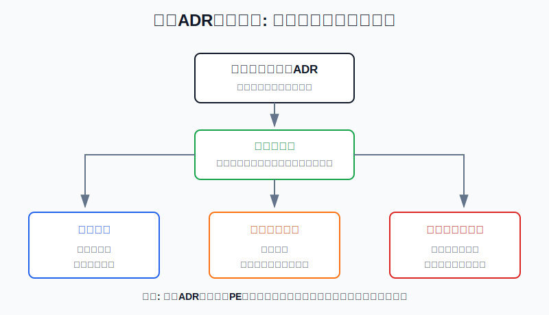

## 散户投资小白金融全品种操盘手册 - 11.18 中概股与ADR - 美元交易不等于没有中国风险
  
### 作者  
digoal  
  
### 日期  
2026-06-07   
  
### 标签  
金融产品 , 金融工具 , 散户 , 投资小白 , 全品操盘手册  
  
----  
  
## 背景 
  

> 适用读者: 已经会看美股个股财报，但容易把“在美国上市、用美元交易”理解成“风险和美国公司一样”的小白投资者。  
> 本文定位: 投资教育框架，不构成个性化投资建议。规则口径按 2026-06-06 可核查公开资料整理。

## 先问一个反直觉的问题

同样是在美股账户里买股票，一只美国本土公司和一只中概ADR，风险一样吗？

表面上都是美元报价、NYSE或Nasdaq交易、券商一键下单。真正区别在后面: **中概ADR的交易入口在美国，但公司经营、牌照、用户数据、监管约束，很多仍在中国。** 所以买中概股，第一课不是问“便宜不便宜”，而是问“我到底买到了哪一层风险”。

## 核心概念: ADR是门票，不是护身符

ADR，全称 American Depositary Receipt，中文常叫美国存托凭证。你可以把它理解成一张“代持凭证”: 美国存托银行把一家外国公司的股票或对应权益打包成凭证，让美国投资者在美国市场买卖。Investor.gov 对ADR的解释很直接: 多数在美国市场交易的外国公司股票，是以ADR形式交易；每份ADR代表一股或多股外国股票，或者一股的一部分。

这件事给小白带来便利: 你不用直接开当地账户，也不用处理当地结算制度，就能在美国市场买到外国公司的风险暴露。

但便利不等于风险消失。中概ADR至少有三层要拆开看。

第一层，是交易层。它在美国报价、用美元结算、受美国交易所和SEC披露规则约束。这个层面决定你能不能买卖、流动性好不好、是否可能被退市。

第二层，是结构层。很多中概互联网公司不是让你直接持有中国经营实体股权，而是通过境外控股公司和VIE合同安排，把中国经营实体的经济利益并入报表。VIE可以简单理解为“用合同连接经营实体”，不是“直接拥有经营实体”。

第三层，是经营监管层。用户、数据、算法、门店、司机、商户、医生、老师、支付牌照、内容审核，往往在中国境内。它们受中国法律和行业监管影响。教育、平台经济、金融科技、数据安全、医疗、游戏、内容平台，这些行业尤其不能只按美国公司来想。

本节的行动结论先放在前面: **买中概ADR前，先做“结构、监管、流动性”三层穿透；三层有一层说不清，就不要按普通美股重仓。对小白来说，中概ADR最多是卫星仓，不应替代宽基ETF和核心资产配置。**

## 逻辑推导链

【论证链标题】: 因为ADR只改变交易入口，不改变经营所在地、VIE结构和中美监管约束，所以中概ADR必须按结构风险、监管风险和流动性风险一起定价。

### 第一步: 前提陈述

前提A: ADR是交易载体，不是公司国籍转换器。这是常量。它像一张在美国电影院卖的外国电影票，票是在美国买的，但电影是谁拍的、版权在哪里、能不能上映，不由票面美元价格决定。

前提B: 很多中概公司通过境外控股公司和VIE合同安排上市。这是变量，具体要看公司20-F和招股书。VIE不是天然违法，也不是天然安全；它的关键是投资者买到的往往是境外壳公司权益，而不是中国经营实体股权。

前提C: 中国经营实体受到中国法律、产业政策、数据安全、网络安全、反垄断、行业许可等约束。这是变量，而且会随行业变化。一个普通制造公司和一个掌握大量用户数据的平台公司，监管敏感度不是一个等级。

前提D: 美国市场也有自己的闸门，包括SEC披露要求、交易所上市规则、PCAOB审计检查和HFCAA规则。这是变量。它不直接决定公司生意好坏，但会影响能否继续在美国交易、能否保持流动性和估值折价。

### 第二步: 逻辑推导

由A可得: 因为ADR只是交易载体，所以“美元交易”只能说明买卖方便，不能说明风险变成美国本土公司风险。投资人真正暴露的是外国公司的经营和制度环境。

由A+B可得: 因为很多中概ADR背后是境外控股公司和VIE合同，所以小白不能只看行情软件上的公司名。必须确认自己买的是哪一个法律实体，经营实体在哪里，VIE合同是否是核心业务的连接方式。

再由A+B+C可得: 因为用户、数据、牌照和业务在中国，所以中国监管变化会直接影响收入、利润、增长速度和上市安排。比如平台公司如果触发网络安全审查、数据合规整改或行业限制，股价受到的不是“情绪波动”，而是经营前提变化。

最后由A+B+C+D可得: 因为美国侧还会通过审计检查、信息披露和交易禁止规则影响流动性，所以中概ADR不是单一公司分析题，而是“公司基本面 + 法律结构 + 两地监管 + 退市路径”的组合题。**中概ADR买入前，要先过三道门: 结构门、监管门、流动性门。**

### 第三步: 正常情景下的操作结论

✅ 正常情景: 公司业务真实且可理解，境外控股公司和VIE关系披露清楚，行业监管敏感度可跟踪，已按中国境外上市备案要求处理相关事项，审计师当前不处于PCAOB无法检查状态，公司有港股双重上市或其他可替代流动性路径，估值也没有把风险当成不存在。

对应操作: 可以进入观察池或小仓位卫星配置，但不能按普通美国龙头股给仓位。买入理由必须写成三句话: 第一，我买的是哪个法律实体；第二，核心业务受哪些中国监管约束；第三，如果美国ADR退市或流动性下降，我有没有转换、减仓或退出路径。

对小白来说，更简单的规则是: **看不懂VIE结构，不买；说不清数据和行业监管，不重仓；没有港股或其他流动性备份，不把它当长期核心仓。**

### 第四步: 数据和案例证实

证据1: Investor.gov 对ADR的基础解释说明，ADR由美国存托银行发行，每份ADR代表一股或多股外国股票或一股的一部分，ADR价格对应外国股票本土市场价格并按比例调整。这个证据验证前提A: ADR是交易和结算工具，不是把外国经营风险改造成美国经营风险。

证据2: SEC在2021年关于中国相关投资者保护的声明中说明，某些中国行业不允许外国所有权，很多中国经营公司通过VIE结构在境外融资；境外壳公司可以通过合同关系在会计上并表中国经营公司，但壳公司本身没有中国经营公司的股权所有权。SEC 2021年12月给China-based companies的样例信进一步要求发行人披露: 投资者买的不是中国经营公司，而是开曼等地控股公司，并且投资者可能永远不会持有中国经营公司的股权。这个证据验证前提B: 中概ADR的法律结构要穿透，不能只看股票代码。

证据3: SEC的HFCAA页面说明，2022年12月29日美国《2023综合拨款法案》把触发初始交易禁令的连续识别年限从三年缩短为两年；同一页面也说明，PCAOB在2022年12月15日撤销了此前关于无法完整检查中国内地和香港相关会计师事务所的决定，因此在PCAOB作出新决定前，没有发行人处于HFCAA交易禁令风险中。这个证据验证前提D: 审计退市风险不是凭空想象，也不是已经永久消失，而是取决于PCAOB能否继续完整检查。

证据4: PCAOB 2022年12月15日公告称，其首次获得对中国内地和香港注册会计师事务所完整检查和调查的权限，并强调这不是给这些事务所出具“健康证明”，而是说明PCAOB当时能够完整开展检查。这个证据对应前提D: 小白不能把“暂时能检查”理解成“审计质量一定没问题”，也不能把“曾经有退市风险”理解成“现在马上会退市”。

证据5: 中国证监会2023年2月17日发布境外上市备案管理制度，自2023年3月31日起实施，对境内企业直接和间接境外发行上市统一实施备案管理，明确备案主体、备案时点和程序。国家网信办等十三部门发布的《网络安全审查办法》自2022年2月15日起施行，其中掌握超过100万用户个人信息的网络平台运营者赴国外上市，必须申报网络安全审查。这个证据验证前提C: 中概公司境外上市不是只面对美国交易所，还面对中国侧备案、网络安全和数据安全要求。

证据6: 滴滴案例说明监管风险会直接变成流动性风险。DiDi Global 2022年5月23日公告称，已通知NYSE推进ADS退市，并计划在2022年6月2日或之后向SEC提交Form 25；国家网信办2022年7月21日公布，对滴滴全球股份有限公司处人民币80.26亿元罚款，对董事长兼CEO程维、总裁柳青各处人民币100万元罚款。这个案例对应前提C和D: 业务还在运营，不等于ADR投资者的交易路径和估值不会受重大影响。

失败案例: Luckin Coffee是财务透明度风险的反例。SEC 2020年12月公告称，Luckin同意支付1.8亿美元罚款以了结会计欺诈指控；SEC投诉称，2019年4月至2020年1月期间，公司通过关联方虚构超过3亿美元零售销售。这个案例提醒小白: 对任何个股，财务真实性都是底线；对跨境上市公司，信息核验、审计检查和监管协作更重要。历史不代表未来每一家中概公司都会出问题，但它验证了一个稳定机制: **当结构复杂、监管跨境、审计信任受损时，估值折价不是市场偏见，而是风险定价。**

### 第五步: 前提变化时的替代结论

若前提B改变，也就是公司VIE结构被监管质疑、合同安排披露不清，或者核心业务和上市主体之间的现金流关系说不明白，推导路径变为: 因为投资者持有的是境外主体权益，而经济利益依赖合同连接，所以合同不清就是资产边界不清。新结论: 不买；已有持仓先降仓位，等年报、监管文件和公司说明说清楚。

若前提C改变，也就是行业监管明显收紧、网络安全审查启动、核心App下架、牌照或业务许可被限制，推导路径变为: 因为经营前提已经变化，所以不能继续按原增长率估值。新结论: 暂停加仓，重新测算收入、利润率和现金流；如果整改期限和影响范围无法判断，先把它从进攻仓降为观察仓。

若前提D改变，也就是PCAOB重新认定无法完整检查某些审计机构，或者公司被SEC识别为HFCAA相关发行人并开始累计连续年限，推导路径变为: 因为流动性和交易场所可能被打断，所以估值要先打流动性折扣。新结论: 不新增ADR仓位；已有持仓检查是否能转换港股、券商是否支持转换、转换费用和税务处理，不能转换的先控制仓位。

若估值前提改变，也就是公司基本面不错，但市场情绪把中概风险当成完全消失，推导路径变为: 因为风险溢价被压缩，所以未来收益空间下降。新结论: 不追高，只等估值给出足够补偿。

## 实操例子: 怎么判断一只中概ADR能不能买

这个例子对应论证链的正常结论: **中概ADR先做结构、监管、流动性三层穿透，再决定是否小仓位参与。**

假设小林有2万美元美股个股资金，已经用标普500 ETF做了核心仓，想用一部分钱研究一家中国互联网平台ADR。行情软件显示它Forward PE只有12倍，收入还在增长，看起来比美国同类公司便宜很多。

第一步，确认自己买的法律实体。小林打开公司20-F或招股书，看封面和公司结构图: 发行主体在哪里注册，是开曼控股公司还是直接经营公司；核心业务是否通过VIE并表；投资者买的是ADS还是普通股；每份ADS对应多少普通股。判断依据是前提A和B: 先知道自己买的是哪一层。

第二步，列监管敏感度清单。小林把业务拆成三类: 是否掌握大量个人信息，是否涉及支付、金融、教育、医疗、内容、出行、算法推荐，是否需要特殊行业许可。如果公司掌握超过100万用户个人信息并涉及赴国外上市，小林必须把网络安全审查和数据合规当成核心变量。判断依据是前提C: 监管不是新闻噪音，而是经营约束。

第三步，查上市和审计闸门。小林查看SEC的HFCAA页面，确认公司是否在相关识别名单上；再看审计师所在地、PCAOB检查状态、公司是否按时提交20-F。如果公司同时有港股上市，小林还要查ADS能否转换港股、自己的券商是否支持、费用是多少。判断依据是前提D: 退市风险真正伤人的是流动性断裂。

第四步，给仓位打折。假设三层都能说清，小林也不直接买满单只个股10%的上限。他把单只中概ADR上限定为账户总资产的2%，也就是400美元；整个中概ADR篮子不超过5%，也就是1000美元。如果这家公司没有港股备份，单只上限再降到1%。这不是因为公司一定差，而是因为结构、监管和流动性风险需要仓位补偿。

第五步，写失效条件。小林的买入计划不能只写“估值低、增长快”。必须写: 如果公司被监管立案或核心App下架，停止加仓；如果20-F延期或审计意见异常，减仓；如果SEC/HFCAA状态变化，先查转换路径再决定；如果VIE风险披露明显恶化，退出观察；如果估值上涨到不再补偿这些风险，减仓。

如果操作错误，后果很直接。只看低PE，可能买到的是监管折价而不是价值机会；只看美元交易，可能忽视ADR退市和转换成本；只看营收增长，可能忽视数据合规、审计和VIE合同这些会突然重估的变量。纠偏方法是把买入理由改成三段: 我买的实体是什么，核心监管风险是什么，最坏流动性路径是什么。

## 可复用框架

【三层穿透】

适用前提: 你研究的是中概ADR、ADS，或主要经营在中国但在美国市场交易的公司。

核心逻辑: 因为ADR只改变交易入口，不改变经营地和法律结构，所以先穿透结构，再穿透监管，最后穿透流动性。

操作步骤:

1. 结构层: 看20-F封面、公司结构图、VIE披露、ADS和普通股比例。
2. 监管层: 看行业是否涉及数据、平台、金融、教育、医疗、内容、出行、游戏和牌照。
3. 流动性层: 看HFCAA状态、审计师检查状态、是否有港股上市、ADS能否转换。

前提失效时: 任意一层说不清，不买；两层同时恶化，减仓；三层都恶化，优先退出，不用“估值便宜”自我安慰。

举一反三: 这个框架也适用于港股里的中资互联网、海外上市的新经济公司，以及任何“交易地和经营地不一致”的资产。

【闸门仓位】

适用前提: 你已经看懂公司基本面，但不确定结构、监管和退市路径会不会打断投资逻辑。

核心逻辑: 因为跨境资产有多道闸门，所以仓位不是只由上涨空间决定，还要由闸门数量和失效后果决定。

操作步骤:

1. 零闸门异常: 结构清楚、监管平稳、流动性有备份，最多小仓卫星。
2. 一道闸门异常: 只观察，不加仓，等下一份年报或监管结果。
3. 两道闸门异常: 降仓或退出，不参与“跌深反弹”。
4. 无备份路径: 即使基本面好，也把仓位上限砍半。

前提失效时: 如果退市、审计、VIE或监管问题已经变成事实，不再用“长期看好中国消费/科技”来覆盖具体公司风险。

举一反三: 以后买跨境ETF、QDII、港股二次上市公司，也可以先问: 资产在哪里，交易在哪里，监管在哪里，流动性备份在哪里。

## 本节行动清单

| 动作 | 合格标准 |
|---|---|
| 先认清买的实体 | 能说清发行主体、注册地、ADS比例、是否VIE |
| 看中国监管变量 | 能列出行业许可、数据安全、网络安全、境外上市备案相关风险 |
| 查美国上市闸门 | 看SEC HFCAA页面、PCAOB检查状态、20-F是否按时披露 |
| 检查流动性备份 | 是否有港股上市，券商是否支持ADS转换，费用和时间是否可接受 |
| 给仓位打折 | 单只中概ADR不按普通美股龙头给满仓位 |
| 写失效条件 | 监管审查、审计异常、退市风险、VIE披露恶化都要触发复核 |

## 一句话总结

中概ADR的美元报价只是交易入口，不是风险护身符；真正要买的是公司基本面、VIE结构、中国监管和美国流动性四件事合在一起后的风险收益。

## 参考资料

- Investor.gov: American Depositary Receipts (ADRs), https://www.investor.gov/introduction-investing/investing-basics/glossary/american-depositary-receipts-adrs
- SEC: Statement on Investor Protection Related to Recent Developments in China, 2021-07-30, https://www.sec.gov/newsroom/speeches-statements/gensler-2021-07-30
- SEC: Sample Letter to China-Based Companies, last reviewed 2024-06-26, https://www.sec.gov/rules-regulations/staff-guidance/disclosure-guidance/sample-letter-china-based-companies
- SEC: Holding Foreign Companies Accountable Act, https://www.sec.gov/rules-regulations/holding-foreign-companies-accountable-act
- PCAOB: PCAOB Secures Complete Access to Inspect, Investigate Chinese Firms for First Time in History, 2022-12-15, https://pcaobus.org/news-events/news-releases/news-release-detail/pcaob-secures-complete-access-to-inspect-investigate-chinese-firms-for-first-time-in-history
- 中国证监会: CSRC Releases New Regulations for Filing-based Administration of Overseas Offering and Listing, 2023-02-17, https://www.csrc.gov.cn/csrc_en/c102030/c7125865/content.shtml
- 国家互联网信息办公室等十三部门: 《网络安全审查办法》, 2022-01-04, https://www.cac.gov.cn/2022-01/04/c_1642894602182845.htm
- DiDi Global Inc.: DiDi Provides Notification to Delist its ADSs from NYSE, 2022-05-23, https://www.sec.gov/Archives/edgar/data/1764757/000110465922063652/tm2216577d1_ex99-2.htm
- 国家互联网信息办公室: 对滴滴全球股份有限公司依法作出网络安全审查相关行政处罚的决定, 2022-07-21, https://www.cac.gov.cn/2022-07/21/c_1660021534306352.htm
- SEC: Luckin Coffee Agrees to Pay $180 Million Penalty to Settle Accounting Fraud Charges, 2020-12-16, https://www.sec.gov/litigation/litreleases/2020/lr24987.htm
- U.S.-China Economic and Security Review Commission: Chinese Companies Listed on Major U.S. Stock Exchanges, 2025-03-07, https://www.uscc.gov/research/chinese-companies-listed-major-us-stock-exchanges

> ⚠️ **声明**：本文内容为投资教育目的，所有历史数据、策略框架均为辅助学习工具，不构成证券投资建议。市场有风险，投资需谨慎。实际操作请结合自身风险承受能力，必要时咨询专业投顾。
  
#### [PostgreSQL 解决方案集合](../201706/20170601_02.md "40cff096e9ed7122c512b35d8561d9c8")
  
  
#### [德哥 / digoal's Github - 公益是一辈子的事.](https://github.com/digoal/blog/blob/master/README.md "22709685feb7cab07d30f30387f0a9ae")
  
  
#### [About 德哥](https://github.com/digoal/blog/blob/master/me/readme.md "a37735981e7704886ffd590565582dd0")
  
  

  
