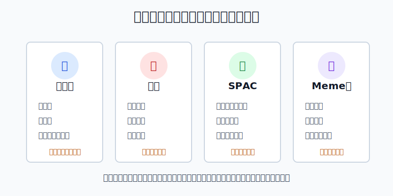
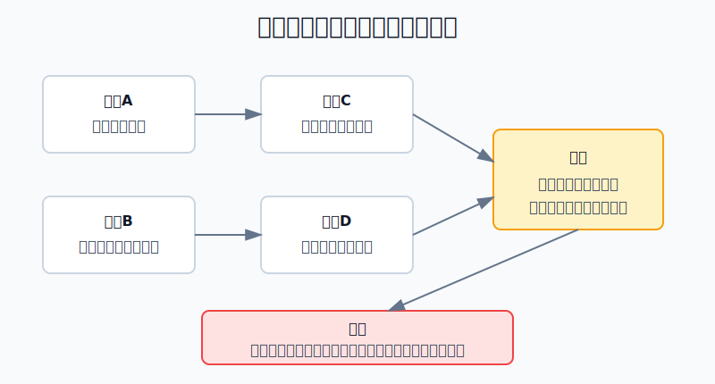
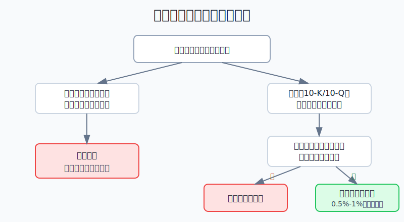

## 散户投资小白金融全品种操盘手册 - 11.19 小盘股、仙股、SPAC、Meme股排雷
  
### 作者  
digoal  
  
### 日期  
2026-06-07   
  
### 标签  
金融产品 , 金融工具 , 散户 , 投资小白 , 全品操盘手册  
  
----  
  
## 背景 
  

> 适用读者: 已经开始研究美股个股，偶尔看到“几毛钱股票暴涨”“SPAC即将并购明星公司”“社交平台集体冲某只票”这类消息，容易被低价和暴涨吸引的小白投资者。  
> 本文定位: 投资教育框架，不构成个性化投资建议。

## 先问一个反直觉的问题

一只股票从0.5美元涨到1美元，是翻倍；从100美元涨到200美元，也是翻倍。小白最容易被前一种吸引，因为它看起来“便宜”。但真正的问题不是股价低不低，而是: **你买进去以后，有没有可靠信息判断它值不值钱，有没有足够成交量让你退出。**

## 核心概念: 低价不是安全垫，可能是风险标签

本节讲四类容易让散户冲动的股票。

小盘股，是市值较小、业务仍在验证的公司。它们不一定坏，真正优秀的小公司也可能长大；但对小白来说，问题在于信息少、波动大、商业模式还没被充分验证。

仙股，在美股语境里可以粗略理解为价格极低的低价股或微型市值股票，常见于1美元附近甚至更低的股票。它们最危险的错觉是“跌不到哪里去”。实际上，0.5美元跌到0.25美元，亏损就是50%。

SPAC，是特殊目的收购公司，也叫“空白支票公司”。它先上市募钱，再找一家私人公司并购，让后者变成上市公司。小白要记住: SPAC不是一个成熟业务本身，而是一套上市交易结构。

Meme股，是被社交平台、论坛、群聊和短线情绪快速推热的股票。它可以短期大涨，也可以在成交、保证金、交易限制和情绪反转中快速回落。

本节行动结论很明确: **小白默认不把小盘股、仙股、SPAC、Meme股当作主线资产；如果一定研究，只能用0.5%-1%的研究仓，并且必须先过四关: 信息披露、流动性、结构风险、退出条件。任一关过不了，不买。**

## 逻辑推导链

【论证链标题】: 因为高风险股票经常同时存在信息不足、流动性差、结构复杂和情绪放大，所以小白不能用“便宜”和“热门”作为买入理由，必须先排雷再研究。

── 第一步: 前提陈述

前提A: 信息披露越少，估值越容易变成猜谜。这是常量。买股票像买二手车，至少要能看到车况报告；如果连收入、现金流、负债、审计意见都看不清，所谓“低估”就没有验证基础。

前提B: 流动性差会放大损失。这是常量。流动性就是你想买卖时，市场有没有足够对手盘。成交量小、买卖价差大时，看起来的账面盈利不一定能成交，想止损时也可能一卖就把价格砸下去。

前提C: SPAC和低价股常有额外结构风险。这是变量。SPAC要看发起人激励、赎回、权证、稀释、并购标的质量；低价股要看是否触发交易所持续上市要求、是否频繁反向拆股、是否持续亏损融资。

前提D: Meme股由情绪放大，情绪也会反向放大。这是变量。社交平台能快速聚集买盘，但不能保证基本面改善，也不能保证券商、清算、交易所机制在极端波动中保持你期待的交易体验。

── 第二步: 逻辑推导

由A+B可得: 因为信息不足时你很难判断真实价值，流动性不足时又很难按计划退出，所以小盘股和仙股不能先问“能涨多少”，必须先问“我凭什么知道它值多少钱”和“错了能不能退出”。

由C可得: 因为SPAC不是普通经营公司上市，而是先有壳、再找标的、再完成并购，所以小白不能只看并购故事，要读清楚发起人报酬、股东稀释、赎回比例、目标公司财务和预测依据。

由D可得: 因为Meme股的上涨可能来自短期情绪和交易拥挤，所以价格上涨本身不能证明买入逻辑正确；同样，交易越拥挤，退出时越容易踩踏。

最后由A+B+C+D可得: **这四类股票的共同排雷顺序应该是: 先验证信息，再验证流动性，再验证结构风险，最后才考虑仓位。** 如果前面三步不过关，后面的“可能翻倍”没有意义。

── 第三步: 正常情景下的操作结论

✅ 正常情景: 公司有SEC文件可查，最新10-K或10-Q能看懂，成交量足够，买卖价差可接受，没有明显退市或融资压力；若是SPAC，已经读过并购文件、稀释和赎回信息；若是Meme股，明确知道上涨主要来自情绪而非基本面。

对应操作: 仍然只允许研究仓。对小白示例而言，单只这类股票不超过总资产0.5%-1%，买入前写好失效条件，不能加杠杆，不能借钱，不能把止损改成“长期持有”。

── 第四步: 数据和案例证实

证据1: SEC在2013年《Microcap Stock: A Guide for Investors》中提醒，许多微型市值公司不向SEC提交财务报告，公开信息可能难找；微型市值股票通常价格低、成交量低，而且许多公司资产、经营或收入有限。SEC还指出，很多微型市值股票成交量低，任何规模的交易都可能对价格产生较大百分比影响。这个证据对应前提A和B: 信息少和流动性差，本身就是风险源。

证据2: Nasdaq持续上市规则显示，Capital Market主要权益证券持续上市需要维持每股1美元最低买价；若最低买价缺陷持续30个连续工作日，公司会收到通知，通常有180个日历日恢复合规。这对应前提C: 低于1美元不是“便宜标签”，而可能是持续上市压力标签。

证据3: SPAC不是小众现象。SPACInsider统计显示，美国SPAC IPO在2021年达到613单，募资约1625.026亿美元。SEC在2024年1月24日通过SPAC新规，要求加强对利益冲突、发起人报酬、稀释、目标公司信息和预测基础的披露。这说明监管关注的不是“SPAC一定不能投”，而是它的信息不对称、利益冲突和稀释结构必须被看清。

证据4: Meme股的波动可以极端到超出普通散户体验。SEC关于2021年初市场结构的工作人员报告显示，GameStop股价从2021年1月8日盘中低点到1月28日盘中高点上涨约2700%，随后到2月第一周收盘价下跌超过86%；1月13日至29日平均每日成交约1亿股，比2020年平均水平高出1400%以上。这个案例对应前提D: 情绪和拥挤交易能制造巨大波动，也能快速反向。

历史不代表未来。上面的数据仍有参考价值，是因为它们验证的不是某一只股票的涨跌，而是一条稳定规律: **当信息、流动性、结构和情绪同时恶化时，散户面对的不是“高收益机会”，而是“无法控制的风险链”。**

── 第五步: 前提变化时的替代结论

若前提A改变，也就是公司信息披露充分、业务能用财报验证，推导路径变为: 因为估值不再完全靠猜，所以可以进入研究池。新结论: 仍不直接买，先和同类公司比较收入、毛利率、现金流、负债和估值。

若前提B改变，也就是成交量充足、价差很小、能够分批退出，推导路径变为: 因为退出能力改善，所以可以考虑极小仓位试错。新结论: 研究仓上限0.5%-1%，错了立即按计划退出。

若前提C恶化，比如股价长期低于1美元、公司频繁反向拆股或持续增发融资，推导路径变为: 因为上市压力和稀释压力上升，所以低价不再是机会，而是警报。新结论: 不买，已持有也优先复盘退出。

若前提D恶化，也就是上涨主要来自群聊、短视频、名人截图和“逼空”口号，推导路径变为: 因为价格不再由基本面主导，所以你无法判断何时情绪反转。新结论: 不追；如果已经误入，按流动性先退出到安全仓位。

失败案例: 把GameStop式极端行情当成可复制策略，就是典型误读。少数人在早期获利，不代表后来追入的人也有同样胜率；情绪行情最大的问题不是不会涨，而是你很难知道什么时候不能卖、卖不掉或不敢卖。

## 实操例子: 2万美元账户遇到一只0.8美元热门股

这个例子对应论证链的结论: **低价热门股先排雷，不能先幻想翻倍。**

假设小林有2万美元美股资金，核心仓已经买了宽基ETF。某天他在社交平台看到一只0.8美元股票，帖子说“马上重组、马上逼空、上1美元就安全”。

第一步，查信息。小林先到SEC EDGAR找10-K、10-Q、8-K。如果最新财报缺失、审计意见异常、收入很小但宣传资产很大，直接不买。这一步对应前提A。

第二步，查流动性。他看最近20个交易日成交量和买卖价差。如果盘口只有很薄的挂单，价差达到几个百分点，说明退出成本很高，直接不买。这一步对应前提B。

第三步，查合规和融资。他看是否收到1美元最低买价通知，是否频繁反向拆股，是否持续通过增发融资。如果公司靠不断发新股续命，旧股东会被稀释，直接不买。这一步对应前提C。

第四步，查上涨原因。如果上涨主要来自群聊、论坛、短视频和“大家一起冲”，但公司没有新的经营数据，直接不追。这一步对应前提D。

第五步，只有四关都过，才允许研究仓。小林最多买总资产0.5%，也就是100美元，并在下单前写清楚: 跌破买入价10%退出；公司文件证伪退出；成交量突然萎缩退出；价格暴涨但没有基本面跟进时分批退出。

如果操作错误，后果很直接。小林如果把100美元研究仓冲到5000美元，就不是研究小盘股，而是在用25%的账户押一个自己无法验证的故事。纠偏方法不是祈祷反弹，而是把仓位降回上限，把剩余资金回到ETF、现金管理或自己真正看得懂的公司。

## 可复用框架

【四关排雷】

适用前提: 你看到小盘股、仙股、SPAC或Meme股，产生了“少买一点搏一下”的冲动。

核心逻辑: 因为这类股票最大风险不是波动本身，而是信息不足、退出困难、结构复杂和情绪反转，所以先过四关，再谈仓位。

操作步骤:

1. 信息关: 是否有最新SEC文件、审计意见、收入、现金流、负债数据。
2. 流动性关: 成交量是否足够，买卖价差是否可接受，能否分批退出。
3. 结构关: 是否有退市压力、反向拆股、增发稀释、SPAC发起人激励和权证稀释。
4. 情绪关: 上涨是否主要来自群聊和社交平台，而不是经营数据。

前提失效时: 任一关说不清，不买；已经持有的，先降到研究仓以下，再重新判断。

举一反三: 这个框架也适用于港股低价股、A股连续题材炒作股、低流动性海外小票和高热度概念股。

【先退后买】

适用前提: 你仍然想参与一只高风险股票，但知道自己可能被情绪带着走。

核心逻辑: 因为这类股票最大的危险是卖不掉、舍不得卖和来不及卖，所以买入前先写退出条件。

操作步骤:

1. 写最大亏损: 单只最多亏多少，不超过账户可承受的小数。
2. 写时间限制: 几个交易日或几个财报周期内必须验证什么。
3. 写退出触发: 流动性下降、文件证伪、跌破纪律线、涨幅脱离基本面。

前提失效时: 如果你写不出退出条件，说明这不是投资计划；如果你不愿执行退出条件，说明仓位已经超过心理承受能力。

举一反三: 任何短线、高波动、靠故事驱动的资产，都应该先写退出，再决定是否买入。

## 本节行动清单

| 动作 | 合格标准 |
|---|---|
| 不因低价买入 | 0.5美元跌到0.25美元也是亏50% |
| 先查SEC文件 | 至少能读到最新10-K、10-Q、8-K或SPAC并购文件 |
| 检查流动性 | 看成交量、买卖价差和能否分批退出 |
| 查上市压力 | 重点看1美元最低买价、反向拆股、退市风险 |
| 识别结构风险 | SPAC必须看发起人报酬、稀释、赎回和目标公司预测 |
| 不追情绪高点 | 群聊热度和社交平台刷屏不是基本面 |
| 限制仓位 | 高风险研究仓只用0.5%-1%，不加杠杆 |
| 先写退出条件 | 写不出退出条件，就不下单 |

## 一句话总结

小盘股、仙股、SPAC、Meme股不是不能研究，而是不能先被“便宜、故事、热度”牵着走；信息、流动性、结构、情绪四关过不了，最好的操作就是不碰。

## 参考资料

- SEC: Microcap Stock: A Guide for Investors，2013年9月17日，https://www.sec.gov/about/reports-publications/investorpubsmicrocapstock
- Nasdaq: Nasdaq Listing Rules，Rule 5550(a)(2) and Rule 5810(c)(3)(A)，https://listingcenter.nasdaq.com/assets/rulebook/nasdaq/rules/marketplace_rules_table.pdf
- SPACInsider: SPAC Statistics，2026年，https://www.spacinsider.com/data/stats
- SEC: SEC Adopts Rules to Enhance Investor Protections Relating to SPACs, Shell Companies, and Projections，2024年1月24日，https://www.sec.gov/newsroom/press-releases/2024-8
- SEC: Staff Report on Equity and Options Market Structure Conditions in Early 2021，2021年10月14日，https://www.sec.gov/files/staff-report-equity-options-market-struction-conditions-early-2021.pdf
- Minmo Gahng, Jay R Ritter, Donghang Zhang: SPACs Available for Purchase，The Review of Financial Studies，2023年，https://academic.oup.com/rfs/article/36/9/3463/7067751

> ⚠️ **声明**：本文内容为投资教育目的，所有历史数据、策略框架均为辅助学习工具，不构成证券投资建议。市场有风险，投资需谨慎。实际操作请结合自身风险承受能力，必要时咨询专业投顾。
  
#### [PostgreSQL 解决方案集合](../201706/20170601_02.md "40cff096e9ed7122c512b35d8561d9c8")
  
  
#### [德哥 / digoal's Github - 公益是一辈子的事.](https://github.com/digoal/blog/blob/master/README.md "22709685feb7cab07d30f30387f0a9ae")
  
  
#### [About 德哥](https://github.com/digoal/blog/blob/master/me/readme.md "a37735981e7704886ffd590565582dd0")
  
  

  
