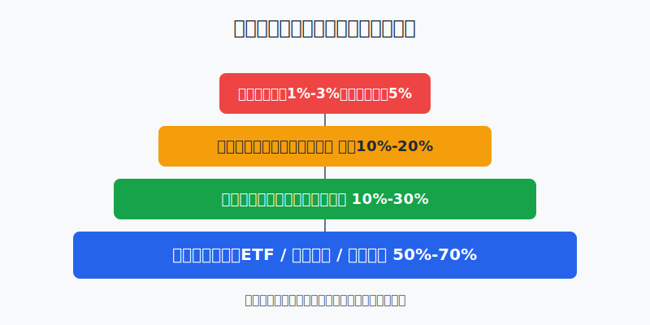
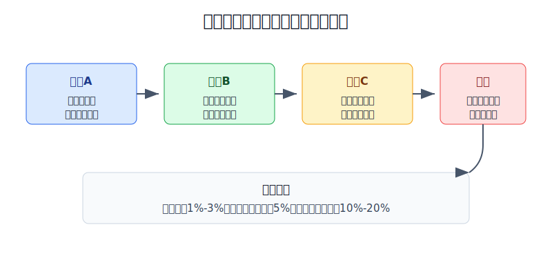
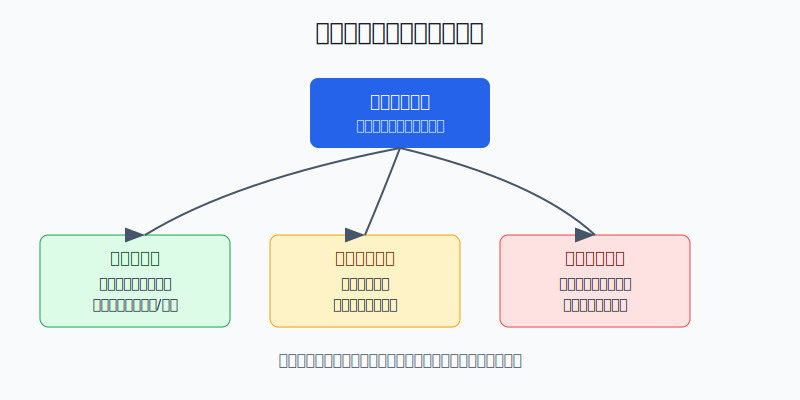

## 散户投资小白金融全品种操盘手册 - 11.20 小白个股仓位上限 - 个股不应替代核心资产配置
  
### 作者  
digoal  
  
### 日期  
2026-06-07   
  
### 标签  
金融产品 , 金融工具 , 散户 , 投资小白 , 全品操盘手册  
  
----  
  
## 背景 
  

> 适用读者: 已经学过美股财报、估值、行业框架，开始想买苹果、微软、英伟达、特斯拉、中概股或其他美股个股，但还没有形成组合上限的小白投资者。  
> 本文定位: 投资教育框架，不构成个性化投资建议。

## 先问一个反直觉的问题

你研究一只股票越认真，越容易把仓位买大。问题是，**研究充分不等于风险消失**。个股可以帮你学习企业和财报，但它不能替代宽基ETF、现金和防守资产组成的核心配置。

## 核心概念: 仓位上限不是保守，是给错误留空间

仓位，就是一项资产占你总资产的比例。小白最常犯的错，是只看证券账户里的钱，不看家庭总资产；只看“这只股票我懂不懂”，不看“如果我错了，会不会伤到整个组合”。

核心资产，是组合里负责长期稳定参与市场的部分，比如美股宽基ETF、全球指数基金、现金管理、短债或黄金等防守资产。卫星仓，是在核心资产之外，用来表达少量主动判断的部分，比如你研究过的个股、行业ETF或主题资产。试错仓，是你还在学习、还没有长期验证的仓位。

本节行动结论先放在前面: **小白买美股个股，先按总资产口径设上限。单只个股默认1%-3%，研究成熟、连续跟踪且核心资产已经打底后，也不宜超过5%；美股个股合计先控制在10%-20%。没有核心配置之前，不用急着买第一个个股。**

## 逻辑推导链

【论证链标题】: 因为个股有不可分散的公司风险，而小白长期选股能力尚未验证，所以个股必须做卫星仓，不能替代核心资产配置。

── 第一步: 前提陈述

前提A: 单一个股有公司特定风险。这是常量。公司特定风险，就是只发生在这家公司身上的风险，例如财报造假、产品失败、监管处罚、管理层误判、竞争对手反超。买一只股票，像把一部分粮食放在一个仓库里；市场下雨所有仓库都会潮，但这个仓库自己着火，就是公司特定风险。

前提B: 美股长期收益由少数大赢家贡献很多。这是常量。指数能长期有效，不是因为每只股票都优秀，而是因为指数把赢家和输家都装进去，让少数超级赢家有机会弥补大量普通公司和失败公司。

前提C: 稳定跑赢指数很难。这是变量，但对小白要先按“难”处理。专业基金经理有团队、数据库和风控系统，长期仍有大量基金跑不赢基准。小白不能把“我看了很多资料”直接等同于“我能长期选中赢家”。

前提D: 家庭资产的第一目标不是证明自己会选股，而是活下来、能复利、能在犯错后继续投资。这是常量。投资组合不是考试卷，错一题不能把整张卷子烧掉。

── 第二步: 逻辑推导

由A可得: 因为单一个股会遇到公司特定风险，所以任何一只股票都不能承载你过高比例的总资产。哪怕它是大公司，也可能经历估值回落、产品周期变化、监管冲击或竞争格局改变。

由A+B可得: 因为市场长期财富集中在少数赢家身上，所以正确动作不是把全部资金压到你最喜欢的一只股票，而是先用宽基ETF保留“不要错过赢家”的底座，再用小比例个股仓学习和增强收益。

再由B+C可得: 因为连专业主动基金长期跑赢指数都很难，所以小白的个股仓位必须承认“我会看错”。仓位上限就是承认错误的制度安排。

最后由A+B+C+D可得: 因为个股风险大、赢家难选、核心资产更适合做长期底座，所以个股只能做卫星仓。**买入顺序应该是: 先建核心资产，再设总仓上限，再定单只上限，最后才研究买哪只。**

── 第三步: 正常情景下的操作结论

✅ 正常情景: 你已经有宽基ETF、现金或短债等核心配置；准备买入的公司有清楚的买入理由、估值边界和失效条件；个股仓位没有挤占生活钱和防守钱。

对应操作: 单只美股个股第一次买入控制在总资产1%-2%；研究成熟后最高加到3%-5%；美股个股合计先不超过10%-20%。如果你还没有核心资产，先把核心资产补起来，再谈个股。

── 第四步: 数据和案例证实

证据1: 专业主动基金长期跑赢指数并不容易。S&P Dow Jones Indices 的 SPIVA U.S. Scorecard Year-End 2025 显示，截至2025年12月31日，美国大型股基金中，78.78%在1年期跑输S&P 500，85.59%在10年期跑输，89.93%在15年期跑输。这对应前提C: 如果专业资金长期都很难稳定战胜指数，小白更不应该把选股当成核心资产配置。

证据2: 个股收益高度集中。Hendrik Bessembinder 2020年论文《Wealth Creation in the U.S. Public Stock Markets 1926 to 2019》统计了1926年以来26,168家美国上市普通股公司，发现57.8%的股票相对短期国库券减少了股东财富，但美国公开股票市场整体仍创造了47.4万亿美元净财富。这对应前提B: 指数的强大来自广撒网后抓住少数大赢家，而不是每只成分股都赚钱。

证据3: 监管投资者教育也把集中持仓列为核心风险。FINRA 2022年文章《Concentrate on Concentration Risk》把集中风险解释为: 当投资组合中很大一部分集中在某个投资、资产类别或市场板块时，亏损会被放大；它建议投资者跨资产和资产内部做分散、定期再平衡，并检查基金和个股是否有重叠。这对应前提A和D: 仓位管理不是观点问题，而是风险控制问题。

失败案例: Enron 是集中持仓的经典反例。美国 GAO 在2002年关于 Enron 崩塌后的报告中提到，DOL 报告显示截至2000年底，Enron 401(k)资产中有63%投在公司股票；报告同时指出，如果账户余额和公司匹配贡献能更快分散，员工经历的损失本可以被限制。这个案例不是说每家公司都会变成 Enron，而是说明一个原则: **你的工作、收入、股票、退休金如果都押在同一家公司或同一类资产上，一次错误会同时打击多个生活支柱。**

历史不代表未来。上面数据仍有参考价值，是因为它们验证的是结构规律: 个股收益分布偏斜，选股长期胜率难，集中仓位会放大错误。这个规律不依赖某一只股票短期涨跌。

── 第五步: 前提变化时的替代结论

若前提A变化，也就是这只股票已经从1%-3%涨到超过5%-8%，推导路径变为: 因为公司风险没有消失，只是股价上涨让它占比更大，所以风险反而集中。新结论: 不把上涨当成继续追买的理由，按计划再平衡，至少把超出上限的部分转回核心资产。

若前提C变化，也就是你确实连续多年有完整记录，能证明自己有稳定研究流程、复盘纪律和风险控制，推导路径变为: 因为选股能力有了证据，所以可以把个股合计仓位从10%提高到20%左右。新结论: 仍然不让单只股票替代核心资产，单只上限维持5%附近，除非你能承受它腰斩后不影响生活目标。

若前提D变化，也就是这笔钱三年内要用来买房、读书、还债或应急，推导路径变为: 因为资金用途从长期投资变成确定支出，所以个股波动不再适配。新结论: 不买个股，转到现金管理、短债或其他更低波动工具。

若买入逻辑失效，比如收入增速、自由现金流、竞争格局或监管环境明显恶化，推导路径变为: 因为当初买入的前提不存在，所以“跌了就补”不是纪律，而是把错误放大。新结论: 先降仓到观察仓，严重失效时退出。

## 实操例子: 10万元账户怎么给美股个股设上限

这个例子对应论证链的正常结论: **先建核心资产，再设总仓上限，再定单只上限，最后才研究买哪只。**

假设小林有10万元长期投资资金，已经留足6个月生活费，不打算三年内买房或大额消费。他想买三只美股个股: 一只科技龙头、一只消费龙头、一只医药公司。

第一步，先分层。小林把60%放在宽基ETF或全球指数基金，作为核心资产；20%放在现金管理、短债或黄金等防守资产；剩下20%才是主动仓。这个动作对应前提D: 组合第一目标是能长期活着，不是用一只股票证明自己。

第二步，给个股合计上限。小林规定美股个股合计不超过15%，也就是1.5万元。剩下5%的主动仓可以留给行业ETF、未来机会或现金等待。这个动作对应前提B和C: 既允许学习个股，也承认自己不一定选中赢家。

第三步，给单只上限。单只个股初始买入不超过2%，也就是2000元；研究两到三个财报周期后，如果买入理由继续成立，最高加到5%，也就是5000元。没有任何一只股票可以因为“我很看好”突破这个上限。

第四步，写失效条件。科技股的失效条件可能是云或AI收入增速明显放缓、资本开支吞掉自由现金流；消费股的失效条件可能是同店销售和利润率同时恶化；医药股的失效条件可能是核心管线失败或监管审批不及预期。失效条件必须在买入前写好，对应前提A: 公司特定风险要提前定义。

第五步，执行再平衡。如果其中一只科技股从2000元涨到7000元，占总资产7%，小林不把它当成“永远正确”，而是把超过5%上限的部分卖出或转回核心ETF。这样做会错过一部分极端上涨，但能防止一次回撤把组合打乱。

如果操作错误，后果很清楚。小林若把10万元中的6万元直接买一只热门股，只要这只股票跌30%，总资产就回撤18%；如果它跌50%，总资产回撤30%。这时他很难理性复盘，容易补仓、扛单或在最低点割肉。仓位上限的作用，就是把“看错一家公司”限制成一次可复盘的损失，而不是整个组合的灾难。

## 可复用框架

【先限后买】

适用前提: 你准备买入美股个股，但还没有清楚的组合仓位规则。

核心逻辑: 因为单一个股有公司特定风险，且小白长期选股能力未验证，所以先给个股设上限，再讨论公司好不好。

操作步骤:

1. 先按总资产口径分层: 核心资产、防守资产、主动资产。
2. 再给主动资产设边界: 小白个股合计先控制在10%-20%。
3. 最后给单只股票设边界: 初始1%-2%，熟悉后3%-5%。

前提失效时: 如果三年内要用钱，不买个股；如果核心资产没建好，不买个股；如果个股涨超上限，做再平衡；如果买入逻辑失效，先降仓再复盘。

举一反三: 这个框架也适用于A股个股、港股个股、单只高股息股票、单只REITs和主题基金。

【三问上限】

适用前提: 你已经持有一只个股，不知道该不该加仓。

核心逻辑: 因为加仓会改变组合风险，所以加仓前先问风险承受，而不是只问公司前景。

操作步骤:

1. 问用途: 这笔钱三年内是否要用。
2. 问损失: 这只股票腰斩后，总资产回撤是否还能承受。
3. 问重叠: 我是否已经通过ETF、行业基金、工资收入或RSU暴露在同一家公司或同一行业。

前提失效时: 任意一问回答不清，不加仓；三问中有两问不合格，减到观察仓。

举一反三: 研究任何高波动资产时，都可以先问这三句。投资不是把最喜欢的资产买到最大，而是让每个错误都不致命。

## 本节行动清单

| 动作 | 合格标准 |
|---|---|
| 用总资产口径看仓位 | 不只看美股账户，也看现金、基金、房贷、生活备用金 |
| 先建核心资产 | 宽基ETF、现金/短债、防守资产先有底座 |
| 设个股合计上限 | 小白美股个股合计先控制在10%-20% |
| 设单只上限 | 初始1%-2%，研究成熟后3%-5%，不因情绪突破 |
| 写失效条件 | 买入前写清财报、估值、竞争、监管的失效信号 |
| 定期再平衡 | 个股涨超上限，不追买，按计划转回核心资产 |
| 检查重叠风险 | 个股、ETF、行业基金、工资和RSU是否押在同一方向 |

## 一句话总结

美股个股可以用来学习和增强收益，但小白的组合底座必须是核心资产配置；先设仓位上限，再谈买入理由，才能让一次选股错误不伤到长期复利。

## 参考资料

- S&P Dow Jones Indices: SPIVA U.S. Scorecard Year-End 2025，数据截至2025年12月31日，https://www.spglobal.com/spdji/en/documents/spiva/spiva-us-year-end-2025.pdf
- Hendrik Bessembinder: Wealth Creation in the U.S. Public Stock Markets 1926 to 2019，SSRN，2020年，https://papers.ssrn.com/sol3/papers.cfm?abstract_id=3537838
- FINRA: Concentrate on Concentration Risk，2022年6月15日，https://www.finra.org/investors/insights/concentration-risk
- U.S. GAO: Private Pensions: Key Issues to Consider Following the Enron Collapse，GAO-02-480T，2002年2月27日，https://www.gao.gov/products/gao-02-480t

> ⚠️ **声明**：本文内容为投资教育目的，所有历史数据、策略框架均为辅助学习工具，不构成证券投资建议。市场有风险，投资需谨慎。实际操作请结合自身风险承受能力，必要时咨询专业投顾。
  
#### [PostgreSQL 解决方案集合](../201706/20170601_02.md "40cff096e9ed7122c512b35d8561d9c8")
  
  
#### [德哥 / digoal's Github - 公益是一辈子的事.](https://github.com/digoal/blog/blob/master/README.md "22709685feb7cab07d30f30387f0a9ae")
  
  
#### [About 德哥](https://github.com/digoal/blog/blob/master/me/readme.md "a37735981e7704886ffd590565582dd0")
  
  

  
