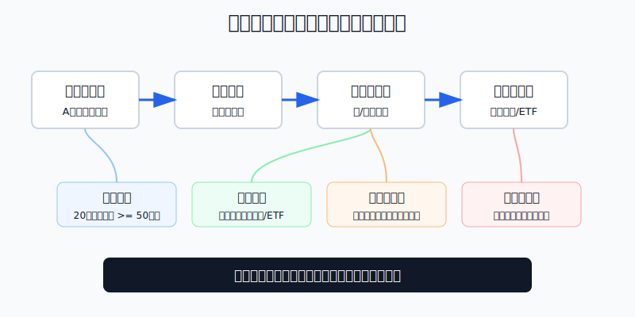
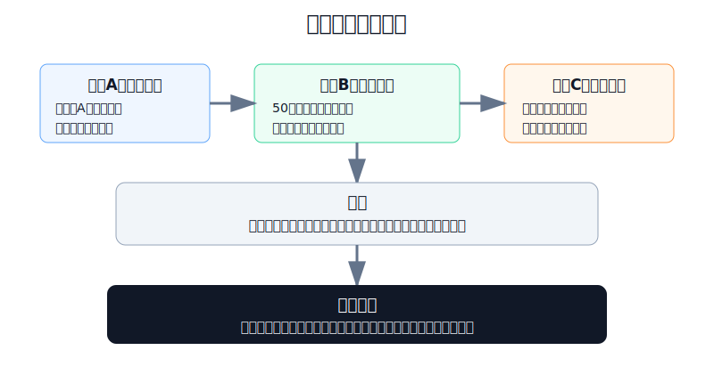
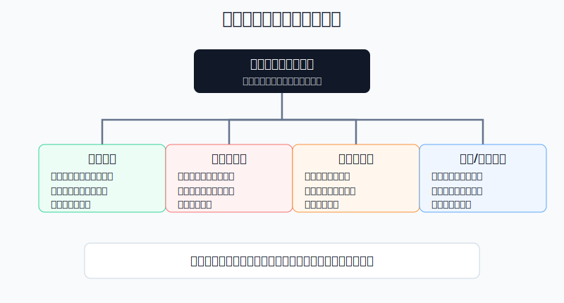

## 散户投资小白金融全品种操盘手册 - 12.1 港股通 - 内地账户参与港股的正规路径
  
### 作者  
digoal  
  
### 日期  
2026-06-07   
  
### 标签  
金融产品 , 金融工具 , 散户 , 投资小白 , 全品操盘手册  
  
----  
  
## 背景 
  

> 适用读者: 已经有A股账户，听说港股便宜、腾讯美团小米都在香港上市，想知道能不能用内地账户买港股的小白投资者。  
> 本文定位: 投资教育框架，不构成个性化投资建议。

## 先问一个反直觉的问题

港股通最大的价值，不是让你“抄底港股”。它真正解决的是一个更基础的问题: **内地投资者怎样在不另开香港账户的情况下，通过规则清楚的通道买一部分香港上市资产。**

如果把港股通理解成“便宜股票自动提款机”，第一步就错了。它是一扇正规门，但门后仍然有波动、汇率、费用、标的范围和交易日差异。

## 核心概念: 港股通是通道，不是完整香港账户

港股通，简单说，就是内地投资者委托内地证券公司，通过上交所或深交所设立的证券交易服务公司，向香港联交所申报，买卖规定范围内的香港上市股票和股票ETF。

这句话里有三个关键词。

第一，**内地账户**。你使用的是沪市或深市人民币普通股票账户，不是直接在香港券商开一个完整港股账户。

第二，**规定范围**。港股通只能买卖名单里的股票和股票ETF，不是所有港股都能买。窝轮、牛熊证、新股暗盘、很多小票，都不是小白用港股通默认能碰的东西。

第三，**港币报价、人民币交收**。股票价格显示为港币，但你的资金最终以人民币交收。也就是说，你买的不是单纯的股票价格，还叠加了人民币和港币之间的汇率折算。

本节先给出行动结论: **港股通适合作为内地散户学习和配置港股的正规入口，但第一笔钱只应该用来熟悉规则。先过资格、再查标的、再算费用和汇率、最后才下单。没有必要为了开通港股通而借钱凑50万元门槛。**

## 逻辑推导链

【论证链标题】: 因为港股通只解决合规入口问题，并不消除港股市场本身的波动、费用和汇率风险，所以小白应把港股通当成低仓位学习通道，而不是重仓押注工具。

── 第一步: 前提陈述

前提A: 港股通是内地账户参与港股的制度化通道。这是常量。上交所规则把港股通定义为投资者委托本所会员，通过本所证券交易服务公司向联交所申报，买卖规定范围内联交所上市股票和股票ETF。它像一条有护栏的跨境桥，不是地下小路。

前提B: 港股通有准入门槛和适当性要求。这是常量。上交所《港股通投资者适当性管理指引》要求，个人投资者申请权限开通前20个交易日，证券账户及资金账户内资产日均不低于人民币50万元，且不包括融资融券融入的资金和证券。这个门槛的意思不是“有50万就能赚钱”，而是监管认为这类跨境股票交易不适合所有小白。

前提C: 港股通的标的范围有限。这是变量，因为名单会调整。按上交所2024年修订的《沪港通业务实施办法》，港股通股票包括恒生综合大型股指数成份股、恒生综合中型股指数成份股、符合市值条件的恒生综合小型股指数成份股，以及A+H股上市公司的H股；但以港币以外货币报价交易等情形不纳入。换句话说，能不能买，不看你喜不喜欢这家公司，要看它在不在规则名单里。

前提D: 港股通有额度、交易日、费用和汇率差异。这是常量。港交所公开说明，沪港通和深港通南向每日额度分别为人民币420亿元；上交所规则写明港股通以港币报价、投资者以人民币交收。香港市场交易还会涉及印花税、交易征费、交易费等成本。

前提E: 港股市场波动和A股不同。这是常量。香港股票不按A股10%涨跌停的习惯运行，部分股票流动性分层明显；低估值常常对应低增长、强周期、强监管或资金长期不愿意给高估值。

── 第二步: 逻辑推导

由A+B可得: 因为港股通是正规通道且有50万元门槛，所以它不是人人都该马上开通的工具。小白先要问“我是否符合规则”，再问“我想买什么”。

由A+C可得: 因为港股通只覆盖规定范围的股票和股票ETF，所以港股通不是完整香港市场。你能买到腾讯、美团这类大股票，不等于你能买所有香港小盘股、新股或衍生品。

再由C+D可得: 因为标的名单、交易日、额度和汇率都会影响能否买入、何时买入、真实成本是多少，所以港股通下单前必须检查四件事: 标的是否可买、今天是否为港股通交易日、费用和汇率折算是否能接受、买入后卖出和资金可用规则是否清楚。

最后由A+B+C+D+E可得: 因为港股通解决的是“合规入口”，而不是“收益保证”，所以小白的正确动作是先用小仓位学习规则，优先选择流动性强、业务逻辑能解释、费用不会被频繁交易吞掉的标的。**港股通第一笔操作的目标不是赚快钱，而是验证自己是否真的懂规则。**

── 第三步: 正常情景下的操作结论

✅ 正常情景: 你已经有A股账户，开通前20个交易日日均资产达到50万元，不靠融资融券凑数；已经完成风险测评和港股通知识测试；准备投入的是三年以上不用的长期资金；目标标的在港股通名单内，成交活跃，费用和汇率成本都算清楚。

对应操作: 第一阶段只用总资产1%-5%作为港股通学习仓。先买你能解释清楚的港股通ETF或大市值高流动性股票，不碰冷门小票，不做日内频繁交易，不因为“港股便宜”突破仓位上限。

── 第四步: 数据和案例证实

证据1: 港股通是正式制度安排，不是灰色路径。上交所2024年修订的《沪港通业务实施办法》明确了港股通定义、标的范围、交易特别事项和投资者适当性管理；港交所也说明，沪深港通是连接内地与香港市场的双向交易和清算机制，南向每日额度沪深两条线各为人民币420亿元。这验证前提A和D: 港股通是一条被制度设计出来的跨境证券交易通道。

证据2: 港股通已经成为香港市场的重要资金来源。港交所《Stock Connect 2025 Review》披露，2025年南向港股通平均每日成交额达到1211亿港元，高于2024年的482亿港元；截至2025年第四季度末，南向成交占香港现金股票成交的23.0%；截至2025年12月底，南向港股通包括564只股票和23只ETF。这验证前提C: 港股通覆盖面已经不小，但仍然是“名单制入口”，不是完整市场。

证据3: 港股交易成本对短线频繁交易不友好。港交所证券市场交易费用页面列明，香港证券交易收取每边0.0027%的证监会交易征费、每边0.00015%的会财局交易征费、每边0.00565%的交易费；香港税务局2023年11月新闻稿确认，股票转让印花税税率降至0.1%。这些费用按买卖两边发生，说明港股通不是适合高频试错的小白工具。

失败案例: 2022年的港股科技板块说明，“看起来便宜”不能替代仓位控制。恒生指数公司2022年年终报告显示，恒生科技指数2022年年度跌幅为27.2%，全年收盘高点5900点、低点2802点。若投资者在高波动阶段把港股通当成重仓抄底工具，即使买的是一篮子科技龙头，也会经历足以打乱心态的回撤。这个案例不是说港股科技不能买，而是说明前提E一旦被忽视，港股通的正规通道也保护不了你的仓位。

历史不代表未来。上述数据仍有参考价值，是因为它验证的不是某只股票的短期涨跌，而是港股通的结构规律: 通道正规、标的有限、交易活跃、成本真实、波动不能被制度通道消除。

── 第五步: 前提变化时的替代结论

若前提B改变，也就是你未达到50万元门槛，或者准备用借来的钱、融资融券融入资金去凑门槛，推导路径变为: 因为适当性前提不成立，所以港股通学习行为变成了杠杆风险。新结论: 不开通，不借钱凑资格，先用港股QDII基金、港股ETF课程或模拟复盘学习。

若前提C改变，也就是你想买的股票不在港股通名单内，或者被调出后只能卖不能买，推导路径变为: 因为通道不支持买入，所以“我看好这家公司”不构成下单条件。新结论: 换成名单内同类标的，或者放弃这笔交易。

若前提D改变，也就是当日额度不足、非港股通交易日、汇率波动明显、费用超过你的预期，推导路径变为: 因为入口成本和执行条件变差，所以买入结论失效。新结论: 不追单，等交易条件恢复，再按原计划执行。

若前提E改变，也就是你发现自己承受不了港股无涨跌停式波动，或者持仓一跌就想补仓翻本，推导路径变为: 因为心理和资金承受能力不匹配，所以资产再便宜也不适合你。新结论: 降到观察仓，优先用ETF或基金替代个股。

## 实操例子: 60万元账户怎样迈出港股通第一步

这个例子对应论证链的正常结论: **第一阶段只用小仓位学习规则，先确认资格、标的、成本和仓位，再下单。**

假设小林有60万元长期投资资金，生活备用金已经另外留好。他的A股账户开通多年，最近20个交易日日均资产超过50万元，没有用融资融券凑数。他想通过港股通买一点香港资产，主要原因是想补充A股之外的互联网、消费和金融资产。

第一步，先确认资格，不急着下单。小林在券商App里完成港股通权限开通流程，重点看三项: 资产是否达标、风险测评是否匹配、是否签署港股通风险揭示书。这个动作对应前提B。若资产不达标，他不为了开通权限临时借钱。

第二步，定学习仓上限。小林规定第一阶段港股通仓位不超过总资产的3%，也就是1.8万元。这个上限不是因为他不看好港股，而是因为他还没有经历过港股通的交易日、汇率、费用和波动。这个动作对应前提D和E。

第三步，先选工具，再选观点。小林把候选标的分成两类: 港股通ETF和港股通大市值股票。ETF适合先学习市场风格，大市值股票适合学习公司研究。冷门小票、成交稀疏股票、名字听起来很热但业务讲不清的股票，全部剔除。

第四步，买入前做四项检查。标的是否在港股通名单内；今天是否为港股通交易日；每手股数是多少、买一手需要多少港币；买入和卖出合计要承担多少印花税、交易征费、交易费、佣金和汇率折算成本。四项里任意一项说不清，不下单。

第五步，分两次买，不一次打满。小林计划买1.8万元，但第一笔只买6000元左右。成交后记录港币成交价、人民币扣款金额、参考汇率和实际交收后的差异。这个动作的目标是把规则学明白，而不是立刻把仓位买满。

第六步，写纠偏规则。如果标的下跌10%，小林不自动补仓，而是先检查买入理由是否仍成立；如果下跌20%，把它降为复盘案例，不再加仓；如果上涨后港股通仓位超过5%，把超出部分转回核心资产。这个动作对应前提E: 波动没有消失，仓位必须先限制损失。

如果操作错误，后果很具体。假设小林把60万元中的20万元直接买入单一港股科技股，股价下跌30%，持仓会亏6万元，也就是总资产损失10%。这不是一次小亏，而是会影响后续判断的大回撤。纠偏方法不是继续补仓，而是回到论证链: 港股通只是通道，通道不等于低风险。

## 可复用框架

【四门检查】

适用前提: 你准备第一次使用港股通买入香港上市资产。

核心逻辑: 因为港股通的收益来自底层资产，但交易成败先受规则约束，所以先过四道门，再下单。

操作步骤:

1. 资格门: 20个交易日日均资产是否达到50万元，风险测评和知识测试是否通过。
2. 标的门: 股票或ETF是否在港股通名单内，是否仍允许买入。
3. 成本门: 印花税、交易费、征费、佣金、汇率折算是否算清。
4. 仓位门: 第一阶段是否控制在总资产1%-5%，单一标的是否有上限。

前提失效时: 资格不达标，不开户；标的不在名单，不买；成本说不清，不下单；仓位超过上限，先减仓再研究。

举一反三: 这个框架也适用于跨境ETF、QDII基金、美股ETF和商品基金。凡是跨市场工具，都要先看入口规则。

【通道归通道】

适用前提: 你看到港股估值低、南向资金活跃，开始产生重仓港股冲动。

核心逻辑: 因为港股通只解决合规参与问题，不解决价格波动问题，所以通道判断和资产判断必须分开。

操作步骤:

1. 先问通道: 我能不能合规买、能买哪些、今天能不能买。
2. 再问资产: 这家公司或ETF为什么值得买，估值低背后的原因是什么。
3. 最后问组合: 这笔买入放在A股、美股、黄金、债券之外，承担什么角色。

前提失效时: 如果只是因为“大家都说港股便宜”而买，没有资产逻辑；如果只是因为“港股通很方便”而买，没有组合逻辑。两种情况都不下单。

举一反三: 任何投资入口都不是投资理由。证券账户、基金账户、期货账户、境外账户，本质上都只是门，不是赚钱公式。

## 本节行动清单

| 动作 | 合格标准 |
|---|---|
| 确认开通资格 | 申请前20个交易日日均资产不低于50万元，不含融资融券融入资金和证券 |
| 不借钱凑门槛 | 达不到适当性要求时，先学习，不开通 |
| 查询标的名单 | 下单前确认股票或ETF在港股通范围内，且允许买入 |
| 计算交易成本 | 印花税、交易征费、交易费、佣金、汇率折算都写入成本表 |
| 控制学习仓 | 第一阶段总资产1%-5%，不把第一次操作做成重仓押注 |
| 避免频繁交易 | 港股通成本按买卖两边发生，短线试错会吞收益 |
| 写明失效条件 | 标的被调出、逻辑破坏、仓位超限、波动超承受时停止加仓 |

## 一句话总结

港股通是内地账户参与港股的正规路径，但它只解决“能不能合规买”的问题，不解决“买了会不会亏”的问题；小白先用小仓位把规则走通，再谈港股配置。

## 参考资料

- 上海证券交易所: 《上海证券交易所沪港通业务实施办法（2024年修订）》，2024-06-14，https://www.sse.com.cn/lawandrules/sselawsrules2025/global/hkexsc/c/c_20251017_10795123.shtml
- 上海证券交易所: 《上海证券交易所港股通投资者适当性管理指引（2017年修订）》，https://www.sse.com.cn/lawandrules/sselawsrules2025/global/hkexsc/c/c_20250612_10781688.shtml
- HKEX: Stock Connect Explained，https://www.hkex.com.hk/Mutual-Market/Connect-Hub/Stock-Connect?sc_lang=en
- HKEX: Stock Connect 2025 Review，2026-03-09，https://www.hkexgroup.com/Media-Centre/Insight/Insight/2026/HKEX-Insight/Stock-Connect-2025-Review?sc_lang=en
- HKEX: Securities Market Transaction Costs，https://www.hkex.com.hk/Services/Rules-and-Forms-and-Fees/Fees/Securities-%28Hong-Kong%29/Trading/Transaction?sc_lang=en
- Hong Kong Inland Revenue Department: Press Release on reduction of stock transfer stamp duty to 0.1%，2023-11-15，https://www.ird.gov.hk/eng/ppr/archives/23111501.htm
- Hang Seng Indexes Company: Year-End Report 2022，https://www.hsi.com.hk/static/uploads/contents/en/dl_centre/other_materials/20221230e.pdf

> ⚠️ **声明**：本文内容为投资教育目的，所有历史数据、策略框架均为辅助学习工具，不构成证券投资建议。市场有风险，投资需谨慎。实际操作请结合自身风险承受能力，必要时咨询专业投顾。
  
#### [PostgreSQL 解决方案集合](../201706/20170601_02.md "40cff096e9ed7122c512b35d8561d9c8")
  
  
#### [德哥 / digoal's Github - 公益是一辈子的事.](https://github.com/digoal/blog/blob/master/README.md "22709685feb7cab07d30f30387f0a9ae")
  
  
#### [About 德哥](https://github.com/digoal/blog/blob/master/me/readme.md "a37735981e7704886ffd590565582dd0")
  
  

  
