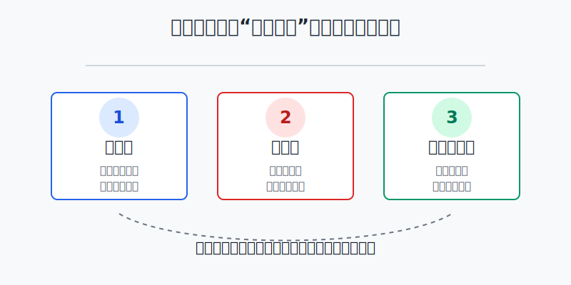
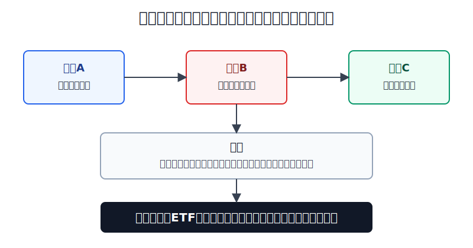
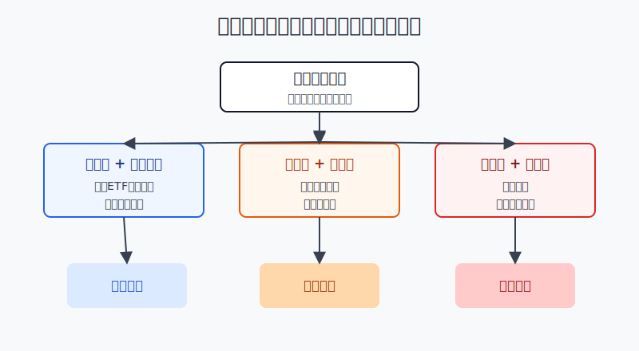

## 散户投资小白金融全品种操盘手册 - 12.2 港股市场特点 - 低估值、高波动、流动性分层
  
### 作者  
digoal  
  
### 日期  
2026-06-07   
  
### 标签  
金融产品 , 金融工具 , 散户 , 投资小白 , 全品操盘手册  
  
----  
  
## 背景 
  

> 适用读者: 已经知道港股通是内地账户参与港股的重要路径，接下来想判断港股到底适不适合放进自己组合的小白投资者。  
> 本文定位: 投资教育框架，不构成个性化投资建议。数据口径按 2026-06-06 可核查公开资料整理，实盘前仍要以交易所、基金公告和券商页面为准。

## 先问一个反直觉的问题

港股经常看起来便宜，但便宜不等于好买。真正的问题是: **这个便宜，是市场误杀给你的机会，还是波动、流动性和基本面不确定性的折扣？** 答不上这个问题，就不要把“低估值”当成买入理由。

## 核心概念: 港股像一个折扣商场，但不是每个柜台都好退货

港股市场有三个标签: 低估值、高波动、流动性分层。

**低估值**，就是同样一块资产，市场愿意给的价格更低。市盈率（PE，股价除以每股盈利）低，说明投资者花较少的钱买一元盈利；股息率高，说明一元股价对应的现金分红更高。但估值低有两种原因: 一种是被低估，另一种是市场认为未来盈利、政策、流动性或公司治理有风险。

**高波动**，就是价格上下摆动更大。它像海边的浪，浪大时冲得快，也退得快。对小白来说，高波动最危险的地方不是“会跌”，而是你还没想清楚长期逻辑，就被短期涨跌逼着追涨杀跌。

**流动性分层**，就是有些港股像大商场门口的热门店，随时有人买卖；有些港股像角落里的冷门柜台，标价看着便宜，但真想卖时没有足够买家。成交量（一定时间内成交了多少股票或金额）和买卖价差（买一价和卖一价之间的差距）决定你能不能按接近预期的价格进出。

本节行动结论先放在前面: **小白配置港股，优先用港股宽基ETF、港股通ETF或高流动性龙头做组合补充；港股仓位要比A股、美股核心仓打折；冷门小盘港股即使估值很低，也先放弃。**

## 逻辑推导链

【论证链标题】: 因为港股的低估值往往同时对应高波动和流动性分层，所以小白不能只看便宜，必须先做工具筛选、仓位打折和成交过滤。

── 第一步: 前提陈述

前提A: 港股核心指数经常呈现相对低估值。这是变量。估值会随着盈利、利率、风险偏好和资金流变化。它像商场打折标签，能提醒你“这里可能有便宜货”，但标签本身不能证明商品质量。

前提B: 港股价格波动较大。这是常量偏变量。市场结构、资金进出、内地经济预期、美元利率和风险偏好都会放大波动。它像一条更颠的路，同样的车速下，更容易让新手方向盘打过头。

前提C: 港股流动性明显分层。这是常量。大指数成分股、头部互联网、金融、能源、电讯、公用事业等股票成交活跃；大量中小市值股票成交很薄。它像同一座城市里的不同道路，主干道通畅，小巷子掉头困难。

前提D: 小白最容易把“估值低”理解成“下跌空间小”。这是变量，但要按高风险处理。市场便宜之后仍然可以继续便宜，低PE不自动形成底部。

── 第二步: 逻辑推导

由A+D可得: 因为港股常有估值折扣，而小白容易把折扣当安全垫，所以第一步不是买入，而是问折扣从哪里来。若折扣来自短期情绪，才有修复空间；若折扣来自盈利下滑、行业衰退或治理风险，便宜可能是陷阱。

由A+B可得: 因为低估值不消除高波动，所以港股仓位不能照搬A股或美股核心仓。你可以买便宜，但不能用满仓去承受便宜资产的继续下跌。

再由B+C可得: 因为高波动遇上低流动性，会让买入和卖出都变难，所以小白必须先过滤成交。能用ETF解决的，不优先用单只冷门股票；能买龙头的，不去碰成交稀薄的小盘股。

最后由A+B+C+D可得: 因为港股的机会和风险绑在一起，所以操作顺序必须是: **先选工具，再控仓位，再看成交，最后才判断买点。** 反过来，只因为“便宜”就买，逻辑顺序是错的。

── 第三步: 正常情景下的操作结论

✅ 正常情景: 你想把港股放进全球配置里，资金是三年以上不用的长期资金；你还没有稳定研究港股财报、公司治理和交易规则的能力；你只是想补充A股和美股之外的中国资产、互联网平台、金融、电讯、能源或红利类资产。

对应操作: 先用港股宽基ETF、港股通ETF或流动性好的龙头建立小仓位观察；港股总仓位先控制在总资产5%-15%；单只港股个股初始仓位不超过总资产1%-2%。若某只股票日成交额长期很低、买卖价差明显、公告看不懂，直接跳过，不用因为PE低而心动。

── 第四步: 数据和案例证实

证据1: 恒生指数公司 2026年4月事实表显示，截至2026年4月30日，恒生指数PE为14.08倍，股息率为3.04%；指数包含90只成分股。这个数据验证前提A: 港股核心指数确实呈现不算高的估值和较高现金回报特征，但它只说明“价格标签”，不说明“买了就涨”。

证据2: 同一份恒生指数事实表显示，恒生指数过去1年、3年、5年年化波动率分别为18.47%、23.74%、25.04%。这对应前提B: 港股不是低波动资产，便宜资产也会用较大的日常波动考验持有人。

证据3: 同一份事实表还显示，恒生指数90只成分股覆盖香港主板相关股票总市值的64.26%，覆盖市场成交额的52.34%。这个数据对应前提C: 港股成交明显向头部股票集中。头部指数成分股已经覆盖一半以上成交额，说明市场剩下部分的流动性不能想当然。

证据4: 港交所2026年5月月度市场摘要显示，香港证券市场5月平均每日成交额为2929亿港元，月底总市值为47.1万亿港元；2026年前五个月ETF平均每日成交额为389亿港元。这个数据说明港股市场整体不是没有流动性；真正的问题是流动性分布不均，不能把全市场活跃误认为每一只股票都好买好卖。

失败案例: 恒生指数历史年度数据里，2021年下跌14.08%，2022年下跌15.46%，2023年下跌13.82%，连续三年下跌后，2024年才上涨17.67%。这个案例说明，低估值不能阻止市场继续下跌。若你在2021年只因为“便宜”重仓买入，又没有分批、仓位上限和止损规则，后面几年会非常难熬。

历史数据不代表未来。它们仍有参考价值，是因为它们验证的不是某一年会不会涨，而是港股的结构特征: 估值折扣、较高波动、成交集中。这三个特征共同决定了小白的操作方式。

── 第五步: 前提变化时的替代结论

若前提A改变，也就是港股估值已经明显修复，PE和股息率不再有吸引力，推导路径变为: 因为折扣变薄，容错率下降，所以不能继续用“便宜”解释持仓。新结论: 停止加仓，把重点转到盈利增长和趋势确认。

若前提B改变，也就是港股短期大涨、成交放大、社交平台情绪很热，推导路径变为: 因为波动可能从低位修复变成情绪追涨，所以小白不能把补涨当长期逻辑。新结论: 不追高加仓，已有仓位按目标比例再平衡。

若前提C改变，也就是你看中的不是ETF或龙头，而是日成交很低的小盘港股，推导路径变为: 因为退出成本上升，账面便宜可能无法兑现，所以估值折扣要再打折。新结论: 小白直接跳过；如果已有持仓，先减到观察仓。

若前提D改变，也就是你已经能读港股公告、财报、分红政策、股权结构和关联交易，并且有完整复盘记录，推导路径变为: 因为研究能力提高，可以适度研究个股，但仍不能忽视流动性。新结论: 个股仓位可以从学习仓提高到卫星仓，但单只股票仍要设上限。

## 实操例子: 10万元组合怎么配置港股才不被“低估值”带偏

这个例子对应论证链的正常结论: **先选工具，再控仓位，再看成交，最后才判断买点。**

假设小林有10万元长期投资资金，已经留足生活备用金，三年内不需要动用。他已经有A股宽基ETF和一部分美股指数基金，现在想加入港股。

第一步，定港股总上限。小林先把港股总仓位设为10%，也就是1万元，不因为港股PE低就直接买到30%。这个动作对应前提B: 高波动资产要先限制对总组合的冲击。

第二步，先选工具。小林把7000元放在港股宽基ETF或港股通ETF，覆盖头部公司；剩下3000元作为观察仓，用来研究1到2只流动性好的港股龙头。这个动作对应前提C: 能用ETF解决分散和流动性，就不要一开始押小盘个股。

第三步，设成交过滤。单只港股进入观察清单前，小林至少看三件事: 最近20个交易日成交额是否稳定，买卖价差是否窄，公告和财报是否能读懂。三项有两项不合格，就不买。这个动作对应前提C和D。

第四步，分批买入。1万元港股额度不一次打满。第一笔买3000元ETF，第二笔等指数回撤或趋势确认再买3000元，第三笔留给再平衡。这个动作对应前提B: 高波动市场用分批降低买在单一高点的风险。

第五步，写前提失效后的调整。若港股大涨后仓位从10%变成15%，小林卖出超出部分回到目标仓位；若港股继续下跌但估值、成交和长期资金前提都没坏，按计划小额补ETF；若某只个股成交突然萎缩或公告出现看不懂的关联交易，直接停止加仓，必要时退出。

如果操作错误，后果很具体。小林若把10万元里的4万元一次性买入一只“低PE港股”，但这只股票日成交稀薄，之后股价跌20%，总资产回撤8%；更麻烦的是，他想卖时买盘很薄，只能降价成交。亏损不只来自判断错，还来自退出困难。纠偏方法不是找更便宜的港股，而是回到工具、仓位、成交三道门。

## 可复用框架

【三折过滤】

适用前提: 你准备买港股ETF、港股通ETF或港股个股，买入理由里出现了“低估值”“高股息”“跌得多”。

核心逻辑: 因为港股的估值折扣通常伴随波动折扣和流动性折扣，所以每一个“便宜”都要先过三层过滤。

操作步骤:

1. 估值折扣: 看PE、PB、股息率是否确实不贵，同时问便宜原因是什么。
2. 波动折扣: 看过去回撤和波动能不能承受，先设港股总仓位上限。
3. 流动性折扣: 看成交额、买卖价差、ETF规模或个股成交深度，不合格就不买。

前提失效时: 如果估值不再便宜，停止用低估值解释持仓；如果波动超过承受范围，降仓；如果流动性变差，优先退出个股而不是补仓。

举一反三: 这个框架也适用于小盘A股、主题ETF、REITs和可转债。凡是看上去便宜但交易不活跃的资产，都要先问能不能退出。

【先宽后窄】

适用前提: 你想参与港股，但还不熟悉港股公告、公司治理、行业结构和交易细节。

核心逻辑: 因为指数和ETF能分散个股风险，而个股需要更强研究和退出能力，所以先用宽基工具建立认知，再缩小到龙头或个股。

操作步骤:

1. 先配置港股宽基ETF或港股通ETF，仓位控制在总资产5%-15%。
2. 再观察高流动性龙头，单只初始仓位不超过总资产1%-2%。
3. 最后才研究中小盘和高股息个股，并且必须通过成交过滤。

前提失效时: 如果你连ETF成分、指数规则、汇率和交易费用都没弄清楚，不进入个股；如果个股公告看不懂，退回ETF。

举一反三: 全球配置都可以按“先宽后窄”来做。先买市场，再研究行业，最后才买公司。

## 本节行动清单

| 动作 | 合格标准 |
|---|---|
| 不把低估值当买入理由 | 能说清折扣来自情绪、周期、盈利、治理还是流动性 |
| 港股总仓位先打折 | 小白先控制在总资产5%-15%，不和核心宽基仓抢位置 |
| 优先ETF和龙头 | 先选港股宽基ETF、港股通ETF或成交活跃龙头 |
| 单只个股看成交 | 看20日成交额、买卖价差、公告可读性 |
| 分批而不是梭哈 | 至少分2到3笔，留一笔给回撤或再平衡 |
| 前提失效就切换 | 估值修复、波动过大、流动性变差时，不继续加仓 |

## 一句话总结

港股的机会来自折扣，风险也藏在折扣里。小白不要只问“便不便宜”，而要按估值、波动、流动性三层过滤，先用ETF和龙头小仓位参与，再慢慢学习个股。

## 参考资料

- Hang Seng Indexes Company: Hang Seng Index Factsheet，数据截至2026年4月30日，https://www.hsi.com.hk/static/uploads/contents/en/dl_centre/factsheets/hsie.pdf
- HKEX Monthly Market Highlights，2026年5月，https://www.hkex.com.hk/Market-Data/Statistics/Consolidated-Reports/HKEX-Monthly-Market-Highlights?sc_lang=en
- Tracker Fund of Hong Kong: Factsheet，含恒生指数历史年度表现，https://www.trahk.com.hk/content/dam/hsvm/trahk/fund_docs/offering/TraHK_Factsheet-English.pdf

> ⚠️ **声明**：本文内容为投资教育目的，所有历史数据、策略框架均为辅助学习工具，不构成证券投资建议。市场有风险，投资需谨慎。实际操作请结合自身风险承受能力，必要时咨询专业投顾。
  
#### [PostgreSQL 解决方案集合](../201706/20170601_02.md "40cff096e9ed7122c512b35d8561d9c8")
  
  
#### [德哥 / digoal's Github - 公益是一辈子的事.](https://github.com/digoal/blog/blob/master/README.md "22709685feb7cab07d30f30387f0a9ae")
  
  
#### [About 德哥](https://github.com/digoal/blog/blob/master/me/readme.md "a37735981e7704886ffd590565582dd0")
  
  

  
