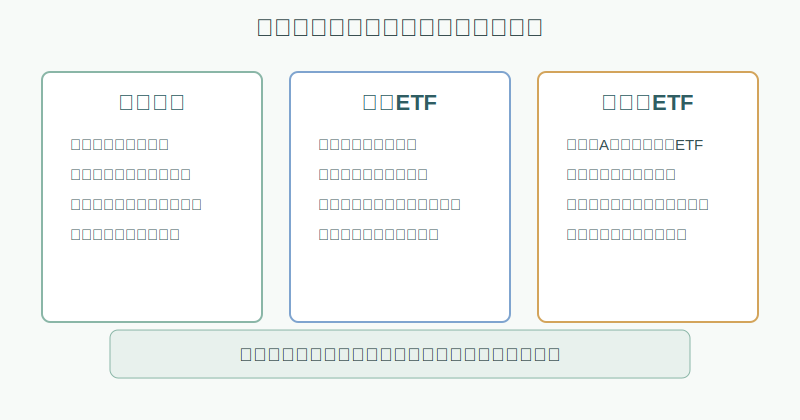
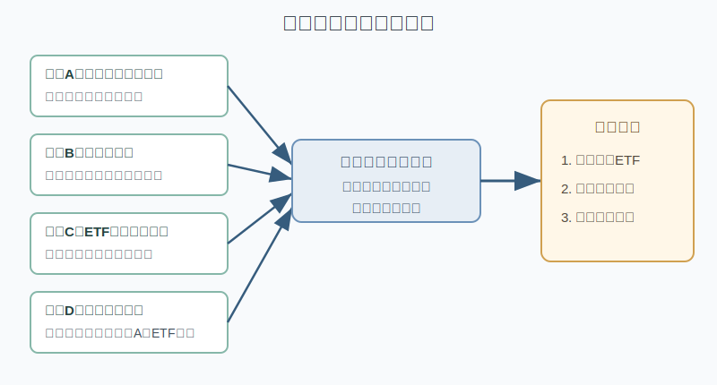
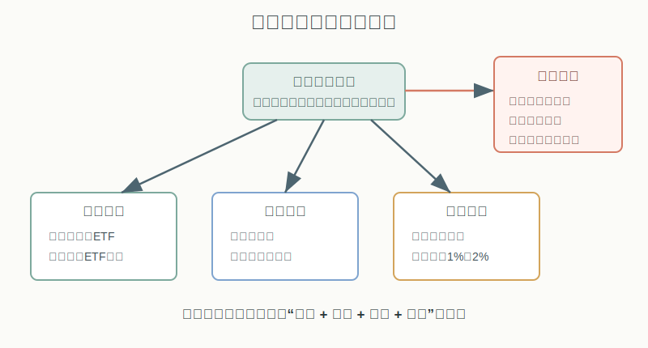

## 散户投资小白金融全品种操盘手册 - 12.3 港股个股、港股ETF、港股通ETF
  
### 作者  
digoal  
  
### 日期  
2026-06-07   
  
### 标签  
金融产品 , 金融工具 , 散户 , 投资小白 , 全品操盘手册  
  
----  
  
## 背景 
  

> 适用读者: 已经知道港股通是内地账户参与港股的正规路径，但还分不清港股个股、港股ETF、港股通ETF应该怎么选的小白投资者。  
> 本文定位: 投资教育框架，不构成个性化投资建议。

## 先问一个反直觉的问题

你想买港股，不一定要先买港股个股。很多小白亏钱，不是因为港股没有机会，而是把三个问题混成了一个问题: 我想配置香港市场，我想押某个行业，我想买某家公司。

这三个目标，对应的工具不一样。

## 核心概念: 先分清“底层”和“外壳”

港股个股，买的是一家香港上市公司。你赚的是这家公司经营改善、估值提升、分红或市场情绪的钱；你亏的也可能是这家公司财报变差、政策变化、竞争失败、流动性变差的钱。

港股ETF，买的是在香港交易所上市的一篮子基金。它可能跟踪恒生指数、恒生科技指数、国企指数、红利指数，也可能跟踪某个行业或主题。ETF帮你分散单家公司风险，但不会消灭市场风险、行业风险、汇率风险和成交成本。

港股通ETF这个名字最容易误会。在内地市场里，它常指**在A股市场交易、基金通过港股通买入港股通范围内股票的人民币ETF**，例如名字里带“港股通科技”“港股通互联网”“港股通红利”的场内ETF。你在A股账户买它，交易外壳是内地ETF；底层资产是港股通范围里的港股。

还有一种情况，是香港上市ETF被纳入南向港股通ETF名单，合格投资者可以通过港股通去买。两者都和“港股通”有关，但入口不同: 一个是你买内地ETF，基金经理通过港股通买港股；一个是你本人通过港股通买香港上市ETF。小白读产品名称时，先看它在哪个交易所上市、用什么货币交易、底层持仓是什么。

本节行动结论先放在前面: **如果你的目标是配置港股市场，优先用宽基或风格ETF；如果只是想表达科技、互联网、红利等主题，用小比例主题ETF；如果想买港股个股，先把它当卫星仓，单只初始1%-2%，不要让一家公司替代整个港股配置。**

## 逻辑推导链

【论证链标题】: 因为港股市场机会集中但规则、流动性和底层风险更复杂，所以小白应先用ETF解决配置，再用小仓位研究个股。

── 第一步: 前提陈述

前提A: 港股市场很大，但结构高度带有中国资产属性。这是常量中带变量。HKEX 2025年市场统计显示，截至2025年12月31日，香港证券市场有2,686家上市公司，总市值47.39万亿港元，全年日均成交2,498.2亿港元；其中内地企业有1,552家，占上市公司数58%，市值37.58万亿港元，占总市值79%，日均股本成交1,764亿港元，占91%。这意味着你买港股，很多时候不是单纯买“香港本地市场”，而是在买中国企业、港币计价、国际资金定价三件事的叠加。

前提B: 港股流动性分层明显。这是常量。大市值公司、主要指数ETF、热门行业ETF成交可能很活跃；但中小市值股票、冷门行业、低成交ETF，买卖价差可能明显变宽。它像菜市场: 门口的大摊位天天有人买，角落的小摊位不是不能买，而是你一着急就可能买贵、卖便宜。

前提C: ETF能降低个股风险，但不能保证不亏。这是常量。ETF像一篮子菜，不会因为一根菜坏了就全坏，但如果整篮菜本来都是同一个季节、同一个产地、同一个主题，遇到大环境变化照样会一起下跌。港股科技ETF就是典型: 它分散了单家公司风险，但仍然承受科技成长股估值、监管、流动性和风险偏好的共同冲击。

前提D: 参与入口不同，决定了你的成本和边界。这是变量。港股通需要符合适当性要求；香港账户、港股通、内地上市港股通ETF、QDII基金、跨境ETF，每个外壳的交易货币、税费、交易日、申赎机制、可买范围都不同。小白不能只看底层叫“港股”，就默认它们风险一样。

── 第二步: 逻辑推导

由A可得: 因为港股市场里中国企业权重很高，所以买港股前要先问: 我是不是已经通过A股、基金、工资收入或房产暴露在同一个中国经济方向上？如果已经高度重叠，港股不能盲目加成重仓。

由B可得: 因为流动性分层明显，所以小白直接买个股时，不能只看股价便宜、估值低、分红高，还要看成交额、买卖价差、每手股数和持仓上限。便宜但卖不出去，不是低估，是流动性风险。

由B+C可得: 因为ETF通常比单只个股更分散、交易也更标准化，所以当目标是“配置港股市场”时，ETF比个股更适合作为第一工具。但ETF仍要检查溢价、折价、成交量、买卖价差和跟踪指数。

再由C+D可得: 因为港股通ETF和港股ETF只是外壳不同，底层仍可能是同一批港股，所以选择工具时不能只问“哪个方便”，还要问“底层是否集中、费用是否可接受、假期和汇率是否会带来偏差”。

最后由A+B+C+D可得: **小白买港股的正确顺序是: 先确认自己要配置市场、表达主题还是研究公司；再选择ETF、港股通ETF或个股；最后设仓位上限和失效条件。**

── 第三步: 正常情景下的操作结论

✅ 正常情景: 你有长期资金，已经留足生活备用金，想在A股和美股之外补一部分港股资产，但还没有稳定研究港股公司的能力。

对应操作: 港股整体配置先用宽基ETF或港股通ETF解决，初始比例控制在总资产3%-8%；行业主题ETF控制在1%-3%；港股个股只做卫星仓，单只初始1%-2%，研究成熟后也不宜突破3%-5%。如果你只是想追一个热门港股故事，不买个股，先用观察仓或主题ETF学习。

── 第四步: 数据和案例证实

证据1: 港股市场不是小市场，但中国资产暴露很高。HKEX 2025年数据里的2,686家上市公司、47.39万亿港元市值和2,498.2亿港元日均成交，说明港股有足够深度；同时内地企业占市值79%、日均股本成交91%，说明港股配置本质上很大程度是在配置“离岸中国资产”。这对应前提A: 港股不是简单的“海外分散”，它可能和你的A股、中国经济风险高度相关。

证据2: ETF已经是港股市场的重要工具。HKEX 2025年统计显示，香港交易所上市ETF数量为200只，ETF全年成交8.184万亿港元，高于2024年的3.940万亿港元。港股ETF不是边缘品种，成交活跃时可以成为散户配置香港市场的主工具。这对应前提C: 对小白来说，先用篮子工具接触市场，比直接挑公司更稳。

证据3: 港股通和ETF Connect让入口更方便，但入口方便不等于风险消失。HKEX公告显示，ETF自2022年7月4日起纳入互联互通；上交所投资者教育页面说明，个人投资者参与港股通，申请权限开通前20个交易日证券账户及资金账户内资产日均不低于人民币50万元，并需了解风险、签署风险揭示书。这个证据对应前提D: 如果监管把入口设成有门槛，就说明规则和风险需要被认真对待。

证据4: 主题ETF也会经历大回撤。恒生投资管理的恒生科技指数ETF资料显示，恒生科技指数在2021年下跌32.47%，2022年下跌26.67%，2023年又下跌8.26%，到2024年才反弹19.89%。这对应前提C: ETF分散的是单家公司风险，不是把一个高波动主题变成低风险资产。

失败案例: 如果小白在2021年只看到“港股科技便宜”“互联网龙头多”“ETF比个股安全”，于是把30%的总资产压到单一港股科技ETF，他避开了一家公司爆雷，却没有避开整个主题连续回撤。当前提C被误解为“ETF不会大跌”时，推导路径就错了: 篮子里装的如果都是同一类高波动资产，篮子本身也会大幅波动。正确动作不是补仓硬扛，而是回到仓位上限，把主题ETF放回卫星仓。

历史不代表未来。上面数据仍有参考价值，是因为它们验证的是结构规律: 港股有深度，但中国资产权重高；ETF能分散个股风险，但不消灭市场和主题风险；入口便利可以降低操作门槛，但不会降低底层波动。

── 第五步: 前提变化时的替代结论

若前提A改变，也就是你已经在A股、人民币资产、国内房产和工资收入上有大量中国经济暴露，推导路径变为: 因为港股可能与原有资产高度同向，所以它不再是强分散工具。新结论: 港股仓位只做补充，不做核心重仓；优先选宽基或红利等风格工具，少追单一行业。

若前提B改变，也就是你想买的港股个股成交额低、买卖价差宽、每手金额高，推导路径变为: 因为流动性成本可能吞掉估值优势，所以低估不等于能买。新结论: 放弃个股，换成流动性更好的ETF，或只放极小观察仓。

若前提C改变，也就是你买的ETF高度集中在科技、医药、地产、博彩或某个单一主题，推导路径变为: 因为主题相关性很高，所以ETF只是“多只股票的同向押注”。新结论: 仓位从核心配置切换为卫星配置，比例降到1%-3%。

若前提D改变，也就是你没有港股通权限、看不懂港股交易费用、不了解港股交易日和汇率结算，推导路径变为: 因为入口规则不清楚，所以操作错误概率上升。新结论: 先通过内地上市港股通ETF或后面章节会讲的QDII基金学习，不急着直接买港股个股。

## 实操例子: 60万元账户怎么选港股工具

这个例子对应论证链的正常结论: **先确认目标，再选外壳，最后设仓位。**

假设小林有60万元长期投资资金，已经有A股宽基ETF和现金管理，也配置了一点美股宽基ETF。他想给组合加一点港股，但不知道买腾讯、美团、小米，还是买港股ETF。

第一步，先写目标。小林把目标写成三句话: 我不是为了三个月翻倍；我想补充港股市场暴露；我愿意学习港股公司，但现在还没有稳定研究流程。这个动作对应前提A和D: 港股是资产配置的一部分，不是短线消息场。

第二步，定总仓位。小林规定港股相关资产初始不超过总资产8%，也就是4.8万元。因为他已经有较多中国资产暴露，所以不把港股仓位一次拉到20%。这个动作对应前提A: 港股和A股有可能同向，不要把“全球配置”做成“同一风险加仓”。

第三步，选第一层工具。小林先拿3万元买宽基港股ETF或内地上市港股通宽基ETF，分两到四次完成，不在溢价明显、价差过宽、市场剧烈波动时追单。这个动作对应前提B和C: 用篮子降低个股风险，用分批降低成交时点风险。

第四步，选第二层主题。小林如果想表达港股科技或互联网观点，只拿1万元做主题ETF，不把它放进核心仓。买前检查三件事: 指数成分是否集中在少数公司，近三年最大回撤是否能承受，当前成交量和买卖价差是否正常。这个动作对应前提C: 主题ETF不是安全资产，只是比单只个股更分散的主题工具。

第五步，个股只做学习仓。小林如果想买某只港股个股，初始只拿6000元到1.2万元，也就是总资产1%-2%。买入前写三条失效条件: 公司收入或利润逻辑变坏，行业政策或竞争格局明显恶化，股价上涨后仓位超过上限。这个动作对应前提B: 港股个股不是不能买，而是不能让一家公司决定整个组合命运。

第六步，判断入口。如果小林没有港股通权限，也不想开香港账户，他就选择A股市场内的港股通ETF或后续章节会讲的QDII基金；如果他已经有港股通权限，想直接买港股通标的或香港上市ETF，就必须先确认交易日、费用、每手股数、汇率和税费。这个动作对应前提D: 入口不是小事，入口决定交易成本和可买范围。

如果操作错误，后果很清楚。小林若把4.8万元全部买成一只港股科技个股，这只股票跌40%，总资产回撤3.2%；看起来不致命，但如果他因为“跌多了更便宜”继续加到20万元，股票再跌40%，总资产就会被拖下去13%以上，而且心理上很难止损。纠偏方法不是问“它还能不能涨回来”，而是先把仓位降回规则内，再复盘当初买的是配置、主题还是个股故事。

## 可复用框架

【先篮后票】

适用前提: 你想买港股，但还没有长期验证过港股个股研究能力。

核心逻辑: 因为港股市场中国资产权重高、流动性分层明显、个股风险集中，所以先用ETF建立小比例市场暴露，再用个股做学习仓。

操作步骤:

1. 先判断目标: 配置市场、表达主题、研究公司，只能选一个主目标。
2. 配置市场: 用宽基港股ETF或港股通ETF，初始3%-8%。
3. 表达主题: 用行业或主题ETF，控制在1%-3%。
4. 研究公司: 单只港股个股初始1%-2%，买前写失效条件。

前提失效时: 如果港股和你原有资产高度重叠，降低总仓位；如果ETF溢价高、价差宽，暂停交易；如果个股流动性差，放弃个股，换成ETF。

举一反三: 这个框架也能用在美股、A股行业基金、REITs和商品基金。先解决“我要暴露在哪类风险”，再决定用哪只代码。

【四看外壳】

适用前提: 你看到一个名字里带“港股”“恒生”“港股通”的产品，不知道它到底是什么。

核心逻辑: 因为同样是港股底层，不同外壳的交易规则、货币、税费和可买范围不同，所以先看外壳，再看收益。

操作步骤:

1. 看上市地: 是香港上市ETF，还是A股市场上市ETF。
2. 看交易货币: 是港币、人民币，还是多柜台。
3. 看底层范围: 是全港股、恒生指数、港股通范围，还是单一行业主题。
4. 看成本: 费用率、买卖价差、溢价折价、印花税或其他交易费用。

前提失效时: 如果你无法说清这四项，不下单；如果只能说“名字听起来像港股”，说明还没看懂。

举一反三: 以后看到QDII基金、跨境ETF、联接基金、LOF，也先用“四看外壳”拆开。金融产品的名字常常像包装盒，真正的风险在盒子里面。

## 本节行动清单

| 动作 | 合格标准 |
|---|---|
| 写清目标 | 配置市场、表达主题、研究公司，不混在一起 |
| 先查外壳 | 知道产品在哪个交易所上市、用什么货币交易、底层买什么 |
| 控制总仓 | 港股初始配置按总资产3%-8%学习，不和A股风险重复重仓 |
| ETF先过交易检查 | 看费用率、规模、成交量、买卖价差、溢价折价 |
| 主题ETF降级为卫星 | 科技、互联网、医药、地产等主题不放核心仓 |
| 个股写失效条件 | 买入前写清财报、行业、估值、政策和流动性触发条件 |
| 不懂入口先停手 | 港股通权限、交易日、每手股数、汇率、税费看不懂，不直接买个股 |

## 一句话总结

港股不是一个代码，而是一组工具: 配置用篮子，主题用小仓，个股用学习仓；先看底层，再看外壳，最后才轮到买入按钮。

## 参考资料

- HKEX: Market Statistics 2025，2026年发布，https://www.hkex.com.hk/-/media/HKEX-Market/Market-Data/Statistics/Consolidated-Reports/Annual-Market-Statistics/2025FY-Annual-Market-Stat_Eng.pdf
- HKEX: HKEX to Include ETFs in Stock Connect on 4 July，2022年6月28日，https://www.hkex.com.hk/News/News-Release/2022/220628news
- 上海证券交易所: 股票投资/港股通适当性要求，2026年访问，https://one.sse.com.cn/onething/gptz/
- 上海证券交易所: 港股通交易税费，2026年访问，https://big5.sse.com.cn/site/cht/www.sse.com.cn/services/hkexsc/tax/
- HKEX: Securities Market Trading Hours，2026年访问，https://www.hkex.com.hk/Services/Trading-hours-and-Severe-Weather-Arrangements/Trading-Hours/Securities-Market?sc_lang=en
- HKEX: Securities Transaction Fees，2026年访问，https://www.hkex.com.hk/Services/Rules-and-Forms-and-Fees/Fees/Securities-%28Hong-Kong%29/Trading/Transaction?sc_lang=zh-HK
- Hang Seng Investment Management: Hang Seng TECH Index ETF Factsheet，2025年10月，https://cms.hangseng.com/cms/ivp/hsvm/document/etf_tech_index_en.pdf
- 上海证券交易所基金网站: 富国基金港股通科技ETF上市案例，2025年7月28日，https://etf.sse.com.cn/fundtrends/c/c_20250728_10786741.shtml

> ⚠️ **声明**：本文内容为投资教育目的，所有历史数据、策略框架均为辅助学习工具，不构成证券投资建议。市场有风险，投资需谨慎。实际操作请结合自身风险承受能力，必要时咨询专业投顾。
  
#### [PostgreSQL 解决方案集合](../201706/20170601_02.md "40cff096e9ed7122c512b35d8561d9c8")
  
  
#### [德哥 / digoal's Github - 公益是一辈子的事.](https://github.com/digoal/blog/blob/master/README.md "22709685feb7cab07d30f30387f0a9ae")
  
  
#### [About 德哥](https://github.com/digoal/blog/blob/master/me/readme.md "a37735981e7704886ffd590565582dd0")
  
  

  
