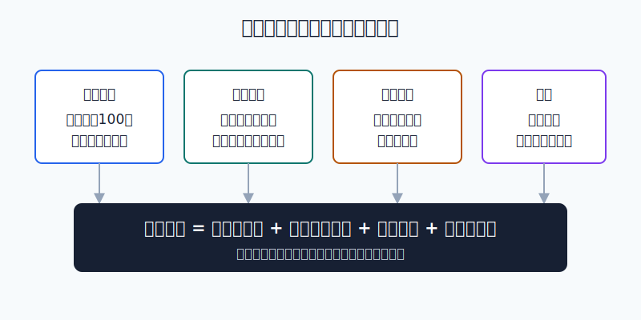
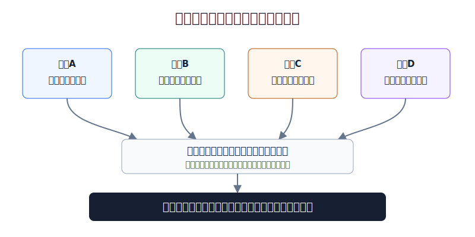
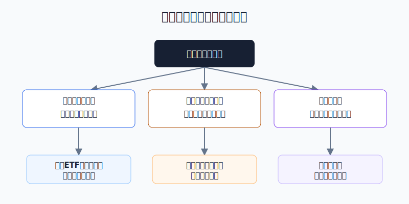

## 散户投资小白金融全品种操盘手册 - 12.4 港股交易规则 - 每手股数、交易时间、费用、汇率
  
### 作者  
digoal  
  
### 日期  
2026-06-07   
  
### 标签  
金融产品 , 金融工具 , 散户 , 投资小白 , 全品操盘手册  
  
----  
  
## 背景 
  

> 适用读者: 已经知道港股可以通过港股通、港股ETF或境外券商账户参与，但还没真正算过一笔港股订单规则成本的小白投资者。  
> 本文定位: 投资教育框架，不构成税务、法律或证券投资建议。规则口径按 2026-06-06 可核查公开资料整理，实操前以交易所、券商和结算机构最新提示为准。

## 先问一个反直觉的问题

港股最容易亏错的地方，不是你看错了腾讯、阿里、美团，而是你以为“港股就是另一个A股”。一手股数不固定，开收盘有集合竞价，费用按买卖两边收，港币报价还要换回人民币算。**规则没算清，买入理由再漂亮，也会先输在入口上。**

## 核心概念: 港股不是只换了一个交易所

把港股下单想成去香港买一件商品。

**每手股数**是包装规格。A股小白习惯“一手100股”，但港股不是这样。港股的“一手”由发行人决定，同一市场里可以有100股、200股、500股、1000股、2000股等不同规格。你不是想买100股就能买100股，先要看这只股票一手是多少股。

**交易时间**是商场开门规则。香港和内地同属北京时间/香港时间，不用像美股那样倒时差，但港股有开市前时段、连续交易时段和收市竞价时段。对小白来说，最干净的执行窗口是连续交易主时段，而不是一上来就在集合竞价里试手。

**费用**不是券商佣金一个数字。港股交易里有印花税、交易费、证监会交易征费、会财局交易征费，券商还会有佣金、平台费、交收费等项目。你做一次买入和一次卖出，费用是两边都算。

**汇率**不是背景噪音。港股以港币报价；港股通是港币报价、人民币交收；境外账户则通常要自己处理人民币、港币、美元之间的资金安排。港币和美元有联系汇率制度，但你最后用人民币衡量账户，所以人民币兑港币的变化仍会影响真实收益。

所以本节的行动结论先放在前面: **小白买港股前，必须先写下四个数: 一手金额、可交易时段、单边和往返成本、买入时人民币/港币汇率。四个数说不清，就不下单。**

## 逻辑推导链

【论证链标题】: 因为港股的交易单位、时段、费用和汇率都会改变真实盈亏，所以小白必须先算规则账，再判断投资机会。

── 第一步: 前提陈述

前提A: 港股一手股数不是统一100股，而是由发行人决定。这是常量。港交所FAQ说明，香港证券市场的board lot指交易单位，不同于内地市场固定100股，香港上市证券的一手股数由发行人决定；不足一手的证券叫碎股，碎股不进入交易所自动对盘系统，而是在特殊碎股市场处理，流动性通常低于整手市场。

前提B: 港股交易日有分段时段和订单类型差异。这是常量。港交所公布，香港证券市场周一至周五交易，开市前时段为9:00至9:30；连续交易的核心时段包括9:30至12:00、13:00至16:00；收市竞价为16:00至随机收市的16:08至16:10之间。12:00至13:00的延续早市只适用于延续交易证券，普通小白不能把它当成所有股票都能正常交易的午间窗口。

前提C: 港股显性交易成本按每边收取，且印花税是大头。这是常量加变量。港交所费用页面显示，证券交易买卖每边有0.0027%证监会交易征费、0.00015%会财局交易征费、0.00565%交易费；香港股票交易印花税一般为交易金额0.1%，买方和卖方都收，并向上取整至最接近港元。券商佣金、平台费和是否转嫁结算费用由券商决定，这是变量。

前提D: 港股报价货币和投资者最终记账货币不同。这是变量。港金管局说明，港币联系汇率制度把港币维持在每1美元兑7.75至7.85港元区间内；港交所资料也说明，港股通下内地投资者交易港交所证券以港币报价、人民币交收。因此，港股价格不动时，人民币兑港币变化也会改变你的人民币口径收益。

── 第二步: 逻辑推导

由A可得: 因为每手股数不统一，所以“小资金分散买几只港股”的想法先要过一手金额检查。若一只股票股价80港元、一手500股，买一手就是40000港元，不适合拿5000元人民币学习仓硬买。

由A+B可得: 因为整手和碎股流动性不同，集合竞价和连续交易订单规则不同，所以小白不能只看行情软件上的最新价。最新价只是一个点，能不能按可接受价格成交，要看一手、盘口、买卖价差和当时所处时段。

再由B+C可得: 因为港股费用按每边收，频繁买卖会把“看对一点点方向”的收益吃掉，所以港股不适合小白用来做高频短线练手。你的买入理由至少要覆盖往返显性费用、买卖价差和券商收费。

再由C+D可得: 因为港股通是港币报价、人民币交收，直接港股账户还要处理换汇，所以最终收益必须拆成两层: 第一层是港币资产涨跌，第二层是人民币/港币汇率变化。只看港股涨跌幅，不等于看到了自己的真实收益。

最后由A+B+C+D可得: 小白买港股的正确顺序不是“看好公司就买”，而是“先确认规则可承受，再谈公司是否值得买”。规则可承受包括: 一手金额不超过计划仓位、连续交易时段内限价下单、预期收益覆盖成本、汇率账能解释。

── 第三步: 正常情景下的操作结论

✅ 正常情景: 你通过港股通或合规港股账户买入一只成交活跃的大型港股或港股ETF，计划持有时间不是几天内来回倒，资金不是短期要用钱，单笔仓位不超过组合上限。

对应操作: 下单前先查一手股数和一手金额；默认在9:30至12:00或13:00至16:00的连续交易主时段下限价单；按“买入成本 + 卖出成本 + 买卖价差 + 汇率影响”估算真实门槛；港股通记录人民币交收金额和港币成交金额，直接账户记录换汇汇率。若任一项不清楚，不用真实资金试错。

── 第四步: 数据和案例证实

证据1: 港交所对一手和碎股的解释验证前提A。港交所FAQ写明，香港一手股数由发行人决定；碎股不被交易所交易系统自动对盘接受，而在特殊碎股市场交易；碎股价格通常因流动性较低而略低于同一证券整手市场价格。这个证据说明，港股的一手不是小细节，而是决定最小买入金额和卖出质量的入口规则。

证据2: 港交所交易时间表验证前提B。港交所公布，香港证券市场开市前时段为9:00至9:30，连续交易主时段覆盖9:30至12:00和13:00至16:00，收市竞价在16:00至随机收市的16:08至16:10之间。这个证据说明，小白不能把港股理解成“9:30到16:00随便市价买卖”，不同时段对应不同订单规则和成交质量。

证据3: 港交所和香港税务局资料验证前提C。港交所列明证券交易每边有0.0027%证监会交易征费、0.00015%会财局交易征费、0.00565%交易费；香港股票交易印花税一般为0.1%，买方和卖方都收。香港税务局《Rates of Stamp Duty - Transfer of Hong Kong Stock》也列出合约票据买卖香港股票税率为0.1%。这意味着仅官方显性费率中，不含券商佣金和价差，普通港股买入一边约0.1085%，一买一卖约0.217%。

证据4: 港金管局和港交所资料验证前提D。港金管局说明联系汇率制度维持港币在每美元7.75至7.85港元区间；港交所关于港币人民币双柜台的说明指出，现行港股通机制下内地投资者交易港交所证券以港币报价、人民币交收，并承受汇率波动风险。这个证据说明，港币看起来稳定，不等于人民币投资者没有汇率账。

证据5: 港股市场整体活跃，但个股流动性仍要逐只检查。港交所2025年12月月度市场摘要显示，2025年证券市场平均每日成交额为2498亿港元，较2024年增加90%；2025年ETF平均每日成交额为333亿港元，较2024年增加108%。这个数据说明港股不是没流动性的市场，但总成交额不能替代个股盘口检查。大市场里仍有冷门股、碎股、低成交ETF和买卖价差很宽的品种。

失败案例: 小林拿3万元人民币想买三只港股，第一只股价85港元、一手500股，一手金额42500港元，已经超过他的单票计划；第二只股价6港元、一手2000股，看似便宜但买入后成交稀疏，卖出时买卖价差很宽；第三只通过港股通买入，港币价格涨了2%，但人民币兑港币在这段时间走强，人民币口径收益被吃掉一部分。三个错误都不是“公司研究失败”，而是前提A、C、D没有先检查。

历史数据不代表未来，费用和交易安排也会更新。它的参考价值在于提醒你: 港股规则不是背景知识，而是每笔订单都会立刻体现在盈亏里的真实成本。

── 第五步: 前提变化时的替代结论

若前提A改变，也就是一手金额超过单票上限，推导路径变为: 因为最小买入单位已经超过计划仓位，所以买入会直接造成仓位失控。新结论: 不买这只个股，改研究港股ETF、同类低价标的，或等资金规模足够后再说。

若前提B改变，也就是你只能在开市前或收市竞价时处理订单，推导路径变为: 因为订单类型和成交价格形成机制变复杂，所以不能用普通连续交易思路下单。新结论: 只用事先写好的限价，不用追价；不熟悉集合竞价时，等连续交易主时段。

若前提C改变，也就是券商佣金、平台费、交收费较高，或买卖价差很宽，推导路径变为: 因为总成本超过预期收益空间，所以短线买卖不合格。新结论: 降低交易频率，只做更长期、更有安全边际的配置；成本算不过来就不交易。

若前提D改变，也就是人民币兑港币波动较大，或你准备用美元账户转港币买入，推导路径变为: 因为收益从一层资产涨跌变成两层甚至三层货币换算，所以原来的港币涨跌判断不足。新结论: 分批换汇、记录汇率，或降低单次仓位。

## 实操例子: 5万元账户买第一只港股怎么做

这个例子对应论证链的正常结论: **规则可承受以后，才进入买入判断。**

假设小林有5万元人民币学习账户，最多拿20%做港股学习仓，也就是1万元人民币；单只个股上限为账户的8%，约4000元人民币。他看中一只港股，价格为40港元，一手500股，券商显示港股通可买，人民币兑港币参考汇率按1港元约0.92元人民币估算。

第一步，先算一手金额。40港元乘500股，等于20000港元，折合约18400元人民币。这个数已经超过小林1万元港股学习仓，也超过4000元单票上限。对应论证链前提A，结论很直接: **不买**。不是公司不好，而是最小交易单位不适合他的账户。

第二步，换成一只港股ETF或一手金额更低的标的。假设另一只港股ETF价格20港元，一手100股，一手金额2000港元，折合约1840元人民币。这个单位能放进4000元单票上限，才进入下一步。

第三步，检查时段。小林不在9:00至9:30开市前时段下单，也不在16:00后的收市竞价里试手。他选择10:00至11:30或14:00至15:30之间看盘口，用限价单，不用市价单。这一步对应前提B: 连续交易主时段的成交质量更适合小白执行计划。

第四步，算成本。买入2000港元名义金额，官方显性费用中印花税是否适用要看产品类型和券商页面；若按普通香港股票粗算，单边官方费率约0.1085%，即约2.17港元，加上券商佣金、平台费、结算相关收费和买卖价差。因为金额很小，固定平台费和最低佣金会抬高真实成本。若券商最低收费让这笔交易成本超过1%，小林就不为了“体验一下”下单，改用更低成本工具或增加学习但不交易。

第五步，记录汇率。若通过港股通买入，他在交易记录里写下: 港币成交价、港币成交金额、人民币交收金额、当日参考汇率。以后复盘时分开看: 港币资产涨跌多少，人民币换算贡献多少。若用境外账户，他还要记录人民币换港币或美元换港币的实际汇率。

第六步，写错了怎么办。如果买入后发现一手金额算错导致仓位过大，第一优先不是补仓摊薄，而是按仓位规则降回上限；如果买成碎股，卖出前要预期更差流动性；如果发现汇率亏损让人民币收益变差，不用再加仓赌汇率反转，而是把港币收益和人民币收益分开复盘。

这个例子里，小林最终会发现: 真正的第一笔港股交易，不是按下买入键，而是把一手金额、时段、费用、汇率四张账写清楚。写不清楚时，现金就是合格仓位。

## 可复用框架

【四账下单】

适用前提: 你准备买港股个股、港股ETF，或通过港股通参与香港市场。

核心逻辑: 因为港股规则成本会改变真实盈亏，所以下单前先算四张账，再谈买入理由。

操作步骤:

1. 一手账: 查每手股数和一手金额，确认不超过单票仓位上限。
2. 时间账: 默认连续交易主时段下限价单，不熟悉集合竞价就避开。
3. 成本账: 买入和卖出两边都算，费用、价差、券商收费一起看。
4. 汇率账: 港币收益和人民币收益分开记录，港股通也不例外。

前提失效时: 一手金额超预算，不买；盘口价差太宽，不买；费用覆盖不了，不做短线；汇率账说不清，先降仓或分批。

举一反三: 这个框架也适用于美股ETF、跨境ETF、QDII基金和多币种债券基金。只要交易货币和记账货币不同，就要先算规则账。

【整手优先】

适用前提: 你是小资金账户，想买港股个股。

核心逻辑: 因为港股整手和碎股流动性不同，且一手金额决定最小仓位，所以先用整手金额筛品种，避免一买就仓位失控。

操作步骤:

1. 先看股价和每手股数，算出一手金额。
2. 一手金额超过单票上限，直接淘汰，不用硬买。
3. 一手金额合格，再看成交额、买卖价差和公司逻辑。

前提失效时: 如果持仓因送股、合股、拆股产生碎股，卖出时接受流动性折价，不把碎股当成正常整手仓位管理。

举一反三: 这个框架也能用在可转债最小交易单位、ETF最小申赎单位、期权合约单位上。先问最小单位，再问收益想象。

## 本节行动清单

| 动作 | 合格标准 |
|---|---|
| 查每手股数 | 下单前知道一手是多少股，不把港股当固定100股 |
| 算一手金额 | 一手金额不超过单票仓位上限 |
| 避开不熟时段 | 默认9:30-12:00、13:00-16:00连续交易主时段限价下单 |
| 算往返成本 | 买入和卖出两边都算印花税、征费、交易费、券商收费和价差 |
| 区分港币和人民币 | 港币成交收益、人民币换算收益分开记录 |
| 港股通看日历 | 只在港股通开放日交易，注意香港和内地节假日差异 |
| 碎股不硬扛 | 知道碎股流动性较低，卖出前预期成交折价 |

## 一句话总结

港股入门第一课不是选哪只股票，而是先把一手、时段、费用、汇率四张账算清楚；规则账合格，投资判断才有意义。

## 参考资料

- HKEX: Securities Market Trading Hours, 2026年访问, https://www.hkex.com.hk/Services/Trading-hours-and-Severe-Weather-Arrangements/Trading-Hours/Securities-Market?sc_lang=en
- HKEX: Securities Market Operations FAQ, 2026年访问, https://www.hkex.com.hk/Global/Exchange/FAQ/Securities-Market/Trading/Securities-Market-Operations?sc_lang=en
- HKEX: Top Questions - Board Lot and Odd Lot, 2026年访问, https://www.hkex.com.hk/Global/Exchange/FAQ/Top-Questions?sc_lang=en&search=lot+size
- HKEX: Securities (Hong Kong) Transaction Fees, 2026年访问, https://www.hkex.com.hk/Services/Rules-and-Forms-and-Fees/Fees/Securities-%28Hong-Kong%29/Trading/Transaction?sc_lang=en
- HKEX: Clearing and Settlement Operational Fees, 2026年访问, https://www.hkex.com.hk/Services/Rules-and-Forms-and-Fees/Fees/Securities-%28Hong-Kong%29/Clearing-and-Settlement/Operational?sc_lang=en
- Hong Kong Inland Revenue Department: Rates of Stamp Duty - Transfer of Hong Kong Stock, 2026年访问, https://www.ird.gov.hk/eng/pdf/sd_stock_rates.pdf
- Hong Kong Monetary Authority: Linked Exchange Rate System, 页面最后修订 2024-06-27, https://www.hkma.gov.hk/eng/key-functions/money/linked-exchange-rate-system/
- HKEX Group: HKD-RMB Dual Counter Model, Explained, 2023-06-19, https://www.hkexgroup.com/Media-Centre/Insight/Insight/2023/HKEX-Insight/HKD-RMB-Dual-Counter-Model-Explained?sc_lang=en
- HKEX: Monthly Market Highlights - December 2025, 2026年访问, https://www.hkex.com.hk/Market-Data/Statistics/Consolidated-Reports/HKEX-Monthly-Market-Highlights?sc_lang=en&select=%7BB874D9B6-E6B3-44CC-AC36-B566A6363CCD%7D

> ⚠️ **声明**：本文内容为投资教育目的，所有历史数据、策略框架均为辅助学习工具，不构成证券投资建议。市场有风险，投资需谨慎。实际操作请结合自身风险承受能力，必要时咨询专业投顾。
  
#### [PostgreSQL 解决方案集合](../201706/20170601_02.md "40cff096e9ed7122c512b35d8561d9c8")
  
  
#### [德哥 / digoal's Github - 公益是一辈子的事.](https://github.com/digoal/blog/blob/master/README.md "22709685feb7cab07d30f30387f0a9ae")
  
  
#### [About 德哥](https://github.com/digoal/blog/blob/master/me/readme.md "a37735981e7704886ffd590565582dd0")
  
  

  
