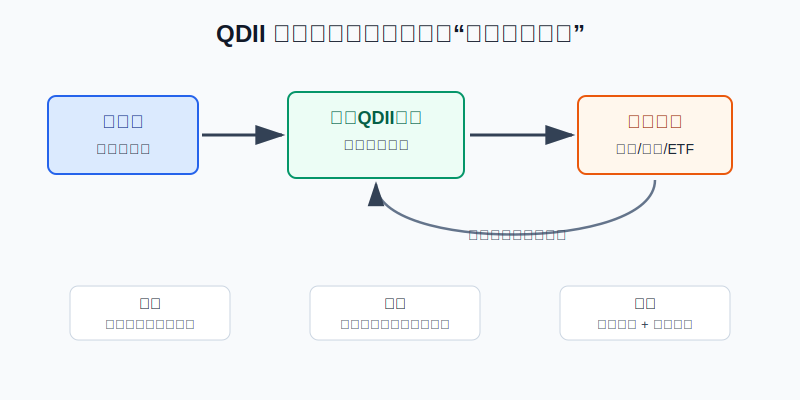
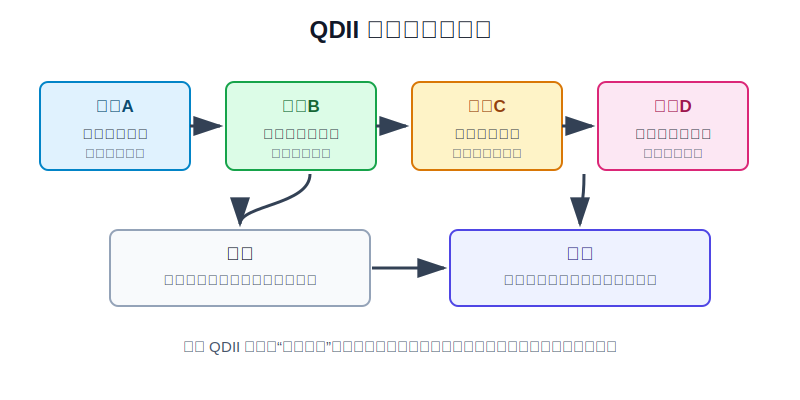
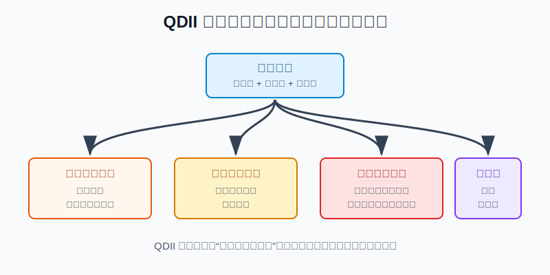

## 散户投资小白金融全品种操盘手册 - 12.5 QDII基金 - 普通散户配置海外资产的主路径
  
### 作者  
digoal  
  
### 日期  
2026-06-07   
  
### 标签  
金融产品 , 金融工具 , 散户 , 投资小白 , 全品操盘手册  
  
----  
  
## 背景 
  

> 适用读者: 想配置海外资产，但不想自己开境外账户，也还没搞清楚资金出入境、税务和海外交易规则的小白投资者。  
> 本文定位: 投资教育框架，不构成个性化投资建议。

## 先问一个反直觉的问题

QDII最容易被误解的地方，是很多人把它当成“买海外就更安全”。事实相反: **QDII只帮你解决合规出海和账户复杂度，不替你消灭海外市场波动、汇率波动、费用和申赎限制。**

## 核心概念: QDII是正规代买通道，不是保本海外存款

QDII，全称是合格境内机构投资者。小白可以把它理解成“有资格的境内机构帮你去海外买资产”。你用人民币或美元申购境内基金，基金公司再通过获批额度和托管安排，把资金投向海外股票、债券、ETF、商品或全球多资产组合。

它的好处很直接: 你不用自己开境外券商账户，不用自己处理美股税表、交易时差、境外券商安全和复杂下单规则。它的代价也很清楚: 你要接受基金公司的投资范围、管理费和托管费、申购赎回到账时间、额度限制，以及人民币兑外币的汇率波动。

所以本节行动结论先放在前面: **普通散户第一次做海外配置，QDII可以作为主路径；但买入顺序必须是先看底层资产，再看汇率和费用，再看申赎状态，最后才决定买入金额。三年内要用的钱，不进QDII股票类产品。**

## 逻辑推导链

【论证链标题】: 因为QDII只解决“合规跨境入口”，不消灭海外资产、汇率和额度风险，所以小白应把QDII当作长期海外配置工具，而不是短线追热点工具。

── 第一步: 前提陈述

前提A: QDII是制度化的跨境证券投资入口。这是常量。证监会《合格境内机构投资者境外证券投资管理试行办法》第二条说明，符合条件的境内基金管理公司、证券公司等机构，经批准后可以在境内募集资金，以资产组合方式进行境外证券投资管理。用生活里的话说，QDII不是你自己偷偷把钱搬出去，而是坐正规班车出海。

前提B: QDII的收益来自底层资产，不来自“QDII”三个字。这是常量。买美国股票QDII，本质是承受美国股票涨跌；买全球债券QDII，本质是承受债券利率、信用和汇率变化；买黄金或商品QDII，本质是承受商品价格波动。通道只是船，船上装什么货，决定你遇到什么风浪。

前提C: 人民币投资者还要承受汇率变化。这是变量。你看到的基金净值可能用人民币计价，但底层资产可能用美元、港币、日元或欧元计价。海外资产没涨没跌，汇率变化也会让人民币净值发生变化。

前提D: QDII受额度、申赎和运作成本约束。这是变量。外汇局截至2026年4月末的QDII投资额度审批表显示，QDII累计批准额度总计1761.69亿美元，其中证券基金类合计972.80亿美元。额度存在，说明这是正规通道；额度有限，说明热门阶段会出现限购、暂停申购或申赎效率下降。

前提E: 普通散户的第一目标不是“买到海外”，而是让全球配置服务整个组合。这是常量。海外资产是组合的一部分，不是把A股焦虑换成美股焦虑、日股焦虑或AI主题焦虑。

── 第二步: 逻辑推导

由A+B可得: 因为QDII是正规入口，但收益和风险仍由底层资产决定，所以买QDII不能只问“是不是海外”，必须先问“它到底买什么”。宽基、债券、黄金、区域股票、行业主题，对应的风险完全不同。

再由B+C可得: 因为底层资产涨跌和汇率都会影响人民币净值，所以小白不能只看海外指数涨了多少。美元贵、海外股票也贵时，人民币买入成本就是“双贵”；海外资产下跌叠加人民币升值时，人民币净值回撤也会被放大。

再由C+D可得: 因为QDII额度和申赎状态会影响买入体验，所以热门基金限购时不要用情绪抢额度，也不要转去买看不懂的高波动替代品。入口拥挤本身就是风险信号。

最后由A+B+C+D+E可得: 因为QDII解决的是“怎么合规买海外资产”，不是“买什么都能赚钱”，所以完整结论是: **小白用QDII做海外配置，先选宽基或清晰多资产产品，单次小比例分批买入，持有期限至少三年以上，并把QDII仓位纳入全组合上限。**

── 第三步: 正常情景下的操作结论

✅ 正常情景: 你已经留足生活备用金，这笔钱三年以上不用；你选择的是投资范围清楚、费用可接受、基金规模和申赎状态正常的QDII；你能接受海外资产和汇率同时波动。

对应操作: 第一次QDII仓位先控制在总资产5%-10%以内，优先选全球宽基、美股宽基、海外债券或清晰的多资产基金；每月或每季度分批买入，不在基金限购、暂停大额申购、热门主题大涨后追入。买入前固定检查五项: 底层资产、费用、汇率、申赎状态、组合仓位。

── 第四步: 数据和案例证实

证据1: QDII已经是有规模的公募基金品类。中国证券投资基金业协会《公募基金市场数据(2026年4月)》显示，截至2026年4月底，公募基金资产净值合计39.36万亿元；其中QDII基金337只，份额9384.62亿份，净值10539.19亿元。这个数据验证前提A: QDII不是少数人的小众通道，而是成熟的公募基金类别。

证据2: QDII受额度管理。国家外汇管理局《QDII投资额度审批情况表》显示，截至2026年4月末，QDII累计批准额度1761.69亿美元，证券基金类合计972.80亿美元。这个数据验证前提D: 额度是正规入口的一部分，也解释了为什么热门时期基金会限购或暂停申购。

证据3: QDII不是低风险同义词。2022年全球股票和债券同时承压，纳斯达克100指数全年明显下跌，美股成长类QDII和相关ETF净值也出现较大回撤。这个案例对应前提B: 如果底层资产是高估值成长股，QDII外壳不能把股票风险变成现金管理风险。

证据4: 汇率会改变人民币体验。美联储G.5A年度外汇数据显示，人民币兑美元年度平均汇率从2022年的6.7290，到2024年的7.1957、2025年的7.1875。数字越高，代表一美元需要更多人民币。这个数据对应前提C: 同样买1万美元海外资产，人民币成本会随汇率变化明显改变。

失败案例: 最典型的错误，是在海外主题大涨、基金限购、媒体热炒时买入高波动QDII。此时小白以为自己在做全球配置，实际是在追一个已经拥挤的主题。如果之后海外市场回撤、人民币升值或基金恢复申购后价格回落，亏损会同时来自底层资产、汇率和买入时点。失败点不是QDII制度失效，而是前提B、C、D同时被忽略。

历史不代表未来，但这些数据仍有参考价值，因为它们验证的是结构规律: QDII是正规通道，底层资产决定主要风险，汇率改变人民币成本，额度影响申赎体验。只要这些结构还在，买入纪律就有必要。

── 第五步: 前提变化时的替代结论

若前提B改变，也就是你准备买的QDII从宽基变成单一国家、单一行业或热门主题，推导路径变为: 因为底层资产风险集中，所以它不能再当作“海外核心仓”。新结论: 把它归入卫星仓，单只主题QDII不超过总资产3%-5%，且不能替代全球宽基。

若前提C改变，也就是美元阶段性偏强、海外资产估值也不便宜，推导路径变为: 因为人民币买入成本被汇率和估值同时抬高，所以一次性买满会降低容错率。新结论: 降低买入速度，保留现金，按月或按季度进入。

若前提D改变，也就是基金暂停申购、限制大额申购、公告提示额度紧张，推导路径变为: 因为入口已经拥挤，所以抢买不是纪律，而是被稀缺感驱动。新结论: 不追替代高波动产品，等待申赎恢复或选择同类低拥挤产品。

若前提E改变，也就是这笔钱一年内要用来买房、还债、读书或应急，推导路径变为: 因为资金用途变成确定支出，所以QDII股票类产品的净值和汇率波动不适配。新结论: 不买QDII股票类产品，优先放回现金管理或短债工具。

## 实操例子: 10万元账户怎样第一次买QDII

这个例子对应论证链的正常结论: **先选底层资产，再检查汇率、费用、申赎状态和组合仓位，最后小比例分批买入。**

假设小林有10万元长期投资资金，已经留足6个月生活备用金。他想用QDII开始海外配置，但从来没有买过海外基金。

第一步，先定上限。小林规定第一阶段QDII合计不超过总资产10%，也就是1万元。这个动作对应前提E: 先让海外配置服务组合，而不是让新鲜感决定仓位。

第二步，先选底层资产。小林把候选产品分成三类: 全球宽基或美股宽基作为核心候选，海外债券或多资产基金作为防守候选，单一行业和热门主题只放在观察名单。这个动作对应前提B: 先看货，再看船。

第三步，看费用和申赎。小林只保留投资范围清楚、基金规模不太小、管理费和托管费可接受、没有暂停申购或频繁限购的产品。若基金公告显示暂停大额申购，他不抢买，也不转去买看不懂的主题QDII。

第四步，看汇率和买入节奏。若美元兑人民币处在高位，且海外股票估值也不低，小林把1万元拆成6到12个月买入；若海外市场明显回撤、汇率成本也缓和，再略微提高当月买入额。这个动作对应前提C: 不让“资产贵 + 美元贵”一起压缩容错率。

第五步，写纠偏规则。如果QDII仓位从10%涨到15%，小林不继续追买，而是暂停新增资金；如果买入的主题QDII回撤超过20%，但宽基QDII没有同步恶化，他不盲目补仓主题，而是检查当初买入理由是否还成立；如果一年内要用钱，直接停止新增QDII股票类仓位。

如果操作错误，后果很具体。比如小林把1万元全部买入某个单一科技主题QDII，随后海外科技股回撤25%，人民币又阶段性升值，人民币净值可能出现接近或超过25%的回撤。此时他会误以为“海外配置没用”，其实错误在于把卫星主题当成核心仓。纠偏方法是把主题仓降到3%-5%以内，重新用宽基或多资产产品建立核心海外仓。

## 可复用框架

【五项检查】

适用前提: 你准备第一次买QDII，且资金三年以上不用。

核心逻辑: 因为QDII只解决合规入口，不解决资产、汇率和额度风险，所以每次买入前先过五项检查。

操作步骤:

1. 查底层资产: 它买的是宽基、债券、黄金、区域市场，还是行业主题。
2. 查费用: 管理费、托管费、申购费、赎回费和持有成本是否可接受。
3. 查汇率: 当前人民币买入外币资产的成本是否偏高。
4. 查状态: 是否暂停申购、限制大额申购、公告提示额度紧张。
5. 查仓位: QDII合计是否超过你给海外资产设的上限。

前提失效时: 任意一项说不清，不下单；底层资产过于集中，改为卫星仓；资金期限不足，退出QDII股票类计划。

举一反三: 这个框架也适用于跨境ETF、港股基金、海外债券基金和商品基金。只要资金跨市场，入口、资产、汇率和期限都要一起看。

【核心卫星】

适用前提: 你想通过QDII建立海外资产组合，而不是只买一只热门基金。

核心逻辑: 因为海外资产内部也有高低风险之分，所以先用宽基或多资产做核心，再用小比例主题做卫星。

操作步骤:

1. 核心仓: 全球宽基、美股宽基或清晰多资产QDII，占QDII仓位70%-90%。
2. 防守仓: 海外债券、黄金或现金类替代工具，按风险承受能力配置。
3. 卫星仓: 单一行业、单一国家、热门主题，只用小比例表达观点。

前提失效时: 如果卫星仓涨得太快并挤占核心仓，暂停加仓并再平衡；如果核心仓本身变成高波动主题产品，重新选择底层更分散的产品。

举一反三: A股ETF、美股ETF、港股基金都可以用这个框架。先保证核心分散，再允许少量主动判断。

## 本节行动清单

| 动作 | 合格标准 |
|---|---|
| 明确资金期限 | 三年内要用的钱，不买QDII股票类产品 |
| 先看底层资产 | 能说清基金主要买什么市场、什么品种、什么指数或策略 |
| 查费用和公告 | 买前看管理费、托管费、申赎费、限购和暂停申购公告 |
| 看汇率成本 | 美元贵、海外资产也贵时，不一次性买满 |
| 控制初始仓位 | 第一次QDII合计先控制在总资产5%-10%以内 |
| 区分核心和卫星 | 宽基/多资产做核心，主题QDII只做小比例卫星 |
| 定期复盘 | 每季度检查净值、汇率、仓位和买入理由是否变化 |

## 一句话总结

QDII是普通散户配置海外资产的主路径，但它只是正规入口，不是收益保证；先看底层资产和汇率，再看额度、费用和仓位，才能把“买海外”变成真正的全球配置。

## 参考资料

- 中国证监会: 《合格境内机构投资者境外证券投资管理试行办法》，证监会令第46号，2007年7月5日起施行，https://www.csrc.gov.cn/csrc/c101932/c1044480/content.shtml
- 中国证券投资基金业协会: 《公募基金市场数据(2026年4月)》，2026年5月27日，https://www.amac.org.cn/sjtj/tjbg/gmjj/202605/P020260527642499680112.pdf
- 国家外汇管理局: 《合格境内机构投资者(QDII)投资额度审批情况表》，截至2026年4月末，https://www.safe.gov.cn/safe/file/file/20260430/b4e13fd3928e4d89a1a4531fddcc887a.pdf
- Federal Reserve Board: Foreign Exchange Rates - G.5A Annual，2026年1月5日，https://www.federalreserve.gov/releases/g5a/current/

> ⚠️ **声明**：本文内容为投资教育目的，所有历史数据、策略框架均为辅助学习工具，不构成证券投资建议。市场有风险，投资需谨慎。实际操作请结合自身风险承受能力，必要时咨询专业投顾。
  
#### [PostgreSQL 解决方案集合](../201706/20170601_02.md "40cff096e9ed7122c512b35d8561d9c8")
  
  
#### [德哥 / digoal's Github - 公益是一辈子的事.](https://github.com/digoal/blog/blob/master/README.md "22709685feb7cab07d30f30387f0a9ae")
  
  
#### [About 德哥](https://github.com/digoal/blog/blob/master/me/readme.md "a37735981e7704886ffd590565582dd0")
  
  

  
