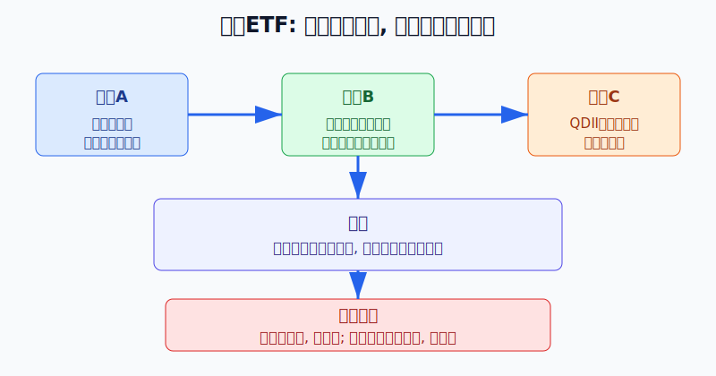
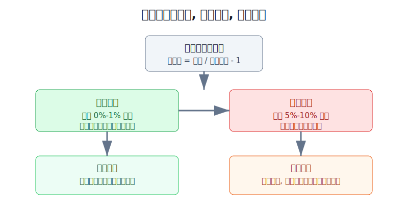
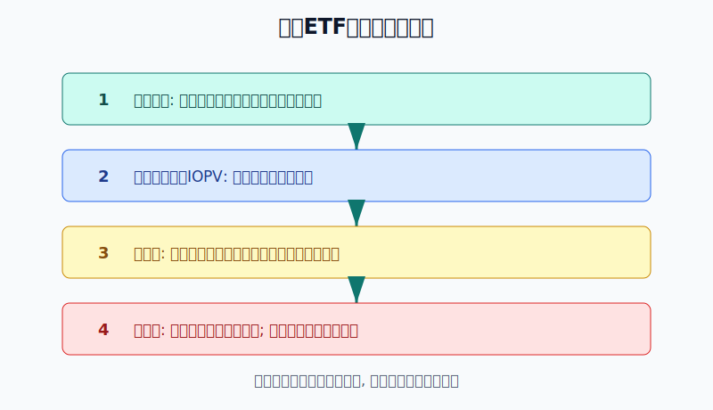

## 散户投资小白金融全品种操盘手册 - 12.6 跨境ETF - 方便，但要警惕高溢价
  
### 作者  
digoal  
  
### 日期  
2026-06-07   
  
### 标签  
金融产品 , 金融工具 , 散户 , 投资小白 , 全品操盘手册  
  
----  
  
## 背景 
  

> 适用读者: 已经知道 QDII 基金、港股通和境外账户的大致区别，想用证券账户买海外指数，但还分不清“涨了”和“买贵了”的小白投资者。  
> 本文定位: 投资教育框架，不构成个性化投资建议。

## 先问一个反直觉的问题

你买跨境ETF，本来是想省事: 不换汇、不开境外账户、场内一键下单。可最容易亏的钱，往往也藏在这个“省事”里。**海外指数没怎么跌，你买的跨境ETF也可能先亏一截，因为你买入时付了高溢价。**

## 核心概念: 跨境ETF有两个价格

跨境ETF，就是在境内交易所上市、跟踪海外市场指数或资产的 ETF。它的方便之处很明显: 你用 A 股证券账户，就能买到跟踪港股、美股、日本股市、海外债券或商品的基金份额。

但小白必须先记住一句话: **跨境ETF有两个价格，一个是“里面资产值多少钱”，一个是“别人愿意在场内用多少钱买”。**

第一个价格叫基金份额净值，或者盘中参考净值 IOPV。你可以把它理解成这只基金货架里真正装的货值多少钱。第二个价格是场内交易价格，也就是你下单买卖时看到的价格。它像菜市场的成交价，买的人多、货一时不够，成交价就可能被抬高。

溢价率的公式很简单:

> 溢价率 = 场内交易价格 / 基金份额参考净值 - 1

如果参考净值是 1.000 元，场内价格是 1.080 元，溢价率就是 8%。这意味着你花 1.08 元买了大约 1 元的海外资产。海外指数以后当然可能继续涨，但你已经先多付了 8 分钱。

本节行动结论先放在前面: **跨境ETF不是不能买，而是必须先看溢价。小白默认只在溢价很低、流动性正常、没有连续风险提示时买入；溢价超过 3% 先停手，超过 5% 默认不追，超过 10% 当作风险事件处理。**

## 逻辑推导链

【论证链标题】: 因为跨境ETF的场内市价由境内供求决定，而净值由海外资产决定，所以当供给受限、买盘拥挤时，高溢价会把“买海外资产”变成“高价接盘”。

── 第一步: 前提陈述

前提A: 跨境ETF的优点是交易方便。这是常量。你不需要自己换外币、不需要研究境外券商规则，就可以在境内交易时间下单，像买普通ETF一样买海外方向的资产。

前提B: 跨境ETF的净值跟着海外资产走，但场内交易价格由境内买卖双方撮合出来。这是常量。净值像商品的进货成本，场内价格像柜台售价；柜台售价可以短期高于进货成本。

前提C: 跨境ETF的供给不是无限的。这是变量。QDII额度、基金申购安排、申购赎回清单、海外市场休市、交易时差、做市和套利资金，都可能影响新份额供给和套利效率。供给跟不上买盘时，溢价就容易扩大。

前提D: 小白通常不能做跨境ETF的一二级市场套利。这是常量。套利需要资金、系统、申购赎回资格和对冲能力。普通散户看到的是“可以买”，但未必有能力把高溢价压回净值。

── 第二步: 逻辑推导

由A+B可得: 因为跨境ETF在场内交易，所以你买到的是“别人愿意卖给你的价格”，不是自动等于基金真实净值。方便不等于便宜。

由B+C可得: 因为净值由海外资产决定，场内价格由境内供求决定，所以当某个海外市场突然火热，而 QDII 额度、申购或套利供给跟不上时，场内价格会明显高于参考净值。

再由C+D可得: 因为普通散户很难亲自套利，所以不能把“高溢价迟早会被套利压回去”当成自己的赚钱机会。你能做的不是套利，而是避免在溢价最贵的时候买入。

最后由A+B+C+D可得: **跨境ETF的正确使用方式，是把它当成全球配置工具，而不是把它当成追热点按钮。下单前先看溢价率、成交额、公告和仓位；高溢价时等待，比追买更重要。**

── 第三步: 正常情景下的操作结论

✅ 正常情景: 这只跨境ETF跟踪的指数清楚，成交额足够，买卖价差不大，基金没有连续发布溢价风险提示，溢价率在 0%-1% 附近。

对应操作: 可以按全球配置计划分批买入或定投，但单一跨境ETF仍然不应替代整个海外配置；第一次买入先用计划仓位的 1/3 到 1/2。

── 第四步: 数据和案例证实

证据1: 交易所规则说明了 ETF 为什么会有净值参考和套利机制。上海证券交易所《交易型开放式指数基金业务实施细则》规定，交易型开放式指数基金可以申购、赎回并在交易所上市交易；上交所投资者教育文章也解释，IOPV 是根据申购赎回清单和成分资产盘中价格计算的动态净值参考，折溢价套利的目标就是让交易价格向净值靠拢。这对应前提B和D: ETF有净值锚，但普通散户不等于能套利。

证据2: QDII额度确实是跨境产品供给的重要边界。国家外汇管理局公布的 QDII 投资额度审批情况表显示，截至 2026 年5月末，QDII 累计批准额度总计 1761.69 亿美元，其中证券基金类合计 972.80 亿美元。这对应前提C: 跨境产品不是想无限扩就无限扩，额度和产品申购安排会影响场内供给。

证据3: 高溢价会触发基金公司反复提示风险甚至停牌。华夏基金在上海证券交易所披露的公告显示，华夏野村日经225 ETF（513520）在 2024年1月23日因二级市场价格明显高于基金份额参考净值，开市起至当日 10:30 停牌；同一只产品在 2026年6月5日仍发布二级市场交易价格溢价风险提示，提示如果溢价幅度未有效回落，有权申请盘中临时停牌、延长停牌时间等措施。这对应前提B和C: 高溢价不是理论风险，而是会进入公告和交易安排的现实风险。

证据4: 2024年跨境ETF热潮中，日经方向产品出现过集中高溢价。21世纪经济报道在 2024年1月22日报道，截至当日中午收盘，日经ETF（513520）、日经ETF（159866）、日经225ETF易方达（513000）溢价率分别约为 9.4%、6.2% 和 5.2%。这对应本节结论: 当海外市场成为热点时，场内买盘可能先把价格推到净值上方。

历史不代表未来。上面数据仍有参考价值，是因为它验证的是结构规律: 跨境ETF的价格由“海外资产净值”和“境内场内供求”两股力量共同决定。当供给慢、买盘急、套利不顺时，溢价会扩大；当情绪退潮或供给恢复时，价格会向净值回落。

── 第五步: 前提变化时的替代结论

若前提C变化，也就是基金暂停申购、限购、额度紧张或连续风险提示，推导路径变为: 因为新增供给受限，场内买盘更容易把价格推高，所以溢价不再只是小摩擦，而是主要风险。新结论: 不追买，等公告恢复正常或换成低溢价同类工具。

若前提B变化，也就是海外市场休市、参考净值更新滞后、汇率剧烈波动，推导路径变为: 因为你看到的参考价格可能不能完整反映最新海外资产和汇率变化，所以不能只看分时涨跌。新结论: 降低单次买入金额，等海外市场开盘后再判断。

若前提A变化，也就是你这笔钱不是长期全球配置资金，而是短期要用的钱，推导路径变为: 因为跨境ETF叠加海外资产波动、汇率波动和折溢价波动，所以短期资金不适合承担这种三层波动。新结论: 不买跨境ETF，转回现金管理或短债类工具。

失败案例: 在高溢价时买入日经、纳指等热门跨境ETF，哪怕标的指数没有马上大跌，只要场内溢价从 8% 回落到 1%，买入者就会先承受约 7% 的估值回归损失。这个亏损不是看错海外市场，而是下单前没有区分“资产上涨”和“价格买贵”。

## 实操例子: 想买纳指或日经ETF，怎么下单

这个例子对应论证链的正常结论: **先看溢价率和公告，再决定买不买；跨境ETF是配置工具，不是追热点工具。**

假设小林有 20 万元长期投资资金，已经有 A 股宽基ETF、现金管理和债券基金。他想拿 2 万元做海外权益补充，看中一只跟踪海外指数的跨境ETF。

第一步，确认它买的是什么。小林先看基金名称、跟踪指数、基金公告和持仓说明，确认它是跟踪纳斯达克100、标普500、日经225、恒生科技，还是其他指数。这个动作对应前提B: 先知道净值由什么资产决定。

第二步，计算溢价。假设软件显示参考净值约 1.000 元，场内成交价 1.015 元，溢价约 1.5%。这个溢价不算便宜，但还没有进入明显异常区间。小林不一次买满 2 万元，而是先买 8000 元，后面再按计划分批。

第三步，看公告。如果基金最近连续发布“二级市场交易价格溢价风险提示公告”，或者公告说可能申请盘中临时停牌，小林直接停止买入。这个动作对应前提C: 供给和套利可能不顺，市价不一定贴近净值。

第四步，设置三档动作。溢价 0%-1% 附近，可以按计划买；溢价 1%-3%，只买计划金额的一部分；溢价超过 3%，暂停新买；溢价超过 5%，默认不追；溢价超过 10%，把它当成风险事件，而不是机会。

第五步，处理情景切换。如果小林已经买了 8000 元，第二天发现溢价从 1.5% 扩到 6%，他不加仓；如果标的指数继续上涨，但溢价也继续扩大，他也不追。只有等溢价回到合理区间，或者找到同类低溢价工具，才继续完成剩余买入计划。

如果操作错误，后果很直接。假设小林在 8% 溢价时买满 2 万元，几天后标的指数不涨不跌，但 ETF 溢价回到 1%，他的持仓会因为溢价回落损失约 7%，大约 1400 元。这不是全球配置的正常波动，而是买入纪律的问题。

## 可复用框架

【三价下单】

适用前提: 你准备买入跨境ETF，但还没有判断是否买贵。

核心逻辑: 因为跨境ETF有净值、场内价格和汇率三层变量，所以先算价格偏离，再下单。

操作步骤:

1. 看净值: 找基金份额净值或盘中参考净值 IOPV。
2. 看市价: 用场内交易价格计算溢价率。
3. 看汇率: 确认你买的是人民币计价工具，但底层资产可能受外币波动影响。

前提失效时: 如果海外市场休市、IOPV参考意义下降、汇率大幅波动或公告提示高溢价，暂停追买。

举一反三: 这个框架也适用于港股ETF、QDII-LOF、商品ETF和其他可能出现折溢价的场内基金。

【溢价红绿灯】

适用前提: 你知道自己想买哪只跨境ETF，但不知道今天能不能买。

核心逻辑: 因为高溢价会让你先买贵，所以用固定阈值把情绪拦在下单按钮前。

操作步骤:

1. 绿灯: 溢价 0%-1% 附近，成交正常，可按计划买入。
2. 黄灯: 溢价 1%-3%，只买部分仓位，继续观察公告。
3. 红灯: 溢价超过 3%，暂停新买；超过 5%，默认不追；超过 10%，视为风险事件。

前提失效时: 如果该产品长期低流动性、买卖价差大、频繁风险提示，就算溢价短期回落，也要降低仓位或换工具。

举一反三: 这个框架也能用在主题ETF、商品基金、封闭式基金和 REITs 的场内交易上。

## 本节行动清单

| 动作 | 合格标准 |
|---|---|
| 看标的 | 知道 ETF 跟踪哪个海外指数或资产 |
| 算溢价 | 用场内价格和参考净值算出溢价率 |
| 查公告 | 看是否有风险提示、限购、暂停申购或临时停牌 |
| 看流动性 | 成交额够、买卖价差不大、盘口不薄 |
| 分批买 | 第一次只买计划仓位的一部分 |
| 高溢价停手 | 超过 3% 暂停新买，超过 5% 默认不追 |
| 写入复盘 | 记录买入时的溢价率，而不只记录涨跌幅 |

## 一句话总结

跨境ETF的价值是让小白方便参与全球配置，但方便不等于随时值得买；先看溢价，再下单，才能避免把全球配置做成高价接盘。

## 参考资料

- 上海证券交易所: 《上海证券交易所交易型开放式指数基金业务实施细则》，2020年第二次修订，https://www.sse.com.cn/lawandrules/sselawsrules2025/fund/trading/c/c_20250606_10781071.shtml
- 上海证券交易所 ETF 投资者教育: 《ETF瞬时套利策略》，说明 IOPV、折溢价套利和申购赎回单位，https://etf.sse.com.cn/fund/learning/strategy/c/5704303.shtml
- 国家外汇管理局广东省分局: 《合格境内机构投资者（QDII）投资额度审批情况表（截至2026年5月31日）》，2026年6月3日，https://www.safe.gov.cn/guangdong/2026/0601/3230.html
- 华夏基金管理有限公司: 《华夏野村日经225交易型开放式指数证券投资基金（QDII）二级市场交易价格溢价风险提示及临时停牌公告》，2024年1月23日，https://www.sse.com.cn/disclosure/fund/announcement/c/new/2024-01-23/513520_20240123_LTAG.pdf
- 华夏基金管理有限公司: 《华夏野村日经225交易型开放式指数证券投资基金（QDII）二级市场交易价格溢价风险提示公告》，2026年6月5日，https://www.sse.com.cn/disclosure/fund/announcement/c/new/2026-06-05/513520_20260605_5ORT.pdf
- 21世纪经济报道: 《日经ETF第八次提示溢价风险 超160QDII“闭门限客”》，2024年1月22日，https://m.21jingji.com/article/20240122/herald/50a26d33f290c6eba0c97b040ca4645b_zaker.html

> ⚠️ **声明**：本文内容为投资教育目的，所有历史数据、策略框架均为辅助学习工具，不构成证券投资建议。市场有风险，投资需谨慎。实际操作请结合自身风险承受能力，必要时咨询专业投顾。
  
#### [PostgreSQL 解决方案集合](../201706/20170601_02.md "40cff096e9ed7122c512b35d8561d9c8")
  
  
#### [德哥 / digoal's Github - 公益是一辈子的事.](https://github.com/digoal/blog/blob/master/README.md "22709685feb7cab07d30f30387f0a9ae")
  
  
#### [About 德哥](https://github.com/digoal/blog/blob/master/me/readme.md "a37735981e7704886ffd590565582dd0")
  
  

  
