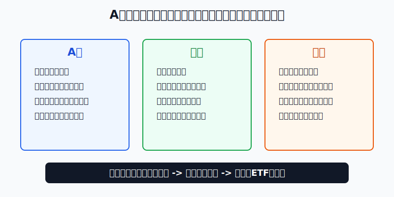
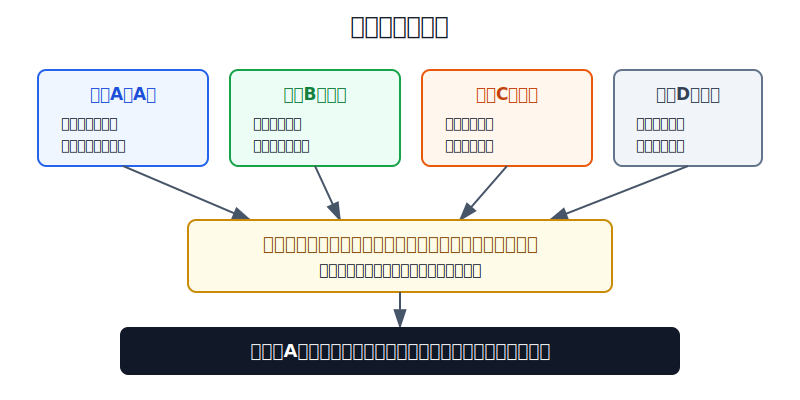
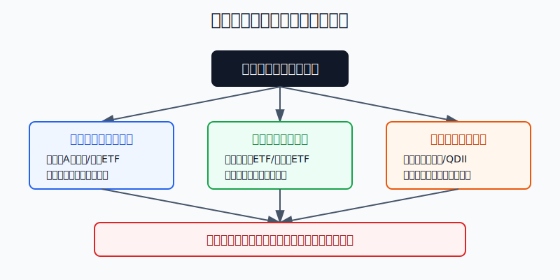

## 散户投资小白金融全品种操盘手册 - 12.7 A股、港股、美股的市场风格差异
  
### 作者  
digoal  
  
### 日期  
2026-06-07   
  
### 标签  
金融产品 , 金融工具 , 散户 , 投资小白 , 全品操盘手册  
  
----  
  
## 背景 
  

> 适用读者: 已经知道港股通、QDII、跨境ETF和美股参与路径，但还分不清“同样买股票，为什么A股、港股、美股的涨跌逻辑完全不一样”的小白投资者。  
> 本文定位: 投资教育框架，不构成个性化投资建议。

## 先问一个反直觉的问题

同一家公司，A股、港股、美股投资者给出的价格可以差很多。这不是谁更聪明，而是三个市场在买的“风险包”不同。**小白做全球配置，第一步不是猜哪个市场会涨，而是先弄清自己到底在买人民币周期、离岸中国资产，还是美元全球核心资产。**

## 核心概念: 市场风格就是资金给风险定价的习惯

市场风格，不是简单说“A股爱炒题材、港股便宜、美股公司好”。这种说法太粗，会误导操作。更准确的理解是: **上市公司结构、投资者结构、货币环境和监管规则共同决定了一个市场怎么涨、怎么跌、怎么给公司估值。**

A股是人民币在岸市场。很多公司的收入、利润、政策环境和资金成本都跟中国国内经济周期绑定，所以它对国内产业政策、流动性、主题轮动和风险偏好更敏感。

港股是离岸中国资产市场。大量公司业务在内地，但交易、结算、估值和国际资金视角在香港。它既受中国基本面影响，也受美元利率、全球资金风险偏好和南向资金影响，所以经常出现“基本面没那么差，但估值压得很低”的阶段。

美股是美元全球核心权益市场。它不只是美国本土市场，还装着大量全球化龙头、科技平台、消费品牌、医药和金融公司。买美股宽基，本质是在买美元体系下全球盈利能力最强的一批上市公司，同时也承担美元汇率、科技集中度和高估值回撤风险。

本节行动结论先放前面: **A股用于表达国内产业周期和人民币资产暴露，港股用于补充离岸中国资产和估值修复暴露，美股用于承担全球核心权益暴露。不要把三个市场混成一个“股票池”，更不要因为哪个市场短期涨得快，就把它当成全部资产配置。**

## 逻辑推导链

【论证链标题】: 因为A股、港股、美股的上市公司结构、资金结构和货币环境不同，所以同样是股票投资，也必须按不同市场角色配置，而不能用同一套买卖规则。

── 第一步: 前提陈述

前提A: A股是人民币在岸权益市场。这是常量。它像本地菜市场，交易规则、资金来源、政策预期和公司经营环境都更贴近中国国内经济。中国上市公司协会2026年5月发布的境内股票市场上市公司2025年经营业绩报告显示，截至2026年4月30日，境内市场5516家公司披露2025年年报，全年实现营业收入73.01万亿元、净利润5.40万亿元。这个体量说明A股不是少数概念股的舞台，而是国内实体经济和金融体系的股权切片。

前提B: 港股是离岸中国资产市场。这是常量。它像一个国际中转港，货物很多来自中国内地，但买家、报价方式和风险偏好来自全球。HKEX 2025年年度市场统计显示，香港证券市场截至2025年12月31日总市值47.39万亿港元，上市公司2686家，全年平均每日成交额2498亿港元，同比上升89.5%。这说明港股不是没有流动性，而是流动性更容易集中到少数龙头、ETF和阶段性主题上。

前提C: 美股是美元全球核心权益市场。这是常量。标普500由500家美国大型上市公司组成，通常被用作美国大盘股代表，覆盖美国可投资市值的大部分。它像全球资金的主干高速路，长期由盈利能力、科技创新、回购分红、美元利率和全球风险偏好共同驱动。

前提D: 小白最容易犯的错误，是把三个市场当成同一种东西。这是变量，但必须按高概率风险处理。比如用A股短线题材思维去买美股宽基，会频繁追涨杀跌；用美股长期核心仓思维去重仓港股单一互联网股，会低估政策和流动性折价；用“港股便宜”去买低流动性小票，会把估值陷阱当成价值投资。

── 第二步: 逻辑推导

由A可得: 因为A股更贴近国内政策、产业周期和人民币流动性，所以它适合表达“我看好中国某个产业阶段、某类风格修复、某个宽基估值回归”的判断。对应工具优先是A股宽基ETF、行业ETF或少量熟悉的个股，而不是把全部全球仓位押在一个国内主题上。

由B可得: 因为港股公司业务多在中国、估值却由离岸资金共同定价，所以港股经常比A股更便宜，也更容易受美元利率、外资风险偏好和南向资金影响。对应操作不是看到便宜就重仓，而是把港股当成“离岸中国资产补充仓”，用ETF或龙头组合承接估值修复，而不是押低流动性个股翻身。

由C可得: 因为美股宽基代表的是美元体系下全球龙头盈利能力，所以它更适合做全球权益核心仓。但“核心仓”不等于“永远不会跌”。当美元利率上行、科技龙头估值过高、指数集中度升高时，美股宽基也会出现明显回撤。

再由A+B+C+D可得: 因为三个市场买到的是三种不同风险暴露，所以小白的正常顺序应该是: **先确定资金目标，再确定市场角色，再选择工具，最后才看买入价格。**

── 第三步: 正常情景下的操作结论

✅ 正常情景: 你已经留足生活备用金，这笔投资资金三年以上不用；你希望做全球配置，但还不能稳定研究跨市场财报、汇率和政策差异。

对应操作: A股作为人民币资产和国内产业周期的主要表达；美股宽基或QDII作为全球核心权益仓；港股作为中国离岸资产、互联网平台、高股息或估值修复的补充仓。小白优先使用宽基ETF、港股通ETF、QDII基金和跨境ETF，少用单只个股来承担市场判断。

── 第四步: 数据和案例证实

证据1: A股承载的是国内实体经济股权切片。中国上市公司协会报告显示，2025年境内上市公司合计营收73.01万亿元、净利润5.40万亿元，现金流状况也延续改善。这个数据对应前提A: A股不是单纯的交易市场，它背后是国内产业、金融、消费、制造和科技公司的经营结果。小白看A股，不能只看题材热度，也要看国内经济和行业利润周期。

证据2: 港股的流动性和估值弹性来自离岸定价。HKEX 2025年年度市场统计显示，香港市场全年平均每日成交额2498亿港元，同比增长89.5%；总市值47.39万亿港元，同比增长34.2%。恒生指数公司2026年2月季度检讨还把宁德时代、洛阳钼业、老铺黄金纳入恒生指数，成分股数量从88只增加到90只。这对应前提B: 港股不只是传统金融地产市场，越来越多中国新经济、制造和消费龙头通过香港接受全球资金定价。

证据3: 美股宽基是全球核心权益的重要代表。S&P Dow Jones Indices 对标普500的定位，是衡量美国大盘股表现的核心指数；State Street 关于SPY的资料也把它描述为通过一笔交易获得500家美国大型上市公司敞口的高流动性工具。这对应前提C: 美股宽基适合做核心，不是因为它每年都涨，而是因为它覆盖了全球资金最关注的一批美元资产。

失败案例: 2021年至2022年的中概互联网和港股科技回撤，是“把便宜当安全”的反例。很多投资者看到港股互联网公司估值低于美股科技龙头，就认为下跌空间有限，但当监管预期、美元利率、外资风险偏好和公司盈利预期同时转弱时，低估值还能继续变得更低。这个案例说明: **港股便宜只是一个条件，不是完整买入理由；离岸流动性和政策预期没有改善时，便宜可能变成价值陷阱。**

历史不代表未来。上面数据仍有参考价值，是因为它们验证的是结构规律: A股更贴近国内经济和政策周期，港股是离岸资金定价中国资产，美股宽基是美元全球核心资产。结构不等于涨跌预测，但能帮助小白避免把三个市场用错位置。

── 第五步: 前提变化时的替代结论

若前提A变化，也就是A股主题过热、成交极度拥挤、估值已经明显透支，推导路径变为: 因为国内产业周期仍在，但价格已经提前反映过多乐观预期，所以继续追高会把周期判断变成情绪交易。新结论: A股仓位从进攻转为观察，优先降高估行业ETF和主题仓。

若前提B变化，也就是港股成交萎缩、南向资金降温、美元利率压力重新上升，推导路径变为: 因为离岸估值修复的资金条件变弱，所以“便宜”不再足够。新结论: 港股仓位不加码，保留宽基或龙头ETF，避开低流动性个股。

若前提C变化，也就是美股科技龙头估值过高、指数集中度过强、美元汇率对人民币投资者不利，推导路径变为: 因为核心仓的价格安全边际下降，所以不能把长期配置做成一次性追高。新结论: 美股核心仓用分批、定投和再平衡进入，不用满仓押一个时点。

若前提D变化，也就是这笔钱一年内要买房、还债、交学费或做生意周转，推导路径变为: 因为资金用途从长期配置变成确定支出，所以三个股票市场都不适合当主要承载工具。新结论: 先放现金管理、货币基金或短债，全球配置暂停。

## 实操例子: 10万元怎么分清三种市场角色

这个例子对应论证链的正常结论: **先确定资金目标，再确定市场角色，再选择工具，最后才看买入价格。**

假设小林有10万元长期投资资金，生活备用金已经留好，三年以上不用。他的目标不是短线翻倍，而是慢慢建立全球配置。小林不懂跨市场个股财报，也没有能力判断每家公司在A股、港股、美股的估值差异。

第一步，先写资金目标。小林把10万元定义为长期权益和防守资产组合，不用来做短线热点。这个动作对应前提D: 先防止自己把全球配置做成追涨杀跌。

第二步，给三个市场定角色。A股负责人民币资产和国内产业周期，比如沪深300、中证A500、创业板或行业ETF；美股负责全球核心权益，比如标普500、美国全市场或纳斯达克100相关QDII，但纳斯达克100要按成长风格控制上限；港股负责离岸中国资产补充，比如恒生指数、恒生科技、港股高股息或港股通ETF。

第三步，设一个小白版本比例。小林可以先用“50%人民币核心资产 + 30%美股核心资产 + 10%港股补充 + 10%现金/短债/黄金防守”作为学习模板。这里不是推荐比例，而是演示角色分工: A股不是全部，美股不是神药，港股不是因为便宜就重仓。

第四步，选择工具顺序。A股先选宽基ETF，再考虑行业ETF；港股先选流动性好的港股通ETF或恒生类ETF，再考虑个股；美股先通过合规QDII或跨境ETF建立宽基暴露，再研究行业或个股。每个市场下单前都写一句话: “我买的是哪种风险暴露？”写不出来，就不买。

第五步，设情景切换。若A股主题仓涨到组合20%以上，先减回目标比例；若港股因为估值修复上涨，港股补充仓超过15%，把超出部分转回核心仓；若美股在高估值阶段快速上涨，不追到满仓，只用定投和再平衡慢慢补。若人民币急用钱的概率提高，所有股票仓都先降，防守仓提高。

如果操作错误，后果很具体。小林如果把10万元全部买港股科技ETF，理由只是“港股便宜”，一旦离岸流动性转弱，账户可能承受远高于自己预期的回撤；如果全部买纳斯达克100，理由只是“美股长期强”，一旦科技估值回落和人民币汇率反向波动叠加，他会同时承受股价和汇率压力。纠偏动作不是预测底部，而是回到三问: 这笔钱买的是什么风险？这个市场在组合里是什么角色？仓位有没有超过角色上限？

## 可复用框架

【三市三问】

适用前提: 你准备在A股、港股、美股之间做选择，但不知道该买哪个市场。

核心逻辑: 因为三个市场的定价规则不同，所以先问风险暴露，再问市场角色，最后问工具。

操作步骤:

1. 问风险: 我买的是人民币产业周期、离岸中国资产，还是美元全球核心权益？
2. 问角色: 它是核心仓、补充仓、进攻仓，还是观察仓？
3. 问工具: 用宽基ETF、行业ETF、QDII、港股通ETF，还是少量个股？

前提失效时: 如果资金一年内要用，不做股票市场选择；如果市场角色说不清，不下单；如果仓位超过角色上限，先再平衡。

举一反三: 这个框架也能用在A股内部风格、港股行业ETF、美股行业ETF和中概股选择上。

【角色优先】

适用前提: 你已经有几个候选市场或产品，但容易被短期涨幅影响。

核心逻辑: 因为涨幅只能说明过去，角色才能决定仓位，所以先定角色，再看价格。

操作步骤:

1. 核心仓只放覆盖面广、流动性好、规则清楚的工具。
2. 补充仓用来表达估值修复、行业周期或区域配置，不替代核心。
3. 进攻仓必须有上限，涨得越快越要检查是否失控。

前提失效时: 如果核心仓变成单一行业或单一主题，先降集中度；如果补充仓涨成主仓，先转回核心；如果进攻仓亏损但逻辑失效，不补仓。

举一反三: 这个框架适用于第十二章后面的全球组合搭建，也适用于A股、港股、美股之间的年度再平衡。

## 本节行动清单

| 动作 | 合格标准 |
|---|---|
| 写清市场角色 | A股、港股、美股分别承担什么风险，一句话说清 |
| 先用ETF学习 | 不懂跨市场财报前，优先用宽基ETF、港股通ETF、QDII |
| 不把便宜当安全 | 港股低估值必须配合流动性、政策预期和盈利改善 |
| 不把长期当满仓 | 美股核心仓也要分批、定投和再平衡 |
| 检查汇率风险 | 买海外资产同时承担人民币和外币的汇率波动 |
| 设补充仓上限 | 港股、行业、主题资产不因上涨自动变核心仓 |
| 短期钱不入场 | 一年内要用的钱，不拿来试全球配置 |

## 一句话总结

A股、港股、美股不是谁替代谁，而是各自买不同的风险: A股买人民币国内周期，港股买离岸中国资产重估，美股买美元全球核心权益；小白先定角色和仓位，再选工具，才不会把全球配置做成跨市场追热点。

## 参考资料

- 中国上市公司协会: 境内股票市场上市公司2025年经营业绩报告，2026年5月，https://www.capco.org.cn/pub/zgssgsxh/sjfb/dytj/202605/20260506/j_2026050614431000017780499108508188.html
- HKEX: Market Statistics 2025，数据截至2025年12月31日，https://www.hkex.com.hk/-/media/HKEX-Market/Market-Data/Statistics/Consolidated-Reports/Annual-Market-Statistics/2025FY-Annual-Market-Stat_Eng.pdf
- HKEX: What Drove Hong Kong's Markets in 2025?，2026年，https://www.hkexgroup.com/Media-Centre/Insight/Insight/2026/HKEX-Insight/What-Drove-Hong-Kong-Markets-in-2025?sc_lang=en
- Hang Seng Indexes Company: Hang Seng Indexes Company Announces Index Review Results，2026年2月13日，https://www.hsi.com.hk/static/uploads/contents/en/news/pressRelease/20260213T174500.pdf
- S&P Dow Jones Indices: S&P 500 Index，2026年访问，https://www.spglobal.com/spdji/en/indices/equity/sp-500/
- State Street SPDR: SPY - The original S&P 500 ETF，2026年访问，https://www.ssga.com/us/en/intermediary/capabilities/spdr-core-equity-etfs/spy-sp-500

> ⚠️ **声明**：本文内容为投资教育目的，所有历史数据、策略框架均为辅助学习工具，不构成证券投资建议。市场有风险，投资需谨慎。实际操作请结合自身风险承受能力，必要时咨询专业投顾。
  
#### [PostgreSQL 解决方案集合](../201706/20170601_02.md "40cff096e9ed7122c512b35d8561d9c8")
  
  
#### [德哥 / digoal's Github - 公益是一辈子的事.](https://github.com/digoal/blog/blob/master/README.md "22709685feb7cab07d30f30387f0a9ae")
  
  
#### [About 德哥](https://github.com/digoal/blog/blob/master/me/readme.md "a37735981e7704886ffd590565582dd0")
  
  

  
