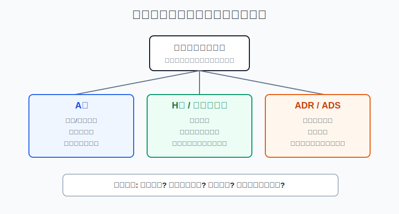
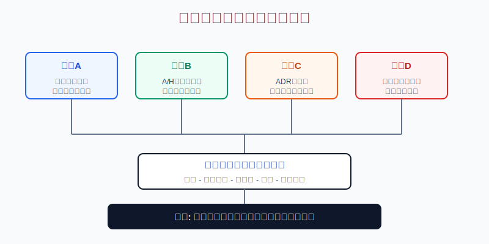
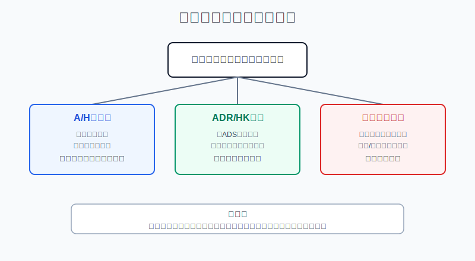

## 散户投资小白金融全品种操盘手册 - 12.8 AH股、ADR、中概股之间的关系
  
### 作者  
digoal  
  
### 日期  
2026-06-07   
  
### 标签  
金融产品 , 金融工具 , 散户 , 投资小白 , 全品操盘手册  
  
----  
  
## 背景 
  

> 适用读者: 已经知道港股通、QDII、跨境ETF和美股账户这些入口，但看到同一家公司有A股、H股、港股代码、ADR代码时容易混乱的小白投资者。  
> 本文定位: 投资教育框架，不构成个性化投资建议。规则口径按 2026-06-06 可核查公开资料整理。

## 先问一个反直觉的问题

同一家公司，有时会同时出现A股代码、港股代码、美国ADR代码。是不是买了三个代码，就等于分散买了三家公司？

不是。很多时候，你只是用不同币种、不同交易所、不同规则，买到了同一家公司的不同入口。真正的风险不在代码名字，而在四件事: **公司是不是同一个，股份类别是不是同一个，两个市场能不能转换，价格差有没有被汇率和费用吃掉。**

## 核心概念: 先分清“公司、股份、凭证、标签”

这节要把四个词拆开。

**AH股**，指同一家公司既有A股，也有H股。A股通常在上海或深圳交易，人民币报价；H股在香港交易，通常港元报价。港交所对H股公司的基础解释是: 在中国内地注册、并在香港上市的公司。小白可以把AH股理解成“同一个企业，开了两个售票窗口”。窗口不同，来买票的人不同，票价就不会自动一样。

**ADR/ADS**，是美国市场常见的外国公司交易工具。Investor.gov 的解释是: 多数在美国市场交易的外国公司股票以ADR形式交易，每份ADR代表一股或多股外国股票，或一股的一部分。这里最重要的是“比例”。例如阿里巴巴投资者关系资料显示，NYSE 的 BABA 是ADS，每份ADS代表8股阿里巴巴普通股；阿里巴巴也在港交所以9988港元柜台和89988人民币柜台交易。

**中概股**不是一种股份类别。它更像一个风险标签: 公司主要经营、用户、供应链、监管环境或管理团队与中国有关，但交易地点可能在美国、香港或其他市场。中概股可以是ADR，也可以是港股普通股，还可能是境外控股公司通过VIE结构持有经济利益的安排。第十一章已经讲过ADR和VIE风险，这一节只补一件事: 不要把“中概”当成具体证券结构。

所以本节的行动结论是: **看到AH股、ADR、中概股，先不要问哪个更便宜，先画一张映射表: 经营实体是谁，上市主体是谁，股份类别是什么，交易币种是什么，是否能互相转换。映射表画不出来，不下单。**

## 逻辑推导链

【论证链标题】: 因为AH股、ADR和中概股分别对应股份类别、存托凭证和风险标签，所以散户必须先做“实体映射”，再比较估值和入口成本。

### 第一步: 前提陈述

前提A: 交易代码不同，不等于公司不同。这是常量。就像同一个人在内地身份证、护照、港澳通行证上号码不同，但人还是同一个人。股票代码只告诉你在哪个市场交易，不自动告诉你底层权益是不是不同。

前提B: A股和H股通常是同一家公司在不同市场发行的不同股份类别，不能被普通散户自由一键互换。这是常量加变量。常量是市场、币种、投资者结构不同；变量是互联互通范围、资金流向和估值情绪会变化。

前提C: ADR/ADS是存托凭证，核心是“对应多少股底层股份”。这是常量。它像一张兑换券，券面在美国用美元交易，但背后对应的外国股份比例必须查清楚。比例查错，价格比较必错。

前提D: 中概股是风险标签，不是交易结构。这是常量。它提醒你关注中国经营风险、监管风险、审计和退市路径，但不能直接告诉你买的是A股、H股、港股普通股还是ADR。

### 第二步: 逻辑推导

由A+B可得: 因为同一家公司在A股和H股的投资者群体、交易货币、交易制度不同，所以A/H价差不是“看见就能捡的钱”。小白如果只看到H股便宜，或者只看到A股更活跃，就直接下注价差收敛，是把市场结构当成短期套利机会。

由A+C可得: 因为ADR有固定或可查询的存托比例，所以ADR和港股普通股比较时，必须先把币种和比例折算到同一把尺子上。例如每份ADS代表8股普通股时，不能拿1份ADS价格直接和1股港股价格比较。

再由A+B+C+D可得: 因为“同一家公司”“同一股份类别”“同一交易入口”是三件不同的事，所以全球配置里的第一步不是找最低价，而是画清关系。关系清楚以后，才比较估值、流动性、税费、换汇成本、账户规则和最坏情况下的退出路径。

最后结论是: **AH股按“两个市场、两个投资者群体”处理；ADR和可转换港股按“同一底层股份、不同入口”处理；中概股按“经营和监管风险标签”处理。三者不能混着用。**

### 第三步: 正常情景下的操作结论

✅ 正常情景: 你能查到公司年报、上市地、股份类别、ADR比例、港股是否双重主要上市或主要上市、是否能进入港股通或美股交易，且账户资金是三年以上不用的钱。

对应操作: 先做一张五列表: 公司名称、买入代码、股份类别、交易币种、转换或退出路径。然后只选择一个最适合自己账户和风险承受能力的入口。对同一底层股份，不要因为“NYSE一个、HKEX一个”就同时买两份当作分散配置；对A/H股，不要因为价差存在就做小白套利。

### 第四步: 数据和案例证实

证据1: 港交所说明，H股公司是在中国内地注册并在香港上市的公司。这个证据验证前提B: H股不是“美国ADR”，也不是“A股换个名字”，它是香港市场里的中国内地注册公司股份。

证据2: 恒生指数公司对恒生沪深港通AH股溢价指数的说明是，该指数衡量同时有A股和H股上市的中国内地公司中，A股相对H股的绝对溢价或折价；指数大于100表示A股相对H股平均溢价。2026年4月事实表显示该指数为120.55。这验证了一个关键事实: AH股价差真实存在，而且截至该时点A股平均比H股贵约20.55%。历史不代表未来，但它说明价差不是一眼就能消除的免费套利。

证据3: Investor.gov 对ADR的定义说明，每份ADR代表一股或多股外国股票，或者一股的一部分，ADR价格通常对应外国股票本土市场价格并按比例调整。这个证据验证前提C: ADR比较价格时必须看比例和汇率。

证据4: 阿里巴巴投资者信息页显示，BABA ADS在NYSE交易，每份ADS代表8股普通股；公司普通股在港交所9988港元柜台和89988人民币柜台交易，并于2024年8月28日转为香港双重主要上市。这个案例说明，BABA和9988不是两家不同公司，而是同一集团不同交易入口。买两边不等于分散公司风险，只是增加了交易地、币种和账户规则的差异。

证据5: USCC 2025年3月7日清单显示，NYSE、Nasdaq和NYSE American 三大美国交易所共有286家中国公司上市，总市值约1.1万亿美元。这个数据说明“中概股”不是小众概念，但它覆盖的是一组公司，不是一种统一的证券结构。

失败案例: 最常见的失败不是买错公司，而是把“价差”当成“确定收益”。假设一只A/H公司A股12元人民币，H股10港元，港元兑人民币按0.92估算，则H股折成人民币约9.2元，A股相对H股溢价约30.4%。小白看到这个差价后买H股、做空A股，想等价差归零。但普通散户通常无法低成本同时做多做空、跨市场借券、处理汇率、处理交易日差异和融资成本。若AH溢价继续扩大，他不仅没赚到“便宜”，还可能两边都被波动打穿。这个反例说明: **价差可以作为估值温度计，不能直接当套利按钮。**

### 第五步: 前提变化时的替代结论

若前提B改变，也就是A/H价差极端扩大或南向资金明显拥挤，推导路径变为: 因为价格差背后可能是流动性、情绪和资金限制，而不是公司基本面差异，所以不能用“同一家公司”推出“马上收敛”。新结论: 只把价差作为买入入口参考，不做杠杆套利；已有持仓检查自己买的是公司逻辑，还是价差逻辑。

若前提C改变，也就是ADR比例调整、存托费用提高、公司从美国退市或券商不支持ADR转换港股，推导路径变为: 因为同一底层股份的转换通道变差，所以美国入口的流动性和操作风险上升。新结论: 不新增ADR仓位；先确认港股备份、转换费用、税务和到账时间。

若前提D改变，也就是公司被贴上“中概股”标签后又涉及数据安全、审计检查、VIE披露或地缘政策变化，推导路径变为: 因为风险标签已经影响交易路径和估值折价，所以不能只按普通港股或普通美股处理。新结论: 仓位降级为卫星仓，先看监管和流动性，再看估值便宜。

## 实操例子: 看到BABA和9988，怎么判断自己该买哪一个

这个例子对应论证链的正常结论: **先做实体映射，再比较入口成本，不把重复代码当分散配置。**

假设小林有20万元长期投资资金，核心仓已经配置宽基ETF。他想小仓研究一家中国互联网公司，发现美股账户可以买BABA，港股账户可以买9988，行情软件还显示9988有港元柜台和89988人民币柜台。

第一步，确认底层关系。小林查公司投资者信息和年报，写下: BABA是NYSE交易的ADS，每份代表8股普通股；9988是港交所普通股港元柜台；89988是人民币柜台。判断依据是前提A和C: 先确认不是三家公司。

第二步，用同一把尺子比价格。演示公式是: ADS等价港股价格 = ADS美元价格 × 美元兑港元汇率 ÷ 8。反过来，港股折算ADS等价美元价格 = 港股价格 × 8 ÷ 美元兑港元汇率。小林不用这个公式预测涨跌，只用它防止把1份ADS和1股港股直接比较。

第三步，比较入口成本。若小林的长期资金主要是人民币，已经有港股通权限，但港股通买不到某些股票或交易限制不适合，他不能硬买；若他已有合规美股账户，但不熟悉ADR费用和退市转换，他也不能只因为美股成交方便就买。判断依据是前提C和D: 同一底层股份也有不同账户责任。

第四步，只选一个入口。若港股流动性好、汇率换算后价格接近、美股账户没有明显优势，小林选择港股入口；若他本来就用美元资产做配置，且能接受ADR规则，他选择BABA。无论哪边，单只中概个股只占总资产2%以内；同一家公司不同时买BABA和9988来假装分散。

第五步，写前提失效后的调整。若美国ADR退市风险上升，先查是否能转换港股和券商费用；若香港流动性明显转弱，检查买卖价差；若中国监管变量影响核心业务，先降仓位再重估。操作错误的后果是: 价格没比清，重复持仓；风险没分散，仓位翻倍；最后公司一跌，两个代码一起跌。

## 可复用框架

【五格映射】

适用前提: 你看到同一家中国公司有A股、H股、港股、ADR或多个柜台代码。

核心逻辑: 因为代码只是入口，不是底层风险本身，所以先映射实体和股份，再讨论买卖。

操作步骤:

1. 写公司: 经营实体和上市主体分别是谁。
2. 写股份: A股、H股、普通股、ADS分别是什么。
3. 写市场: 上海、深圳、香港、纽约或纳斯达克。
4. 写币种: 人民币、港元、美元，以及汇率折算。
5. 写出口: 能否转换，能否卖出，费用和时间是多少。

前提失效时: 任意一格填不出来，不买；只能填公司名、填不出股份类别和转换路径，说明你还没看懂交易对象。

举一反三: 这个框架也适用于跨境ETF、QDII基金、美股双重上市公司和港股人民币柜台。

【价差三问】

适用前提: 你发现同一家公司在两个市场价格不同，想判断是不是机会。

核心逻辑: 因为价格差可能来自汇率、流动性、投资者结构和转换限制，所以先问差价来源，再问能否操作。

操作步骤:

1. 问汇率: 是否已经把港元、美元、人民币折到同一单位。
2. 问比例: ADR/ADS是否按正确股份比例折算。
3. 问转换: 这个差价是否能被你低成本、低风险地搬走。

前提失效时: 如果不能转换、不能做空、费用高、交易日不同，就把价差当观察指标，不把它当套利策略。

举一反三: 以后看到LOF折溢价、跨境ETF溢价、商品ETF溢价，也先问这三件事。

## 本节行动清单

| 动作 | 合格标准 |
|---|---|
| 先分清概念 | AH股是股份类别关系，ADR是存托凭证，中概股是风险标签 |
| 画五格映射 | 公司、股份、市场、币种、出口都能写清楚 |
| AH先算汇率 | A股和H股比较前，先把港元折成人民币 |
| ADR先看比例 | 每份ADS对应多少普通股，不能凭代码直觉比较 |
| 不做小白套利 | A/H价差和ADR/HK价差只能先当温度计 |
| 不重复持仓 | 同一底层股份不要买两边当作分散配置 |
| 仓位打折 | 中概个股只能做卫星仓，先看监管和退出路径 |

## 一句话总结

AH股、ADR、中概股不是三个平行答案: AH股讲的是同一公司不同市场股份，ADR讲的是美国存托凭证，中概股讲的是中国经营风险标签；小白先画清映射表，再决定用哪个入口买，而不是看到哪个代码熟就买哪个。

## 参考资料

- HKEX: Overview of the listed market, https://www.hkex.com.hk/Global/Exchange/FAQ/Getting-Started/Overview-of-the-listed-market
- Hang Seng Indexes: Hang Seng Stock Connect China AH Premium Index, https://www.hsi.com.hk/eng/indexes/all-indexes/ahpremium
- Hang Seng Indexes: Hang Seng Stock Connect China AH Premium Index Factsheet, April 2026, https://www.hsi.com.hk/static/uploads/contents/en/dl_centre/factsheets/ahpremiume.pdf
- Investor.gov: American Depositary Receipts (ADRs), https://www.investor.gov/introduction-investing/investing-basics/glossary/american-depositary-receipts-adrs
- Investor.gov: Investor Bulletin - American Depositary Receipts, 2012-08-17, https://www.investor.gov/introduction-investing/general-resources/news-alerts/alerts-bulletins/investor-bulletins-88
- Alibaba Group: FAQs - Investor Information, https://www.alibabagroup.com/en-US/faqs-investor-information
- Alibaba Group: Annual Report on Form 20-F for Fiscal Year 2025, https://www.sec.gov/Archives/edgar/data/1577552/000095017025090161/baba-20250331.htm
- HKEX: Stock Connect Explained, https://www.hkex.com.hk/Mutual-Market/Connect-Hub/Stock-Connect
- U.S.-China Economic and Security Review Commission: Chinese Companies Listed on Major U.S. Stock Exchanges, 2025-03-07, https://www.uscc.gov/research/chinese-companies-listed-major-us-stock-exchanges

> ⚠️ **声明**：本文内容为投资教育目的，所有历史数据、策略框架均为辅助学习工具，不构成证券投资建议。市场有风险，投资需谨慎。实际操作请结合自身风险承受能力，必要时咨询专业投顾。
  
#### [PostgreSQL 解决方案集合](../201706/20170601_02.md "40cff096e9ed7122c512b35d8561d9c8")
  
  
#### [德哥 / digoal's Github - 公益是一辈子的事.](https://github.com/digoal/blog/blob/master/README.md "22709685feb7cab07d30f30387f0a9ae")
  
  
#### [About 德哥](https://github.com/digoal/blog/blob/master/me/readme.md "a37735981e7704886ffd590565582dd0")
  
  

  
