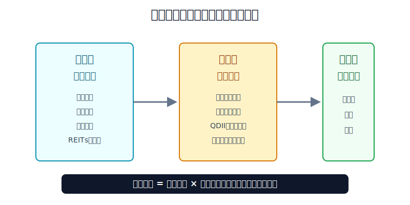
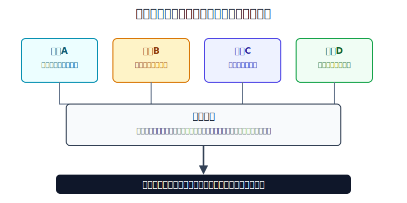
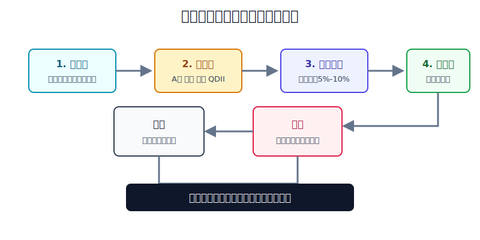

## 散户投资小白金融全品种操盘手册 - 12.9 汇率在全球配置中的作用
  
### 作者  
digoal  
  
### 日期  
2026-06-07   
  
### 标签  
金融产品 , 金融工具 , 散户 , 投资小白 , 全品操盘手册  
  
----  
  
## 背景 
  

> 适用读者: 已经知道A股、港股、美股、QDII都能放进组合，但还没有把“未来用什么钱”写进仓位计划的小白投资者。  
> 本文定位: 投资教育框架，不构成个性化投资建议。

## 先问一个反直觉的问题

全球配置最容易被误解的地方，不是你买了海外资产，而是你以为“分散到海外”就天然降低风险。**如果你未来所有支出都是人民币，但组合里越来越多资产靠美元、港币或其他外币定价，你其实多了一层看不见的波动。**

汇率不是用来猜的。对小白来说，汇率的第一作用不是帮你赚快钱，而是提醒你: 这笔钱未来在哪里花，就要先按那个币种管理风险。

## 核心概念: 全球配置有三层账

第一层是**资产账**。A股涨跌、港股分红、美股指数回报、黄金价格、债券利息，都属于资产本身的表现。

第二层是**计价货币账**。港股多数以港币报价，美股以美元报价，很多QDII基金虽然你用人民币买，但底层可能是美元资产、港币资产或多币种资产。你下单界面显示人民币，不代表底层没有汇率。

第三层是**用钱币种账**。如果你的工资、房贷、孩子教育、养老和日常消费都在人民币体系里，你最后关心的是人民币购买力。如果你未来要去美国留学、用美元支付学费，美元资产反而可能降低一部分币种错配。

所以本节的行动结论很直接: **全球配置之前，先写清未来用钱币种；持仓之后，把收益拆成“资产本身 + 汇率变化”；年度复盘时用再平衡管理币种敞口，不把汇率预测当作加仓理由。**

## 逻辑推导链

【论证链标题】: 因为全球资产的收益最终要换回家庭用钱币种，所以汇率必须进入仓位、期限和再平衡规则，而不是被当成短线预测题。

── 第一步: 前提陈述

前提A: 全球资产都有自己的计价货币。这是常量。港股常用港币报价，美股常用美元报价，QDII基金要看底层资产币种。用生活里的话说，你不是只在不同超市买东西，还在使用不同货币结账。

前提B: 多数中国散户的最终支出仍以人民币为主。这是常量。账户里可以有美元资产、港币资产，但如果未来要买房、养老、支付家庭开支，最终还是要回到人民币购买力。

前提C: 汇率会改变最终收益，而且散户很难稳定预测方向。这是变量。美元兑人民币上升时，美元资产换回人民币有顺风；美元兑人民币下降时，美元资产换回人民币有逆风。港币又和美元有联系汇率制度，港股投资者也不能完全忽略美元和人民币之间的变化。

前提D: 资金期限越短，币种错配越危险。这是变量。三五年不用的钱，可以承受资产和汇率的双重波动；半年后要用的人民币钱，不应该拿去承担海外资产下跌再叠加汇率反向变化。

── 第二步: 逻辑推导

由A+B可得: 因为你买入的是不同币种计价资产，但家庭最终支出多数仍以人民币发生，所以只看资产涨跌是不完整的。港股涨了，不等于人民币收益同幅度上涨；美股没跌，也不代表换回人民币时一定没有损失。

再由A+B+C可得: 因为汇率会进入最终收益公式，所以它不是背景噪音，而是全球配置的第二层风险。资产收益和汇率方向一致时，人民币结果会被放大；方向相反时，人民币结果会被压缩。

最后由A+B+C+D可得: 因为短期刚性用钱无法等待汇率和资产价格修复，所以全球配置必须先做币种匹配，再做仓位上限。真正可执行的规则不是“看好美元就加仓美股”，而是“长期钱才进海外资产，短期人民币用途的钱留在人民币低波动工具里”。

── 第三步: 正常情景下的操作结论

✅ 正常情景: 你已经留足生活备用金，海外资产资金三年以上不用，主要支出仍是人民币，但你希望组合里有一部分美元、港币或全球资产分散单一市场风险。

对应操作: 可以配置A股核心、海外核心、港股补充、黄金或债券防守，但必须给外币资产设总仓位上限；每年复盘一次币种占比；当外币资产因为上涨或汇率顺风超过上限时，用新增资金或再平衡拉回目标比例。

── 第四步: 数据和案例证实

证据1: 美元是全球外汇市场的核心货币。BIS三年一度外汇调查显示，2022年4月全球场外外汇交易中，美元出现在88.5%的交易一侧。这个数字说明，很多全球资产虽然名字不同，但定价、融资和避险经常绕不开美元。对普通投资者来说，理解美元影响，是理解全球配置的底层入口。

证据2: 港币并不是自由漂浮在美元之外。香港金管局的联系汇率制度把港元兑美元维持在7.75到7.85的兑换保证区间内。也就是说，港股用港币报价，但港币和美元存在制度性联系；人民币投资者买港股时，不能只看公司股价，也要理解港币、美元、人民币之间的链条。

证据3: 人民币兑美元变化会明显改变海外资产的人民币结果。美联储G.5A年度外汇表显示，人民币兑美元年度平均汇率从2021年的6.4508，到2022年的6.7290，再到2023年的7.0809、2024年的7.1957。数字越高，代表1美元需要更多人民币。假设一项美元资产价格不变，仅换汇成本变化就足以改变买入体验和复盘结果。

证据4: 用教学公式看，汇率可以放大也可以抵消收益。假设一只港股或美股基金资产本身上涨8%，但对应外币兑人民币下跌4%，人民币结果约为1.08×0.96-1=3.68%；反过来，资产本身下跌8%，但外币兑人民币上涨4%，人民币结果约为0.92×1.04-1=-4.32%。这说明汇率不是让亏损消失的魔法，只是改变最终结果的一层变量。

失败案例: 最典型的失败不是“买海外资产一定亏”，而是“拿短期人民币用途的钱去做外币资产配置”。例如一笔一年后要用的20万元装修款，被拿去买港股互联网ETF或美股QDII。若资产下跌10%，同时人民币相对外币升值5%，换回人民币时的损失就会叠加；即使资产没跌，汇率反向也可能让原本的用钱计划被打乱。历史数据不代表未来，但它证明了一个稳定规律: **全球配置先解决钱在哪里花，再解决资产在哪里买。**

── 第五步: 前提变化时的替代结论

若前提D改变，也就是这笔钱一年内必须用人民币支出，推导路径变为: 因为短期用钱不能承受资产和汇率双重波动，所以海外资产不再是配置，而是在拿刚性资金冒险。新结论: 不买或只保留极小学习仓，主体资金留在人民币现金管理、货币基金、短债等低波动工具里。

若前提B改变，也就是未来明确有美元或港币支出，例如留学、境外医疗或长期海外生活，推导路径变为: 因为未来支出本身是外币，所以持有一部分同币种资产反而能降低错配。新结论: 可以提前分批建立对应币种资产，但仍要控制资产波动，不能把币种匹配误解成股票重仓。

若前提C改变，也就是外币资产因为上涨和汇率顺风一起扩大，推导路径变为: 因为组合实际外币敞口已经超过原计划，所以继续加仓会让风险集中。新结论: 暂停给外币资产加钱，用新增资金补人民币资产、防守资产，必要时做年度再平衡。

## 实操例子: 20万元账户怎样把汇率放进全球组合

这个例子对应论证链的正常结论: **先写未来用钱币种，再给外币资产设上限，最后用年度再平衡纠偏。**

假设小林有20万元可投资资金，生活备用金已经单独放好。未来三年没有大额支出，主要消费仍是人民币。他想做一个简单全球组合: A股核心、海外核心、港股补充、黄金或债券防守。

第一步，写用钱币种。小林在计划第一行写: “未来三年主要支出为人民币，暂无确定美元或港币刚性支出。”这一步对应前提B和D。既然未来花人民币，外币资产只能是配置仓，不能替代人民币现金仓。

第二步，设币种上限。示例规则是: 人民币资产占60%，外币相关资产占30%，黄金或债券防守占10%。这里的30%不是标准答案，而是演示“先封顶”。如果小林风险承受能力低，外币资产上限可以更低。

第三步，拆工具和底层币种。A股宽基ETF属于人民币资产；港股ETF虽然可能通过港股通用人民币交收，但底层价格是港币；美股QDII或跨境ETF虽然用人民币买，底层仍可能是美元资产；黄金也常受美元价格影响。这一步对应前提A: 下单币种不等于底层币种。

第四步，做5%-10%汇率压力测试。小林假设海外资产上涨8%，但外币兑人民币下跌5%，人民币收益约为1.08×0.95-1=2.6%；再假设海外资产下跌8%，但外币兑人民币上涨5%，人民币收益约为0.92×1.05-1=-3.4%。如果这两种结果他都能接受，才继续执行。

第五步，年度再平衡。年底检查时，如果海外资产因为美股上涨和美元顺风，从30%漂到40%，小林不再给海外资产加钱，而是把新增资金投向A股核心或防守资产；如果偏离仍然超过计划，比如目标30%变成45%，再考虑卖出一部分超配资产。判断依据是前提C: 赚钱也会让风险变大。

如果操作错误，最常见后果是把汇率顺风当成投资能力。比如港股或美股只涨了3%，但外币兑人民币涨了6%，账户人民币收益看起来不错。小林若误以为自己选对了市场，把海外仓从30%加到60%，下一次人民币走强或海外资产回撤时，组合就会被同一方向的风险拖住。纠偏方法不是猜汇率顶部，而是回到规则: 拆收益、看币种、守上限、做再平衡。

## 可复用框架

【三层收益账】

适用前提: 你买的是港股、美股、QDII、跨境ETF、海外债券、黄金或其他跨币种资产。

核心逻辑: 因为最终结果由资产本身、计价货币和家庭用钱币种共同决定，所以复盘必须拆成三层。

操作步骤:

1. 写资产收益: 标的本身涨跌、分红、利息或净值变化。
2. 写计价货币: 底层是美元、港币、人民币，还是多币种。
3. 写用钱币种: 未来主要支出用人民币还是外币。
4. 算最终结果: 用“资产收益 × 汇率变化”估算人民币结果。

前提失效时: 如果未来支出本身就是美元或港币，人民币复盘不是唯一标准，但资产波动仍要单独管理。

举一反三: 这个框架也能用在海外房产基金、外币存款、海外债券ETF、商品基金上。

【币种上限】

适用前提: 你的家庭主要收入和支出是人民币，但组合中开始加入海外资产。

核心逻辑: 因为外币资产会同时承担资产波动和汇率波动，所以必须先设总上限，再谈买什么。

操作步骤:

1. 一年内要用的人民币钱，不进入外币资产配置。
2. 三年以上不用的钱，才进入港股、美股、QDII、海外债券等讨论。
3. 先写外币相关资产总上限，再分配到美股、港股、QDII。
4. 每年复盘一次，超过上限就用新钱或再平衡拉回。

前提失效时: 如果你已经有明确外币支出，外币资产可以成为“币种匹配仓”；但如果买的是股票、REITs或高波动基金，仍不能把它当成外币现金。

举一反三: 这个框架也适用于“美元升值/贬值时，美股资产该怎么看”和“全球资产年度再平衡方法”两节。

## 本节行动清单

| 动作 | 合格标准 |
|---|---|
| 写未来用钱币种 | 每笔资金先标注未来主要花人民币、美元、港币还是其他币种 |
| 拆底层币种 | 不按下单界面判断，按底层资产计价币种判断 |
| 做汇率压力测试 | 外币兑人民币反向波动5%-10%，组合仍能接受 |
| 给外币资产设上限 | 海外资产上涨或汇率顺风后，不让外币敞口无限扩大 |
| 短期人民币钱不出海 | 一年内要用的人民币资金，不重仓港股、美股、QDII |
| 年度再平衡 | 每年至少一次检查币种比例，用新增资金优先纠偏 |

## 一句话总结

汇率在全球配置里的作用，不是给小白提供短线下注方向，而是帮助你看清最终用钱币种、控制外币敞口、把全球资产放进可复盘、可再平衡的组合规则里。

## 参考资料

- BIS: Triennial Central Bank Survey 2022, OTC foreign exchange turnover in April 2022, https://www.bis.org/statistics/rpfx22.htm
- Hong Kong Monetary Authority: Linked Exchange Rate System, https://www.hkma.gov.hk/eng/key-functions/money/linked-exchange-rate-system/
- Board of Governors of the Federal Reserve System: Foreign Exchange Rates - G.5A Annual, https://www.federalreserve.gov/releases/g5a/current/
- Federal Reserve Bank of St. Louis FRED: DEXCHUS, Chinese Yuan Renminbi to U.S. Dollar Spot Exchange Rate, https://fred.stlouisfed.org/series/DEXCHUS
- HKEX: Stock Connect, https://www.hkex.com.hk/Mutual-Market/Stock-Connect

> ⚠️ **声明**：本文内容为投资教育目的，所有历史数据、策略框架均为辅助学习工具，不构成证券投资建议。市场有风险，投资需谨慎。实际操作请结合自身风险承受能力，必要时咨询专业投顾。
  
#### [PostgreSQL 解决方案集合](../201706/20170601_02.md "40cff096e9ed7122c512b35d8561d9c8")
  
  
#### [德哥 / digoal's Github - 公益是一辈子的事.](https://github.com/digoal/blog/blob/master/README.md "22709685feb7cab07d30f30387f0a9ae")
  
  
#### [About 德哥](https://github.com/digoal/blog/blob/master/me/readme.md "a37735981e7704886ffd590565582dd0")
  
  

  
