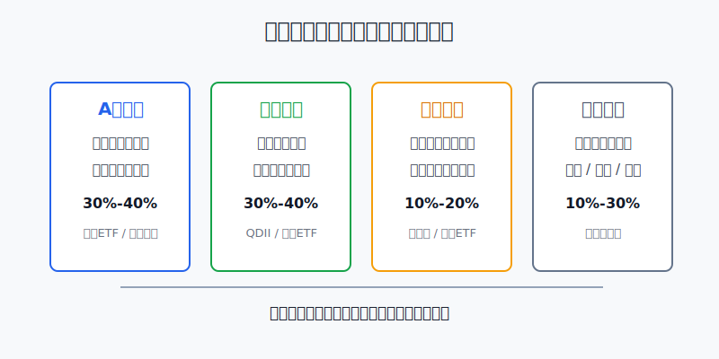
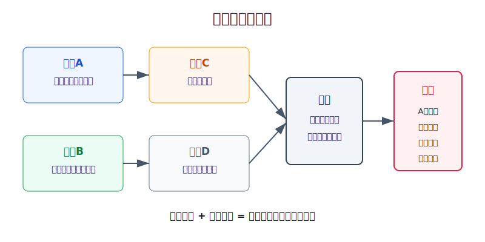
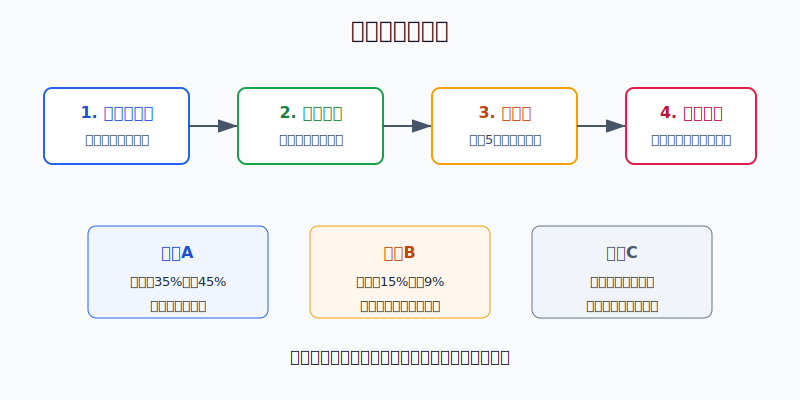

## 散户投资小白金融全品种操盘手册 - 12.10 全球组合怎么搭 - A股核心 + 美股核心 + 港股补充 + 黄金/债券防守
  
### 作者  
digoal  
  
### 日期  
2026-06-07   
  
### 标签  
金融产品 , 金融工具 , 散户 , 投资小白 , 全品操盘手册  
  
----  
  
## 背景 
  

> 适用读者: 已经知道A股、港股、美股、QDII、跨境ETF和汇率风险，但不知道怎么把它们放进同一个组合的小白投资者。  
> 本文定位: 投资教育框架，不构成个性化投资建议。规则口径按 2026-06-06 可核查公开资料整理。

## 先问一个反直觉的问题

全球配置最容易犯的错，不是买得太少，而是把它做成“哪个市场最近涨，就买哪个市场”。真正的全球组合不是追热点清单，而是一张分工表: A股负责人民币资产底盘，美股负责全球核心权益，港股负责补充中国离岸资产，黄金和债券负责降低账户脆弱性。

## 核心概念: 先定任务，再定比例

小白做全球组合，先别问“现在该买A股、港股还是美股”。这个问题会把你带进预测游戏。正确问题是: 这笔钱未来几年不用，我希望它分别承担什么任务。

A股核心，是你在人民币收入、人民币支出背景下的本土权益底盘。权益就是股票类资产，涨跌大，但长期收益主要来自企业盈利增长。A股的优势是离你的生活、政策、消费和产业更近；劣势是市场波动、行业轮动和情绪周期都很明显。

美股核心，是全球龙头公司和美元资产的核心暴露。暴露可以理解为“账户受哪类资产涨跌影响”。小白参与美股，优先用QDII基金或跨境ETF等合规工具，而不是一上来研究几十只美股个股。

港股补充，不是A股和美股之外随手加一块，而是中国资产离岸定价的补充。很多公司业务在中国，融资和交易在香港，价格又受国际资金、港币利率、美元流动性影响。所以港股可以补充，但不适合让小白一开始就重仓押注。

黄金和债券防守，不等于保本。黄金不生息，赚的是货币信用、避险需求和实际利率变化的钱；债券怕利率上行和信用风险。防守资产的任务是让组合不要只靠股票一个发动机，而不是保证每年都赚钱。

本节的行动结论先放在前面: **普通散户做全球组合，先用A股核心和美股核心搭主骨架，再用港股做补充，最后用黄金、债券或现金管理做防守。每年检查一次，单一大类偏离目标超过5个百分点再平衡。**

## 逻辑推导链

【论证链标题】: 因为A股、美股、港股和防守资产承担的风险来源不同，所以全球组合必须按任务分配仓位，并用年度再平衡替代短期预测。

### 第一步: 前提陈述

前提A: 不同市场赚的钱不一样，亏的钱也不一样。这是常量。A股更多受国内经济、产业政策、人民币流动性和市场情绪影响；美股更多受全球龙头盈利、美元利率和科技周期影响；港股同时受中国基本面和海外流动性影响；黄金和债券受利率、通胀、避险和信用环境影响。

前提B: 普通散户有合规参与路径，但每条路径都有工具成本。这是常量加变量。A股可以通过场内ETF、场外指数基金和个股参与；美股和全球资产主要通过QDII基金、跨境ETF等工具参与；港股可以通过港股通、港股ETF或QDII参与。但QDII额度、基金申赎、跨境ETF溢价、港股通范围和交易费用都会影响实际体验。

前提C: 未来哪一个市场最强不可提前确定。这是变量。过去几年强的市场，下一阶段可能变弱；估值便宜的市场，也可能因为盈利和流动性差继续便宜。小白如果把全球配置做成“猜年度冠军”，本质上还是短线择时。

前提D: 小白真正能控制的是比例、上限和复盘时间。这是常量。你控制不了美联储、中国经济、港股流动性和黄金价格，但你能控制A股最多占多少、美股最多占多少、港股最多占多少、防守资产至少留多少。

### 第二步: 逻辑推导

由A+D可得: 因为每类资产的风险来源不同，所以它们在组合里必须有不同任务。A股和美股可以做核心，但港股和黄金不能因为某一年涨得快就自动变成核心。

由B+D可得: 因为普通散户参与海外资产要经过基金、ETF、港股通等工具，所以选择工具前要先定比例。比例不清楚时，看到QDII涨、跨境ETF溢价、港股反弹，就容易把工具波动误当成投资机会。

再由C+D可得: 因为市场冠军无法稳定预测，所以全球组合的操作重点不是押中下一年，而是让单一市场涨太多时不会绑架账户，跌太多时也不会被情绪赶出场。

最后由A+B+C+D可得: **全球组合的核心不是“买遍全世界”，而是“给每类资产分配任务和上限，再按年度再平衡维护风险”。**

### 第三步: 正常情景下的操作结论

✅ 正常情景: 你已经留足6到12个月生活备用金，这笔投资资金三年以上不用，能接受股票资产回撤、汇率波动和基金净值波动。

对应操作:

1. A股核心占全球权益和防守组合的30%-40%，优先用宽基ETF或指数基金承接，不用一开始重仓个股。
2. 美股核心占30%-40%，优先用标普500、美国全市场或全球股票类QDII/ETF承接，不用把纳斯达克100或单一科技主题当全部美股。
3. 港股补充占10%-20%，用来补充中国离岸资产和低估值弹性，不让它替代A股或美股核心。
4. 黄金、债券、现金管理等防守资产占10%-30%，根据年龄、资金期限和回撤承受力调整。期限越短，防守占比越高；越看不懂市场，现金和短债比例越高。
5. 每年固定一个月做组合体检。任一大类偏离目标超过5个百分点，或者小仓位偏离目标25%以上，就执行再平衡。

### 第四步: 数据和案例证实

证据1: 全球股票本来就不是一个市场。MSCI ACWI官方资料显示，该指数覆盖发达市场和新兴市场的大中盘股票，约覆盖全球可投资股票机会集的85%；截至2026年5月29日，指数包含2513只成分股，指数市值为103.70万亿美元。这个证据验证前提A: 全球权益的底层由多个国家、货币和产业组成，小白不应把“海外资产”只理解成一只热门基金。

证据2: 美股核心适合用宽基承接。S&P Dow Jones Indices官方页面说明，S&P 500包含500家领先公司，覆盖美国可投资市值约80%。这个证据验证前提A和第三步结论: 如果小白要配置美股核心，先用宽基指数承接主干风险，比直接押单一行业更稳。

证据3: A股核心也应优先用代表性宽基承接。中证指数公司2026年沪深300指数资料显示，沪深300由沪深市场中规模大、流动性好的最具代表性的300只证券组成。这个证据验证第三步结论: A股核心不是随便买几只熟悉股票，而是先用宽基拿到账户底盘。

证据4: 港股适合做补充，而不是替代全部核心。恒生指数公司2026年4月资料显示，恒生指数包括市值最大及成交最活跃、并在香港联交所主板上市的公司，成分股数目90只，截至2026年4月30日，市值涵盖率64.26%、成交额涵盖率52.34%。这个证据验证前提A: 港股能代表香港市场的重要部分，但它仍是一个流动性和行业结构都比较集中的市场。

证据5: 合规路径本身就是组合设计的一部分。中国证监会QDII办法说明，合格境内机构投资者可以在境内募集资金，并以资产组合方式进行境外证券投资；证监会投资者问答也提示，境内居民可通过购买QDII基金产品份额、参与沪港通等合法渠道投资境外证券市场。这个证据验证前提B: 小白做全球配置，先选合规通道，再谈品种。

证据6: 再平衡不是玄学。FINRA投资者教育材料把资产配置、分散和再平衡解释为管理投资风险的重要工具，并提示投资者可以在年度投资回顾中考虑是否需要再平衡。Vanguard的投资者教育材料也举例说明，70%股票、30%债券的组合若漂移到76%股票、24%债券，且设定偏离5个百分点触发，就应调整回目标比例。这个证据验证前提D: 再平衡是维护风险，不是预测市场。

历史数据不代表未来，但这些证据共同说明一个稳定机制: **小白做全球组合，胜负不应押在“哪个市场明年第一”，而应押在“长期留在多个风险来源里，并且不让任何单一风险失控”。**

### 第五步: 前提变化时的替代结论

若前提B改变，也就是某只跨境ETF出现高溢价，推导路径变为: 因为你买到的不只是底层资产，还买入了额外溢价，所以继续追买会降低未来收益。新结论: 暂停买入高溢价工具，改用场外基金、同类低溢价ETF或等待溢价回落。

若前提C改变，也就是某一年美股大涨、A股和港股低迷，推导路径变为: 因为美股权重已经偏离目标，所以继续把新增资金全投美股，会让组合越来越依赖单一市场。新结论: 用新增资金补低配资产，或者卖出超出上限的部分回到目标比例。

若前提A改变，也就是你的港股仓位已经从补充变成最大仓位，推导路径变为: 因为港股受中国基本面和海外流动性双重影响，账户波动会明显放大。新结论: 港股回到10%-20%的补充位置，核心仓位重新交给A股和美股宽基。

失败案例: 2022年提醒过投资者，防守资产也会失效。BlackRock的TLT资料显示，iShares 20+ Year Treasury Bond ETF在2022年NAV年度回报为-31.41%；State Street关于SPDR Gold Shares的资料显示，GLD在2022年市场价格回报为-0.77%。如果一个组合把“防守”全部压在长久期美债上，当利率快速上行时，防守层会和股票一起伤账户。新结论: 防守资产也要分散，短债、现金管理、黄金和中短久期债券要按任务搭配。

## 实操例子: 10万元怎么搭一个全球组合

这个例子对应论证链的正常结论: **先定任务和目标比例，再选合规工具，最后用年度再平衡维护比例。**

假设小林有10万元长期投资资金，生活备用金已经留好，三年内不用。他能接受组合最大浮亏15%-20%，但不能接受单一市场决定全部结果。

第一步，写目标比例。小林把10万元分成四块: A股核心35%，也就是3.5万元；美股核心35%，也就是3.5万元；港股补充10%，也就是1万元；黄金和债券防守20%，也就是2万元。这一步对应前提A和D: 先让每类资产有任务，不让情绪决定仓位。

第二步，给A股核心选工具。3.5万元优先放在沪深300、中证A500、中证500等宽基ETF或指数基金中，不用一开始挑5只个股。判断依据是证据3: A股核心先买市场底盘，个股研究能力成熟后再做卫星仓。

第三步，给美股核心选工具。3.5万元优先用QDII基金、跨境ETF或其他合规渠道配置标普500、美国全市场或全球股票指数。若跨境ETF溢价明显高于净值，先不追买，等溢价回落或改用申赎机制更平稳的基金。判断依据是前提B: 通道成本会影响实际收益。

第四步，给港股补充设上限。1万元只做补充，不因为港股估值低就加到30%。港股通或港股ETF都要看成交、费用、跟踪指数和是否符合自己的账户条件。判断依据是前提A: 港股是中国资产离岸定价，不是无风险低估值礼包。

第五步，给防守资产拆分。2万元防守层可以拆成1万元短债或现金管理、5000元中短债基金、5000元黄金ETF或黄金基金。若小林不懂久期，就少碰长债。久期可以理解为债券对利率变化的敏感度，久期越长，利率上行时价格越容易跌。

第六步，设再平衡规则。每年12月做一次组合体检。若美股从35%涨到45%，超过目标10个百分点，就把超出部分卖回35%-40%区间，资金补到A股、防守或现金。若港股从10%跌到6%，先检查港股补充的前提是否还成立；若成立，用新增资金补回10%，不要因为下跌就删除这类资产。若防守资产也下跌，先检查是不是长债比例过高，而不是机械补仓。

如果操作错误，最常见的后果有三个: 把美股核心做成纳斯达克或AI主题重仓，账户变成科技单押；把港股低估当成必涨，补充仓变成最大仓；把长债当成保本工具，利率上行时防守层失效。纠偏方法只有一个: 回到目标比例表，把每一笔交易问清楚“它是在维护比例，还是在追逐情绪”。

## 可复用框架

【四格组合】

适用前提: 你要做三年以上的全球配置，且已经留足生活备用金。

核心逻辑: 因为A股、美股、港股和防守资产的风险来源不同，所以组合先分任务，再定比例，再选工具。

操作步骤:

1. A股核心: 30%-40%，承担人民币权益底盘。
2. 美股核心: 30%-40%，承担全球龙头和美元资产暴露。
3. 港股补充: 10%-20%，补充中国离岸资产和估值弹性。
4. 防守资产: 10%-30%，用黄金、债券和现金管理降低脆弱性。

前提失效时: 如果资金三年内要用，提高现金和短债比例；如果跨境工具溢价过高，暂停买入；如果某类资产超过上限，先再平衡。

举一反三: 这个框架也能用于ETF组合、养老账户和家庭资产配置，只是比例要按年龄、收入稳定性和回撤承受力调整。

【年度拉回】

适用前提: 你已经写好目标比例，但容易被新闻和涨跌带着走。

核心逻辑: 因为市场会让仓位自然漂移，所以再平衡要按偏离幅度触发，而不是按情绪触发。

操作步骤:

1. 固定日期: 每年选择一个月做组合体检。
2. 计算偏离: 大类资产偏离目标超过5个百分点，或小仓位偏离目标25%以上，进入再平衡清单。
3. 优先用新增资金: 能用新增资金补低配资产，就少卖出；必须卖出时，只卖超出上限的部分。

前提失效时: 如果投资目标、资金期限或风险承受力变了，先重设目标比例，再执行再平衡；不要用旧比例服务新目标。

举一反三: A股行业ETF、美股ETF、可转债组合和黄金债券组合，都可以用年度拉回框架防止仓位失控。

## 本节行动清单

| 动作 | 合格标准 |
|---|---|
| 先写目标比例 | A股、美股、港股、防守资产四类比例写到纸面上 |
| 核心优先宽基 | A股和美股核心不用单一行业或个股替代 |
| 港股只做补充 | 默认10%-20%，不因低估值或反弹自动加成核心 |
| 防守不要神化 | 黄金、债券、现金管理分散使用，长债要看利率风险 |
| 检查通道成本 | QDII额度、跨境ETF溢价、费用、流动性都要看 |
| 每年再平衡 | 偏离目标超过5个百分点，执行拉回而不是预测 |

## 一句话总结

全球组合的重点不是猜A股、美股、港股谁明年最强，而是让A股核心、美股核心、港股补充和黄金债券防守各司其职，再用年度再平衡把账户风险拉回你能承受的范围。

## 参考资料

- FINRA: Asset Allocation and Diversification, https://www.finra.org/investors/investing/investing-basics/asset-allocation-diversification
- SEC: Beginners' Guide to Asset Allocation, Diversification, and Rebalancing, https://www.sec.gov/investor/pubs/assetallocation.htm
- Vanguard: Rebalancing your portfolio, https://investor.vanguard.com/investor-resources-education/portfolio-management/rebalancing-your-portfolio
- MSCI: MSCI ACWI Index, https://www.msci.com/indexes/index/892400
- MSCI: MSCI ACWI Index factsheet, https://www.msci.com/documents/10199/255599/msci-acwi-net.pdf
- S&P Dow Jones Indices: S&P 500, https://www.spglobal.com/spdji/en/indices/equity/sp-500/
- 中证指数有限公司: 沪深300指数资料, https://oss-ch.csindex.com.cn/static/html/csindex/public/uploads/indices/detail/files/zh_CN/000300factsheet.pdf
- 中国证监会: 合格境内机构投资者境外证券投资管理试行办法, https://www.csrc.gov.cn/csrc/c101932/c1044480/content.shtml
- 中国证监会: 境内居民参与境外证券交易合法渠道投资者问答, https://www.csrc.gov.cn/csrc/c106299/c1600712/content.shtml
- Hang Seng Indexes: 恒生指数资料, https://www.hsi.com.hk/static/uploads/contents/zh_cn/dl_centre/factsheets/hsic.pdf
- BlackRock: iShares 20+ Year Treasury Bond ETF factsheet, https://www.blackrock.com/us/individual/literature/fact-sheet/tlt-ishares-20-year-treasury-bond-etf-fund-fact-sheet-en-us.pdf
- State Street: SPDR Gold Shares investment paper, https://www.ssga.com/library-content/products/fund-docs/etfs/us/insights-investment-ideas/spdr-invest-in-gold.pdf

> ⚠️ **声明**：本文内容为投资教育目的，所有历史数据、策略框架均为辅助学习工具，不构成证券投资建议。市场有风险，投资需谨慎。实际操作请结合自身风险承受能力，必要时咨询专业投顾。
  
#### [PostgreSQL 解决方案集合](../201706/20170601_02.md "40cff096e9ed7122c512b35d8561d9c8")
  
  
#### [德哥 / digoal's Github - 公益是一辈子的事.](https://github.com/digoal/blog/blob/master/README.md "22709685feb7cab07d30f30387f0a9ae")
  
  
#### [About 德哥](https://github.com/digoal/blog/blob/master/me/readme.md "a37735981e7704886ffd590565582dd0")
  
  

  
