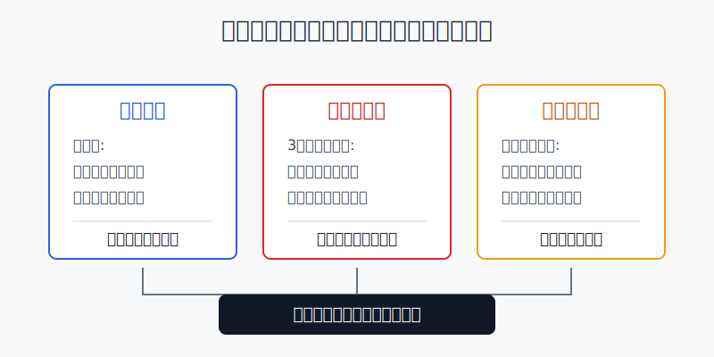
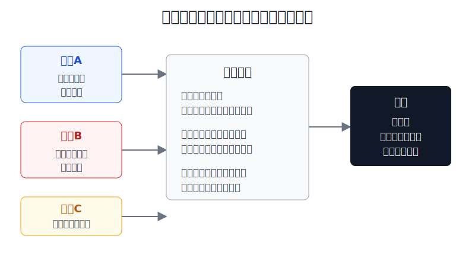
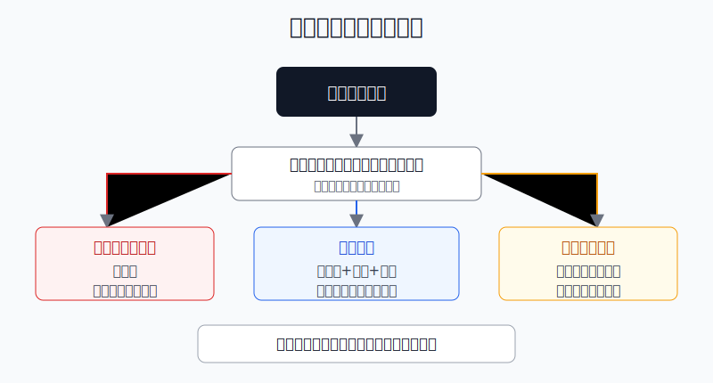

## 散户投资小白金融全品种操盘手册 - 12.11 什么时候不要做全球配置 - 不懂规则、短期要用钱、只为追热点
  
### 作者  
digoal  
  
### 日期  
2026-06-07   
  
### 标签  
金融产品 , 金融工具 , 散户 , 投资小白 , 全品操盘手册  
  
----  
  
## 背景 
  

> 适用读者: 已经知道港股、QDII、跨境ETF、美股、黄金和债券都能参与全球配置，但还没有形成“什么时候该停手”规则的小白投资者。  
> 本文定位: 投资教育框架，不构成个性化投资建议。

## 先问一个反直觉的问题

全球配置听起来很高级，但小白最容易亏钱的时候，往往不是“没有全球配置”，而是**在不该配置的时候硬要配置**。不懂规则、短期要用钱、只为追热点，这三种情况里，暂停比行动更值钱。

## 核心概念: 全球配置不是多买几个市场

全球配置，是把资产放到不同国家、不同货币、不同市场和不同风险来源里。它的目的不是追哪个市场涨得快，而是让组合不要只押在一个经济体、一种货币、一类资产上。

但全球配置有一个前提: 你要知道自己买的是什么。港股有港股的交易规则和流动性分层；QDII基金会受到额度、申赎节奏和海外市场休市影响；跨境ETF有溢价风险；美股账户涉及汇率、税务、券商安全和交易制度；海外债券和黄金也有利率、汇率、商品价格波动。

本节的行动结论先放前面: **只要出现三种情况之一，就不要急着做全球配置: 第一，不懂买入工具的规则；第二，这笔钱三年内要用；第三，买入理由只是热点和涨幅。正确动作不是永远不买，而是先暂停、补规则、保现金，再用小仓位和再平衡进入。**

## 逻辑推导链

【论证链标题】: 因为全球配置同时叠加市场、汇率、规则和流动性风险，所以小白在规则不清、资金期限不匹配或只为追热点时，应该暂停配置，而不是硬上。

── 第一步: 前提陈述

前提A: 全球资产的规则差异比A股单一账户更复杂。这是常量。买A股宽基ETF，你主要面对价格波动；买港股、QDII、跨境ETF或美股资产，还会叠加交易时间、汇率换算、申赎安排、额度、税费、折溢价和信息披露差异。用生活里的比喻说，A股像在熟悉城市开车，全球配置像跨境旅行: 地图、交通规则、货币和时差都变了。

前提B: 全球配置不能消灭亏损，只能改变风险来源。这是常量。很多小白以为“分散到全球”就等于更安全，但在全球流动性收紧、美元走强、风险偏好下降时，股票、债券、新兴市场、港股和美股可能一起下跌。全球配置不是保险箱，只是把鸡蛋放到更多篮子里；如果一辆车把所有篮子都颠起来，短期仍会受伤。

前提C: 资金期限决定能不能承受波动。这是常量。三年内要买房、交学费、还债、做生意周转或做家庭备用的钱，本质上是“要按时到站的钱”。全球权益资产和跨境工具短期波动大，不能保证在你需要用钱时刚好赚钱。

前提D: 热点会放大溢价和情绪交易。这是变量，但在跨境ETF、主题基金、港股热门板块和美股热门主题里经常出现。当二级市场买盘太热，ETF交易价格可能明显高于基金净值，这个差额就是溢价。溢价越高，你买到的不是资产本身，而是别人情绪加价后的门票。

── 第二步: 逻辑推导

由A可得: 因为规则差异会把同一个“买入动作”变成不同风险，所以不懂规则时不能下单。你不知道QDII为什么暂停申购、跨境ETF为什么有溢价、美股分红为什么扣税，就无法判断亏损来自市场、汇率、费用还是工具机制。

由B+C可得: 因为全球配置仍然会发生回撤，而短期资金没有等待修复的时间，所以三年内要用的钱不适合进入高波动全球资产。不是资产不好，而是钱的用途不匹配。

再由A+D可得: 因为跨境工具本来就有交易规则和净值差异，热点又会把二级市场价格推高，所以只为追热点时，买入行为很容易从“配置资产”变成“接别人的高价筹码”。

最后由A+B+C+D可得: 因为全球配置不是免亏工具，且规则、期限、情绪都会放大错误，所以小白必须先做三问: **我懂规则吗？这笔钱三年内不用吗？我有配置计划而不是追热点吗？** 三问任意一问不合格，结论都是暂停。

── 第三步: 正常情景下的操作结论

✅ 正常情景: 你已经看懂工具规则；这笔钱三年以上不用；买入理由是组合需要，而不是新闻热度；已经有A股核心资产、现金或短债防守仓。

对应操作: 可以开始做全球配置，但先小仓位、分批买入、定期再平衡。对小白来说，全球资产先做组合补充，不做全部资产的主仓；港股、QDII、跨境ETF、美股ETF都先从规则简单、流动性好、溢价低的工具开始。

── 第四步: 数据和案例证实

证据1: 规则不懂会直接变成操作风险。国家外汇管理局在个人外汇业务问答和购汇填报说明中长期明确，个人年度购汇有等值5万美元便利化额度，但购汇资金用途要如实申报，不得用于境外证券投资等资本项目用途。这对应前提A: 全球配置不是只看收益，还要先看参与路径和合规边界。通过QDII基金、港股通、合规跨境ETF等路径参与，和自己随意换汇去买境外证券，不是同一回事。

证据2: 全球资产也会一起跌。MSCI ACWI 指数代表全球发达市场和新兴市场的大中盘股票，MSCI公布的指数数据中，MSCI ACWI 2022年美元计价年度收益为-18.36%。同一年，美股标普500指数总回报为-18.11%，纳斯达克100指数价格回报约为-32.97%。这对应前提B和C: 全球配置能减少单一市场依赖，但不能保证短期不亏；三年内要用的钱不能把“可能回撤20%-30%”当成小波动。

证据3: 热点会把工具价格推离净值。2024年多只跨境ETF因二级市场交易价格明显高于基金份额参考净值而发布溢价风险提示，基金公司公告中反复提醒投资者注意二级市场交易价格溢价风险，若盲目投资可能遭受重大损失。以当年日经225相关ETF为例，市场追捧日本股市时，部分产品一度出现较高溢价，随后溢价回落会让追高买入者即使看对海外指数，也可能先亏在溢价收缩上。这对应前提D: 追热点买跨境产品，错的不一定是方向，可能是买入价格。

失败案例: 2021年追中概互联网、2024年追高溢价日经ETF，都是同一个错误结构: 不是先问工具规则、估值、汇率、仓位，而是先被“海外机会”“别人赚钱”“新高突破”吸引。前提D一旦失效，推导路径就会变成: 因为买入价格包含情绪溢价，所以即使长期主题没错，短期也可能被估值回落、汇率波动和溢价收缩三重打击。

历史不代表未来。上面数据仍有参考价值，是因为它们验证的是结构规律: 全球配置有规则门槛，全球股票也会同步回撤，跨境工具会出现溢价。这个规律不依赖某一只产品短期涨跌。

── 第五步: 前提变化时的替代结论

若前提A改变，也就是你已经能说清楚买入工具的交易时间、费用、汇率、申赎、折溢价、税务和卖出限制，推导路径变为: 因为规则风险下降，所以可以进入小仓位试运行。新结论: 先用1%-3%的资金验证交易流程和心理承受，再逐步纳入组合。

若前提C改变，也就是这笔钱三年内确定不用，且你有足够现金和短债覆盖生活与应急，推导路径变为: 因为资金期限可以承受回撤，所以可以用定投或分批方式配置全球宽基。新结论: 不追一次买满，按季度或月度进入，并设定再平衡区间。

若前提D恶化，也就是你发现买入理由只剩“涨得好、朋友都买、媒体都在说”，推导路径变为: 因为买入理由从资产配置变成情绪跟随，所以胜率下降。新结论: 停止加仓，等待溢价回落、估值降温或重新写出配置理由。

若前提B恶化，也就是全球市场进入流动性收紧、美元快速走强、风险资产同步下跌的阶段，推导路径变为: 因为分散效果短期下降，所以不能用“全球配置”作为满仓理由。新结论: 提高现金和短债比例，只保留长期核心仓，暂停卫星仓和主题仓。

## 实操例子: 20万元账户什么时候该暂停

这个例子对应论证链的核心结论: **三问任意一问不合格，暂停全球配置。**

假设小王有20万元投资资金，已经持有A股宽基ETF和货币基金。他看到港股互联网ETF和日经225ETF近期讨论很多，也想买一点美股ETF。

第一步，问规则。小王先写下三个工具的规则: 港股ETF的跟踪指数、成交量、管理费、买卖价差；跨境ETF的净值、IOPV（基金份额参考净值，就是盘中估算净值）、溢价率、申赎限制；美股ETF的交易时间、汇率影响、分红税和券商安全。如果他说不清其中两项以上，就先不买。这个动作对应前提A: 不懂规则时，亏损原因都分不清。

第二步，问期限。小王发现20万元里有8万元准备两年后装修，4万元是家庭备用金，真正三年以上不用的只有8万元。那么全球配置只能从这8万元里考虑，不能动装修钱和备用金。这个动作对应前提C: 短期要用的钱不承担全球权益波动。

第三步，问理由。小王给自己写一句买入理由: “我希望组合里有A股之外的权益暴露，长期分散单一市场风险。”这句话合格。如果写出来的是“日股一直涨，港股很便宜，大家都说要反转”，就不合格。这个动作对应前提D: 配置理由要能穿过热度，而不是被热度牵着走。

第四步，给仓位。三问通过后，小王只从8万元长期资金里拿20%做全球资产，也就是1.6万元。第一笔只买一半，8000元，剩余8000元分两到三次进入。港股和海外宽基优先，主题和高溢价工具不碰。这个动作对应正常情景下的结论: 小仓位、分批、低溢价、可再平衡。

第五步，设置暂停条件。如果跨境ETF溢价超过5%，暂停买入；如果家庭备用金不足6个月，暂停买入；如果市场大涨后自己想把1.6万元提高到5万元，必须重新做三问，并检查这是不是追热点。

如果操作错误，后果也很直观。小王若直接把20万元中的10万元追进高溢价跨境ETF，假设海外指数跌15%、人民币汇率不利变动3%、ETF溢价从10%回到1%，账户可能出现接近20%以上的综合损失。这不是全球配置本身的错，而是规则、期限和买入价格同时错了。

## 可复用框架

【三问暂停】

适用前提: 你准备买港股、QDII、跨境ETF、美股ETF或其他海外资产，但不知道现在该不该买。

核心逻辑: 因为全球配置会叠加规则、波动、汇率和溢价风险，所以先判断能不能买，再讨论买什么。

操作步骤:

1. 问规则: 我能否用自己的话说清交易、费用、汇率、税务、申赎和折溢价。
2. 问期限: 这笔钱三年内是否完全不用，家庭备用金是否已经留足。
3. 问理由: 我买它是为了组合分散，还是为了追最近涨得快。

前提失效时: 任意一问答不清，暂停；规则不清就学习，期限不够就留现金，理由不合格就等待热度降温。

举一反三: 这个框架也适用于买行业ETF、主题基金、商品基金、REITs和单只海外股票。

【低溢价进入】

适用前提: 你已经决定用跨境ETF或QDII基金参与海外资产。

核心逻辑: 因为跨境工具可能出现交易价格高于净值的情况，所以买入前必须先看净值和溢价，而不是只看指数涨跌。

操作步骤:

1. 先看基金公告和盘中参考净值，确认是否有溢价风险提示。
2. 再看成交量和买卖价差，避免流动性太差的品种。
3. 最后分批买入，不在高溢价、高热度、高涨幅同时出现时追价。

前提失效时: 溢价超过自己规则上限，停止买入；公告提示重大溢价风险，暂停；流动性明显变差，换工具或等待。

举一反三: 这个框架也可以用于港股ETF、黄金ETF、商品ETF和封闭式基金，因为它们都可能出现交易价格和资产价值不一致的问题。

## 本节行动清单

| 动作 | 合格标准 |
|---|---|
| 写清工具规则 | 交易时间、费用、汇率、申赎、税务、折溢价至少能说清 |
| 区分资金期限 | 三年内要用的钱不进入高波动全球资产 |
| 检查买入理由 | 不是因为新闻热、朋友买、短期涨幅大 |
| 先看溢价 | 跨境ETF和QDII相关产品先看公告、净值和溢价 |
| 小仓位验证 | 第一笔只用长期资金的小比例，不一次买满 |
| 设暂停条件 | 备用金不足、高溢价、规则不懂、理由变形时停止加仓 |
| 定期再平衡 | 全球资产涨超目标比例，转回核心资产或防守资产 |

## 一句话总结

全球配置的第一课不是买遍全球，而是知道什么时候该停手；不懂规则、短期要用钱、只为追热点时，暂停就是最好的风控。

## 参考资料

- 国家外汇管理局: 《个人外汇管理办法实施细则》及答记者问，关于个人年度购汇总额、经常项目购汇、资本项目证券投资通过合格境内或境外机构办理的规则，https://www.safe.gov.cn/safe/2007/0105/22509.html ，https://www.safe.gov.cn/safe/2007/0105/4319.html
- 国家外汇管理局: 个人购汇申请书示例，列明购汇不得用于境外买房、证券投资等尚未开放的资本项目，https://www.safe.gov.cn/big5/big5/www.safe.gov.cn%3A443/yunnan/file/file/20210511/a04df91192014a47af175cd1f7d4cdb8.pdf
- MSCI: MSCI ACWI Index factsheet，2022年美元计价年度收益为-18.36%，https://www.msci.com/documents/10199/a71b65b5-d0ea-4b5c-a709-24b1213bc3c5
- S&P Dow Jones Indices: S&P 500 factsheet，2022年总回报为-18.11%，https://www.spglobal.com/spdji/en/indices/equity/sp-500/
- Nasdaq Global Indexes: Nasdaq-100 factsheet，2022年价格回报为-32.97%，https://indexes.nasdaqomx.com/docs/FS_NDX.pdf
- 上海证券交易所基金公告: 华夏野村日经225ETF（QDII）二级市场交易价格溢价风险提示公告，2024年8月5日，https://www.sse.com.cn/disclosure/fund/announcement/c/new/2024-08-05/513520_20240805_8GDO.pdf

> ⚠️ **声明**：本文内容为投资教育目的，所有历史数据、策略框架均为辅助学习工具，不构成证券投资建议。市场有风险，投资需谨慎。实际操作请结合自身风险承受能力，必要时咨询专业投顾。
  
#### [PostgreSQL 解决方案集合](../201706/20170601_02.md "40cff096e9ed7122c512b35d8561d9c8")
  
  
#### [德哥 / digoal's Github - 公益是一辈子的事.](https://github.com/digoal/blog/blob/master/README.md "22709685feb7cab07d30f30387f0a9ae")
  
  
#### [About 德哥](https://github.com/digoal/blog/blob/master/me/readme.md "a37735981e7704886ffd590565582dd0")
  
  

  
