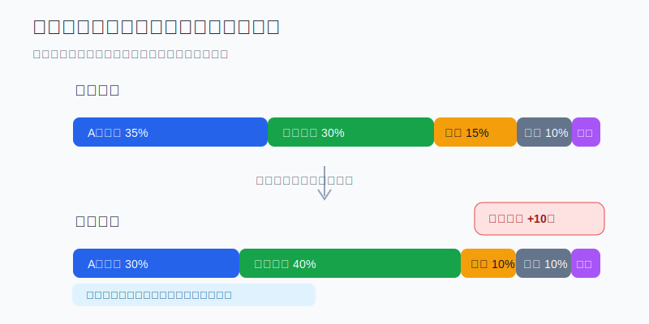
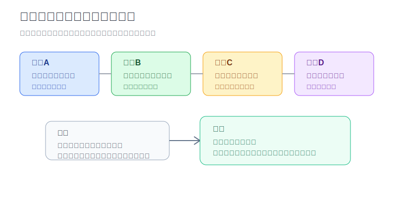
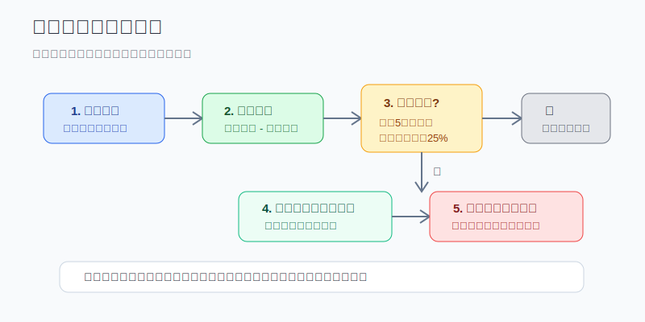

## 散户投资小白金融全品种操盘手册 - 12.12 全球资产年度再平衡方法
  
### 作者  
digoal  
  
### 日期  
2026-06-07   
  
### 标签  
金融产品 , 金融工具 , 散户 , 投资小白 , 全品操盘手册  
  
----  
  
## 背景 
  

> 适用读者: 已经知道 A股核心、美股核心、港股补充、黄金/债券防守这些角色，但不知道每年该怎么调仓的小白投资者。  
> 本文定位: 投资教育框架，不构成个性化投资建议。

## 先问一个反直觉的问题

全球配置最难的地方，不是买进很多市场，而是**一年后还能坚持原来的风险计划**。涨得最好的资产会自动变大，跌得最差的资产会自动变小。你不管它，组合就会悄悄从“配置”变成“追涨后的重仓”。

## 核心概念: 再平衡不是预测，是体检

再平衡，就是把组合里各类资产的比例，重新拉回你事先设定的目标比例。比如年初计划是 A股核心35%、美股核心30%、港股补充15%、黄金/债券防守10%、现金10%。一年后，美股涨得多，实际占比变成40%；A股和港股占比降下来。这个时候，你不是在判断“美股明年一定跌”，而是在问: **我的组合是不是已经比原计划承担了更多美股风险？**

这里有三个小白必须听懂的词。

目标比例，就是每类资产在总投资资金里的计划占比。它本质上是风险预算，不是收益排行榜。

偏离，就是实际比例和目标比例之间的差。目标30%，实际40%，偏离就是+10个百分点。

触发阈值，就是偏离大到需要动作的线。小白可以用两条简单线: **大资产偏离超过5个百分点才动；小资产偏离超过目标比例的25%才动。** 例如美股目标30%，实际36%，偏离6个百分点，可以触发；黄金目标10%，实际13%，虽然只偏离3个百分点，但相对目标偏离30%，也可以触发。

本节行动结论先放在前面: **全球组合每年固定做一次体检，超过阈值才再平衡；优先用现金、分红和新增资金补低配资产，只有不够时才卖出超配资产。再平衡的目的不是提高短期收益，而是让组合风险回到自己能承受的位置。**

## 逻辑推导链

【论证链标题】: 因为全球资产长期会分化，目标比例代表风险预算，而交易有成本，所以小白应该用“年度检查 + 阈值触发”的方式再平衡。

── 第一步: 前提陈述

前提A: A股、港股、美股、黄金、债券、现金不会同步涨跌。这是常量。它们像一支球队里的不同位置，前锋、后卫、门将的表现不会每场都一样。全球配置的价值，正是来自这些资产在不同环境下承担不同角色。

前提B: 目标比例不是随便写的数字，而是你愿意承担的风险预算。这是常量，但会随人生阶段变化。30%美股和50%美股，表面只是数字差20个百分点，实际是你愿意承受的美元资产、科技股集中度、海外市场波动都变大了。

前提C: 再平衡有成本。这是变量。成本包括交易佣金、基金申赎费、买卖价差、跨境ETF溢价、QDII额度限制、港股通汇率换算、以及可能的税务影响。动得太频繁，就像车子每开一小段就急刹车，磨损会吃掉一部分收益。

前提D: 人天然容易追涨杀跌。这是常量。涨多的资产看起来更正确，跌多的资产看起来更讨厌。没有规则时，小白最容易把“涨了所以继续买”误认为“配置能力强”。

── 第二步: 逻辑推导

由A可得: 因为各类资产涨跌不同，所以组合比例一定会漂移。只要时间够长，实际持仓就会偏离原计划。

由A+B可得: 因为比例漂移会改变风险预算，所以不再平衡等于默认接受一个新组合。问题是，这个新组合往往不是你主动设计的，而是市场涨跌替你设计的。

再由B+C可得: 因为目标比例需要维护，但交易有成本，所以不能每天小偏离就动。合理做法是设置阈值，让小波动自然消化，让大偏离触发动作。

再由C+D可得: 因为人会被短期涨跌影响，所以再平衡必须写成机械流程。先算比例，再看阈值，最后决定用新增资金、现金还是卖出超配资产。

最终由A+B+C+D可得: **全球资产年度再平衡的核心不是预测哪类资产明年最好，而是用低频、低成本、可复盘的规则，把组合风险拉回目标。**

── 第三步: 正常情景下的操作结论

✅ 正常情景: 你的目标比例没有变；这笔钱是长期资金；各类资产流动性正常；跨境ETF或QDII没有明显高溢价；偏离超过设定阈值。

对应操作: 每年固定一个日期做组合体检，例如每年12月最后一周或春节前。先汇总所有账户市值，再计算目标比例和实际比例。若偏离没有超过阈值，只记录，不交易。若超过阈值，优先用现金、分红和新增资金补低配资产；不够时，再卖出超配资产，把比例拉回目标附近，而不是要求精确到小数点。

── 第四步: 数据和案例证实

证据1: Vanguard 2022年研究《Rational Rebalancing》用1989年末到2021年末的数据测算，60%股票/40%债券的组合如果从不再平衡，到2021年末股票占比会升到约80%；研究还指出，不再平衡的股票权重可能在约50%到80%之间漂移。这对应前提A和B: 长期不管，组合风险会被市场涨跌改写。

证据2: FINRA 在投资者教育页面《Asset Allocation and Diversification》中说明，市场表现会改变各类资产价值，投资者可能需要调整持仓以回到原始配置；它还建议投资者可以把“是否需要再平衡”放进年度投资检查，并列出三种方式: 把资金转向落后资产、用新增投资补落后资产、卖出部分表现较好的资产。这对应前提C: 年度检查和先用现金/新增资金，是小白更容易执行的低摩擦方法。

证据3: S&P Dow Jones Indices 的 S&P 500 factsheet 显示，S&P 500 Total Return 在2022年为-18.11%，2023年为+26.29%，2024年为+25.02%，2025年为+17.88%。这不是让你追美股，而是说明同一类资产连续几年表现差异很大。若组合里美股权重本来只有30%，连续上涨后很容易变成40%甚至更高；如果不体检，风险预算会被动上调。

失败案例: 2022年是再平衡的压力测试年份。美股和债券都经历明显回撤，传统“股债互相保护”的体验变差。如果小白在没有现金计划、没有用钱时间表的情况下，机械地把未来一年要用的钱也补进风险资产，就会把“再平衡”变成“硬扛波动”。这个反例说明: 再平衡只适用于长期投资资金，不能拿生活钱、买房钱、学费钱去补跌。

历史不代表未来。上面数据仍有参考价值，是因为它们验证的是结构规律: 不同资产收益不同步，比例会漂移；不设规则，人会被涨跌牵着走。年度再平衡不是保证收益，而是防止风险在无意识中变大。

── 第五步: 前提变化时的替代结论

若前提B改变，也就是你的目标、年龄、收入稳定性或未来用钱时间变了，推导路径变为: 因为风险预算本身改变，所以不能机械回到旧比例。新结论: 先重设目标比例，再谈再平衡。例如两年内要买房，现金和短债比例应该提高，不能为了回到旧的股票比例而加风险。

若前提C改变，也就是交易成本、税费、QDII额度、跨境ETF溢价或港股流动性明显不友好，推导路径变为: 因为调整成本过高，所以本次不必一次性卖买到位。新结论: 用三到六个月的新增资金和分红慢慢补低配资产，避免为了精确比例付出过高成本。

若前提A在危机中暂时失效，也就是股票、港股、REITs、商品一起下跌，债券也没有明显保护，推导路径变为: 因为相关性上升，组合保护力下降，所以第一动作不是抄底，而是确认现金安全垫。新结论: 先保证6到12个月生活费和短期支出，再用长期资金按阈值再平衡。

若偏离没有超过阈值，推导路径变为: 因为风险变化不大，但交易成本真实存在，所以不交易。新结论: 记录比例，保持原计划，下一次年度体检再看。

## 实操例子: 20万元全球组合怎么做年度再平衡

这个例子对应论证链的正常结论: **目标比例没变、长期资金没变、偏离超过阈值时，才做年度再平衡。**

假设小周有20万元长期投资资金，已经留足生活备用金，计划用“全球组合”参与市场。他年初设定目标:

| 资产角色 | 目标比例 | 目标金额 |
|---|---:|---:|
| A股核心 | 35% | 70000元 |
| 美股核心 | 30% | 60000元 |
| 港股补充 | 15% | 30000元 |
| 黄金/债券防守 | 10% | 20000元 |
| 现金等待 | 10% | 20000元 |

一年后，账户总市值变成22万元。因为美股涨得多，港股表现弱，实际比例变成:

| 资产角色 | 实际金额 | 实际比例 | 偏离 |
|---|---:|---:|---:|
| A股核心 | 72000元 | 32.7% | -2.3点 |
| 美股核心 | 90000元 | 40.9% | +10.9点 |
| 港股补充 | 22000元 | 10.0% | -5.0点 |
| 黄金/债券防守 | 20000元 | 9.1% | -0.9点 |
| 现金等待 | 16000元 | 7.3% | -2.7点 |

第一步，先判断目标有没有变。小周未来三年没有确定大额支出，工作收入稳定，目标比例仍然适合自己。这对应前提B: 目标比例仍是有效风险预算。

第二步，看是否触发阈值。美股核心目标30%，实际40.9%，偏离+10.9个百分点，超过5个百分点；港股补充目标15%，实际10%，偏离-5个百分点，也到了边界。触发再平衡。

第三步，先用现金和新增资金。小周接下来准备追加12000元长期资金。他先把这12000元投入低配资产: 8000元补港股补充，4000元补现金或防守资产。这样做对应前提C: 先用新增资金，少卖出，减少交易摩擦。

第四步，如果新增资金不够，再处理超配资产。追加后，美股仍明显超过目标。小周可以卖出一部分美股核心，把超出目标太多的部分转向港股补充、A股核心或防守资产。注意，动作不是“清空美股”，而是把40.9%拉回30%到35%附近。再平衡追求回到风险区间，不追求完美比例。

第五步，写下复盘记录。记录四项: 年末总市值、目标比例、实际比例、交易原因。如果交易是因为“美股偏离超过5个百分点”，下一年复盘就能检查规则是否被执行，而不是靠情绪解释。

如果前提不成立，操作要切换。比如小周明年要用8万元付首付，那就不能为了补港股或A股而降低现金；应该先把8万元从长期组合中划出，放到现金管理或短债，再用剩余长期资金重新设目标比例。

如果操作错误，后果也很清楚。小周若看到美股涨得好，就把港股和防守资产都卖掉继续追美股，短期可能更舒服，但组合从全球配置变成单一市场重仓。下一次美股回撤时，他承受的波动会远高于原计划，最后容易在下跌中恐慌卖出。

## 可复用框架

【一年一检】

适用前提: 你持有 A股、港股、美股、黄金、债券、QDII或跨境ETF等多类资产，并且这笔钱是长期投资资金。

核心逻辑: 因为资产涨跌不同会导致比例漂移，而目标比例代表风险预算，所以每年固定一次检查，超过阈值才调。

操作步骤:

1. 写下目标比例，不写目标收益率。
2. 年末汇总所有账户，按总市值计算实际比例。
3. 偏离超过5个百分点，或小仓位偏离超过目标的25%，才触发动作。
4. 先用现金、分红、新增资金补低配资产，不够时再卖超配资产。
5. 执行后记录原因、金额、费用和下一次检查日期。

前提失效时: 如果短期要用钱，先提高现金；如果交易成本过高，用新增资金慢慢补；如果目标比例已经不适合自己，先重设目标，不要机械回旧比例。

举一反三: 这个框架也适用于 ETF组合、可转债组合、红利ETF加债券组合、美股ETF组合。

【三线再平衡】

适用前提: 你不知道这次到底该不该交易。

核心逻辑: 因为再平衡不是看观点，而是看规则，所以先过三条线: 目标线、偏离线、成本线。

操作步骤:

1. 目标线: 原目标比例是否仍适合当前生活阶段。
2. 偏离线: 实际比例是否超过触发阈值。
3. 成本线: 交易费、溢价、税务、流动性是否可以接受。

前提失效时: 目标线失效，先改资产配置；偏离线没触发，不交易；成本线不合格，改用新增资金和分红慢慢修正。

举一反三: 任何“要不要调仓”的问题，都可以先过这三条线。它能把情绪问题变成流程问题。

## 本节行动清单

| 动作 | 合格标准 |
|---|---|
| 写目标比例 | A股、美股、港股、防守资产、现金都有明确比例 |
| 固定体检日期 | 每年一次，日期固定，不因短期涨跌临时改 |
| 汇总全账户 | 证券账户、基金账户、QDII、港股通、现金都算进去 |
| 设置触发阈值 | 大资产偏离超过5个百分点，小资产相对偏离超过25% |
| 现金优先 | 先用现金、分红、新增资金补低配资产 |
| 控制交易成本 | 检查申赎费、买卖价差、溢价、汇率和税务 |
| 写复盘记录 | 记录目标、实际、偏离、交易、费用、下次检查日 |

## 一句话总结

全球资产年度再平衡，不是猜明年谁涨谁跌，而是每年把组合从市场替你安排的比例，拉回你自己能承受的风险预算。

## 参考资料

- Vanguard Research: Rational Rebalancing: An Analytical Approach to Multiasset Portfolio Rebalancing Decisions and Insights, 2022, https://corporate.vanguard.com/content/dam/corp/research/pdf/rational_rebalancing_analytical_approach_to_multiasset_portfolio_rebalancing.pdf
- Vanguard: Vanguard's approach to target-date fund rebalancing, 2025, https://workplace.vanguard.com/insights-and-research/perspective/vanguards-approach-to-target-date-fund-rebalancing.html
- FINRA: Asset Allocation and Diversification, https://www.finra.org/investors/investing/investing-basics/asset-allocation-diversification
- S&P Dow Jones Indices: S&P 500 (USD) Factsheet, as of May 29, 2026, https://www.spglobal.com/spdji/en/indices/equity/sp-500/

> ⚠️ **声明**：本文内容为投资教育目的，所有历史数据、策略框架均为辅助学习工具，不构成证券投资建议。市场有风险，投资需谨慎。实际操作请结合自身风险承受能力，必要时咨询专业投顾。
  
#### [PostgreSQL 解决方案集合](../201706/20170601_02.md "40cff096e9ed7122c512b35d8561d9c8")
  
  
#### [德哥 / digoal's Github - 公益是一辈子的事.](https://github.com/digoal/blog/blob/master/README.md "22709685feb7cab07d30f30387f0a9ae")
  
  
#### [About 德哥](https://github.com/digoal/blog/blob/master/me/readme.md "a37735981e7704886ffd590565582dd0")
  
  

  
