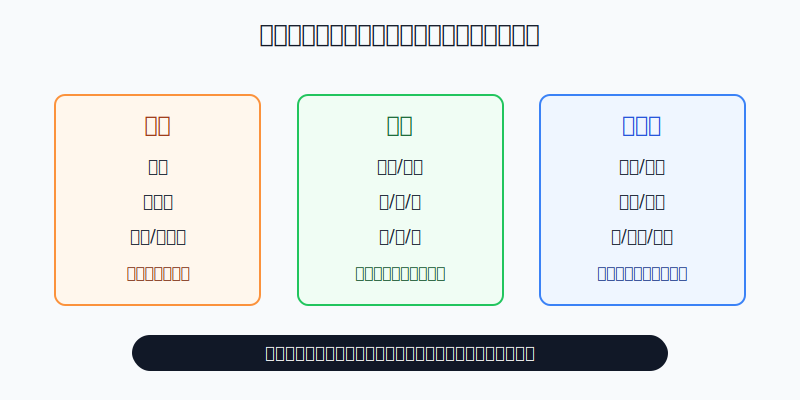
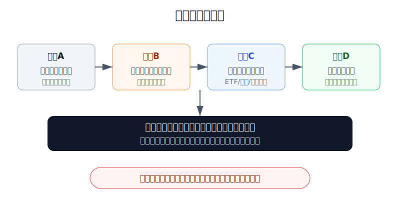
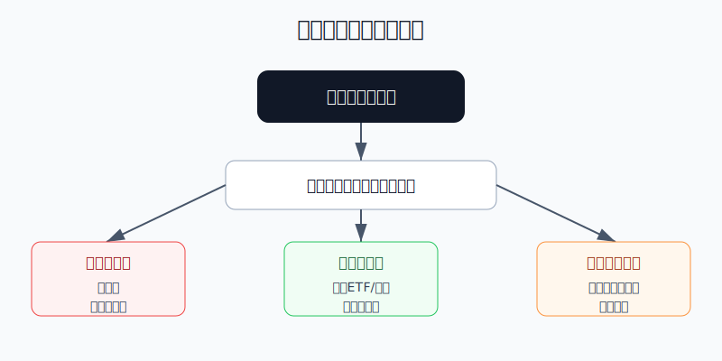

## 散户投资小白金融全品种操盘手册 - 13.1 商品资产是什么 - 能源、金属、农产品
  
### 作者  
digoal  
  
### 日期  
2026-06-07   
  
### 标签  
金融产品 , 金融工具 , 散户 , 投资小白 , 全品操盘手册  
  
----  
  
## 背景 
  

> 适用读者: 听过原油、黄金、铜、大豆、煤炭、商品基金，但还分不清“商品资产”和“股票基金”到底差在哪里的小白投资者。  
> 本文定位: 投资教育框架，不构成个性化投资建议。

## 先问一个反直觉的问题

商品价格最容易让小白误会的一点是: **它涨得猛，不代表它像好公司一样变优秀了。** 原油涨，可能是供应被打断；小麦涨，可能是天气和战争；铜涨，可能是工业需求，也可能只是库存太低。

所以第十三章先不教你做期货，也不教你猜明天涨跌。第一节只解决一个问题: 你到底在买什么风险。

## 核心概念: 商品不是公司，是原材料的价格

商品资产，简单说，就是能源、金属、农产品这些现实世界原材料的价格风险。股票背后是一家公司，债券背后是一笔还本付息的债，REITs背后是一组基础设施现金流；但商品本身没有董事会、没有利润表、没有分红，也不会因为“管理层优秀”自动创造现金流。

常见商品可以先分成三大类。

第一类是**能源**，比如原油、天然气、汽油、燃料油。它像经济机器的燃料箱，交通、化工、发电、工业生产都会受到它影响。能源价格对地缘冲突、产油国政策、库存和运输特别敏感。

第二类是**金属**，分成贵金属和工业金属。黄金、白银偏贵金属，更多和避险、实际利率、货币信用有关；铜、铝、锌、镍偏工业金属，更多和基建、制造业、电网、新能源、库存周期有关。它们像工业温度计，温度上来了，价格容易有反应；温度下去了，价格也会冷。

第三类是**农产品**，比如玉米、小麦、大豆、豆油、糖、棉花、咖啡。它们和人口消费、饲料需求、种植面积、天气、病虫害、贸易政策有关。农产品最像“老天爷和供应链一起开的报价单”，丰收和歉收会直接改变价格。

本节行动结论先放前面: **商品资产适合先用“能源、金属、农产品”三类地图建立认知，再通过商品ETF、商品基金或资源行业ETF小仓位学习；看不懂供需、库存、工具结构和杠杆规则时，不要把商品当成重仓押注工具。**

## 逻辑推导链

【论证链标题】: 因为商品没有内生现金流，价格主要由供需、库存和宏观冲击驱动，而散户参与路径大多带有工具结构风险，所以小白应先分类、再识别驱动、最后用低杠杆工具小仓位参与。

── 第一步: 前提陈述

前提A: 商品是现实世界的原材料，不是公司股权。这是常量。买股票像买一家店的部分所有权，店能不能赚钱看收入、成本、竞争力；买商品更像买油箱里的油、仓库里的铜、粮仓里的小麦，价格看的是当下和未来的供需紧张程度。

前提B: 商品本身不产生稳定现金流。这是常量。黄金不会分红，铜不会给你发利息，大豆也不会自动变成利润。你赚钱主要来自买入价格和卖出价格的差，而价格差又来自供需、库存、通胀、美元、地缘、天气等变量。

前提C: 商品供给和需求都可能突然变化。这是变量。能源会受战争、制裁、OPEC+产量政策、运输影响；金属会受矿山供应、工业需求、库存影响；农产品会受天气、播种面积、贸易限制影响。它们不像宽基ETF那样分散到几百家公司，某个关键变量变了，价格反应可能很快。

前提D: 小白买到的通常不是一桶油、一吨铜、一车小麦，而是金融工具。这是常量。常见路径包括商品ETF、商品基金、资源行业ETF、黄金ETF、期货合约。工具不同，风险也不同。特别是期货，有保证金和每日结算，方向错了不是“等等看”那么简单。

── 第二步: 逻辑推导

由A+B可得: 因为商品不是公司，也没有稳定现金流，所以不能用“好公司长期拿住”的思路直接套到商品上。商品持有逻辑必须回答: 供需为什么紧、库存为什么低、宏观环境为什么支持这个价格。

由B+C可得: 因为商品价格靠外部变量推动，而这些变量会突然变化，所以商品更适合作为组合里的周期性工具，而不是长期无脑重仓的核心资产。

再由C+D可得: 因为商品价格本身波动已经大，而期货、杠杆、滚动合约、基金跟踪误差还会增加一层工具风险，所以小白的第一选择不是直接上期货，而是先用低杠杆、规则清楚、仓位可控的工具学习。

最终由A+B+C+D可得: **商品资产的正确入门顺序是: 先分清能源、金属、农产品；再看供需、库存、美元、地缘、天气；最后选择低杠杆工具，并把仓位控制在组合的卫星位置。**

── 第三步: 正常情景下的操作结论

✅ 正常情景: 你只是想理解商品资产在组合中的作用；资金是长期闲钱；不使用借款和高杠杆；能够说清楚自己买的是能源、金属还是农产品；也能说清工具是ETF、基金、资源行业ETF还是期货。

对应操作: 第一阶段只做学习仓。普通小白可把商品相关资产控制在总投资资金的5%以内，用商品ETF、商品基金、黄金ETF或资源行业ETF观察价格和驱动变量。暂时不碰满仓期货、借钱交易、频繁补保证金，也不要因为看到“通胀”“地缘冲突”“大宗商品牛市”几个词就直接重仓。

── 第四步: 数据和案例证实

证据1: Bloomberg Commodity Index 的公开资料显示，BCOM 由24种商品构成，覆盖能源、谷物、软商品、畜牧、工业金属和贵金属；其2026年目标权重里，能源组约29.44%，贵金属组约18.84%。这说明“商品”不是一个单一东西，而是一篮子差异很大的原材料价格。把原油、黄金、玉米、铜混在一起喊“商品会涨”，本身就太粗。

证据2: 世界银行《Commodity Markets Outlook, April 2026》把商品市场分成能源、金属、关键矿产、农业、贵金属和化肥等大类来分析。这验证前提C: 商品研究的重点不是一条万能公式，而是不同品类背后的供需结构和冲击来源。

证据3: FAO 披露，FAO Food Price Index 在2022年全年平均为143.7点，比2021年高14.3%，创下年度高位；随后2023年全年平均值又比2022年低13.7%。这对应农产品的特点: 战争、天气、能源和投入成本会推高价格，但一旦供需缓和，价格也会回落。

失败案例: 2020年4月20日，EIA 记录了WTI近月原油期货首次跌到负价格，核心原因包括疫情导致需求骤降、库存和交割地储油能力紧张。这个案例告诉小白: 商品不是“跌多了就安全”。如果你买的是带交割和到期结构的期货合约，库存、交割、展期这些规则会直接影响价格，甚至出现普通股票投资里很少见的极端情况。

历史不代表未来。上面的数据仍有参考价值，是因为它们验证的是商品的结构规律: 商品不是单一资产，价格由现实供需和库存驱动，金融工具会把这种波动进一步传导给投资者。

── 第五步: 前提变化时的替代结论

若前提C改变，也就是供需紧张缓和、库存上升、地缘冲突降温、天气改善，推导路径变为: 因为推动价格上涨的变量消失，所以“继续持有等更高价格”的结论失效。新结论: 商品学习仓应降温，至少停止加仓，并检查是否需要回到目标仓位。

若前提D改变，也就是你从商品ETF切到期货，推导路径变为: 因为工具从低杠杆观察变成保证金交易，所以同样的价格波动会放大成更大的账户波动。新结论: 不做真实重仓，先模拟；真要学习，也只用极小仓位，并提前写好亏损上限。

若前提A和B被误解，也就是你把商品当成“长期必涨资产”，推导路径变为: 因为商品没有利润增长和现金流托底，所以长期持有不是自动正确。新结论: 必须回到供需和工具结构复盘，不能只靠宏大叙事持仓。

## 实操例子: 10万元账户怎样学习商品资产

这个例子对应论证链的正常结论: **先分类、再识别驱动、最后用低杠杆工具小仓位参与。**

假设小陈有10万元长期投资资金，核心资产已经用宽基ETF和债券基金搭好。他看到新闻里原油、黄金、铜、农产品都在涨，想加一点商品资产，但以前没有做过期货。

第一步，先定学习仓上限。小陈把商品相关资产上限定为总资金的5%，也就是5000元。这个动作对应前提B和D: 商品没有现金流，工具还有结构风险，所以先不能重仓。

第二步，把候选品种放进三类表。黄金ETF归入贵金属；资源行业ETF归入能源或金属股票暴露；商品基金归入一篮子商品；原油期货归入高杠杆工具。只要某个工具说不清底层是什么，就先不买。

第三步，给每类写一句驱动。黄金: 看实际利率、美元和避险需求；原油: 看需求、产量、库存和地缘；铜: 看制造业、基建、电网和库存；农产品: 看天气、播种面积、库存和贸易。写不出来，就说明还没到下单阶段。

第四步，只用一笔小钱做观察。比如先用2000元买一只规则清楚、流动性较好的商品基金或黄金ETF，剩下3000元不急着动。买入后每周记录三个变量: 价格变动、主要新闻、自己的原始判断是否被验证。

第五步，设失效条件。如果买入理由是“通胀和避险上升”，但后续实际利率上行、美元走强、避险降温，就不继续加仓；如果工具出现高溢价、成交太差、跟踪误差大，也停止买入。这个动作对应前提变化推演: 变量变了，结论必须跟着变。

如果小陈跳过这些步骤，直接用5万元做原油期货，价格反向波动10%，在保证金机制下可能很快变成账户层面的重大亏损，还可能被要求追加保证金。纠偏方法不是“再补一点摊低成本”，而是先退回模拟和观察仓，把期货规则学清楚。

## 可复用框架

【三类一问】

适用前提: 你看到某个商品资产上涨，想判断能不能参与。

核心逻辑: 因为商品价格由具体品类的供需变量决定，所以先分三类，再问一个关键驱动。

操作步骤:

1. 先分清它是能源、金属还是农产品。
2. 写下当前最重要的驱动: 供需、库存、美元、地缘、天气，最多选两项。
3. 找到对应低杠杆工具，不直接把期货当默认入口。
4. 仓位先放在卫星资产，不影响核心组合。

前提失效时: 如果分类说不清、驱动写不出、工具结构看不懂，结论只有一个: 不下单。

举一反三: 这个框架也适用于黄金、原油基金、资源股ETF、农业主题基金和商品QDII。

【商品三不】

适用前提: 你已经被商品行情吸引，准备从观察转向真实交易。

核心逻辑: 因为商品没有现金流、波动受外部变量驱动、期货工具会放大损益，所以先守住三条边界。

操作步骤:

1. 不把商品当核心仓。小白阶段先控制在总投资资金5%以内。
2. 不用借钱和高杠杆。保证金交易先模拟，真实仓位必须极小。
3. 不靠一句宏观口号下单。每次买入都要写清品类、驱动、工具、失效条件。

前提失效时: 一旦出现满仓、借钱、看不懂还补仓三种情况，立刻停止交易，先复盘资金安全。

举一反三: 这三条也适用于期权、杠杆ETF、黄金T+D等带杠杆或结构复杂的工具。

## 本节行动清单

| 动作 | 合格标准 |
|---|---|
| 分清商品类型 | 能说出能源、金属、农产品分别包含什么 |
| 写出核心驱动 | 每个候选品种至少写出供需、库存、美元、地缘、天气中的一到两项 |
| 识别参与工具 | 明确自己买的是ETF、基金、行业ETF还是期货 |
| 控制学习仓位 | 小白阶段商品相关资产不超过总投资资金5% |
| 不碰高杠杆重仓 | 期货先模拟，真实学习只能极小仓 |
| 写失效条件 | 供需缓和、库存上升、工具溢价过高、规则看不懂时停止加仓 |

## 一句话总结

商品资产买的不是公司成长，而是能源、金属、农产品这些原材料的供需和库存压力；小白先学地图和边界，再用小仓位、低杠杆工具观察。

## 参考资料

- Bloomberg: Bloomberg Commodity Index 2026 Target Weights Announced, 2025-10-30, https://www.bloomberg.com/company/press/bloomberg-commodity-index-2026-target-weights-announced/
- Bloomberg Professional Services: Commodities Indices overview, https://www.bloomberg.com/professional/products/indices/commodities/
- World Bank: Commodity Markets Outlook, April 2026, https://www.worldbank.org/en/research/commodity-markets
- FAO: World food prices dip in December, FAO Food Price Index ends 2022 lower than a year earlier, 2023-01-06, https://www.fao.org/north-america/news/details/World-food-prices-dip-in-December-FAO-Food-Price-Index-ends-2022-lower-than-a-year-earlier/en
- FAO: FAO Food Price Index declines in December, 2024-01-05, https://www.fao.org/newsroom/detail/fao-food-price-index-declines-in-december/en
- U.S. Energy Information Administration: Low liquidity and limited available storage pushed WTI crude oil futures prices below zero, 2020-04-27, https://www.eia.gov/TODAYINENERGY/detail.php?id=43495

> ⚠️ **声明**：本文内容为投资教育目的，所有历史数据、策略框架均为辅助学习工具，不构成证券投资建议。市场有风险，投资需谨慎。实际操作请结合自身风险承受能力，必要时咨询专业投顾。
  
#### [PostgreSQL 解决方案集合](../201706/20170601_02.md "40cff096e9ed7122c512b35d8561d9c8")
  
  
#### [德哥 / digoal's Github - 公益是一辈子的事.](https://github.com/digoal/blog/blob/master/README.md "22709685feb7cab07d30f30387f0a9ae")
  
  
#### [About 德哥](https://github.com/digoal/blog/blob/master/me/readme.md "a37735981e7704886ffd590565582dd0")
  
  

  
