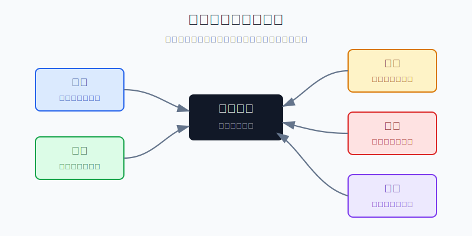
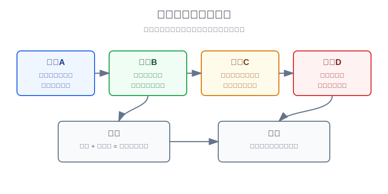
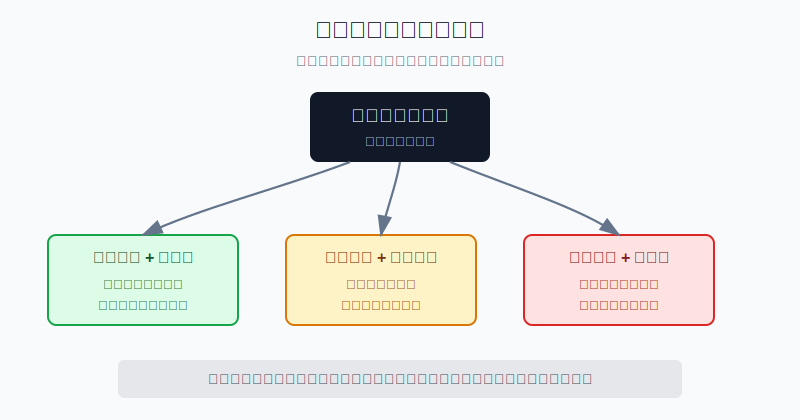
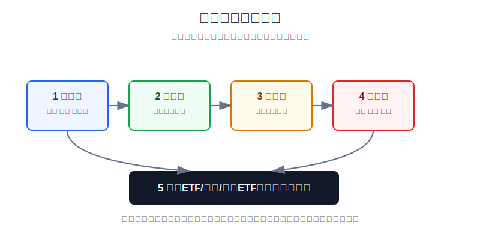

## 散户投资小白金融全品种操盘手册 - 13.2 商品价格由什么决定: 供需、库存、美元、地缘、天气
  
### 作者  
digoal  
  
### 日期  
2026-06-07   
  
### 标签  
金融产品 , 金融工具 , 散户 , 投资小白 , 全品操盘手册  
  
----  
  
## 背景 
  

> 适用读者: 已经知道商品包括能源、金属、农产品，但看到油价、铜价、粮价新闻时不知道该看哪几个变量的小白投资者。  
> 本文定位: 商品章节的认知底座，只讲判断边界和低风险参与思路，不教小白重仓做期货。

## 先问一个反直觉的问题

商品价格不是“消息越坏越涨”。同样是地缘冲突，油价可以先涨后跌；同样是干旱，农产品也不一定一路涨。原因很简单: **新闻只是火柴，真正决定火能不能烧起来的，是供需缺口、库存缓冲、美元方向和市场已经提前反映了多少。**

## 核心概念: 商品价格是一张现实世界的账单

股票价格有时会被故事、估值和情绪推很远；商品不一样，它背后有真实用途。原油要炼成汽油和柴油，铜要进电网和制造业，大豆、小麦、玉米要进入食品、饲料和工业链条。

所以小白看商品，不要先问“这个新闻是不是利好”，而要先问四个更朴素的问题:

1. 需求有没有真的增加，还是只是情绪变热？
2. 供应有没有真的减少，还是只是担心减少？
3. 库存够不够顶一段时间？
4. 美元、地缘、天气这些变量，是在同向推价格，还是互相抵消？

本节行动结论先放在前面: **小白判断商品价格，先看供需缺口和库存，再看美元、地缘和天气；只有多项变量同向、且自己使用的是商品ETF、商品基金、资源行业ETF这类低杠杆工具时，才允许用小仓位表达观点。变量不同向、工具不清楚、带杠杆，就不参与。**

## 逻辑推导链

【论证链标题】: 因为商品价格先由现实缺口驱动，再被库存、美元和突发扰动放大或压制，所以小白只能按变量同向程度小仓位参与，不能按单条新闻重仓下注。

── 第一步: 前提陈述

前提A: 商品有真实用途。这是常量。原油、铜、粮食不是一串代码，它们要被运输、储存、加工和消耗。用生活里的话说，商品价格最后要回到“货够不够用、谁愿意出更高价拿到货”。

前提B: 供需决定大方向。这是变量。需求大于供应，就像超市里的米被抢得快、补货慢，价格容易被推上去；供应大于需求，就像货架堆满但顾客少，价格就会被压住。

前提C: 库存是缓冲垫。这是变量。库存高时，短期供应扰动可以用仓库里的货顶住；库存低时，一点点供应中断都会被市场放大。库存不是价格本身，但它决定价格对坏消息有多敏感。

前提D: 美元是全球商品报价的重要尺子。这是变量。很多国际商品用美元报价。美元走强时，非美元买家要付出更多本币成本，需求会受压；美元走弱时，商品价格更容易获得金融顺风。

前提E: 地缘和天气会制造突发缺口。这是变量。战争、制裁、航运中断、飓风、干旱、洪水，都可能让供应突然变紧。但突发事件能不能持续推高价格，仍要回到前提B和C: 真实缺口多大，库存够不够。

── 第二步: 逻辑推导

由A+B可得: 因为商品要被真实消耗，所以价格大方向必须看供需。只看“新闻刺激”，不看需求和供应，就像只听别人说米要涨价，却不看仓库里到底有没有米。

再由B+C可得: 因为库存是缓冲垫，所以同样的供应冲击，在高库存和低库存环境下结果完全不同。低库存时，价格弹性变大；高库存时，价格容易冲高后回落。

再由B+C+D可得: 因为美元会影响非美元买家的购买力，所以即便商品有缺口，美元强势也会压制涨幅；反过来，若供需偏紧叠加美元偏弱，价格上涨更容易形成趋势。

最后由B+C+D+E可得: **商品价格不是由单一变量决定，而是由变量组合决定。小白的操作规则不是追逐新闻，而是确认“缺口扩大、库存低、美元不强烈逆风、突发扰动未解除”这些条件是否同向。**

── 第三步: 正常情景下的操作结论

✅ 正常情景: 商品需求没有明显走弱；供应受到约束；库存处在低位或下降；美元没有形成强逆风；地缘或天气扰动还没有解除；你使用的是商品ETF、商品基金或资源行业ETF，不使用期货杠杆。

对应操作: 只用组合里的卫星仓参与，单一商品主题不超过总投资资金的5%，商品和资源类合计不超过10%。买入前写下四项变量，买入后每周复盘一次。若库存回升、需求走弱、美元强势压制、扰动解除，满足任一条就减仓或退出。

── 第四步: 数据和案例证实

证据1: EIA 的“原油价格由什么驱动”框架把原油价格因素拆成现货价格、非OPEC供应、OPEC供应、供需平衡和库存、金融市场、非OECD需求、OECD需求等七类。这验证了前提B和C: 商品不是单靠新闻定价，供应、需求、库存和金融变量必须合起来看。

证据2: 2022年原油就是“多变量同向后再反转”的案例。EIA 数据显示，2022年 Brent 原油现货均价约100美元/桶，WTI约95美元/桶；2月24日俄罗斯全面入侵乌克兰后，地缘冲击叠加全球原油库存连续下降，把油价推到2014年以来按通胀调整后的高位。到下半年，经济衰退担忧、中国疫情管控影响需求、战略石油储备释放增加供应，油价又从高位回落。这对应推导链: 地缘能点火，但需求、库存和新增供应会决定火能烧多久。

证据3: 2020年4月 WTI 负油价是库存和交割机制失控的反例。EIA 记录，2020年4月20日，WTI近月期货一度跌到-40.32美元/桶；当时库欣工作库容约7600万桶，4月17日库存约6000万桶，账面已约76%满。这个案例说明，商品不是纯金融游戏。你买的是合约时，背后可能连着交割、仓储和流动性；小白若不懂这些边界，就不能碰期货重仓。

证据4: 农产品也服从同一条链。FAO 2026年5月食品价格指数为130.8点，较2022年3月峰值低18.4%；同一份发布中，FAO说明小麦价格受主要出口国收成预期、燃料和化肥成本影响，部分大米报价受天气担忧和原油相关成本支撑，糖价也受未来供应收紧和天气因素影响。这验证了前提E: 天气有用，但它必须通过产量、成本、库存和出口供应进入价格。

证据5: 美元会改变商品的本币压力。世界银行2022年10月报告指出，从俄罗斯入侵乌克兰到2022年9月底，Brent原油按美元计价下跌近6%，但由于货币贬值，近60%的石油进口型新兴市场和发展中经济体看到本币油价上涨；近90%的这些经济体看到本币小麦价格涨幅高于美元价格涨幅。这对应前提D: 商品不是只看美元价格，买家的本币购买力也会改变需求和通胀压力。

历史数据不代表未来。它们的参考价值在于验证结构规律: 商品价格先看真实缺口，库存决定弹性，美元改变购买力，地缘和天气制造扰动。规律本身比某一次涨跌更重要。

── 第五步: 前提变化时的替代结论

若前提C改变，也就是库存从低位回升，推导路径变为: 因为缓冲垫变厚，所以供应扰动对价格的放大作用下降。新结论: 不再追涨，已有仓位降到观察仓。

若前提D改变，也就是美元快速走强，推导路径变为: 因为非美元买家的成本上升，所以即使供需偏紧，价格也会受到金融逆风。新结论: 只观察，不加仓；若已有盈利，优先锁定部分收益。

若前提B改变，也就是需求开始走弱，推导路径变为: 因为真实消耗下降，所以地缘和天气新闻只能制造短期波动，难以支撑趋势。新结论: 商品主题仓退出，转回现金、短债或核心宽基。

失败案例: 小白最容易犯的错，是看到“战争、干旱、减产”四个字就追涨商品基金，甚至去做期货。若库存已经高、需求正在下降、美元又很强，新闻热度反而会成为高位接盘的理由。这个反例说明: 单条新闻不能替代变量组合。

## 实操例子: 10万元账户怎么看原油主题

这个例子对应论证链的正常结论: **只有供需、库存、美元和扰动多项同向时，才用低杠杆工具小仓位表达观点。**

假设小陈有10万元长期投资资金，已经留好生活备用金。他看到原油上涨新闻，想买资源行业ETF或商品基金。

第一步，写变量表。需求端: 全球经济没有明显衰退信号，汽油和工业需求稳定。供应端: 主要产油国减产或运输受阻。库存端: 原油库存处于下降或低位。美元端: 美元没有快速走强。扰动端: 地缘风险仍未解除。若四项里只有一项成立，小陈不买；若三项以上同向，才进入第二步。

第二步，选工具。小陈不碰期货、不碰带杠杆的产品，只在商品基金、商品ETF、资源行业ETF里选自己看得懂的工具。理由是前提A和C已经说明，商品背后有交割和库存问题，工具复杂度越高，小白越容易在不懂的地方亏钱。

第三步，定仓位。10万元账户里，原油或资源主题最多买5000元，占总资金5%。如果原本已经有黄金、资源股、商品基金，商品相关合计不超过10000元。商品是卫星仓，不是核心仓。

第四步，写退出条件。库存连续回升、美元明显走强、需求数据走弱、地缘扰动解除、账户中商品仓位超过10%，满足任一条就复盘减仓。这里不是“感觉不对就卖”，而是回到论证链: 变量不再同向，原来的买入理由就失效。

如果前提不成立，操作要切换。比如供应有扰动，但库存高、需求弱、美元强，小陈不买；若已经买了，就把仓位降到观察仓。操作错误的后果也清楚: 若他用期货满仓追涨，一次价格反向波动就可能触发保证金压力，把本来可控的主题学习变成被动扛单。

## 可复用框架

【四问商品】

适用前提: 你准备看原油、铜、黄金以外的工业金属、农产品、商品基金、资源行业ETF。

核心逻辑: 因为商品价格由缺口、库存、美元和扰动共同决定，所以先问变量，不先问消息。

操作步骤:

1. 问缺口: 需求是否强于供应。
2. 问库存: 库存是下降、低位，还是高位。
3. 问美元: 美元是顺风、逆风，还是中性。
4. 问扰动: 地缘、天气、运输问题有没有持续影响真实供应。

前提失效时: 只要需求走弱、库存回升、美元强逆风、扰动解除中出现两项，就不追涨；已有仓位降到观察仓。

举一反三: 这个框架也能用在黄金、能源ETF、资源股、农产品基金和通胀周期配置上。

【卫星商品仓】

适用前提: 你不是专业商品交易员，只想在组合里少量表达通胀、供需紧张或资源周期观点。

核心逻辑: 因为商品波动大、变量多、工具复杂，所以只能做组合卫星，不能替代宽基ETF、债券、现金这些核心资产。

操作步骤:

1. 单一商品主题不超过总投资资金的5%。
2. 商品和资源类合计不超过10%。
3. 只用商品ETF、商品基金、资源行业ETF等低杠杆路径。
4. 每周复盘变量表，变量失效就减仓。

前提失效时: 如果工具带杠杆、需要保证金、涉及交割或自己看不懂持仓结构，直接退出学习，不用真金白银试错。

举一反三: 这个框架也适用于第十三章后面“通胀上行时商品为什么可能表现好”和“商品追涨的风险”两节。

## 本节行动清单

| 动作 | 合格标准 |
|---|---|
| 写变量表 | 供需、库存、美元、地缘、天气至少写清4项 |
| 先看库存 | 不知道库存状态，不做商品追涨 |
| 判断美元 | 美元强逆风时，不把商品上涨当成单边趋势 |
| 只用低杠杆工具 | ETF、基金、资源行业ETF优先，不碰期货重仓 |
| 设仓位上限 | 单一商品主题不超过5%，商品和资源类合计不超过10% |
| 写退出条件 | 库存回升、需求走弱、美元走强、扰动解除就复盘减仓 |

## 一句话总结

商品价格不是被新闻直接推着走，而是由供需缺口决定方向、库存决定弹性、美元决定金融风向、地缘和天气制造扰动；小白能做的不是预测每一次波动，而是用低杠杆、小仓位、变量复盘守住边界。

## 参考资料

- U.S. Energy Information Administration: What drives crude oil prices: Overview, https://www.eia.gov/finance/markets/crudeoil/
- U.S. Energy Information Administration: Crude oil prices increased in first-half 2022 and declined in second-half 2022, 2023-01-04, https://www.eia.gov/todayinenergy/detail.php?id=55079
- U.S. Energy Information Administration: Low liquidity and limited available storage pushed WTI crude oil futures prices below zero, 2020-04-27, https://www.eia.gov/todayinenergy/detail.php?id=43495
- U.S. Energy Information Administration: Stronger U.S. dollar contributes to higher crude oil prices in international markets, 2022-05-17, https://www.eia.gov/todayinenergy/detail.php?id=52399
- FAO: FAO Food Price Index, release date 2026-06-05, https://www.fao.org/worldfoodsituation/foodpricesindex/en/
- World Bank: Commodity Markets Outlook: Currency Depreciations Risk Intensifying Food, Energy Crisis in Developing Economies, 2022-10-26, https://www.worldbank.org/en/news/press-release/2022/10/26/commodity-markets-outlook

> ⚠️ **声明**：本文内容为投资教育目的，所有历史数据、策略框架均为辅助学习工具，不构成证券投资建议。市场有风险，投资需谨慎。实际操作请结合自身风险承受能力，必要时咨询专业投顾。
  
#### [PostgreSQL 解决方案集合](../201706/20170601_02.md "40cff096e9ed7122c512b35d8561d9c8")
  
  
#### [德哥 / digoal's Github - 公益是一辈子的事.](https://github.com/digoal/blog/blob/master/README.md "22709685feb7cab07d30f30387f0a9ae")
  
  
#### [About 德哥](https://github.com/digoal/blog/blob/master/me/readme.md "a37735981e7704886ffd590565582dd0")
  
  

  
