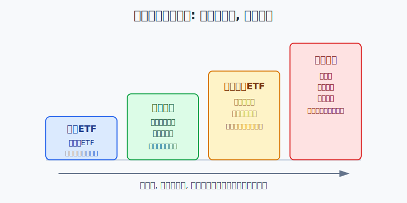
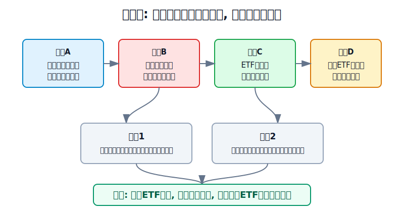
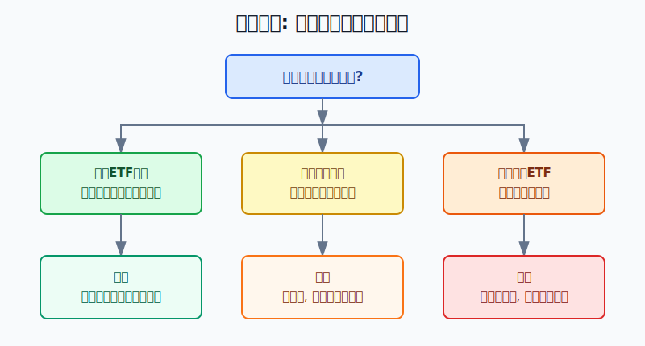

## 散户投资小白金融全品种操盘手册 - 13.3 小白参与商品的低风险路径 - 商品ETF、商品基金、资源行业ETF
  
### 作者  
digoal  
  
### 日期  
2026-06-07   
  
### 标签  
金融产品 , 金融工具 , 散户 , 投资小白 , 全品操盘手册  
  
----  
  
## 背景 
  

> 适用读者: 已经知道商品包括能源、金属、农产品，但一听到期货、保证金、合约到期就发怵的小白投资者。  
> 本文定位: 投资教育框架，不构成个性化投资建议。

## 先问一个反直觉的问题

你想参与商品，不等于你应该直接做期货。**对小白来说，离商品价格最近的工具，往往离追加保证金和强制平仓也最近。**本节讲的“低风险路径”，不是说商品没有风险，而是先把杠杆、到期和强平从个人账户里隔离出去。

## 核心概念: 低风险路径的本质是“隔离杠杆”

商品资产，就是黄金、白银、铜、原油、煤炭、豆粕、玉米这类实物或大宗原材料。它们的价格不靠公司利润驱动，而是靠供需、库存、美元、地缘、天气和产业周期驱动。

商品期货，是约定未来某个时间按规则买卖某种商品的合约。它的好处是价格发现效率高，坏处是它有保证金、每日结算和合约到期。保证金就是只拿一部分钱控制一份更大的合约；每日结算就是每天收盘后把盈亏划进划出账户；合约到期就是不能像股票一样无限期拿着等回本。

所以小白参与商品，第一目标不是“赚最多”，而是**不要让商品价格波动变成账户生存问题**。低风险路径按优先级排:

1. **商品ETF**: 优先看黄金ETF、成熟商品期货ETF。你买的是基金份额，个人账户不需要追加期货保证金。
2. **商品基金**: 可以是场外基金、联接基金或QDII商品基金。交易没那么灵活，但基金经理负责处理底层合约和展期。
3. **资源行业ETF**: 比如有色、煤炭、能源、黄金股相关ETF。它买的是股票，不是商品本身，只能当“商品相关股票资产”。
4. **直接期货**: 本章不把它列为小白默认路径。想学可以模拟、极小仓位、先学风控，不能重仓上来就干。

本节行动结论先放在前面: **小白要商品暴露，先选不需要个人追加保证金的公募产品；商品ETF优先，商品基金其次，资源行业ETF只做股票替代。没有看懂标的、净值、溢价、跟踪误差和最大回撤之前，不下单。**

## 逻辑推导链

【论证链标题】: 因为商品价格波动大，而期货机制会把波动放大成保证金压力，所以小白参与商品的正确路径，是用ETF和基金先隔离个人杠杆，再用仓位控制净值波动。

── 第一步: 前提陈述

前提A: 商品价格的驱动因素比股票更“外部”。这是常量。股票至少还能看收入、利润、现金流；商品要看供需、库存、美元、地缘、天气和运输条件。它像菜市场里的货，今天缺货、明天到货、后天暴雨，价格就会变。

前提B: 期货工具本身带有保证金、每日结算和到期机制。这是常量。中国投资者网的期货投资者教育材料说明，期货实行当日无负债结算，保证金不足要及时补足；上海期货交易所也在结算规则中说明，每个交易日闭市后会按当日结算价结算盈亏、交易保证金和相关费用。对小白来说，这意味着亏损不是账面数字，而是会变成补钱要求。

前提C: 商品ETF和商品基金能把底层期货、现货或相关资产包装成基金份额。这是常量。证监会2014年发布的商品期货ETF指引规定，商品期货ETF以持有依法批准的商品期货合约为主要策略，并在证券交易所上市交易；指引还对期货合约价值比例、非保证金资产投资和信息披露提出要求。对小白来说，基金份额不会要求你个人盘中追加期货保证金。

前提D: 资源行业ETF买的是股票，不是商品。这是变量。有色ETF、煤炭ETF、能源ETF、黄金股ETF会受商品价格影响，但还会受公司成本、产量、政策、估值、股市情绪影响。铜涨，不等于有色股一定涨；黄金涨，不等于黄金股一定跑赢黄金ETF。

── 第二步: 逻辑推导

由A+B可得: 因为商品价格会被供需、库存、天气和地缘快速改变，而期货又有保证金和每日结算，所以直接做期货会把“价格看错”升级成“账户被迫补钱或被强平”。

由B+C可得: 因为商品ETF和商品基金把底层交易放在产品内部，所以小白承担的是基金净值波动、溢价折价、跟踪误差和流动性风险，而不是个人期货账户的追加保证金压力。

再由C+D可得: 因为不同工具给你的风险不一样，所以不能把它们混成一句“买商品”。商品ETF更接近商品价格；商品基金更适合场外分批；资源行业ETF更像股票仓位，不适合当作商品本身的替代品。

最后由A+B+C+D可得: **小白参与商品的低风险路径，是先用公募产品隔离杠杆，再用小仓位控制净值波动，最后用工具类型决定复盘口径。买商品ETF复盘商品价格和溢价，买商品基金复盘净值和跟踪误差，买资源行业ETF复盘行业股票逻辑。**

── 第三步: 正常情景下的操作结论

✅ 正常情景: 你有长期配置需求，资金不是三个月内要用的钱；目标是给组合增加少量抗通胀或避险暴露；选择的商品ETF或商品基金标的清楚、规模和成交正常、没有明显高溢价，且你能接受20%以上的阶段性回撤。

对应操作: 商品相关仓位从总资产的3%-5%开始，熟悉后也不轻易超过10%。黄金ETF可以作为最容易理解的第一类商品工具；商品期货ETF或商品基金只买你看得懂的标的；资源行业ETF按股票行业基金管理，单独设仓位上限，不把它当保守资产。

── 第四步: 数据和案例证实

证据1: 公募商品工具已经有明确监管框架。证监会2014年商品期货ETF指引规定，商品期货ETF是以依法批准的商品期货合约为主要策略、跟踪商品期货价格或价格指数、并在交易所上市交易的开放式基金；同时要求披露商品期货交易情况。这个证据对应前提C: 小白不是只能在期货账户里接触商品，公募基金已经提供了被监管的包装路径。

证据2: 黄金ETF是国内投资者最容易理解、最成熟的商品ETF代表。中国黄金协会数据显示，2025年国内黄金ETF全年增仓133.118吨，至2025年12月底持仓247.852吨；2026年一季度国内黄金ETF增仓50.438吨，至2026年3月底持仓298.289吨。这个证据对应正常结论: 当小白需要商品暴露时，黄金ETF这类标准化产品比实物囤货和杠杆交易更适合作为第一课。

证据3: 商品基金并不等于普通股票债券基金。美国CFTC在2020年关于商品ETP和基金的客户提示中提醒，使用期货、期权、掉期等工具的商品ETP或基金，不一定像传统股票ETF或债券基金那样表现；期货合约有到期和展期，长期收益不一定等于现货商品涨幅。这个证据对应前提B和C: 基金帮你隔离了个人保证金，但没有消灭底层期货结构风险。

证据4: 2020年4月20日，NYMEX近月WTI原油期货结算价跌到-37.63美元/桶。美国能源信息署EIA复盘称，低流动性、可用库存受限、需求急降和合约临近到期共同推动了负价格。这个案例对应本节反例: 期货风险不只是“涨跌”，还包括合约月份、交割地、库存和展期。小白如果只听“油价便宜”就直接冲期货，会面对自己解释不了、也扛不住的机制风险。

历史不代表未来。上面数据仍有参考价值，是因为它验证的不是某个商品必涨，而是商品工具的结构差异: 直接期货是合约和保证金游戏，商品ETF和基金是净值和仓位游戏，资源行业ETF是股票行业游戏。

── 第五步: 前提变化时的替代结论

若前提C改变，也就是商品ETF成交很冷、买卖价差很大、场内价格明显高于参考净值，推导路径变为: 因为你买到的是场内交易价格，而不是自动按净值成交，所以低风险路径会被高溢价破坏。新结论: 不追，等溢价回落，或换成同类场外基金。

若前提D改变，也就是你买的是资源行业ETF但把它当成黄金或原油本身，推导路径变为: 因为资源股还受股市估值、公司经营和政策影响，所以商品涨价不能保证ETF上涨。新结论: 把它放进股票卫星仓，而不是放进防守仓。

若前提A改变，也就是商品进入极端行情，例如战争、天气灾害、库存逼仓或交易所提高保证金，推导路径变为: 因为价格波动和交易限制都会放大，所以你的动作不是加杠杆赌方向，而是降仓位、暂停追买、等待产品公告和净值稳定。

失败案例: 2020年原油负价格说明，“商品很便宜”不是直接买期货的充分理由。近月合约临近到期、库存接近瓶颈、展期成本急剧变化时，看对长期油价也可能在短期合约上亏到无法承受。这个反例的教训是: 小白先学工具边界，再谈价格判断。

## 实操例子: 10万元账户想配置商品，怎么做

这个例子对应论证链的正常结论: **先用公募产品隔离杠杆，再用小仓位试错；不同工具用不同复盘口径。**

假设小林有10万元长期投资资金，已经有宽基ETF、短债基金和现金管理。他担心通胀和地缘风险，想拿一小部分资金参与商品。

第一步，先定上限。小林把商品相关仓位上限定为8000元，也就是总资产的8%。第一次只用4000元试仓，剩下4000元等复盘后再说。这个动作对应前提A: 商品波动大，先用仓位承认自己会看错。

第二步，先选最清楚的工具。小林如果主要想要避险和抗货币信用风险，优先研究黄金ETF，而不是黄金T+D或黄金期货。他要检查基金跟踪什么、场内成交额、买卖价差、溢价率和基金公告。这个动作对应前提C: 买基金份额，不把个人账户放进保证金系统。

第三步，再看商品基金。小林如果想参与有色、能源化工或农产品方向，只能选择自己能看懂合同和风险揭示的商品期货ETF、联接基金或商品基金。他必须确认三个问题: 底层跟踪哪个指数，是否持有期货合约，展期规则会不会让长期收益偏离现货价格。这个动作对应CFTC提示的期货展期风险。

第四步，资源行业ETF单独归类。小林如果买有色、煤炭、能源或黄金股ETF，只能放在股票卫星仓里。例如最多买2000元，复盘时看行业景气、公司盈利、估值和股市风险，而不是只看铜价或金价。这个动作对应前提D: 资源ETF不是商品本身。

第五步，写清楚情景切换。若黄金ETF溢价超过学习红线、成交突然变差，小林暂停新买；若商品基金连续明显跑输标的指数，他停止加仓并读公告；若资源行业ETF上涨只是情绪炒作、估值过热，他按股票基金规则减仓。

如果操作错误，后果很清楚。小林如果跳过这些步骤，直接用5万元做期货，10%的商品价格反向波动在杠杆下会迅速变成保证金压力；一旦被要求补钱，他很可能被迫在最坏的位置砍仓。纠偏方法不是继续加钱扛单，而是退出直接期货，回到商品ETF和商品基金，用小仓位重新学习。

## 可复用框架

【隔离杠杆】

适用前提: 你想参与商品价格，但没有系统学习期货保证金、每日结算、展期和交割规则。

核心逻辑: 因为商品价格本身波动大，期货机制又会放大账户压力，所以先用公募产品把个人保证金风险隔离出去。

操作步骤:

1. 先排除直接期货、杠杆类工具和需要追加保证金的路径。
2. 优先看商品ETF，尤其是标的清楚、成交正常、溢价不高的产品。
3. 再看商品基金，重点读标的指数、期货展期、费用和历史最大回撤。
4. 最后才看资源行业ETF，并把它当股票仓位。

前提失效时: 如果你连产品跟踪什么都说不清，动作不是小买一点试试，而是暂停。商品不是靠感觉买的品种。

举一反三: 这个框架也能用在黄金、白银、原油、豆粕、有色金属和能源化工基金上。

【三问选品】

适用前提: 你已经打开交易软件，准备买一只商品相关产品。

核心逻辑: 因为商品ETF、商品基金、资源行业ETF给你的风险不同，所以先分清风险来源，再决定仓位。

操作步骤:

1. 第一问: 我买的是商品本身、商品期货，还是资源公司股票？
2. 第二问: 我最坏的损失是净值回撤，还是会出现追加保证金？
3. 第三问: 我能不能看到净值、溢价、成交额、基金公告和最大回撤？

前提失效时: 如果答案里出现“我不知道，但最近很热”，动作直接切换为不买。热点不是风控。

举一反三: 这个框架也适用于跨境ETF、REITs、可转债基金和任何名字听起来稳、底层却复杂的产品。

## 本节行动清单

| 动作 | 合格标准 |
|---|---|
| 先定目标 | 知道自己是为了避险、抗通胀、分散组合，还是短线追涨 |
| 排除杠杆 | 小白默认不碰需要个人追加保证金的路径 |
| 识别工具 | 分清商品ETF、商品基金、资源行业ETF、直接期货 |
| 看交易成本 | 场内产品检查成交额、买卖价差、溢价率 |
| 看底层结构 | 商品基金必须看标的指数、期货展期和最大回撤 |
| 控制仓位 | 新手商品相关仓位从3%-5%开始，熟悉后也不轻易超过10% |
| 分类复盘 | 商品ETF看商品和溢价，商品基金看净值和跟踪，资源ETF看股票行业逻辑 |

## 一句话总结

小白参与商品，第一原则不是离商品最近，而是离强平最远；先用商品ETF和商品基金隔离杠杆，再用小仓位学习商品价格，资源行业ETF只能当股票替代，不能当商品本身。

## 参考资料

- 中国证监会: 《公开募集证券投资基金运作指引第1号——商品期货交易型开放式基金指引》，2014年，https://www.gov.cn/gongbao/content/2015/content_2843797.htm
- 中国投资者网: 《第一章 期货交易的特点和风险》，来源中国期货业协会，2016年，https://www.investor.org.cn/learning_center/investors_classroom/investment_guide/futures/online/zqjc_667/201606/t20160618_67501.shtml
- 上海期货交易所投资者教育: 《结算》，2026年访问，https://www.shfe.com.cn/specialtopic/investor/settlement/
- 中国黄金协会: 《2026年一季度我国黄金产量81.065吨，同比下降7.08%，黄金消费量303.292吨，同比增长4.41%》，2026年5月9日，https://www.cngold.org.cn/news/show-9282.html
- 中国黄金协会: 《2025年我国黄金产量377.242吨，同比增长0.56%，黄金消费量985.31吨，同比下降3.53%》，2026年2月5日，https://www.cngold.org.cn/news/show-8980.html
- CFTC: Customer Advisory on Commodity ETPs and Funds，2020年5月22日，https://www.cftc.gov/PressRoom/PressReleases/8167-20
- U.S. Energy Information Administration: Low liquidity and limited available storage pushed WTI crude oil futures prices below zero，2020年4月28日，https://www.eia.gov/todayinenergy/detail.php?id=43495

> ⚠️ **声明**：本文内容为投资教育目的，所有历史数据、策略框架均为辅助学习工具，不构成证券投资建议。市场有风险，投资需谨慎。实际操作请结合自身风险承受能力，必要时咨询专业投顾。
  
#### [PostgreSQL 解决方案集合](../201706/20170601_02.md "40cff096e9ed7122c512b35d8561d9c8")
  
  
#### [德哥 / digoal's Github - 公益是一辈子的事.](https://github.com/digoal/blog/blob/master/README.md "22709685feb7cab07d30f30387f0a9ae")
  
  
#### [About 德哥](https://github.com/digoal/blog/blob/master/me/readme.md "a37735981e7704886ffd590565582dd0")
  
  

  
