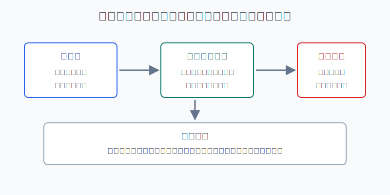
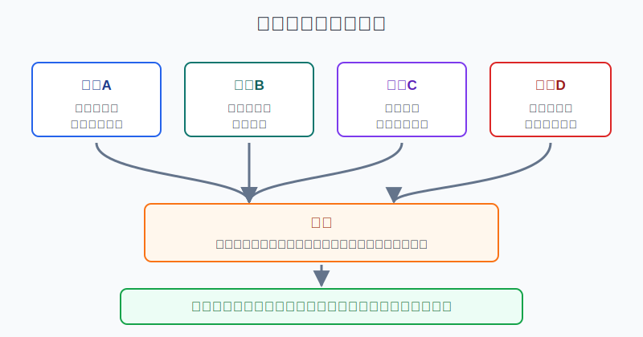
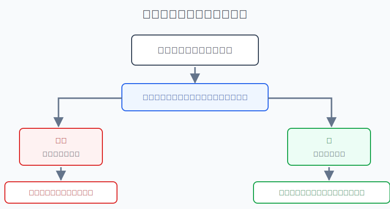

## 散户投资小白金融全品种操盘手册 - 13.4 期货是什么 - 保证金、杠杆、每日结算
  
### 作者  
digoal  
  
### 日期  
2026-06-07   
  
### 标签  
金融产品 , 金融工具 , 散户 , 投资小白 , 全品操盘手册  
  
----  
  
## 背景 
  

> 适用读者: 已经知道商品会受供需、库存、美元、地缘和天气影响，但还分不清“买商品基金”和“做期货”差别的小白投资者。  
> 本文定位: 投资教育框架，不构成个性化投资建议。

## 先问一个反直觉的问题

期货最容易误导人的地方，是它看起来“门槛不高”。一张名义价值10万元的合约，也许只需要1万元左右保证金就能开仓。但这不是便宜，这是杠杆。**你不是用1万元买了1万元商品，而是用1万元押金承担10万元合约的涨跌。**

## 核心概念: 期货是一张按天结账的标准化合约

期货，就是交易所统一设计的标准化合约。它约定了品种、数量、交割月份、最小变动价位、涨跌停板、保证金和交割规则。小白先不用急着研究复杂策略，只要先记住一句话: **期货不是买下一堆现货，而是在交易一张未来履约的合约。**

这里有三个关键词。

保证金，是你为了开仓和维持持仓放在账户里的履约资金。它不是首付款，也不是“最多亏这么多”。CME Group 的投资者教育页面解释，期货保证金不是购买现货的首付款，通常只是合约名义价值的一小部分；中国证监会天津监管局的期货投资者教育材料也提醒，期货保证金制度会带来“以小博大”的杠杆效应。

杠杆，是保证金和合约名义价值之间的放大关系。假设一张合约名义价值10万元，保证金率10%，你用1万元控制10万元合约。标的价格涨1%，合约盈亏约1000元；放到账户保证金上，就是约10%的变化。价格跌1%，也是同样放大。

每日结算，也叫当日无负债结算。意思是每天收盘后，交易所按结算价把当天盈亏划到账户里。深圳证监局2024年的投资者教育案例提醒，结算价通常不等于收盘价，结算后账户权益会变化。对小白来说，这句话很关键: **股票可以账面亏着先不卖，期货亏损会每天变成保证金压力。**

本节行动结论先放在前面: **小白理解期货的第一目标不是学会开仓，而是知道它为什么不能重仓参与。没有合约名义价值意识、追加保证金预案、止损纪律和模拟训练前，不做实盘；即使学习实盘，也只能用极小学习仓，不能借钱、不能满仓、不能扛单。**

## 逻辑推导链

【论证链标题】: 因为期货盈亏按合约名义价值计算，而保证金只占一部分，并且每日结算会把亏损立刻变成现金压力，所以小白不能把期货当成普通投资品重仓参与。

── 第一步: 前提陈述

前提A: 期货盈亏按整张合约的名义价值计算。这是常量。它像你只交了押金租一辆重型卡车，但路上刮蹭的赔偿按整辆车算，不按押金算。

前提B: 保证金只是履约担保，不是最大亏损额。这是常量，但保证金比例是变量。交易所和期货公司会根据品种风险、波动、节假日和市场异常情况调整保证金标准。CME Group 说明，期货保证金要求会随市场条件和波动变化。

前提C: 期货实行每日结算。这是常量。每天的盈亏都会进入账户权益，亏损导致资金低于维持要求时，就要追加保证金、主动减仓，或者承受被强行平仓的风险。

前提D: 商品价格背后有现货供需、库存、运输、交割和突发事件。这是变量。小白看到的是K线，产业交易者看到的是仓库、船期、库存、基差和交割规则。认知差距越大，越不能重仓。

── 第二步: 逻辑推导

由A+B可得: 因为盈亏按整张合约算，而你只交一部分保证金，所以价格小幅波动会变成账户的大幅波动。保证金越低，杠杆越高，账户承受同样价格波动的能力越弱。

再由B+C可得: 因为保证金不是最大亏损额，且每天都要结算，所以亏损不是“先放着以后再说”。当账户资金不够时，你必须拿出新现金或降低仓位。

再由C+D可得: 因为商品期货可能遇到库存、交割、涨跌停、跳空和流动性变化，所以“我到时止损”不一定能按理想价格完成。越接近交割、越不了解合约规则，错误成本越高。

最终由A+B+C+D可得: **期货不是小白的默认投资工具，而是高风险学习工具。小白的正常动作是先模拟、先读合约规则、先算最坏情形；没有这些前提，直接不做实盘。**

── 第三步: 正常情景下的操作结论

✅ 正常情景: 你只是想学习商品和期货机制，没有企业套期保值需求；资金是完全可以亏损的学习资金；已经能读懂合约名义价值、保证金、每日结算、涨跌停、交割月份和持仓限制；已经在模拟盘连续记录至少20笔交易。

对应操作: 先不做实盘。若一定要用实盘学习，账户总资金中只划出极小学习资金，单笔最大亏损先控制在总投资资金的1%以内，并预留至少两到三倍于交易保证金的可用资金。只做自己能解释清楚的合约，不碰临近交割、流动性差和保证金突然上调的品种。触发止损、保证金压力或看不懂行情时，先退出。

── 第四步: 数据和案例证实

证据1: 中国期货业协会发布的2025年12月全国期货市场交易情况显示，2025年1-12月全国期货市场累计成交量为9,073,926,691手，累计成交额为7,662,537.24亿元，同比分别增长17.4%和23.74%。这说明期货市场体量巨大、参与者专业化程度高，小白面对的不是一个“随手试试”的简单市场。

证据2: CME Group 的期货保证金教育材料说明，期货保证金通常只占合约名义价值的3%-12%；其清算保证金实践说明还指出，履约保证金常被称为初始保证金，是为未平仓头寸未来潜在损失提供担保的诚信押金，并且至少每日重新计算。这对应前提B和C: 保证金是风险担保，不是买断成本。

证据3: 中国证监会《期货交易所管理办法》规定，期货交易所应当建立保证金管理制度，期货交易实行当日无负债结算制度，并且在特定情况下可以提高保证金标准、限期平仓或强行平仓。这对应前提C: 亏损和保证金压力会被制度化地处理，不是投资者想拖就能拖。

失败案例: 2020年4月20日，CFTC关于NYMEX WTI原油期货的临时报告显示，WTI 2020年5月合约结算价为每桶-37.63美元，这是该合约上市37年以来首次负价格。报告还指出，当时临近到期、现货供需和库容等因素共同影响价格。这个案例不是让你预测负油价，而是提醒你: 期货合约背后有交割和现货约束，价格可以走到小白直觉之外。

历史不代表未来。上面案例仍有参考价值，是因为它验证的不是“原油一定会再负价”，而是期货的结构规律: 合约名义价值、保证金、每日结算、交割规则和现货约束共同决定风险。只看涨跌方向，不看这些机制，就是拿账户去补课。

── 第五步: 前提变化时的替代结论

若前提“已理解保证金和每日结算”不成立，推导路径变为: 因为你不知道亏损如何变成追加保证金压力，所以任何实盘都会变成盲开。新结论: 暂停实盘，只看教材、交易所规则和模拟结算单。

若前提“有额外现金”不成立，推导路径变为: 因为每日结算需要真实资金承接亏损，所以账户不能满仓占用保证金。新结论: 不开仓；已经开仓的，优先减仓到可用资金充足。

若前提“流动性正常、合约不临近交割”改变，推导路径变为: 因为平仓难度、跳空和交割约束都会上升，所以原来的止损计划可能失效。新结论: 小白提前远离临近交割合约和成交稀薄合约，不把交割规则当小事。

若前提“只是学习”悄悄变成“想靠期货翻本”，推导路径变为: 因为杠杆会放大情绪错误，所以亏损后加仓、借钱补保证金、扛单都会把学习风险变成生存风险。新结论: 立即停止交易，先复盘资金曲线和规则执行。

## 实操例子: 20万元账户看到期货机会，怎么先算边界

这个例子对应论证链的正常结论: **先把合约名义价值、保证金和每日结算算清楚，再决定是否只能模拟。**

假设小周有20万元长期投资资金，已经通过商品基金和资源行业ETF了解过商品周期。某天他看到一个商品期货合约快速上涨，想用实盘学习。为了不绑定具体品种，我们用教学数字演示: 某合约名义价值10万元，交易保证金率10%，一手占用保证金1万元。

第一步，先算真实暴露。买一手不是投1万元，而是承担10万元合约涨跌。价格波动1%，合约盈亏约1000元；如果保证金只放1万元，账户中这笔保证金的盈亏波动约10%。这对应前提A+B。

第二步，检查可用资金。若小周账户里只放1万元就开一手，等于没有缓冲。价格跌2%，亏损约2000元；若保证金要求从10%提高到12%，同一手合约需要的保证金从1万元变成1.2万元。价格亏损和保证金提高叠加，账户很快出现追加资金压力。这对应前提B+C。

第三步，写退出规则。小周不能写“跌了就等等”。合格写法是: 这笔只是学习仓；若合约亏损达到总投资资金的0.5%-1%，或者可用资金低于预设安全垫，立即平仓；若交易所上调保证金、品种临近交割、成交量明显下降，提前退出。这对应前提C+D。

第四步，判断是否该实盘。对小白来说，这个例子的正确答案通常不是“开一手”，而是“先模拟20笔”。模拟时每天记录四个数: 合约名义价值、占用保证金、当日结算盈亏、可用资金变化。只有连续多次能解释结算单，才谈极小实盘。

如果操作错误，后果很直接。小周若看到保证金只要1万元，就用10万元开10手，名义暴露变成100万元。标的价格反向波动1%，账户亏损约1万元；反向波动5%，亏损约5万元，还可能叠加追加保证金。此时他不是在学商品，而是在让杠杆替自己决定命运。纠偏方法只有一个: 先把仓位降到能睡得着，再补课。

## 可复用框架

【三数先算】

适用前提: 你正在研究任何期货合约，准备判断能不能参与。

核心逻辑: 因为期货盈亏按名义价值算，而保证金只是履约押金，所以先算三组数字，再谈观点。

操作步骤:

1. 算名义价值: 合约价格乘以合约乘数，得到一手到底控制多少钱。
2. 算保证金: 名义价值乘以保证金率，得到一手占用多少资金。
3. 算一跳和1%波动: 价格最小变动和1%波动分别对应多少盈亏。
4. 算可用资金: 账户里除占用保证金外，还剩多少资金承接亏损和保证金上调。

前提失效时: 三个数字算不出来，不开仓；算出来后发现1%波动就让自己难受，也不开仓。

举一反三: 这个框架也适用于黄金T+D、期权卖方、杠杆ETF和融资交易。凡是带杠杆的工具，都先算真实暴露。

【日结红线】

适用前提: 你已经持有或模拟持有期货头寸。

核心逻辑: 因为期货每天结算，所以风险管理也要按天执行，不能等到月底再看。

操作步骤:

1. 每天收盘后看结算单，不只看K线收盘价。
2. 记录账户权益、占用保证金、可用资金和风险度。
3. 可用资金低于预设安全垫时，先减仓，不靠临时借钱补保证金。
4. 合约临近交割、流动性下降、保证金上调时，提前退出学习仓。

前提失效时: 看不懂结算单、不能每天检查、不能接受强制平仓风险时，停止实盘。

举一反三: 这个框架也适用于任何需要保证金维持的交易。重点不是预测明天，而是今天账户还能不能承受错误。

## 本节行动清单

| 动作 | 合格标准 |
|---|---|
| 先识别合约 | 写清品种、合约月份、合约乘数、最小变动价位和交割规则 |
| 先算名义价值 | 不用保证金金额替代真实风险暴露 |
| 先看保证金 | 知道交易所保证金和期货公司保证金可能不同，也可能上调 |
| 先懂每日结算 | 每天看结算价、账户权益、占用保证金和可用资金 |
| 先做模拟 | 至少模拟20笔并能解释结算单后，再考虑极小学习仓 |
| 不碰红线 | 不借钱、不满仓、不扛单、不临近交割硬做、不用期货翻本 |

## 一句话总结

期货的本质不是“用小钱赚大钱”，而是“用少量保证金承担整张合约的每日盈亏”；小白先学会敬畏保证金、杠杆和每日结算，才有资格继续学习后面的风控边界。

## 参考资料

- 中国期货业协会: 2025年12月全国期货市场交易情况，2026年1月9日，https://www.cfachina.org/servicesupport/researchandpublishin/statisticalsdata/monthlytransactiondata/202601/t20260109_85987.html
- 中国证监会深圳监管局: 了解期货无负债结算制度，正确读懂期货交易结算单，2024年10月9日，https://www.csrc.gov.cn/shenzhen/c105614/c7521985/content.shtml
- 中国证监会天津监管局: 投资者保护教育（期货），2012年11月9日，https://www.csrc.gov.cn/tianjin/c105377/c1263609/content.shtml
- 中国证监会: 期货交易所管理办法，https://www.csrc.gov.cn/csrc/c101902/c1039265/content.shtml
- CME Group: Margin: Know What's Needed，https://www.cmegroup.com/education/courses/introduction-to-futures/margin-know-what-is-needed
- CME Group: 101 Overview: CME Clearing Performance Bond Practices，https://www.cmegroup.com/articles/brochures-and-handbooks/101-overview-cme-clearing-performance-bond-practices.html
- CFTC: Interim Staff Report on Trading in NYMEX WTI Crude Oil Futures Contract Leading up to, on, and around April 20, 2020，https://www.cftc.gov/media/5296/InterimStaffReportNYMEX_WTICrudeOil/download

> ⚠️ **声明**：本文内容为投资教育目的，所有历史数据、策略框架均为辅助学习工具，不构成证券投资建议。市场有风险，投资需谨慎。实际操作请结合自身风险承受能力，必要时咨询专业投顾。
  
#### [PostgreSQL 解决方案集合](../201706/20170601_02.md "40cff096e9ed7122c512b35d8561d9c8")
  
  
#### [德哥 / digoal's Github - 公益是一辈子的事.](https://github.com/digoal/blog/blob/master/README.md "22709685feb7cab07d30f30387f0a9ae")
  
  
#### [About 德哥](https://github.com/digoal/blog/blob/master/me/readme.md "a37735981e7704886ffd590565582dd0")
  
  

  
