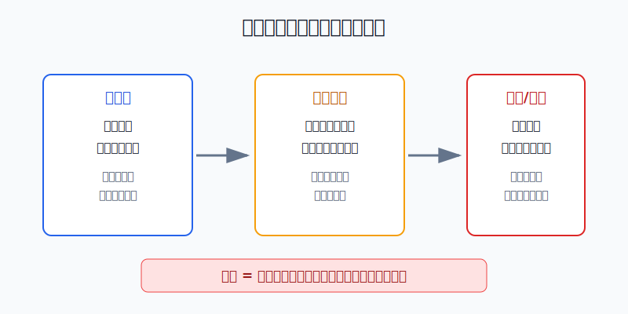
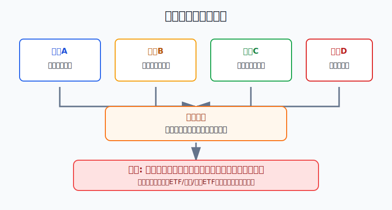
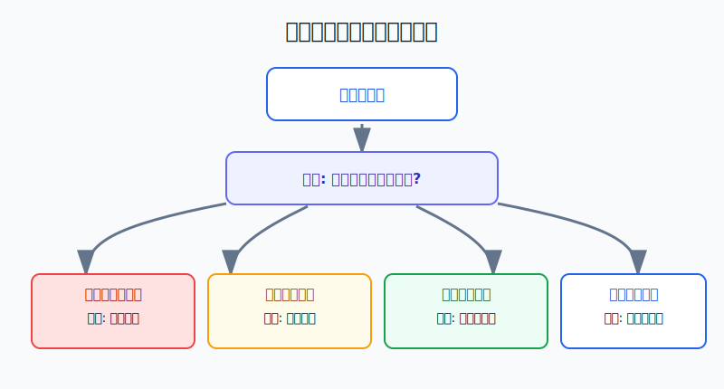

## 散户投资小白金融全品种操盘手册 - 13.5 为什么期货不适合大多数小白重仓参与
  
### 作者  
digoal  
  
### 日期  
2026-06-07   
  
### 标签  
金融产品 , 金融工具 , 散户 , 投资小白 , 全品操盘手册  
  
----  
  
## 背景 
  

> 适用读者: 已经知道期货有保证金和杠杆，但还被“本金少、赚钱快、双向交易”吸引的小白投资者。  
> 本文定位: 投资教育框架，不构成个性化投资建议。

## 先问一个反直觉的问题

期货最迷人的地方，正是它最危险的地方: 你不用拿出全部货款，只交一部分保证金，就能控制一张大合约。**这看起来是在提高资金效率，实际是在把价格波动、时间压力和情绪压力一起放大。**

## 核心概念: 期货不是“买便宜资产”，而是“用保证金控制合约”

期货合约，可以理解成一张标准化的买卖协议: 到未来某个时间，按合约规则交易某种商品、金融指数或其他标的。你真正买卖的不是一袋大豆、一吨铜，也不是一篮子股票，而是一张由交易所统一设计、每天结算盈亏的合约。

这里有三个词，小白必须先听懂。

保证金，就是开仓时交的一部分资金。它像押金，但不是普通押金。普通买股票，10万元最多买10万元股票；期货里，10万元可能控制几十万元甚至上百万元名义价值的合约。名义价值，就是这张合约代表的完整货值。

杠杆，就是“控制的合约价值 ÷ 你实际交的保证金”。如果一张合约名义价值100万元，保证金比例是10%，你交10万元就能控制100万元，杠杆就是10倍。价格只反向波动1%，合约名义价值亏1万元，对你的10万元保证金来说就是亏10%。

每日结算，就是交易所和期货公司每天按结算价把盈亏记到账上。股票跌了你可以先不卖，账面浮亏还在；期货亏损会直接减少可用资金。资金不够维持保证金要求时，就会触发追加保证金或强行平仓。强行平仓，就是期货公司为了控制风险，按规则替你平掉持仓。

所以本节行动结论先放在前面: **大多数小白不要重仓参与期货。默认路径是先用商品ETF、商品基金、资源行业ETF理解商品逻辑；如果一定学习期货，只能先模拟，再用总账户1%以内的极小观察仓，且每笔交易都必须提前写好止损、追保上限和退出条件。**

## 逻辑推导链

【论证链标题】: 因为期货用保证金放大合约价值，又实行每日结算和追加保证金，所以它不适合大多数小白重仓参与。

── 第一步: 前提陈述

前提A: 期货交易天然带杠杆。这是常量。保证金制度让你用一部分钱控制一张完整合约，像只付了车的押金就开走整辆车。车速提高了，刹车距离也变长了。

前提B: 期货盈亏每天结算，亏损会变成真实资金压力。这是常量。它不像普通基金那样主要看净值波动，期货账户每天都要看权益、可用资金和保证金占用。方向错了，不是“再等等”这么简单，而是资金够不够的问题。

前提C: 商品价格的波动经常来自小白看不全的变量。这是变量。能源看地缘和库存，农产品看天气和种植，金属看需求和美元，黑色系看政策和产业链利润。你可能看对了长期通胀，却错过了库存、基差、限仓、移仓和交割月风险。

前提D: 小白最容易在亏损后扩大仓位。这是常量。期货的双向交易、保证金和日内波动，会让人误以为“只要下一把方向对，就能赚回来”。这正是重仓和频繁交易最容易出现的心理入口。

── 第二步: 逻辑推导

由A可得: 因为保证金把合约价值放大，所以同样1%的价格波动，对期货保证金账户的冲击远大于普通现货或基金账户。

由A+B可得: 因为亏损被杠杆放大，且每天结算，所以方向小错也会很快变成追加保证金压力。小白不是只在判断价格，还在和资金耐受度赛跑。

再由A+B+C可得: 因为商品变量复杂，价格还可能隔夜跳动，所以“我看对大方向”不足以保证账户安全。期货交易错在节奏、仓位或资金安排上，也会被迫出局。

最后由A+B+C+D可得: 因为小白通常没有成熟的风控流程，且亏损后容易加仓翻本，所以期货不能重仓。正常结论是: **大多数小白把期货放在学习区，不放在核心资产区；先学机制和风控，再谈策略。**

── 第三步: 正常情景下的操作结论

✅ 正常情景: 你已经理解商品价格驱动，已经用ETF或基金观察过商品波动；生活备用金充足；这笔钱亏掉也不会影响生活；你只是学习期货机制，不是想靠期货翻本。

对应操作: 先模拟交易至少3个月，记录每次开仓理由、止损点、保证金占用、最大浮亏和是否按计划退出。模拟仍然稳定执行规则后，实盘观察仓控制在总账户1%以内，单笔亏损上限控制在观察仓的10%以内。任何时候都不借钱、不满仓、不因为亏损追加大额保证金。

── 第四步: 数据和案例证实

证据1: 美国CFTC在期货市场基础教育材料中说明，期货交易者通常不需要支付合约全部价值，而是缴纳通常为合约总价值2%到10%的保证金；持仓随后会每日按市值结算。NFA也提醒，期货交易只能使用可承受损失的风险资金，交易者可能需要弥补超过原本预计投入资金的亏损缺口。这个证据对应前提A: 保证金不是降低风险，而是降低入场资金，同时放大账户波动。

证据2: CME Group在期货教育材料中说明，期货使用履约保证金，持仓会按市场价格逐日盯市结算，账户需要满足维持保证金要求；如果账户权益低于要求，交易者需要补足资金。这个证据对应前提B: 期货亏损会变成每日资金管理问题。

证据3: 中国金融期货交易所的沪深300股指期货合约页面显示，合约乘数为每点300元，最低交易保证金为合约价值的8%。这意味着当沪深300指数在4000点时，一张合约名义价值约120万元，最低保证金约9.6万元；指数反向波动1%，合约名义价值亏约1.2万元，对9.6万元保证金就是约12.5%的冲击。这个数字对应前提A+B: 小幅价格变化，在保证金账户里会变成大比例波动。

证据4: CFTC在2024年发布的零售期货交易研究中分析了36538个零售期货账户。研究发现，样本中的中位数交易者估计亏损约100到200美元；亏损分布左偏，亏损额整体大于盈利额；第一次交易出现较大美元亏损，与永久离开期货市场显著相关。这个证据对应前提D: 对小白而言，真正危险的不是“期货一定不能赚钱”，而是学习成本可能在第一轮实盘中被杠杆和情绪迅速放大。

失败案例: 2020年4月WTI原油期货5月合约结算价跌至负值，出现了很多普通投资者完全没预料到的价格结构变化。这个事件不代表所有商品都会跌到负价，但它说明期货合约有交割、期限结构、流动性和极端行情风险。若小白只看“油价已经很低”，却不懂合约到期和移仓，就会把方向判断变成合约规则错误。

历史不代表未来。上面数据仍有参考价值，是因为它们验证的是结构规律: 保证金会放大波动，每日结算会制造资金压力，极端行情会让“我再等等”失效。期货不是坏工具，但它要求的风控能力远高于普通基金和ETF。

── 第五步: 前提变化时的替代结论

若前提“只是学习机制”改变，变成“想靠期货快速回本”，推导路径变为: 因为情绪已经压过风控，所以杠杆会把一次亏损扩大成连续错误。新结论: 停止实盘，回到模拟盘和复盘表。

若前提“能承受亏损”不成立，推导路径变为: 因为亏损会影响生活钱、防守钱或信用负债，所以不能把期货当投资工具。新结论: 只看商品ETF、商品基金或资源行业ETF，不开期货仓。

若前提“能盯盘和追踪保证金”不成立，推导路径变为: 因为每日结算和追保不会等你有空，所以不能持有真实期货仓位。新结论: 不做实盘，最多做行情复盘和模拟。

若前提C恶化，也就是出现库存异常、政策变化、交割月临近、夜盘大波动或流动性下降，推导路径变为: 因为合约规则风险超过方向判断，所以先降仓或清仓。新结论: 退出比证明自己看对更重要。

## 实操例子: 10万元账户被期货吸引，怎么处理

这个例子对应论证链的正常结论: **期货只能放在学习区，不能重仓，也不能替代商品ETF或资源ETF。**

假设小陈有10万元投资资金，其中6万元是长期ETF组合，2万元是现金和短债防守，2万元是学习仓。他看到铜价上涨、原油反弹，觉得“商品周期来了”，想开期货账户做多。

第一步，先切资金角色。6万元长期ETF组合不能动，2万元防守资金不能动，最多只能从2万元学习仓里拿出一小部分。按照总账户1%以内的观察仓规则，小陈最多拿1000元到1000多元级别学习，不允许拿2万元甚至10万元去重仓。

第二步，先做3个月模拟。模拟不是随便点买卖，而是每次都写五项: 开仓理由、合约代码、保证金占用、止损价、最大亏损金额。若连续20笔模拟交易里，有3次以上没有按止损执行，说明问题不是行情，而是纪律，不能进入实盘。

第三步，实盘前先算最坏账。假设某合约名义价值20万元，保证金比例10%，一手需要2万元保证金。小陈只有10万元总资金，如果开一手，就相当于用20%总资金控制20万元合约；价格反向波动3%，合约亏6000元，对保证金是30%的损失，对总账户是6%的损失。若再遇到追加保证金，他很容易为了“不被平仓”继续往里塞钱。

第四步，若合约保证金已经超过观察仓上限，直接不做。小陈不应该为了“至少买一手”去扩大仓位，因为期货合约的最小交易单位本身就可能超过小账户的风险预算。买不起合适仓位，不是错过机会，而是工具不匹配。

第五步，若一定想表达商品观点，换低风险路径。比如用商品ETF、商品基金或资源行业ETF做小比例配置。它们也会跌，也不保本，但没有期货的每日追保和强平压力，更适合小白先理解商品周期。

如果前提不成立，操作必须切换。比如小陈是亏损后想翻本，或者工作日不能看盘，或者不懂交割月和移仓，那就不做期货实盘。先把交易冲动写进复盘表: “我到底是在学习，还是在赌下一把？”

如果操作错误，后果很清楚: 重仓期货亏损后，小陈会面对三个选择: 补保证金、被迫平仓、或者加大仓位试图回本。三个选择都可能让原本可控的学习亏损，变成整个账户的系统性风险。纠偏方法只有一个: 先把仓位降到学习仓范围内，再重新写规则。

## 可复用框架

【三问禁重】

适用前提: 你正在考虑开期货仓，或者已经被某个商品行情吸引。

核心逻辑: 因为期货风险来自杠杆、每日结算和复杂变量，所以先问三件事，再决定是否参与。

操作步骤:

1. 问资金: 这笔钱亏掉是否影响生活、防守仓或长期组合？
2. 问机制: 是否知道合约乘数、保证金、每日结算、交割月和强平规则？
3. 问退出: 是否提前写了止损、追保上限和退出条件？

前提失效时: 任意一个问题答不上来，不开实盘；已经开仓就先降到观察仓，再复盘。

举一反三: 这个框架也适用于黄金T+D、杠杆ETF、期权买方和任何带保证金的交易。

【一仓学习】

适用前提: 你不是为了翻本，而是为了理解期货机制。

核心逻辑: 因为小白最缺的是风控肌肉，所以把期货限定为学习仓，而不是收益仓。

操作步骤:

1. 先模拟3个月，记录每笔交易的理由、止损和复盘。
2. 实盘观察仓控制在总账户1%以内，单笔亏损控制在观察仓10%以内。
3. 不追保扩仓，不扛单，不把亏损单改成长期投资。
4. 一旦连续3笔违反规则，停止实盘一个月，只做复盘。

前提失效时: 如果开始借钱、满仓、频繁加保证金或想靠下一笔回本，立刻退出期货学习仓。

举一反三: 学任何高风险工具，都可以先设“学习仓”。学习仓的目标不是赚钱，而是验证自己能不能按规则活下来。

## 本节行动清单

| 动作 | 合格标准 |
|---|---|
| 先识别资金角色 | 生活钱、防守钱、长期核心仓不进期货 |
| 先算合约名义价值 | 写清合约乘数、价格、一手名义价值和保证金 |
| 先做模拟 | 至少3个月，记录开仓、止损、最大浮亏和复盘 |
| 仓位极小 | 实盘观察仓不超过总账户1% |
| 写追保上限 | 亏损后不无限追加保证金 |
| 不扛单 | 触发止损或前提失效，先退出 |
| 不用期货回本 | 亏损后想翻本时，停止实盘 |

## 一句话总结

期货不是“小本金赚大钱”的捷径，而是“用小保证金承担大合约波动”的工具；小白真正要学的第一课，不是怎么重仓抓行情，而是怎么在杠杆面前先活下来。

## 参考资料

- CFTC: Retail Traders in Futures Markets, 2024, https://www.cftc.gov/sites/default/files/2024-11/Retail_Traders_Futures_V2_new_ada.pdf
- CFTC: Futures Market Basics, 2026年访问, https://www.cftc.gov/LearnAndProtect/EducationCenter/FuturesMarketBasics/index2.htm
- CFTC: Economic Purpose of Futures Markets and How They Work, 2026年访问, https://www.cftc.gov/LearnAndProtect/AdvisoriesAndArticles/economicpurpose.html
- NFA: Investor Best Practices, 2026年访问, https://www.nfa.futures.org/investors/investor-resources/files/investor-best-practices.html
- CME Group: Performance Bonds/Margins FAQ, 2026年访问, https://www.cmegroup.com/solutions/risk-management/performance-bonds-margins/faq-performance-bonds-margins.html
- CME Group: Mark-to-Market, 2026年访问, https://www.cmegroup.com/education/courses/introduction-to-futures/mark-to-market
- 中国金融期货交易所: 沪深300股指期货合约, 2026年访问, https://www.cffex.com.cn/cn/hs300.html
- EIA: Low liquidity and limited available storage pushed WTI crude oil futures prices below zero, 2020-04-27, https://www.eia.gov/todayinenergy/detail.php?id=43495

> ⚠️ **声明**：本文内容为投资教育目的，所有历史数据、策略框架均为辅助学习工具，不构成证券投资建议。市场有风险，投资需谨慎。实际操作请结合自身风险承受能力，必要时咨询专业投顾。
  
#### [PostgreSQL 解决方案集合](../201706/20170601_02.md "40cff096e9ed7122c512b35d8561d9c8")
  
  
#### [德哥 / digoal's Github - 公益是一辈子的事.](https://github.com/digoal/blog/blob/master/README.md "22709685feb7cab07d30f30387f0a9ae")
  
  
#### [About 德哥](https://github.com/digoal/blog/blob/master/me/readme.md "a37735981e7704886ffd590565582dd0")
  
  

  
