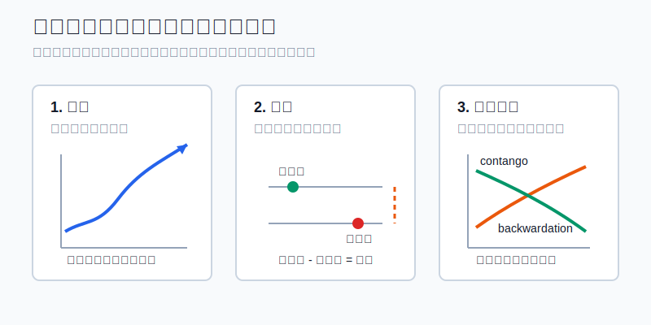
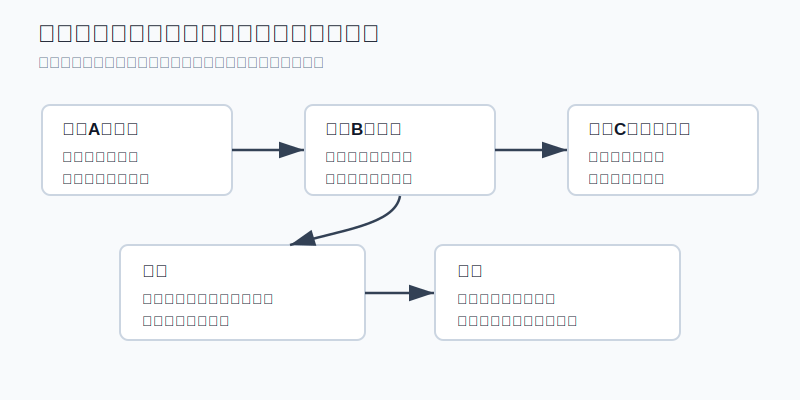
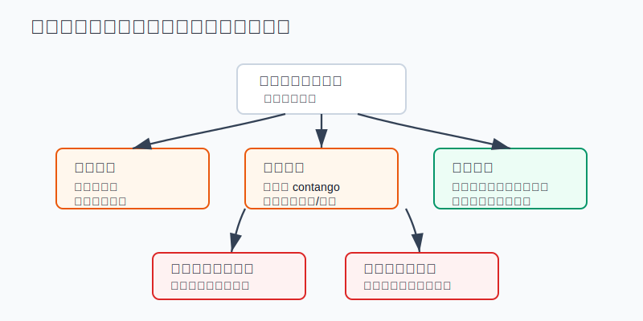

## 散户投资小白金融全品种操盘手册 - 13.6 趋势、基差、期限结构
  
### 作者  
digoal  
  
### 日期  
2026-06-07   
  
### 标签  
金融产品 , 金融工具 , 散户 , 投资小白 , 全品操盘手册  
  
----  
  
## 背景 
  


> 适用读者: 已经知道期货有保证金、杠杆和每日结算，但还分不清“看涨商品”和“买期货合约”为什么不是一回事的小白投资者。  
> 本文定位: 投资教育框架，不构成个性化投资建议。

## 先问一个反直觉的问题

你判断原油未来会涨，这个方向后来也对了，但你买的商品基金或期货合约仍然亏钱。问题不一定出在“看错方向”，而是你只看了趋势，没有看基差和期限结构。



## 核心概念: 三个词其实是三副镜片

趋势，就是价格正在往哪个方向走。最简单的看法是：高点和低点都在抬高，说明上升趋势更清楚；高点和低点都在下移，说明下降趋势更清楚。趋势回答的是“风往哪边吹”。

基差，就是现货价格和期货价格之间的差。常用公式是：

```text
基差 = 现货价格 - 期货价格
```

现货价格，可以理解成今天真实买卖一吨铜、一桶油、一吨豆粕的价格；期货价格，是交易所里某个未来月份合约的价格。基差回答的是“现实仓库里的货，和屏幕上的合约，差了多远”。

期限结构，就是同一个商品不同到期月份合约排成的一条曲线。近月便宜、远月贵，叫 contango，中文常说升水结构；近月贵、远月便宜，叫 backwardation，中文常说贴水结构或反向市场。它回答的是“你从这个月合约换到下个月合约，是顺风还是逆风”。

本节行动结论先放在前面：**小白看商品，不要把趋势当成唯一信号。趋势只决定方向，基差决定现货压力，期限结构决定持有和换月成本。三项没有同向支持时，不重仓、不扛单、不碰临近交割合约；最多做观察、模拟或用低风险商品基金学习。**



## 逻辑推导链

【论证链标题】: 因为商品期货收益同时受价格方向、现货压力和合约滚动影响，所以小白不能只看趋势就重仓参与。

── 第一步: 前提陈述

前提A: 趋势只能说明过去一段时间价格更偏向上涨或下跌。这是变量。它像看河水流向，能告诉你水面往哪边动，但不能告诉你前面有没有闸门、暗礁和急弯。

前提B: 商品期货最终要靠现货世界校准。CME的教育材料把基差解释为现金市场价格和期货价格之间的关系，并给出“现货价格 - 期货价格 = 基差”的公式；它还强调，临近到期时，现货和期货的价格关系会通过套利和交割机制收敛。这是常量，但收敛过程会受仓储、运输和流动性影响。

前提C: 不同到期月份的合约价格不一样。这是常量。CME对 contango 的解释是：现货低于期货，远期曲线向上，可能来自仓储、融资和保险等持有成本；backwardation 则是现货高于远月期货，常和库存紧张、持有实物有额外价值有关。

前提D: 小白最容易把“商品价格会上涨”误解成“买任意相关工具都会赚钱”。这是常量。商品ETF、商品基金和期货合约常常要换月；当远月比近月贵时，卖掉便宜的近月、买入更贵的远月，会形成滚动成本。

── 第二步: 逻辑推导

由A可得: 因为趋势只回答方向，所以它不能单独决定交易。上升趋势中也会有回撤，下降趋势中也会有反弹。

由A+B可得: 因为期货价格要和现货世界发生联系，所以基差变化会改变交易结果。若价格上涨但基差走弱，说明期货涨得比现货更快，屏幕上的热度已经跑在现实供需前面，追涨的安全边际会下降。

再由B+C可得: 因为合约到期前要收敛，且不同月份价格不同，所以持有期货或期货型基金不是“买了一个永远不变的商品”。你持有的是一串会到期、要切换的合约。

最后由A+B+C+D可得: **看商品必须同时看三件事：趋势是否清楚，基差是否支持，期限结构是否友好。三项同向，才有学习价值；三项冲突，先停手。**

── 第三步: 正常情景下的操作结论

✅ 正常情景: 趋势向上；现货需求真实改善，基差没有持续走弱；期限结构没有出现深度 contango；你只用学习仓位，不碰临近交割，不使用借钱或满仓。

对应操作: 小白可以把商品放进观察池，优先研究商品ETF、商品基金或资源行业ETF，而不是直接重仓期货。若一定要学习期货，只能用模拟盘或极小仓位，并提前写清楚退出条件：趋势破位退出，基差异常退出，期限结构恶化退出，保证金压力上升退出。

── 第四步: 数据和案例证实

证据1: CME的农业期货自学材料说明，基差是影响套期保值结果的最重要因素之一，公式是“现货市场价格 - 期货市场价格 = 基差”。同一份材料还提醒，现货和期货虽然通常同向变化，但变化幅度不一定相同，差异就是基差变化。这对应前提B：方向相同，不代表结果相同。

证据2: CME关于 contango 和 backwardation 的说明指出，contango 是现货低于期货、远期曲线向上，可能来自仓储、融资和保险成本；backwardation 是现货高于远期价格、远期曲线向下，可能来自持有实物的便利收益。它还说明，期货临近到期会向现货价格收敛，否则会出现套利机会。这对应前提C：期限结构不是术语游戏，而是持有成本和库存状态的价格表达。

证据3: 2020年4月20日，WTI原油5月合约出现历史性负价。EIA在2020年4月27日的复盘中写到，WTI近月期货当天在纽约商业交易所首次跌到负值，约美东时间14:30低至-40.32美元/桶；CFTC临时报告记录，5月合约最终结算价为-37.63美元/桶，并且其他到期月份当日仍以正价格结算。EIA还给出关键背景：库欣工作库容7600万桶，截至2020年4月17日库存约6000万桶，其中约5800万桶在库区，约76%已满。这个案例对应前提B和C：临近交割、仓储紧张、流动性不足，会让近月合约走势和“长期看油价”完全分开。

证据4: USO在提交给SEC的2020年一季度报告中披露，2020年3月 contango 显著扩大并达到历史水平；报告还解释，当近月低于远月，即市场处于 contango 时，只持有近月原油期货的组合，表现可能不同于持有12个月期货组合。这对应前提D：普通投资者买到的不是“现货原油本身”，而是经过合约选择和换月之后的价格结果。

历史不代表未来。上面数据仍有参考价值，是因为它们验证的不是某个商品一定涨跌，而是商品期货的结构规律：趋势、基差和期限结构会共同影响结果；当交割、库存、换月这些前提改变时，方向判断会失效。

── 第五步: 前提变化时的替代结论

若前提C改变，也就是期限结构从平缓变成深度 contango，推导路径变为: 因为远月显著高于近月，所以持有和换月成本上升。新结论: 不追商品基金净值反弹，不把短期上涨当长期配置机会；动作改为观察期限结构是否修复。

若前提B改变，也就是基差持续走弱，推导路径变为: 因为期货价格跑得比现货更快，所以上涨更多来自金融交易热度，而不是现货紧张。新结论: 不追涨，已有仓位降低到学习仓位或退出。

若前提A改变，也就是趋势破位，推导路径变为: 因为方向信号已经不成立，所以不能再用“基差以后会修复”安慰自己。新结论: 按计划退出，不加保证金扛单。

失败案例: 2020年4月WTI近月合约不是“油没有价值”，而是临近交割的金融合约遇到仓储和流动性压力。若小白只看到“油价跌这么多，一定会涨回来”，却不懂合约到期、库容和期限结构，就可能在错误月份、错误工具、错误仓位上承担无法理解的风险。



## 实操例子: 5万元账户怎样学习商品信号

这个例子对应论证链的正常结论: **趋势、基差、期限结构三项都支持时，也只允许学习仓位；三项冲突时，动作是暂停，而不是找理由重仓。**

假设小陈有5万元投资资金，已经知道期货不适合自己重仓。他想学习铜或原油这类商品，但不确定怎么判断。

第一步，只建观察表，不先下单。表里写四列：主力合约趋势、现货价格相对期货的基差、近月到远月的期限结构、自己能用的工具。若他找不到现货价格和不同月份合约价格，说明还没达到实盘学习条件。

第二步，看趋势。比如某商品主力合约过去两个月高点和低点抬高，价格站在20日均线之上，趋势记为“向上”。这一步只说明方向，不允许直接买入。

第三步，看基差。若现货也强，基差没有连续走弱，说明现实需求和屏幕价格没有明显背离；若期货涨很多、现货跟不上，基差持续走弱，动作改为暂停。判断依据是论证链前提B：期货最终要和现货世界校准。

第四步，看期限结构。若近月和远月价格差不大，或者不是深度 contango，说明换月成本相对可控；若远月明显贵于近月，动作改为只观察商品基金，不做长期持有假设。判断依据是前提C和D：持有期货型工具绕不开换月。

第五步，限定仓位。即使三项都支持，小陈也只拿总资金的2%，也就是1000元，做商品ETF或商品基金的学习仓位；若一定要模拟期货，只用模拟盘，不上真实杠杆。学习目标不是赚钱，而是记录三项信号在未来四周如何变化。

第六步，写退出条件。趋势跌破关键均线或前低，退出；基差连续走弱，退出；期限结构转为深度 contango，退出；工具出现高溢价、流动性差或自己看不懂净值来源，退出。

如果前提不成立，操作必须切换。比如趋势还向上，但期限结构已经深度 contango，小陈不能说“反正方向对”。正确动作是暂停买入，观察远近月价差是否收敛。若已经持有商品基金，则把仓位降到不影响心态的学习仓位，并在复盘里写清楚：这笔交易风险来自换月成本，不是来自短期涨跌。

如果操作错误，后果很直接。小陈若把5万元中的3万元押到单一商品期货，价格反向波动5%，在杠杆下可能触发追加保证金；他会被迫在最差的时候补钱或平仓。纠偏方式不是继续加保证金，而是把仓位降回学习额度，重新从三项观察表开始。

## 可复用框架

【三镜确认】

适用前提: 你想研究商品、商品ETF、商品基金或期货合约，但不确定信号是否足够。

核心逻辑: 因为商品期货收益由趋势、基差和期限结构共同决定，所以三副镜片至少不能互相打架。

操作步骤:

1. 趋势镜: 只判断方向，记录上涨、下跌或震荡。
2. 基差镜: 看现货和期货是否背离，基差持续走弱则暂停追涨。
3. 曲线镜: 看近月到远月是 contango 还是 backwardation，深度 contango 不做长期持有假设。
4. 仓位镜: 三项同向也只用学习仓位，三项冲突直接观察。

前提失效时: 如果你找不到基差和期限结构数据，说明信息不足；如果临近交割规则看不懂，说明工具不适合；如果保证金压力让你睡不好，说明仓位已经超出学习范围。

举一反三: 这个框架可以用于原油、铜、豆粕、螺纹钢、黄金、白银，也可以用于判断商品ETF为什么和现货涨跌不完全一致。

【先问结构】

适用前提: 你已经看好某个商品方向，准备买入相关工具。

核心逻辑: 因为方向判断只解决一半问题，所以先问结构，再问交易。

操作步骤:

1. 我买的是现货、股票、ETF、基金，还是期货合约？
2. 这个工具是否需要换月？
3. 当前换月是顺风还是逆风？
4. 如果方向对但工具亏，我能解释原因吗？

前提失效时: 如果第四个问题答不上来，就不下单。小白不能用真金白银去补自己没有理解的结构课。

举一反三: 这个框架也适用于黄金ETF、资源股、能源基金、农产品基金和跨境商品ETF。名字都叫“商品”，底层结构可能完全不同。

## 本节行动清单

| 动作 | 合格标准 |
|---|---|
| 先看工具 | 分清现货、商品ETF、商品基金、资源股、期货合约 |
| 记录趋势 | 用同一套规则判断上涨、下跌或震荡 |
| 计算基差 | 能写出现货价、期货价和基差方向 |
| 看期限结构 | 能识别 contango、backwardation 和换月成本 |
| 避开交割 | 不持有自己不懂的临近交割合约 |
| 限定仓位 | 真实资金只用学习仓位，期货优先模拟 |
| 写退出条件 | 趋势破位、基差异常、曲线恶化、保证金压力上升都退出 |

## 一句话总结

商品期货不是只猜涨跌；趋势告诉你风向，基差告诉你现实有没有跟上，期限结构告诉你持有这阵风要付多少钱。

## 参考资料

- CME Group: Agricultural Products Self Study Guide, Basis and General Hedge Theory, https://www.cmegroup.com/trading/agricultural/files/AC-215_SelfStuy_GuideNYMEX.pdf
- CME Group: Learn about Grain Convergence, https://www.cmegroup.com/education/courses/introduction-to-grains-and-oilseeds/learn-about-grain-convergence
- CME Group: What is Contango and Backwardation, https://www.cmegroup.com/education/courses/introduction-to-ferrous-metals/what-is-contango-and-backwardation
- U.S. Energy Information Administration: Low liquidity and limited available storage pushed WTI crude oil futures prices below zero, 2020-04-27, https://www.eia.gov/TODAYINENERGY/detail.php?id=43495
- CFTC: Interim Staff Report on Trading in NYMEX WTI Crude Oil Futures Contract Leading up to, on, and around April 20, 2020, 2020, https://www.cftc.gov/media/5296/InterimStaffReportNYMEX_WTICrudeOil/download
- SEC EDGAR: United States Oil Fund, LP Form 10-Q for quarter ended March 31, 2020, https://www.sec.gov/Archives/edgar/data/1327068/000110465920058624/uso-20200331x10q.htm

> ⚠️ **声明**：本文内容为投资教育目的，所有历史数据、策略框架均为辅助学习工具，不构成证券投资建议。市场有风险，投资需谨慎。实际操作请结合自身风险承受能力，必要时咨询专业投顾。
  
#### [PostgreSQL 解决方案集合](../201706/20170601_02.md "40cff096e9ed7122c512b35d8561d9c8")
  
  
#### [德哥 / digoal's Github - 公益是一辈子的事.](https://github.com/digoal/blog/blob/master/README.md "22709685feb7cab07d30f30387f0a9ae")
  
  
#### [About 德哥](https://github.com/digoal/blog/blob/master/me/readme.md "a37735981e7704886ffd590565582dd0")
  
  

  
