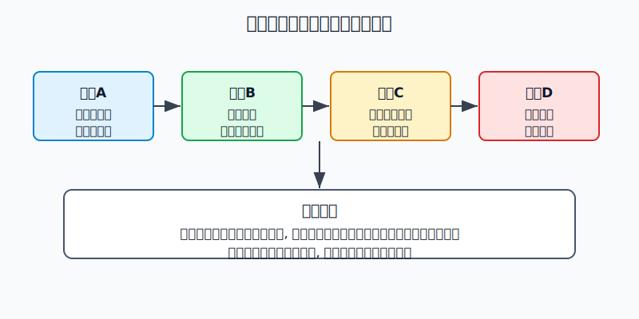
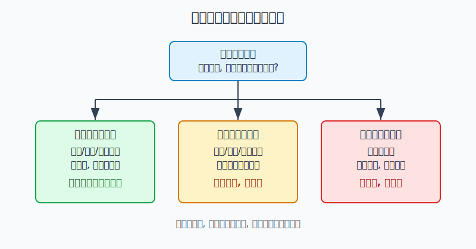
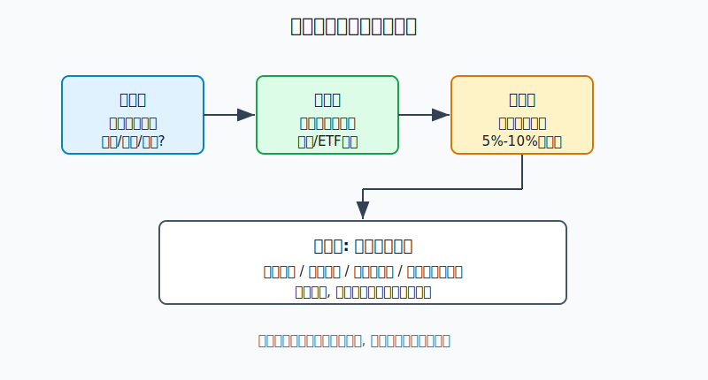

## 散户投资小白金融全品种操盘手册 - 13.7 通胀上行时商品为什么可能表现好
  
### 作者  
digoal  
  
### 日期  
2026-06-07   
  
### 标签  
金融产品 , 金融工具 , 散户 , 投资小白 , 全品操盘手册  
  
----  
  
## 背景 
  

> 适用读者: 已经知道商品包括能源、金属、农产品，也知道期货有杠杆，但还不明白“为什么一说通胀，市场就会想到商品”的小白投资者。  
> 本文定位: 投资教育框架，不构成个性化投资建议。

## 先问一个反直觉的问题

通胀上行时，大家第一反应常常是买黄金、买原油、买资源股。这个反应不完全错，但少了一个关键条件: **只有当通胀的源头来自真实商品涨价，商品资产才更容易表现好；如果通胀来自服务价格、工资粘性，或者央行紧缩把需求打下去，追商品反而容易买在山顶。**

## 核心概念: 商品是经济里的“原材料账单”

商品不是一个神秘资产，它就是经济运行离不开的原料: 原油、天然气、煤炭是能源；铜、铝、铁矿石是工业金属；玉米、小麦、大豆是农产品；黄金、白银是贵金属。

用生活里的比喻，商品像一家饭店的米、油、燃气和电费。菜单价格还没来得及涨，厨房成本已经先涨了。所以当通胀来自能源、粮食、金属这些原料涨价时，商品价格往往比很多股票利润更早反应。

但这不等于“通胀=商品必涨”。商品有三个小白必须记住的特点: 第一，供给修复慢，矿山、油田、农作物不是今天涨价明天就能大规模增产；第二，价格波动大，商品金融产品很多通过期货合约实现，会有移仓和期限结构影响；第三，商品不产生现金流，它更像一张通胀压力表，而不是能长期自己长大的公司。

本节行动结论先放前面: **小白只在“商品短缺型通胀”里用商品基金、商品ETF或资源行业ETF做小比例对冲；不碰重仓期货，不把商品仓当核心仓；一旦供给恢复、需求塌陷或央行强紧缩，商品仓要从进攻改回观察。**

## 逻辑推导链

【论证链标题】: 因为商品是通胀上游原料，且供给不能马上扩张，所以商品短缺型通胀会抬高商品资产胜率；但当前提变成需求衰退或服务型通胀时，商品追涨逻辑失效。

── 第一步: 前提陈述

前提A: 商品是经济的上游原料。这是常量。油价涨，运输、化工、航空、快递都会感到压力；煤价、电价、天然气价格涨，工厂成本会被推高；粮食涨，食品加工和餐饮成本会变高。商品价格不是消费价格的全部，但它常常是通胀的第一层成本。

前提B: 商品供给不能立刻增加。这是常量。一个油田、矿山、港口、航线、种植季，都有真实物理约束。价格涨可以刺激供给，但中间要经过审批、投资、开采、运输和库存调整，不像手机软件一样马上复制。

前提C: 通胀来源会变化。这是变量。通胀可以来自能源和粮食冲击，也可以来自房租、工资、医疗、服务价格粘性。只有前者更直接指向商品资产；后者未必利好商品。

前提D: 商品需求也会被高价格和高利率打下来。这是变量。价格涨太多会破坏需求，央行加息会压制经济活动，美元走强也会让以美元计价的商品对非美元买家更贵。

── 第二步: 逻辑推导

由A+B可得: 因为商品是原料，而且供给修复慢，所以当供需缺口出现时，商品价格会先通过涨价来“逼需求让路”。这就是为什么能源危机、粮食短缺、金属库存低时，商品价格能比很多股票更快反应。

再由A+B+C可得: 因为商品短缺会推高PPI和CPI里的能源、食品、工业品分项，所以在这种通胀里，商品基金、商品ETF和资源行业ETF有机会成为组合里的通胀对冲仓。

再由C+D可得: 因为不是所有通胀都来自商品，而高利率和衰退会反过来压需求，所以“看到通胀就追商品”是跳步推理。正确顺序是: **先判断通胀来源，再看供需缺口，再选低杠杆工具，最后设仓位上限。**

── 第三步: 正常情景下的操作结论

✅ 正常情景: 通胀上行的主要来源是能源、粮食、金属等上游商品；库存偏低或供应受扰；经济需求还没有快速塌陷；你已经有现金、宽基ETF和防守资产，不是拿生活钱来赌行情。

对应操作: 小白可以用5%-10%的学习仓参与商品主题，优先选择商品基金、商品ETF或资源行业ETF；只把它当通胀对冲，不把它当核心资产。买入前必须写清楚三个条件: 通胀来源是什么，商品供需缺口在哪里，什么情况说明前提失效。

── 第四步: 数据和案例证实

证据1: 2022年美国通胀高点就是典型的商品冲击型通胀。美国劳工统计局2022年6月CPI报告显示，CPI同比上涨9.1%，能源指数同比上涨41.6%，汽油同比上涨59.9%，食品同比上涨10.4%。这说明当能源和食品冲击很强时，商品价格会直接进入居民通胀账单。

证据2: 世界银行在2022年4月《Commodity Markets Outlook》中判断，俄乌战争造成商品市场重大冲击，预计2022年能源价格上涨超过50%，非能源价格上涨约20%，布伦特原油均价约100美元/桶。这个案例对应前提A+B: 商品不是屏幕上的数字，它背后有运输、产地、贸易路线和供应链。

证据3: S&P Dow Jones Indices 的指数教育材料显示，S&P GSCI商品指数在2021年和2022年分别上涨约40%和26%；同一材料还提示，过去表现不保证未来结果。这对应本节结论: 商品在通胀压力上行阶段确实有过强表现，但它是条件成立时的对冲工具，不是永久上涨工具。

证据4: 中国也出现过上游商品冲击。国家统计局数据显示，2021年10月全国PPI同比上涨13.5%，工业生产者购进价格同比上涨17.1%，其中煤炭开采和洗选业价格同比上涨103.7%。这说明原材料价格可以先在企业出厂价和购进价里体现，之后才决定能否传导到消费端。

失败案例: 2008年原油就是“追商品也会被反杀”的反例。EIA月度数据中，WTI原油2008年7月均价约133.37美元/桶，到12月均价降至41.12美元/桶。问题不是7月时原油不重要，而是金融危机让需求快速塌陷，前提D改变了: 高价格没有继续带来上涨，反而触发需求破坏和去库存。

历史不代表未来。上面数据有参考价值，是因为它们验证的是结构规律: 商品短缺会先推高上游价格，商品资产可能受益；但当需求塌陷、供给恢复或货币政策强紧缩时，同一条逻辑会反向。

── 第五步: 前提变化时的替代结论

若前提C改变，也就是通胀主要来自服务、房租、工资和医疗，而不是能源、粮食、金属，推导路径变为: 因为商品不是主要涨价源头，所以商品资产不一定受益。新结论: 不追商品，把重点放在现金流、防守资产和组合再平衡上。

若前提D改变，也就是央行强紧缩、经济需求转弱、库存开始累积，推导路径变为: 因为需求下降会压低商品价格，所以商品仓从对冲仓变成回撤来源。新结论: 降低商品仓位，优先保留现金、短债或核心宽基。

若前提B改变，也就是供给快速恢复、航运和库存压力缓解，推导路径变为: 因为缺货溢价消失，所以商品价格可能回落。新结论: 不把历史涨幅当未来理由，仓位超过计划上限就减回去。

## 实操例子: 10万元组合怎么处理商品通胀

这个例子对应论证链的正常结论: **先判断通胀来源，再看供需缺口，再选低杠杆工具，最后设仓位上限。**

假设小林有10万元长期投资资金，生活备用金已经留好，核心仓已有宽基ETF和债券基金。他看到新闻里能源、粮食和金属价格上涨，担心通胀侵蚀购买力，但没有期货经验。

第一步，先判断通胀来源。小林不问“商品还能不能涨”，先看CPI和PPI分项: 如果能源、食品、工业原材料是主要贡献，说明前提C偏向商品短缺型通胀；如果只是服务价格粘性，商品仓暂停。

第二步，选择工具。小林不用期货，不用杠杆账户，而是在商品基金、商品ETF、黄金ETF、资源行业ETF之间做选择。若他看不懂具体品种，就只选覆盖面更广、规模更大、流动性更好的工具。

第三步，设仓位上限。他把商品学习仓上限设为8%，也就是8000元，分三次进入: 第一次3000元，第二次3000元，第三次2000元。每次买入都要确认同一个前提: 商品涨价仍来自供给约束和上游成本压力，而不是单纯情绪追涨。

第四步，写退出条件。若能源和粮食价格回落、PPI开始明显下行、库存回升，说明前提B和C变弱，商品仓减半；若央行强加息导致需求塌陷，说明前提D改变，商品仓不再加码；若商品仓因为上涨超过组合10%，把超出部分转回核心仓或现金。

第五步，纠偏。小林如果看到商品基金一个月涨了15%，就把8000元上限改成3万元，这不是对冲通胀，而是追涨。纠偏动作很简单: 回到仓位上限，商品仓只服务于“通胀压力对冲”，不能替代核心资产配置。

## 可复用框架

【三问商品】

适用前提: 你看到通胀上行，想知道要不要配置商品。

核心逻辑: 因为商品只对特定通胀更敏感，所以先问来源，再问缺口，最后问仓位。

操作步骤:

1. 问来源: 通胀主要来自能源、粮食、金属，还是服务和工资?
2. 问缺口: 供给是否受限，库存是否偏低，需求是否还没塌?
3. 问仓位: 商品仓是5%-10%的对冲仓，还是被你做成重仓赌博?

前提失效时: 如果通胀不是商品驱动，不加商品仓；如果供给恢复或需求塌陷，降仓位；如果商品仓超过上限，先再平衡。

举一反三: 这个框架也能用在黄金、资源股、商品ETF、能源基金和农产品基金上。

【对冲不重仓】

适用前提: 你已经判断商品短缺型通胀成立，但不知道怎么买。

核心逻辑: 因为商品波动高、没有现金流、很多产品通过期货实现，所以它适合做对冲仓，不适合做小白主仓。

操作步骤:

1. 优先选择低杠杆、规则清楚、流动性好的基金或ETF。
2. 仓位先从5%开始，最多不超过自己写下的上限。
3. 每周只检查前提是否还成立，不因短期涨跌频繁交易。

前提失效时: 通胀来源变成服务粘性，商品仓暂停；需求衰退出现，商品仓降低；期货产品出现高溢价或看不懂移仓成本，不买。

举一反三: 这个框架也适用于第七章黄金、第八章REITs和第十五章仓位管理: 防守工具可以进组合，但不能因为短期表现好就变成全部仓位。

## 本节行动清单

| 动作 | 合格标准 |
|---|---|
| 分清通胀来源 | 能说出是能源、粮食、金属驱动，还是服务和工资驱动 |
| 不碰重仓期货 | 小白默认用基金、ETF或资源行业ETF学习 |
| 写供需前提 | 买入前写清供给约束、库存、需求是否仍成立 |
| 设置仓位上限 | 商品仓只做5%-10%对冲仓，不替代核心资产 |
| 识别失效信号 | 供给恢复、需求塌陷、央行强紧缩时主动降仓位 |
| 不追历史涨幅 | 已经大涨后先问前提是否还在，而不是问还能涨多少 |

## 一句话总结

通胀上行时商品可能表现好，不是因为“通胀”两个字有魔法，而是因为能源、粮食、金属等上游原料涨价会先推高成本；小白只在商品短缺型通胀里小比例对冲，前提一变就降仓位。

## 参考资料

- U.S. Bureau of Labor Statistics: Consumer Price Index News Release, June 2022，https://www.bls.gov/news.release/archives/cpi_07132022.htm
- World Bank: Commodity Markets Outlook, April 2022，https://www.worldbank.org/en/news/press-release/2022/04/26/food-and-energy-price-shocks-from-ukraine-war
- S&P Dow Jones Indices: Why S&P GSCI?，November 2024，https://www.spglobal.com/spdji/en/documents/education/education-why-sp-gsci.pdf
- 国家统计局: 2021年10月份工业生产者出厂价格同比上涨13.5% 环比上涨2.5%，https://www.stats.gov.cn/sj/zxfb/202302/t20230203_1901273.html
- U.S. Energy Information Administration: Cushing, OK WTI Spot Price FOB，https://www.eia.gov/dnav/pet/hist/LeafHandler.ashx?f=M&n=PET&s=RWTC

> ⚠️ **声明**：本文内容为投资教育目的，所有历史数据、策略框架均为辅助学习工具，不构成证券投资建议。市场有风险，投资需谨慎。实际操作请结合自身风险承受能力，必要时咨询专业投顾。
  
#### [PostgreSQL 解决方案集合](../201706/20170601_02.md "40cff096e9ed7122c512b35d8561d9c8")
  
  
#### [德哥 / digoal's Github - 公益是一辈子的事.](https://github.com/digoal/blog/blob/master/README.md "22709685feb7cab07d30f30387f0a9ae")
  
  
#### [About 德哥](https://github.com/digoal/blog/blob/master/me/readme.md "a37735981e7704886ffd590565582dd0")
  
  

  
