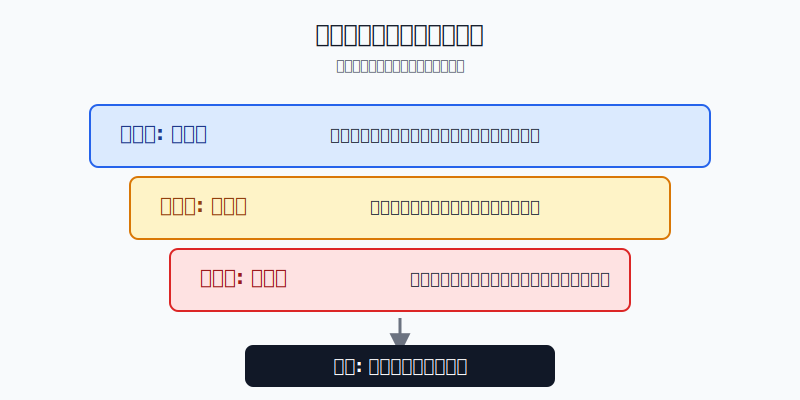
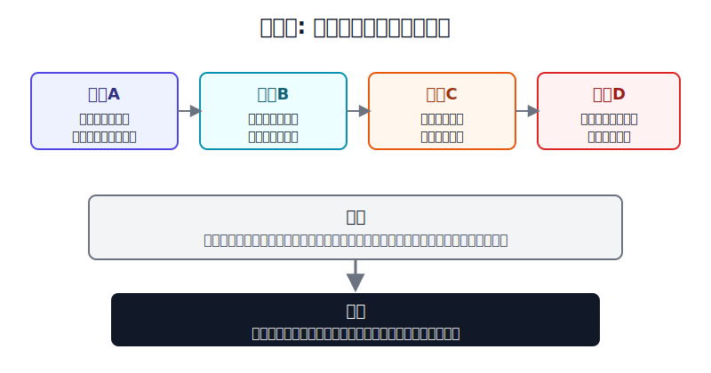
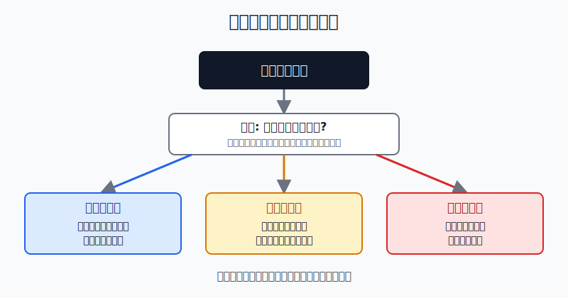

## 散户投资小白金融全品种操盘手册 - 13.8 商品追涨的风险: 高波动、高回撤、高杠杆
  
### 作者  
digoal  
  
### 日期  
2026-06-07   
  
### 标签  
金融产品 , 金融工具 , 散户 , 投资小白 , 全品操盘手册  
  
----  
  
## 背景 
  

> 适用读者: 已经知道商品价格受供需、库存、美元、地缘和天气影响，也初步听过期货保证金的小白投资者。  
> 本文定位: 商品与期货边界教育，不构成个性化投资建议。

## 先问一个反直觉的问题

商品涨得越快，小白越不该兴奋。因为股票涨多了，你通常还是拿着一份股票；商品涨多了，如果你用的是期货或带杠杆工具，下一次反向波动可能直接变成补保证金、被动平仓，甚至欠钱。

## 核心概念: 商品价格不是情绪投票

商品和股票不一样。

股票背后是一家公司，公司可以扩张业务、提高利润、回购股票。商品背后是一桶油、一吨铜、一蒲式耳大豆。它有生产、运输、仓储、交割和库存约束。价格上涨不只是“大家看好”，还意味着现实世界里有人愿意为这批货、这个地点、这个时间付更高价格。

这就是小白追涨商品最危险的地方: 你看到的是价格曲线，真正决定盈亏的是一整套实物链条和期货规则。

**高波动**，就是价格上下摆动大。商品遇到战争、减产、天气异常、库存低位、需求塌陷时，价格会在短时间内大幅跳动。

**高回撤**，就是从高点跌下来的幅度大。商品价格上涨常常来自某个紧张前提，一旦前提缓和，比如库存恢复、需求转弱、运输恢复，前面涨出来的价格会被重新定价。

**高杠杆**，就是你用少量保证金控制更大名义金额。保证金不是首付，而是履约押金。期货每天按结算价盯市，方向错了，亏损会每天从保证金里扣；保证金不够，就要补钱。

本节的行动结论先写清楚: **小白不把商品上涨当买入理由；商品仓位只做卫星仓，不用期货重仓追涨，不借钱、不扛单、不为了“怕错过”加保证金。**

## 逻辑推导链

【论证链标题】: 因为商品价格由现实供需和期货规则共同约束，而追涨通常发生在波动已经放大之后，所以小白必须先控制仓位和工具，再讨论方向。

── 第一步: 前提陈述

前提A: 商品价格由供需、库存、美元、地缘、天气和交割条件共同决定。这是变量。它像菜市场里的鲜菜，不是只看买家情绪，还要看今天到货多少、冷库够不够、运输顺不顺、明天会不会补货。

前提B: 商品上涨经常伴随波动上升。这是变量。油价、镍价、农产品价格大涨，背后常常是库存紧、供应中断、战争或极端天气。涨得快，说明市场正在重新抢定价权；定价权抢得越激烈，反向波动也越容易变大。

前提C: 期货保证金会把波动放大成现金压力。这是常量。CFTC解释过，期货保证金是履约保证金，不是股票融资首付；期货头寸会每日盯市，亏损会使保证金账户下降，低于维持保证金就要追加资金。

前提D: 小白很难稳定判断“上涨前提什么时候失效”。这是常量。你能看到新闻标题和价格突破，但你很难第一时间判断库存、交割、期限结构、交易所规则和大资金持仓是否已经变化。

── 第二步: 逻辑推导

由A+B可得: 因为商品价格上涨通常来自某个紧张前提，而这个前提会变化，所以“涨了”只证明过去买方占优，不证明现在追进去仍有安全边际。

再由A+B+C可得: 因为商品波动大，而期货保证金会放大盈亏，所以在价格已经快速上涨后追涨，相当于用更薄的安全垫承受更大的波动。

最后由A+B+C+D可得: 因为小白看不清前提何时失效，也承受不了保证金连续补钱，所以正确动作不是“涨了就跟”，而是先问工具有没有杠杆、仓位是否可承受、最大亏损是否写死。

── 第三步: 正常情景下的操作结论

✅ 正常情景: 你只是想学习商品资产，账户资金主要用于长期配置，没有专业期货经验，没有稳定复盘系统，也不能承受补保证金压力。

对应操作: 只允许用商品ETF、商品基金、资源行业ETF等低杠杆路径做小比例卫星仓；商品相关仓位上限先控制在总资产的5%-10%；期货实盘不是默认工具，最多先模拟和极小学习仓；如果唯一买入理由是“最近涨得很猛”，动作就是不买。

── 第四步: 数据和案例证实

证据1: 宽口径商品指数本身就有高波动。S&P Dow Jones Indices 的 S&P GSCI 事实表显示，S&P GSCI 是覆盖流动性商品期货、按世界产量加权的商品基准；截至2026年5月29日，S&P GSCI Total Return 的10年年化风险为21.75%，5年年化风险为19.84%。同一事实表里，2020年总回报为-23.72%，2021年为40.35%，2022年为25.99%，2023年又回到-4.27%。这说明商品不是“稳定抗通胀存款”，而是高波动资产。

证据2: 原油负价格事件证明，商品期货不是普通价格曲线。CFTC关于2020年4月20日前后 NYMEX WTI 原油期货交易的报告显示，WTI 2020年5月合约在2020年4月20日从当日交易开始时的17.73美元/桶，跌到结算价-37.63美元/桶。这个案例对应前提A和B: 交割、库存、需求和流动性同时出问题时，价格会走到小白直觉以外的区域。

证据3: 镍的案例说明，商品市场还会遇到交易暂停和规则冲击。2022年3月8日，LME 镍价格在极端波动中一度超过10万美元/吨，伦敦金属交易所暂停镍交易；LME后续材料显示，2022年3月8日至21日期间多日镍官方价格被列为 disrupted official price。这个案例对应前提D: 小白不是只面对涨跌，还可能面对停牌、取消交易、价格限制和保证金变化。

证据4: 监管机构对期货风险的表述非常直接。CFTC投资者教育材料提醒，商品期货和期权交易波动大、复杂、风险高，通常不适合个人投资者，投资者可能亏掉全部资金，甚至被要求支付超过初始投入的金额。这个证据对应前提C: 杠杆工具的风险边界不是“最多亏本金”。

历史不代表未来。上面这些数据仍有参考价值，是因为它们验证的不是某个商品明天涨跌，而是商品市场的稳定机制: 价格驱动会变，波动会集中爆发，期货保证金会把反向波动变成现金压力。

── 第五步: 前提变化时的替代结论

若前提A改变，也就是上涨原因从“真实供需紧张”变成“社交平台热度和资金追逐”，推导路径变为: 因为商品本身没有新增紧缺，只是价格先涨，所以追涨安全边际下降。新结论: 不买；已有仓位按目标比例减回去。

若前提C改变，也就是你从商品ETF升级到期货、T+D、带杠杆基金或融资账户，推导路径变为: 因为工具把波动放大，原来5%的价格回撤可能变成账户20%-50%的亏损压力，所以新结论是先退出实盘杠杆，只保留模拟或极小学习仓。

若前提D改变，也就是交易所暂停交易、扩大保证金、价格触及涨跌停、流动性变差，推导路径变为: 因为你无法保证按计划成交，所以第一动作不是补仓，而是降风险。新结论: 停止加仓，检查最坏情况下是否有现金补充，杠杆仓优先处理。

失败案例: 2020年4月WTI负价格不是因为“石油没有价值”，而是因为临近交割的合约、需求骤降、库存和流动性共同挤压。若小白只看“油价跌很多，一定会反弹”，用期货或高杠杆产品抄底，方向最终即使看对，也可能先被保证金和合约切换打出局。商品交易里，看对大方向不等于账户能活到结论兑现。

## 实操例子: 10万元账户看到原油基金大涨，怎么办

这个例子对应论证链的正常结论: **商品涨得快时，先检查前提和工具，再决定是否用小仓位学习；不能因为上涨就升级到期货重仓。**

假设小林有10万元长期投资资金，已经配置了宽基ETF、债券基金和现金。某个月，他看到原油相关基金两个月上涨30%，社交平台都在说“通胀交易又来了”。他手里没有商品仓，想买。

第一步，先写买入理由。小林必须写出三个事实: 当前上涨来自供给收缩、库存下降，还是需求超预期；这些数据来自交易所、能源机构、基金公告还是二手帖子；如果两周后库存回升或地缘紧张缓和，买入理由是否失效。写不出来，动作是不买。这一步对应前提A和D。

第二步，先选低杠杆工具。小林不能从“想学习商品”直接跳到期货实盘。他只能在商品基金、商品ETF或资源行业ETF里研究，并写清楚底层到底是期货、股票还是混合资产。如果产品带杠杆、需要保证金、可能追加资金，就不作为小白默认工具。这一步对应前提C。

第三步，设仓位上限。10万元账户里，商品学习仓上限先设为5%，也就是5000元；单次买入不超过2500元；最大可接受亏损写成1000元。如果商品仓因为上涨从5%变成8%，不继续加仓，而是等待再平衡。这一步对应正常情景下的操作结论。

第四步，设失效条件。小林写下三条退出或停止加仓条件: 上涨理由消失，停止加仓；商品基金从买入价回撤10%，先减半复盘；账户里商品仓超过计划上限，停止买入并用新增资金补其他资产。这里的10%不是保证盈利的技术线，而是让小白不要把亏损拖成“再等等”。

第五步，如果非要学习期货，只模拟。小林可以开模拟盘记录保证金、每日盯市、合约换月和手续费，但实盘不碰。若未来一定要实盘，先等到第十三章第九节的风控条件全部满足: 极小仓位、有止损、有复盘、有连续亏损停手机制。

如果操作错误，后果很具体。小林若把10万元里的5万元拿去追原油期货，原油价格反向波动5%，在杠杆下就可能不是亏2500元，而是面临大额保证金压力。若他继续补钱扛单，原本可控的学习错误就会变成家庭现金流问题。纠偏方法不是再找一个更刺激的品种，而是立刻降杠杆、降仓位，把交易退回到可承受范围。

## 可复用框架

【三问止追】

适用前提: 商品、商品ETF、资源行业ETF或期货相关产品已经明显上涨，你开始产生“怕错过”的冲动。

核心逻辑: 因为商品上涨前提会变化，而杠杆会放大错误，所以追涨前先问前提、工具和仓位。

操作步骤:

1. 问前提: 我能不能用供需、库存、期限结构或政策变化解释上涨，而不是只说“涨得好”。
2. 问工具: 我买的是低杠杆基金，还是需要保证金、每日盯市、可能追加资金的工具。
3. 问仓位: 即使价格回撤20%，组合是否仍在可承受范围内。
4. 问退出: 上涨理由失效时，我是减仓、清仓，还是继续找理由扛单。

前提失效时: 如果四个问题答不出来，动作从“买入”切换为“观察”；如果已经持有，动作从“加仓”切换为“减到计划仓位”。

举一反三: 这个框架也适用于黄金、白银、能源股、资源ETF、农产品基金和跨境商品ETF。

【先降杠杆】

适用前提: 你已经接触期货、T+D、杠杆ETF、反向ETF或其他带保证金属性的商品工具。

核心逻辑: 因为商品本身已经高波动，杠杆会把高波动变成强制补钱压力，所以先把工具降到能活下来的层级。

操作步骤:

1. 先用无杠杆或低杠杆工具学习价格驱动。
2. 期货先模拟，不用真实资金证明自己。
3. 真实资金只允许极小仓位，单笔最大亏损先写死。
4. 连续亏损两次，停止交易，先复盘。

前提失效时: 如果你已经开始借钱、满仓、补保证金、扛单，说明风险级别超过小白边界，动作是退出实盘杠杆，而不是继续加钱。

举一反三: 这个框架也适用于期权、融资融券和黄金T+D。凡是亏损可能超过初始投入的工具，都先问能不能不用杠杆。

## 本节行动清单

| 动作 | 合格标准 |
|---|---|
| 不用上涨当理由 | 买入理由必须写出供需、库存、期限结构或政策变化 |
| 先看工具杠杆 | 分清商品基金、资源股ETF、期货、T+D、杠杆产品 |
| 商品只做卫星仓 | 小白学习仓先控制在总资产5%-10%以内 |
| 最大亏损先写死 | 买入前写出亏多少必须减仓或停止 |
| 不补保证金扛单 | 需要补钱才能维持的仓位，说明仓位一开始就过大 |
| 追涨冲动转观察 | 看不清前提时，建立观察表，不用真钱抢价格 |

## 一句话总结

商品追涨最危险的地方，不是你一定看错方向，而是高波动、高回撤和高杠杆会让一次看错变成被动出局；小白先守住仓位和工具边界，才有资格学习商品周期。

## 参考资料

- S&P Dow Jones Indices: S&P GSCI Index (USD) Factsheet, as of 2026-05-29, https://www.spglobal.com/spdji/en/indices/commodities/sp-gsci/
- S&P Dow Jones Indices: S&P GSCI Methodology, 2026年4月, https://www.spglobal.com/spdji/en/documents/methodologies/methodology-sp-gsci.pdf
- CFTC: Interim Staff Report on Trading in NYMEX WTI Crude Oil Futures Contract Leading up to, on, and around April 20, 2020, 2020-11-23, https://www.cftc.gov/media/5296/InterimStaffReportNYMEX_WTICrudeOil/download
- CFTC: Futures Market Basics, 2026年访问, https://www.cftc.gov/LearnAndProtect/EducationCenter/FuturesMarketBasics/index2.htm
- CFTC: Economic Purpose of Futures Markets and How They Work, 2026年访问, https://www.cftc.gov/LearnAndProtect/AdvisoriesAndArticles/economicpurpose.html
- London Metal Exchange: LME Nickel MASP calculation for March 2022, https://www.lme.com/en/market-data/disruption-events/lme-nickel-masp-calculation-for-march-2022
- S&P Global Commodity Insights: LME suspends nickel trading after unprecedented surge to above $100,000/mt, 2022-03-08, https://www.spglobal.com/energy/en/news-research/latest-news/metals/030822-lme-suspends-nickel-trading-after-unprecedented-surge-to-above-100000mt

> ⚠️ **声明**：本文内容为投资教育目的，所有历史数据、策略框架均为辅助学习工具，不构成证券投资建议。市场有风险，投资需谨慎。实际操作请结合自身风险承受能力，必要时咨询专业投顾。
  
#### [PostgreSQL 解决方案集合](../201706/20170601_02.md "40cff096e9ed7122c512b35d8561d9c8")
  
  
#### [德哥 / digoal's Github - 公益是一辈子的事.](https://github.com/digoal/blog/blob/master/README.md "22709685feb7cab07d30f30387f0a9ae")
  
  
#### [About 德哥](https://github.com/digoal/blog/blob/master/me/readme.md "a37735981e7704886ffd590565582dd0")
  
  

  
