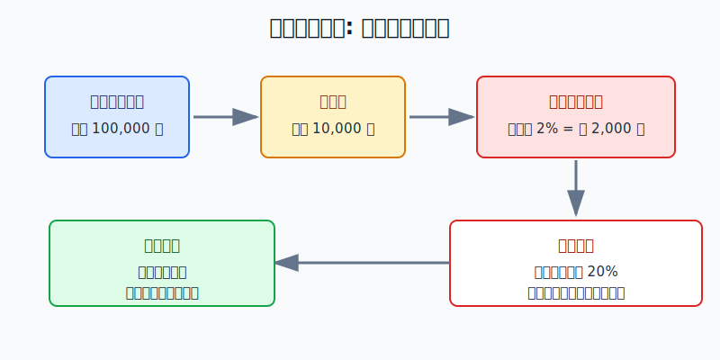
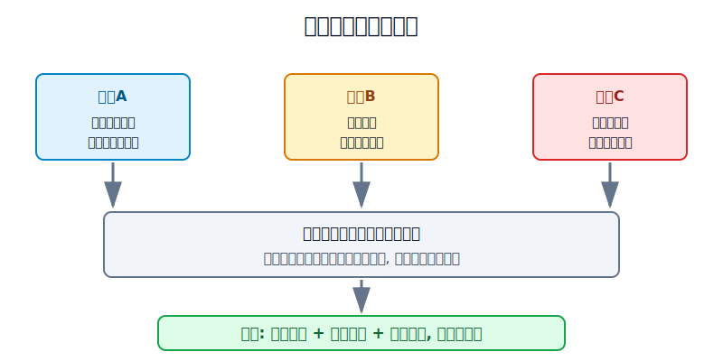
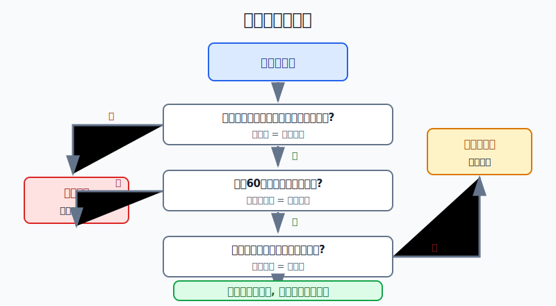

## 散户投资小白金融全品种操盘手册 - 13.9 如果一定学习期货 - 模拟、极小仓位、先学风控
  
### 作者  
digoal  
  
### 日期  
2026-06-07   
  
### 标签  
金融产品 , 金融工具 , 散户 , 投资小白 , 全品操盘手册  
  
----  
  
## 背景 
  

> 适用读者: 已经知道商品和期货有机会也有杠杆风险，但仍然想系统学习期货的小白投资者。  
> 本文定位: 投资教育框架，不构成个性化投资建议。

## 先问一个反直觉的问题

如果一个工具能让你用1万元控制10万元甚至更大的合约，最先要学的不是怎么赚快钱，而是怎么不让1次错误把账户打穿。**期货学习的第一课不是预测，而是风控。**

## 核心概念: 期货学习不是预测练习

期货，是买卖未来某个时间交割或结算的标准化合约。你买的不是一只股票，也不是一只基金，而是一份带保证金、杠杆、每日结算和强平机制的合约。

保证金可以理解成“押金”。假设一份合约名义价值10万元，交易所和期货公司要求你放1万元保证金，你就能参与这份合约的涨跌。听起来资金效率高，但反过来看，标的价格只跌2%，合约亏损就是2000元，放到1万元保证金上就是20%的损失。股票跌2%还是跌2%，期货里可能已经变成账户压力。

所以本节先给行动结论: **如果一定要学习期货，顺序只能是模拟、极小仓位、先学风控。不能解释合约规则，不实盘；不能连续执行止损，不实盘；一手合约的计划亏损超过你的亏损预算，不实盘。**

## 逻辑推导链

【论证链标题】: 因为期货用保证金控制大合约，且亏损会通过每日结算和追加保证金快速传导，所以小白学习期货必须先通过模拟和风控训练，再用极小仓位试运行；任何风控前提不成立时，都应暂停实盘。

── 第一步: 前提陈述

前提A: 期货的保证金机制会放大盈亏。这是常量。保证金不是买断成本，而是履约担保。用生活里的比喻说，你不是花1万元买一辆车，而是交1万元押金去开一辆价值更高的车；车蹭一下，赔的是整辆车对应的损失，不是只按押金比例赔。

前提B: 期货实行当日无负债结算，亏损不能靠“放着不看”拖过去。这是常量。《中华人民共和国期货和衍生品法》规定，期货交易实行当日无负债结算制度；保证金不符合规则时，结算机构会通知追加保证金或自行平仓，未按时处理的会通知交易场所强行平仓。翻成小白话就是: 期货账户每天都要算账，亏损到线了，市场不会等你心情恢复。

前提C: 小白最容易犯的错误不是一次看错方向，而是看错后扛单、补保证金、加仓摊平。这是变量，但在高杠杆工具里杀伤力最大。股票里“再等等”可能只是浮亏扩大；期货里“再等等”可能变成追加保证金、强平，甚至超过原计划亏损。

前提D: 模拟盘能训练流程，但不能证明你一定适合实盘。这是常量。模拟盘没有真实亏损的痛感，也没有临近强平时的压力。它的作用不是证明你会赚钱，而是证明你至少会按规则做事: 下单前写计划，错了就退，盘后复盘，不临时改口。

── 第二步: 逻辑推导

由A+B可得: 因为期货亏损按合约名义价值变化，而账户又每天结算，所以“我只投一点点，亏也亏不了多少”这个想法不成立。真正决定最大损失的，不是你交了多少保证金，而是合约名义价值、价格波动、止损距离和是否会被强平。

再由A+B+C可得: 因为小白在亏损后容易扛单，而期货机制会把扛单变成追加保证金压力，所以先做实盘等于把最贵的错误放到真实账户里演练。

最后由A+B+C+D可得: 因为模拟盘只能验证流程，不能替代真实风控，所以正常结论是: **先用模拟盘训练规则执行，再用极小仓位验证心理承受，最后才讨论策略有效性。任何阶段只要出现规则说不清、止损不执行、亏损预算不匹配，就退回上一阶段。**

── 第三步: 正常情景下的操作结论

✅ 正常情景: 你已经能说清合约乘数、最小变动价位、保证金比例、交易时间、交割月、涨跌停板、追加保证金和强平规则；模拟至少60个交易日，有完整记录；所有模拟交易都能在买入前写清止损和仓位。

对应操作: 可以进入“极小仓位试运行”。学习金控制在总投资资金的1%-2%以内，单笔计划亏损控制在总投资资金的0.2%以内；若一手合约按合理止损计算的亏损已经超过预算，就不实盘，继续模拟或换更低风险的学习路径。

── 第四步: 数据和案例证实

证据1: 中国期货市场很大，但“大市场”不等于“小白容易赚钱”。中国期货业协会2026年1月发布的统计显示，2025年1-12月全国期货市场累计成交量为90.74亿手，累计成交额为766.25万亿元，同比分别增长17.4%和23.74%。这说明期货是产业、机构和专业交易者高度参与的风险管理市场，不是给小白随手押方向的游戏厅。

证据2: 期货的风险控制制度本身就说明它不是普通买卖。中国证监会投资者教育材料《期货风险管理要点》明确提示，保证金杠杆效应容易诱发“以小博大”心理；每日无负债结算会让保证金不足的客户面临强制平仓风险。这对应前提A和B: 机制不是口号，而是会直接改变账户命运的规则。

证据3: 海外监管也把期货列为高复杂、高波动工具。CFTC的Futures Market Basics提示，商品期货和期权交易波动大、复杂、风险高，并且很少适合个人投资者或零售客户；投资者可能亏完本金，还可能需要支付超过初始投入的损失。这对应前提C: 小白不能用“我只试一下”低估杠杆工具的最坏情景。

失败案例: 2020年4月20日，NYMEX WTI原油近月期货出现历史性负价格。美国能源信息署EIA记录，WTI期货盘中最低跌至-40.32美元/桶，并以-37.63美元/桶收盘。这个案例不是让小白去研究原油，而是说明一件事: 临近到期、库存、流动性和合约规则会让价格出现普通投资者想不到的情景。当前提B和C失效，也就是你看不懂合约规则还敢扛单，亏损就不会按你的常识停止。

历史不代表未来。上面这些数据仍有参考价值，是因为它们验证的是结构规律: 期货市场规模巨大、保证金会放大盈亏、每日结算会迫使账户处理亏损、极端行情会击穿直觉。这些规律不依赖某一个品种明天涨还是跌。

── 第五步: 前提变化时的替代结论

若前提D改变，也就是你模拟60个交易日后仍然经常临时取消止损、亏损后加仓摊平、盘后不复盘，推导路径变为: 因为流程纪律没有建立，所以真实亏损只会放大问题。新结论: 不实盘，继续模拟，直到连续20笔交易无规则破坏。

若前提A改变，也就是某个合约一手保证金很高、波动很大，按你的止损距离计算，一次正常波动就会亏掉学习金的20%以上，推导路径变为: 因为一手合约超过你的风险预算，所以“极小仓位”在这个品种上无法实现。新结论: 不做这个合约，换模拟、商品基金、商品ETF或资源行业ETF学习。

若前提B恶化，也就是临近交割月、节假日前后、重大数据公布、涨跌停板扩大或交易所提高保证金，推导路径变为: 因为结算和流动性压力上升，所以原来的止损计划不再可靠。新结论: 降低仓位到零，先退出，再学习规则变化。

## 实操例子: 10万元账户想学期货

这个例子对应论证链的正常结论: **模拟通过后，只能用极小仓位验证风控，不能把学习变成重仓实战。**

假设小林有10万元投资资金，已经留足生活备用金。他看到白银、黄金、原油、股指期货讨论很多，想开期货账户学习。

第一步，先定义学习金。小林把期货学习金设为总资金的2%，也就是2000元。这个钱的角色不是“赚钱本金”，而是“学规则的学费上限”。只要亏到学习金的20%，也就是400元，实盘学习立刻暂停，退回模拟。

第二步，先做60个交易日模拟。每一笔模拟交易必须写四行: 买什么合约、为什么开仓、错到哪里止损、最大亏损多少钱。少一行就不下单。60个交易日结束后，只看三件事: 是否每笔都有止损，是否有扛单，是否有亏损后加仓摊平。只要出现两次规则破坏，不进入实盘。

第三步，算一手合约是否装得进预算。假设某合约一手名义价值10万元，合理止损距离是价格的1%，那一手计划亏损就是1000元。这已经是小林总资金的1%、学习金的50%，不合格。动作不是把止损缩得很窄来凑数，而是不做这个合约。

第四步，如果找到更小的合约或更低波动品种，使一手计划亏损不超过200元，小林才允许试运行。这里的200元对应总资金0.2%，也对应学习金10%。买入后只允许两种结果: 到止损价退出，或到计划目标/时间退出。不能因为亏损就补保证金，不能因为上涨就把学习金扩大到1万元。

第五步，设置强制暂停条件。连续两笔实盘亏损，暂停一周；单日亏损超过200元，暂停；学习金回撤达到400元，停止本轮实盘；看不懂交易所保证金调整、临近交割月、夜盘跳空、涨跌停板时，直接空仓。暂停不是胆小，而是承认前提变化。

如果操作错误，后果很清楚。小林若直接拿2万元做期货，并在亏损后追加保证金，原本“最多亏400元的学习计划”会变成“账户不断给错误续命”。一旦行情跳空或流动性变差，止损价不一定能按理想价格成交，亏损会超过表格里的计划值。纠偏方法只有一个: 先清仓，停止实盘，复盘规则破坏点，而不是换一个品种继续赌。

## 可复用框架

【三关门】

适用前提: 你想从期货模拟走向实盘学习。

核心逻辑: 因为期货亏损会被杠杆和结算机制放大，所以先证明自己守规则，再让真实资金进场。

操作步骤:

1. 规则关: 能说清合约乘数、保证金、交易时间、交割月、涨跌停板和强平规则。
2. 模拟关: 至少60个交易日记录完整，连续20笔交易无扛单、无加仓摊平、无临时取消止损。
3. 预算关: 一手合约的计划亏损必须小于单笔亏损预算，否则不实盘。

前提失效时: 任意一关不过，退回模拟。不要用“少买一点试试”代替通过门槛。

举一反三: 这个框架也适用于期权、黄金T+D、杠杆ETF和外汇保证金类产品。

【亏损预算】

适用前提: 你已经懂规则，并准备给某个高风险工具分配学习仓。

核心逻辑: 因为小白无法控制市场波动，只能控制亏损半径，所以先定最大可亏，再反推能不能交易。

操作步骤:

1. 先定总学习金: 高风险工具学习金不超过总投资资金的1%-2%。
2. 再定单笔亏损: 单笔计划亏损不超过总投资资金的0.2%。
3. 最后反推合约: 一手合约按合理止损计算超过预算，就不做。

前提失效时: 保证金提高、波动扩大、止损距离变宽、流动性变差时，重新计算；算不过，空仓。

举一反三: 买小盘股、主题ETF、可转债短线和商品基金追热点时，也可以先用亏损预算决定仓位，而不是先看收益想象。

## 本节行动清单

| 动作 | 合格标准 |
|---|---|
| 先学规则 | 合约乘数、保证金、交易时间、交割月、涨跌停板、强平都能说清 |
| 先做模拟 | 至少60个交易日，有买入理由、止损、仓位和复盘记录 |
| 限定学习金 | 期货学习金控制在总投资资金的1%-2%以内 |
| 限定单笔亏损 | 单笔计划亏损不超过总投资资金的0.2% |
| 不扛单 | 亏损不补保证金续命，不加仓摊平，不取消止损 |
| 前提变就退 | 临近交割、保证金调整、重大事件、看不懂规则时空仓 |

## 一句话总结

如果一定要学习期货，先把它当成风控训练，而不是赚钱捷径；模拟不过不实盘，预算装不下不下单，规则一变先退场。

## 参考资料

- 中国期货业协会: 《2025年12月全国期货市场交易情况》，2026年1月9日，https://www.cfachina.org/servicesupport/researchandpublishin/statisticalsdata/monthlytransactiondata/202601/t20260109_85987.html
- 中国政府网: 《中华人民共和国期货和衍生品法》，2022年4月21日，第三十九条、第四十一条关于当日无负债结算、追加保证金和强行平仓，https://www.gov.cn/xinwen/2022-04/21/content_5686377.htm
- 中国证监会: 《期货风险管理要点》，2012年4月16日，关于保证金杠杆、每日无负债结算、强制平仓和资金持仓比例，https://www.csrc.gov.cn/csrc/c100211/c1452120/content.shtml
- CFTC: Futures Market Basics，2026年访问，关于期货交易复杂性、零售投资者适当性和可能超过初始投入的损失，https://www.cftc.gov/LearnAndProtect/EducationCenter/FuturesMarketBasics/index2.htm
- U.S. Energy Information Administration: North American crude oil prices are closely, but not perfectly, connected，2020年5月29日，记录2020年4月20日WTI期货盘中低点和收盘价，https://www.eia.gov/todayinenergy/detail.php?id=43875

> ⚠️ **声明**：本文内容为投资教育目的，所有历史数据、策略框架均为辅助学习工具，不构成证券投资建议。市场有风险，投资需谨慎。实际操作请结合自身风险承受能力，必要时咨询专业投顾。
  
#### [PostgreSQL 解决方案集合](../201706/20170601_02.md "40cff096e9ed7122c512b35d8561d9c8")
  
  
#### [德哥 / digoal's Github - 公益是一辈子的事.](https://github.com/digoal/blog/blob/master/README.md "22709685feb7cab07d30f30387f0a9ae")
  
  
#### [About 德哥](https://github.com/digoal/blog/blob/master/me/readme.md "a37735981e7704886ffd590565582dd0")
  
  

  
