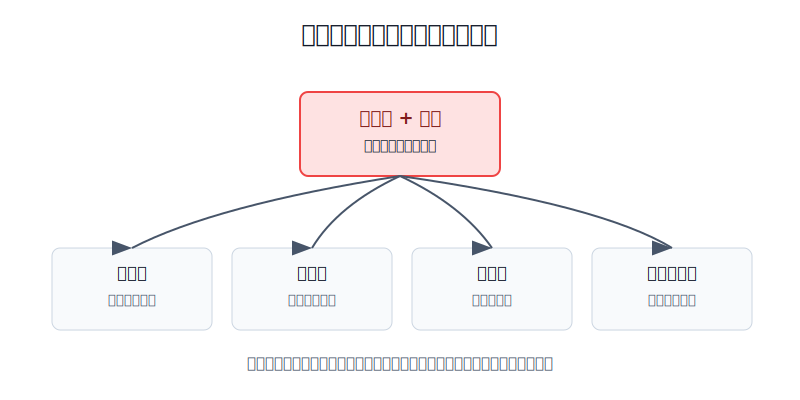
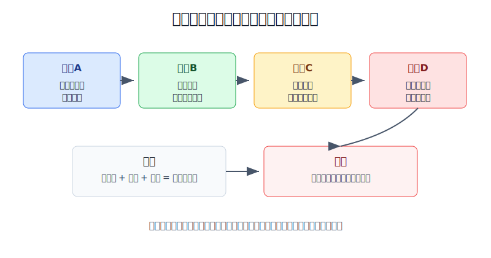
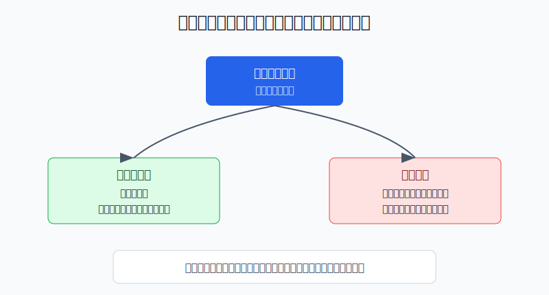

## 散户投资小白金融全品种操盘手册 - 13.10 明确排雷 - 满仓期货、借钱交易、扛单、频繁加保证金
  
### 作者  
digoal  
  
### 日期  
2026-06-07   
  
### 标签  
金融产品 , 金融工具 , 散户 , 投资小白 , 全品操盘手册  
  
----  
  
## 背景 
  

> 适用读者: 已经知道期货有保证金、杠杆和每日结算，但还没有真正理解“亏损会被放大”的小白投资者。  
> 本文定位: 投资教育框架，不构成个性化投资建议。

## 先问一个反直觉的问题

期货最危险的地方，不是你看错方向。看错方向只是一次判断错误。真正危险的是: **你看错以后，还用满仓、借钱、扛单和追加保证金，把一次错误养成一个大洞。**

## 核心概念: 保证金不是“便宜买入”，是“放大器”

期货合约不是普通商品买卖。你不是用全部货款买一件东西，而是交一部分保证金，控制一份更大的合约。保证金可以理解成“押金”，但这个押金不是最大亏损。价格向你有利的方向走，收益会被放大；价格向你不利的方向走，亏损也会被放大。

每日结算，就是交易所每天按结算价把盈亏算清楚。你亏的钱会从账户权益里扣掉。扣到保证金不够时，就会触发追加保证金或强行平仓。强行平仓，就是期货公司或交易所为了控制风险，在你没有及时补足保证金或风险过高时，把持仓处理掉。

扛单，就是明明买入理由已经失效、账户风险已经超预算，还不认错，继续等行情回来。频繁加保证金，就是不断拿新钱去保护旧错误。它们在股票里已经危险，在期货里更危险，因为期货的杠杆和每日结算会让错误加速。

本节行动结论先放在前面: **小白学习期货，默认不实盘重仓。必须写死四条红线: 不满仓、不借钱、不扛单、不反复追加保证金。保证金不足不是“再补一点就能熬过去”的信号，而是仓位已经超过风险预算的信号；第一动作应该是减仓或平仓，而不是继续往里填钱。**

## 逻辑推导链

【论证链标题】: 因为期货是保证金杠杆加每日结算，极端行情下还可能难以及时退出，所以小白必须把“满仓、借钱、扛单、频繁加保证金”列为不可触碰的红线。

── 第一步: 前提陈述

前提A: 期货采取保证金交易，天然带杠杆。这是常量。它像用一小段刹车距离去开一辆很重的车，方向对了很省力，方向错了也更难停稳。

前提B: 期货每天结算，保证金不足就会触发追加保证金或强平。这是常量。股票亏损可以先浮在账面上，期货亏损会更快变成账户权益减少。

前提C: 商品和期货会出现极端行情、跳空、涨跌停、流动性变差或合约临近交割的特殊压力。这是变量。平时看起来能成交，不等于关键时刻一定能按你想要的价格退出。

前提D: 小白亏损后最容易做四件事: 满仓想回本、借钱补洞、扛单等反弹、频繁追加保证金。这是常见行为偏差。它像车已经打滑，还继续踩油门。

── 第二步: 逻辑推导

由A可得: 因为保证金只占合约价值的一部分，所以标的价格的小幅波动，会变成保证金账户的大幅盈亏。

由A+B可得: 因为亏损每天结算，所以只要仓位过大，账户很快就会接近保证金不足。此时你已经不是在“等行情”，而是在和强平线赛跑。

再由A+B+C可得: 因为极端行情下可能跳空、涨跌停或流动性变差，所以止损不一定按理想价格成交，亏损可能超过最初准备的保证金。

最后由A+B+C+D可得: 因为技术风险和心理错误会互相放大，所以四条红线必须放在所有入场信号之前。**先判断会不会被错误拖死，再讨论能不能赚到钱。**

── 第三步: 正常情景下的操作结论

✅ 正常情景: 你只是学习期货，不是产业套保；没有稳定验证过的交易系统；没有职业风控；这笔钱亏掉不能影响生活。

对应操作: 先用模拟盘。若一定要用实盘学习，只能用极小仓位，把单次最坏亏损控制在总投资资金的0.5%-1%以内；账户里必须留足保证金缓冲；一旦触发预设止损或保证金压力，先减仓或平仓。禁止为了证明自己正确而借钱、满仓、扛单和连续补保证金。

── 第四步: 数据和案例证实

证据1: 中国期货业协会网站收录、证监会发布的金融行业标准 JR/T 0100-2024《期货经纪合同要素》要求，期货交易风险说明书应揭示: 期货采取保证金交易方式，客户交易损失有可能超过存放在期货公司的期货保证金；同时应包含保证金不足或违反交易规则被强行平仓的风险，以及极端市场、政策、法规、交易所规则变化下的价格波动风险。这对应前提A、B、C: 亏损超过保证金和被强平，不是吓唬人，而是开户前就应理解的基础风险。

证据2: 美国 CFTC 的 Futures Market Basics 投资者教育材料提醒，许多个人会亏掉全部资金，并可能被要求支付超过初始投入的金额；它还提醒交易者在交易前要知道自己除初始投入外还能承受多少额外损失。这对应前提A和B: 期货风险不能按“我最多亏掉这笔保证金”来理解。

证据3: 美国能源信息署 EIA 在2020年4月27日解释，2020年4月20日，NYMEX WTI 原油近月期货价格首次跌到负值，盘中低至每桶-40.32美元，并在次日部分时间仍低于零；EIA 把原因指向低流动性、可用仓储受限和5月合约到期压力。当时库欣原油工作库容约7600万桶。这对应前提C: 商品期货不只是价格涨跌，还会受交割、库存、期限结构和流动性影响，极端时会出现小白难以想象的价格。

失败案例: “原油宝”事件不是普通期货账户案例，但它清楚暴露了散户接触期货挂钩产品时的风险认知缺口。2020年12月5日，银保监会通报中国银行“原油宝”产品风险事件相关处罚，对中国银行及其分支机构合计罚款5050万元；通报提到的问题包括保证金相关合同条款不清晰、未开展压力测试、市场风险限额设置存在缺陷、销售文本存在夸大或片面宣传等。这个案例说明: 当底层资产是期货，且极端行情和产品规则没有被充分理解时，投资者以为自己买的是“便宜原油”，现实中承受的却可能是期货合约、移仓、保证金和极端价格的综合风险。

历史不代表未来。上面数据仍有参考价值，是因为它们验证的是制度规律: 保证金杠杆会放大盈亏，每日结算会把亏损推到账户层面，极端行情会让退出变难。红线不是预测某个品种会跌，而是防止任何一次错误扩大到不可承受。

── 第五步: 前提变化时的替代结论

若前提A没有被你真正理解，也就是你说不清一手合约价值、保证金比例、每日最大波动对应多少钱，推导路径变为: 因为你不知道自己控制了多大风险，所以任何实盘都是盲开车。新结论: 不开实盘，只做模拟盘和规则学习。

若前提B触发，也就是账户收到追加保证金通知、风险度明显升高或可用资金接近负数，推导路径变为: 因为风险预算已经失控，所以不能把追加保证金当成正常动作。新结论: 先减仓或平仓，只有在仓位已经降到安全线以下后，才复盘是否继续学习。

若前提C变强，也就是临近交割、涨跌停扩大、库存或天气出现重大变化、夜盘跳空、流动性明显下降，推导路径变为: 因为退出难度上升，所以仓位上限必须下调。新结论: 小白不隔夜持有高波动合约；看不懂交割和期限结构时，不做该合约。

若前提D出现，也就是你开始想“再补一点”“行情一定会回来”“这次不能认输”，推导路径变为: 因为情绪已经接管交易，所以继续操作只会放大错误。新结论: 当天停止开新仓，按计划处理已有仓位，复盘前不再交易。

## 实操例子: 5万元账户如何避免把学习变成爆仓

这个例子对应论证链的正常结论: **如果只是学习期货，仓位必须小到一次错误不会伤到生活和本金结构。**

假设小周有5万元学习资金，已经留足生活费，也知道自己不是产业客户。他想学习螺纹钢、豆粕或原油相关合约的价格波动。

第一步，先拒绝满仓。小周不把5万元都拿来开仓。假设某合约一手保证金需要8000元，他也不能因为账户够开五六手就开满。小白实盘学习的第一规则是: **先让账户能承受连续错误，而不是先把仓位开到最大。** 他把单次最大亏损设为总资金的1%，也就是500元。

第二步，反推仓位。若一手合约价格每波动一个最小单位对应10元，预设止损距离是30个最小单位，那一手止损约300元；如果交易两手，止损约600元，已经超过单次亏损上限。按规则只能开一手，或者继续模拟盘。

第三步，写明失效条件。比如买入理由是“趋势突破后回踩不破”，那跌回突破位并收回去，就是理由失效。理由失效时平仓，不等追加保证金通知。这对应前提B: 不能等到保证金压力出现才承认错。

第四步，遇到保证金不足时先减仓。若行情突然跳空，亏损超过预设，账户可用资金快速下降，小周不从信用卡、花呗、亲友借钱，也不把生活费转进来补保证金。他先把持仓降到安全线以下，或者直接退出。因为追加保证金只能让他继续暴露在同一个错误里，不能证明原判断正确。

第五步，复盘而不是翻本。平仓后只记录四件事: 开仓理由、止损位置、实际亏损、是否违反红线。只要出现借钱、满仓、扛单、连续补保证金中的任何一项，本月停止期货实盘。

如果操作错误，后果很直接。小周若用5万元开满仓，行情只要反向快速波动，就可能从“浮亏”变成“补保证金”。他若继续借钱补，账户看起来暂时没爆，实际是把市场风险转成债务风险和生活风险。一旦再遇到跳空或强平，亏损不再是一次交易失败，而是家庭现金流问题。

## 可复用框架

【四不红线】

适用前提: 你是个人投资者，参与期货只是学习或小比例试错，不是企业套保，也没有成熟交易系统。

核心逻辑: 因为期货保证金会放大亏损，每日结算会触发补保证金，极端行情会让退出变难，所以先禁止会扩大错误的行为。

操作步骤:

1. 不满仓: 账户必须留保证金缓冲，单次亏损先按0.5%-1%总资金上限设计。
2. 不借钱: 只用可承受亏损的学习资金，不动生活费、房贷钱、学费钱和借款。
3. 不扛单: 买入理由失效先离场，不用“再等等”替代规则。
4. 不反复补保证金: 保证金不足先减仓或平仓，不用新钱保护旧错误。

前提失效时: 如果你连合约乘数、保证金比例、涨跌停、交割月份都说不清，直接退回模拟盘；如果已经出现情绪化补钱，本月停止实盘。

举一反三: 这个框架也适用于黄金T+D、杠杆ETF、期权卖方、外汇保证金和任何会强平的杠杆工具。

【先算后下】

适用前提: 你想判断某一笔期货交易是否能做。

核心逻辑: 因为期货亏损按合约价值计算，而不是按你心里的“投入金额”计算，所以每次下单前先算最坏情况。

操作步骤:

1. 算一手合约价值: 当前价格乘以合约乘数。
2. 算保证金占用: 合约价值乘以保证金比例。
3. 算止损金额: 止损距离乘以每点或每最小变动单位价值。
4. 算账户影响: 止损金额是否低于总资金的0.5%-1%。
5. 算极端情景: 若跳空或跌停导致止损多亏一倍，账户是否仍能承受。

前提失效时: 任意一步算不清，不下单；极端情景承受不了，不下单；需要借钱补保证金，不下单。

举一反三: 任何高波动工具都要先算“错了会亏多少”，再问“对了能赚多少”。

## 本节行动清单

| 动作 | 合格标准 |
|---|---|
| 写下四条红线 | 不满仓、不借钱、不扛单、不反复追加保证金 |
| 先做模拟盘 | 能连续记录至少20笔模拟交易，再考虑极小实盘 |
| 计算合约风险 | 说清合约乘数、保证金比例、涨跌停、每点价值 |
| 设单次亏损上限 | 单次亏损控制在总学习资金0.5%-1%以内 |
| 保证金不足先减仓 | 收到追加保证金压力时，不把补钱当默认动作 |
| 不碰交割盲区 | 不懂交割、移仓、期限结构，不持有临近交割合约 |
| 写停手机制 | 一旦违反红线，本月停止实盘，只复盘不翻本 |

## 一句话总结

期货排雷的核心不是“这次能不能看对”，而是先保证看错时不会满仓、借钱、扛单和反复补保证金；能活下来，才有资格继续学习。

## 参考资料

- 中国期货业协会网站收录 / 中国证监会发布: JR/T 0100-2024《期货经纪合同要素》，2024年12月24日发布，https://www.cfachina.org/governmentrules/industrystandard/202501/P020250108379920918232.pdf
- CFTC: Futures Market Basics, https://www.cftc.gov/LearnAndProtect/EducationCenter/FuturesMarketBasics/index2.htm
- U.S. Energy Information Administration: Low liquidity and limited available storage pushed WTI crude oil futures prices below zero, 2020年4月27日，https://www.eia.gov/TODAYINENERGY/detail.php?id=43495
- 新浪财经转引银保监会官网消息: 因“原油宝”事件，中国银行被罚5050万元，2020年12月5日，https://finance.sina.com.cn/wm/2020-12-05/doc-iiznctke4979589.shtml

> ⚠️ **声明**：本文内容为投资教育目的，所有历史数据、策略框架均为辅助学习工具，不构成证券投资建议。市场有风险，投资需谨慎。实际操作请结合自身风险承受能力，必要时咨询专业投顾。
  
#### [PostgreSQL 解决方案集合](../201706/20170601_02.md "40cff096e9ed7122c512b35d8561d9c8")
  
  
#### [德哥 / digoal's Github - 公益是一辈子的事.](https://github.com/digoal/blog/blob/master/README.md "22709685feb7cab07d30f30387f0a9ae")
  
  
#### [About 德哥](https://github.com/digoal/blog/blob/master/me/readme.md "a37735981e7704886ffd590565582dd0")
  
  

  
