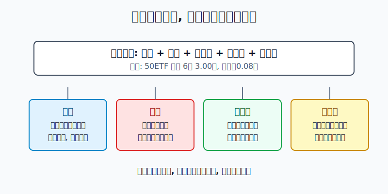
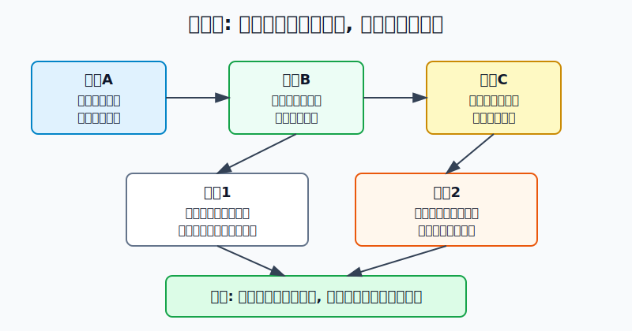
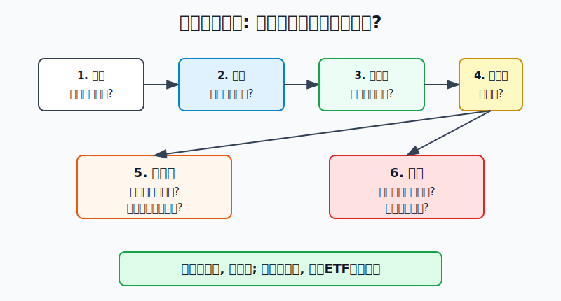

## 散户投资小白金融全品种操盘手册 - 14.1 期权是什么 - 权利、义务、到期日、行权价
  
### 作者  
digoal  
  
### 日期  
2026-06-07   
  
### 标签  
金融产品 , 金融工具 , 散户 , 投资小白 , 全品操盘手册  
  
----  
  
## 背景 
  

> 适用读者: 听过“期权很刺激”“期权可以小钱搏大钱”，但还分不清认购、认沽、买方、卖方的小白投资者。  
> 本文定位: 投资教育框架，不构成个性化投资建议。

## 先问一个反直觉的问题

期权最容易误导小白的地方，不是它难，而是它看起来太便宜。几百元买一张合约，好像比买股票轻松。问题是: **你买的不是股票，而是一份有期限、有价格门槛、有权利义务分工的合同。**

## 核心概念: 期权是一张“带截止日期的选择权合同”

用一句话说，**期权 = 买方花权利金，获得在约定日期前或约定日期当天，按约定价格买入或卖出标的资产的权利；卖方收权利金，承担被行权时履约的义务。**

这里有四个词必须先听懂。

权利，就是买方可以选择做，也可以选择不做。你买了一张电影票，到点可以进场，也可以放弃不看；但票钱通常不会退。期权买方也是这样，买的是选择权，最大损失通常就是已经付出的权利金。

义务，就是卖方不能只拿钱不办事。卖方收了权利金，就像卖出了一份承诺。买方行权时，卖方要按合同履约。认购期权的卖方要按行权价卖出标的；认沽期权的卖方要按行权价买入标的。

到期日，就是这张合同的生命终点。过了这个时间，权利就失效。很多小白以为“方向看对就能赚钱”，但期权多了一道时间门槛: 你不但要方向对，还要在合同到期前对。

行权价，就是合同约定的买卖价格。认购期权是“按这个价格买入”的权利，认沽期权是“按这个价格卖出”的权利。标的现价和行权价之间的关系，决定这张期权是实值、平值还是虚值。实值可以简单理解为“现在行权有内在价值”，虚值则是“现在行权不划算”。

本节行动结论先放在前面: **小白第一次学习期权，不要先问“买涨还是买跌”，而要先把每张期权翻译成六句话: 标的是什么、认购还是认沽、我是买方还是卖方、到期日是哪天、行权价是多少、权利金最多亏多少。六句话说不清，不下单。卖方义务不是小白的默认起点。**

## 逻辑推导链

【论证链标题】: 因为期权是“权利和义务分离、时间和价格同时约束”的合同，所以小白必须先学会翻译合约条款，再谈任何策略。

── 第一步: 前提陈述

前提A: 期权买方买的是权利，不是标的资产本身。这是常量。它像买一张有截止日期的优惠券，优惠券可能有价值，也可能过期作废。

前提B: 期权卖方收的是权利金，承担的是义务。这是常量。它像收了别人的保险费，就要在合同条件触发时履行承诺。

前提C: 每张期权都被到期日和行权价锁住。这是常量。方向判断只是第一层，时间是否够、价格是否越过门槛，才决定合同是否真正有用。

前提D: 权利金会提前支付，而且买方放弃行权或到期虚值时，权利金不会自动退回。这是变量中的关键成本。它会随着时间、波动、标的价格和供需变化而变化。

── 第二步: 逻辑推导

由A+B可得: 因为买方只有权利、卖方有义务，所以同样是“做期权”，买方和卖方的风险结构完全不同。买方先付钱，最坏结果通常是权利金归零；卖方先收钱，但被指派时要履约。

由C+D可得: 因为期权有到期日和行权价，所以“看对方向”不等于“交易赚钱”。认购期权需要标的上涨到足以覆盖行权价和权利金，认沽期权需要标的下跌到足以覆盖行权价和权利金。

再由A+B+C+D可得: 因为期权同时考验方向、时间、价格门槛和身份义务，所以小白不能把它当成低价彩票。**正确起点不是追求高倍收益，而是把合同翻译清楚，确认自己承担的是权利金风险还是履约义务风险。**

── 第三步: 正常情景下的操作结论

✅ 正常情景: 你刚学期权，主要目标是理解工具，不是靠期权短线翻倍；你没有成熟期权系统，也没有处理指派、保证金和行权交收的经验。

对应操作: 只做纸面推演或模拟盘。若未来一定要小仓实盘学习，优先从买方、极小金额、明确到期日和明确最大亏损开始；不做裸卖期权，不把“收权利金”误认为稳定收益。

── 第四步: 数据和案例证实

证据1: SEC 投资者教育公告《Investor Bulletin: An Introduction to Options》用“ABC December 70 Call $2.20”解释期权报价: ABC 是标的，December 是到期日，70 是行权价，Call 是认购，2.20 美元是每股权利金；一张股票期权通常对应100股，因此2.20美元权利金对应220美元合同成本。这个例子对应前提C和D: 期权报价本身就是一串合同条款，不是一个简单涨跌按钮。

证据2: 上交所上证50ETF期权合约基本条款显示，50ETF期权有认购和认沽两类，合约单位为10000份，到期月份为当月、下月及随后两个季月，行权价格设置9个，到期日为到期月份第四个星期三，行权方式为到期日行权。这对应前提A、B、C: A股场内期权是标准化合同，标的、类型、单位、到期日、行权价都先被规则写死。

证据3: OCC 2026年1月5日发布的年度数据中，2025年美国清算期权合约总量为15,207,163,554张，比2024年增长24.4%。这说明期权是成熟市场里的常用工具，但“交易量大”不等于“小白能随便用”。规则越标准，越要求你先读懂规则。

证据4: 《上海证券交易所股票期权市场发展报告（2025）》披露，2025年上交所上证50ETF期权总成交量为27,290.614万张，沪深300ETF期权总成交量为27,612.506万张；同一报告还列出权利金成交额、持仓量和行权量。这个数据对应前提D: 期权市场真实交易的是权利金、持仓和行权，不只是“看涨看跌”的口号。

失败情景: SEC 同一公告里的认购期权例子说明，投资者花220美元买入 ABC December 70 Call，如果到期时股价跌到65美元，低于70美元行权价，期权到期虚值，220美元权利金全部损失。这个例子不是为了预测某只股票，而是说明一条机制: **买方方向错、时间不够、价格没有越过行权价，权利金就会归零。**

历史不代表未来。上面数据仍有参考价值，是因为它们验证的是期权制度本身: 期权是标准化合同，合同条款决定权利、义务、期限和价格门槛；不是因为某一年成交量高，下一年就一定适合小白参与。

── 第五步: 前提变化时的替代结论

若前提A没搞清，也就是你不知道自己买的是权利而不是资产，推导路径变为: 因为你把期权当股票替代品，所以会误以为“拿久一点总会回来”。新结论: 不交易期权，先回到ETF和股票的基础学习。

若前提B被忽视，也就是你觉得卖期权只是“收租”，推导路径变为: 因为你只看见权利金收入，没有看见履约义务，所以亏损会在被指派或保证金压力出现时集中暴露。新结论: 小白不做裸卖期权。

若前提C变得不利，也就是到期日很近、标的价格离行权价还很远，推导路径变为: 因为时间不够且价格门槛太远，所以方向略微看对也难覆盖权利金。新结论: 不碰临近到期的虚值期权，不把便宜当成安全。

若前提D变贵，也就是权利金因为波动率或市场情绪变高而明显抬升，推导路径变为: 因为买入成本已经变高，所以盈亏平衡点更远。新结论: 即使方向判断正确，也要重新计算是否值得买。

## 实操例子: 把一张50ETF认购期权翻译成人话

这个例子对应论证链的正常结论: **先翻译合同，再判断能不能学习性参与。**

假设你看到一张期权: 50ETF认购期权，行权价3.00元，到期日为6月第四个星期三，权利金0.08元，合约单位10000份。你不能只说“我看涨50ETF”，而要按六步翻译。

第一步，标的是50ETF，不是一只个股。它对应的是上证50ETF基金份额。判断依据来自前提C: 期权必须先确认标的，否则你不知道自己实际暴露在哪个资产上。

第二步，类型是认购。认购就是买方有权按行权价买入标的。你的核心判断不是“会涨”，而是“到期前或到期时，50ETF价格能不能有效高过3.00元，并覆盖权利金成本”。

第三步，身份是买方。买方付权利金0.08元，每张合约单位10000份，所以一张合约成本是0.08 × 10000 = 800元。不考虑手续费时，这800元就是这张买方合约的最大损失。

第四步，到期日是6月第四个星期三。假设现在离到期只有10个交易日，这张合同的时间很短；假设离到期还有2个月，时间压力就不同。判断依据来自前提C: 方向正确也必须在到期日前兑现。

第五步，计算盈亏平衡点。认购期权买方的简单盈亏平衡点 = 行权价 + 权利金 = 3.00 + 0.08 = 3.08元。也就是说，到期时50ETF只涨到3.03元，虽然高于行权价，但还没有覆盖0.08元权利金。

第六步，写下前提失效时的动作。如果你买入理由是“50ETF将快速突破3.08元”，但到期前时间只剩几天，价格仍在2.95元附近，前提已经变差。正确动作不是补仓摊薄，而是承认这张合同的时间门槛正在关闭，按计划止损或放弃。

如果操作错误，后果很直接。你若只看到“800元不贵”，连续买入多张虚值认购，单张最大亏损虽然有限，但多张叠加后会把“小亏”变成系统性亏损。你若从买方跳到卖方，以为收权利金更稳，却没有准备标的或保证金，就从“最多亏权利金”切换成了“被指派时必须履约”的风险结构。

## 可复用框架

【六句翻译】

适用前提: 你看到任何一张期权合约，想判断自己是否看懂。

核心逻辑: 因为期权是标准化合同，所以先把合同条款翻译成人话，再谈交易方向。

操作步骤:

1. 标的是什么: ETF、股票、指数，还是商品相关工具。
2. 类型是什么: 认购是买入权，认沽是卖出权。
3. 身份是什么: 买方拥有权利，卖方承担义务。
4. 到期日是哪天: 时间越短，容错越低。
5. 行权价是多少: 它是合同的价格门槛。
6. 权利金是多少: 买方最大损失和盈亏平衡点从这里开始算。

前提失效时: 六句里任意一句说不清，不下单；只想押涨跌，退回ETF、股票或模拟盘。

举一反三: 这个框架也适用于美股期权、ETF期权、指数期权、商品期权和后面要讲的保护性看跌、备兑开仓、领口策略。

【先买后卖】

适用前提: 你是期权小白，只想理解工具，不追求靠复杂策略赚钱。

核心逻辑: 因为买方风险边界更容易算清，卖方有履约义务，所以学习顺序应先买方、后卖方、再组合。

操作步骤:

1. 先用模拟盘买一张小金额期权，观察权利金如何变化。
2. 记录标的价格、到期日、行权价、权利金和盈亏平衡点。
3. 到期后复盘: 是方向错、时间不够、行权价太远，还是权利金太贵。

前提失效时: 如果你开始觉得“卖方胜率更高，所以直接卖期权”，说明你跳过了义务和保证金这一层，停止实盘，先学指派和保证金规则。

举一反三: 所有带义务的金融工具都要按这个顺序学: 先理解最大亏损，再接触潜在义务。

## 本节行动清单

| 动作 | 合格标准 |
|---|---|
| 写出期权定义 | 权利、义务、到期日、行权价四个词都能解释 |
| 翻译一张合约 | 能说清标的、类型、身份、到期日、行权价、权利金 |
| 算买方最大亏损 | 权利金 × 合约单位，先算亏多少 |
| 算盈亏平衡点 | 认购为行权价 + 权利金，认沽为行权价 - 权利金 |
| 区分买方卖方 | 买方有权利，卖方有义务 |
| 拒绝裸卖起步 | 不把“收权利金”当成无风险收益 |
| 建立到期意识 | 临近到期虚值期权不因便宜而买 |

## 一句话总结

期权不是便宜版股票，而是一份写清了权利、义务、到期日和行权价的合同；小白先把合同翻译清楚，再决定自己是否有资格碰它。

## 参考资料

- SEC Investor.gov: Investor Bulletin: An Introduction to Options, 2015年3月18日，https://www.investor.gov/introduction-investing/general-resources/news-alerts/alerts-bulletins/investor-bulletins-63
- 上海证券交易所: 上证50ETF期权合约基本条款，2023年3月3日，https://big5.sse.com.cn/site/cht/www.sse.com.cn/assortment/options/contract/c/c_20230303_5717359.shtml
- OCC: OCC Annual 2025 and December 2025 Volume, 2026年1月5日，https://www.theocc.com/newsroom/views/2026/01-05-occ-annual-2025-and-december-2025-volume
- 上海证券交易所: 《上海证券交易所股票期权市场发展报告（2025）》，https://big5.sse.com.cn/site/cht/www.sse.com.cn/aboutus/research/report/c/10814750/files/d1800de82bbe4613a2fe93e0853b7a3a.pdf

> ⚠️ **声明**：本文内容为投资教育目的，所有历史数据、策略框架均为辅助学习工具，不构成证券投资建议。市场有风险，投资需谨慎。实际操作请结合自身风险承受能力，必要时咨询专业投顾。
  
#### [PostgreSQL 解决方案集合](../201706/20170601_02.md "40cff096e9ed7122c512b35d8561d9c8")
  
  
#### [德哥 / digoal's Github - 公益是一辈子的事.](https://github.com/digoal/blog/blob/master/README.md "22709685feb7cab07d30f30387f0a9ae")
  
  
#### [About 德哥](https://github.com/digoal/blog/blob/master/me/readme.md "a37735981e7704886ffd590565582dd0")
  
  

  
