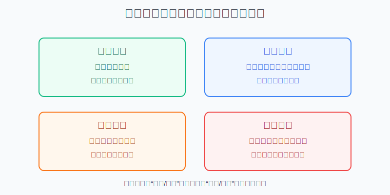
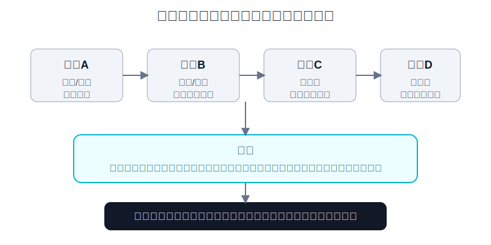
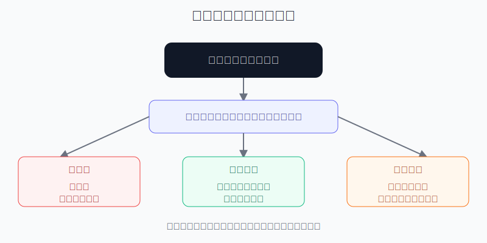

## 散户投资小白金融全品种操盘手册 - 14.2 看涨期权、看跌期权、买方、卖方
  
### 作者  
digoal  
  
### 日期  
2026-06-07   
  
### 标签  
金融产品 , 金融工具 , 散户 , 投资小白 , 全品操盘手册  
  
----  
  
## 背景 
  

> 适用读者: 已经知道期权有权利、义务、到期日和行权价，但一看到“买认购、卖认购、买认沽、卖认沽”就混乱的小白投资者。  
> 本文定位: 投资教育框架，不构成个性化投资建议。

## 先问一个反直觉的问题

很多人以为期权只有两个方向: 看涨和看跌。其实期权真正让小白亏得不明不白的，不是方向，而是身份。**同样判断市场会上涨，买入看涨和卖出看跌，风险完全不是一回事。**

## 核心概念: 期权不是“买涨买跌”，而是“四格棋盘”

期权先分两种类型，再分两种身份。

看涨期权，也叫认购期权，给买方的是“按行权价买入标的”的权利。你买看涨，是希望标的上涨到足以覆盖行权价和权利金；你卖看涨，是收权利金，同时承诺如果买方行权，你要按行权价卖出标的。

看跌期权，也叫认沽期权，给买方的是“按行权价卖出标的”的权利。你买看跌，是希望标的下跌，或者给已有持仓买保险；你卖看跌，是收权利金，同时承诺如果买方行权，你要按行权价买入标的。

买方和卖方的差别，比看涨和看跌更重要。买方先付权利金，换来选择权，最坏情形通常是权利金归零。卖方先收权利金，换来义务，最坏情形取决于有没有备兑、有没有现金、标的价格会走多远。备兑，就是你卖出认购期权时已经持有对应标的；现金担保，就是你卖出认沽期权时已经准备好按行权价买入标的的现金。

本节行动结论先放在前面: **小白不要把期权下单理解成“押涨跌”。每次下单前先问四句话: 我做的是看涨还是看跌？我是买方还是卖方？最大亏损能不能写成数字？被指派时有没有标的或现金履约？四句话说不清，只能模拟，不能实盘。**

## 逻辑推导链

【论证链标题】: 因为期权类型决定方向，买卖身份决定权利义务，权利金和到期日决定成本门槛，所以小白必须先识别四个角色，再决定是否只能模拟。

── 第一步: 前提陈述

前提A: 看涨期权和看跌期权解决的是不同方向问题。这是常量。看涨像买一张“未来可按固定价买入”的优惠券；看跌像买一张“未来可按固定价卖出”的保险单。

前提B: 买方和卖方的风险结构不同。这是常量。买方付钱买权利，卖方收钱承担义务。买方像买保险的人，保费花掉了就花掉了；卖方像收保费的人，事故发生时要赔。

前提C: 权利金不是小费用，而是买方的成本和盈亏平衡门槛。这是变量。权利金会随标的价格、到期时间、波动率和市场供需变化。越贵的权利金，越要求标的走出更大幅度。

前提D: 卖方是否备兑、是否有现金担保，是风险边界的关键变量。有备兑的卖出看涨，风险主要是放弃上方收益；无备兑的卖出看涨，标的越涨，亏损越难封顶。卖出看跌若没有现金准备，标的大跌时会变成被迫接货和保证金压力。

── 第二步: 逻辑推导

由A可得: 因为看涨和看跌代表不同权利，所以“我看多”通常对应买入看涨或卖出看跌，“我看空或想保护持仓”通常对应买入看跌或卖出看涨。但这只是方向层，不能直接下单。

由A+B可得: 因为买方有权利、卖方有义务，所以同样看多，买入看涨的最大损失通常是权利金，而卖出看跌的风险是标的大跌后你可能必须按行权价买入。方向相同，最坏结果不同。

再由B+C可得: 因为买方要先付权利金，所以买方不是“亏损有限就随便买”。方向对得不够快、不够远，仍然可能亏掉权利金。看涨买方的到期盈亏平衡点约等于行权价加权利金；看跌买方的到期盈亏平衡点约等于行权价减权利金。

最后由B+D可得: 因为卖方的义务会在指派时落到账户上，所以小白不能把“收权利金”理解成稳定利息。只有在有标的、有现金、有仓位上限、能接受被指派结果时，卖方才进入学习区；否则卖方是风险放大器。

── 第三步: 正常情景下的操作结论

✅ 正常情景: 你刚学期权，目标是理解四个角色，不是靠短期期权翻倍；你还没有处理行权、指派、保证金和组合风险的经验。

对应操作: 第一阶段只做纸面推演和模拟盘。若未来一定要小额实盘学习，优先从买方开始，而且单笔权利金亏完也不能影响组合。卖方不作为小白默认起点；卖出看涨必须先问是否持有标的，卖出看跌必须先问是否愿意并且有钱按行权价买入标的。

── 第四步: 数据和案例证实

证据1: SEC 投资者教育公告《Investor Bulletin: An Introduction to Options》在2015年用“ABC December 70 Call $2.20”说明期权报价。一张股票期权通常对应100股，所以每股2.20美元的权利金，对应一张合约220美元成本。公告里的例子还说明，如果到期股价低于行权价，买方可能损失全部权利金。这个证据对应前提C: 买方亏损边界清楚，但权利金归零是真实风险。

证据2: FINRA 的期权教育材料说明，期权买方拥有按固定价格买入或卖出标的的权利；期权卖方可能被指派，并被要求履行合同条款。FINRA 还特别提醒，无备兑看涨期权卖方如果被行权，必须在市场上买入股票再按行权价交付，标的上涨越多，风险越大。这个证据对应前提B和D: 卖方风险不在“方向说法”，而在履约义务。

证据3: OCC 在2026年1月5日发布的年度数据中披露，2025年美国清算期权合约总量为15,207,163,554张，比2024年增长24.4%；其中股票期权8,269,693,680张，ETF期权5,679,730,264张，指数期权1,257,739,610张。这个证据说明期权是成熟市场里的常用工具，但交易量巨大不等于适合小白直接实盘。

证据4: 上交所《上海证券交易所股票期权市场发展报告（2025）》披露，2025年上交所股票期权合约累计成交12.75亿张，日均成交524.70万张，日均权利金成交30.14亿元；从类型看，认购期权交易量占53.20%，认沽期权交易量占46.80%。报告还披露，个人投资者偏好买入开仓，占其所有开仓交易的60.98%；机构投资者偏好卖出开仓，占其所有开仓交易的79.62%。这个证据对应前提B和D: 买方和卖方不是难度相同的两边，机构更常做卖方，背后通常有保证金、对冲和组合管理能力。

失败情景: 小白最常见的失败不是“买错方向”，而是“把角色搞错”。例如他看多50ETF，本来只想最多亏1000元学费，却卖出认沽期权收权利金。若标的大跌并被指派，他承担的不是1000元学费，而是按行权价买入标的的义务。这个结果和买入看涨完全不同。历史不代表未来，但它验证的是结构规律: 身份决定最坏结果，不能用方向判断替代风险边界。

── 第五步: 前提变化时的替代结论

若前提C改变，也就是权利金明显变贵，推导路径变为: 因为买方成本上升，盈亏平衡点被推远，所以方向看对也可能亏。新结论: 买方不追贵权利金，先算盈亏平衡点，再决定是否模拟。

若前提D改变，也就是卖出看涨没有持有标的，推导路径变为: 因为你没有可交付的标的，所以标的上涨会让你被迫高价买入、低价交付。新结论: 小白不做无备兑卖出看涨。

若卖出看跌没有现金准备，推导路径变为: 因为你可能被要求按行权价买入标的，所以标的大跌时风险会从“收一点权利金”变成“账户被迫接货”。新结论: 不做无现金准备的卖出看跌。

若到期日很近，推导路径变为: 因为剩余时间少，买方容错变低，卖方指派和波动风险更集中。新结论: 小白不碰临近到期的短期期权，更不做末日期权。

## 实操例子: 同样看多50ETF，四个角色完全不同

这个例子对应论证链的正常结论: **先识别角色，再算最坏结果。**

假设50ETF现价为3.00元，你研究的是一个月后到期、行权价3.00元的期权。为了教学演示，假设看涨期权权利金0.08元，看跌期权权利金0.07元，合约单位10000份。

第一种，买入看涨。你付出0.08 × 10000 = 800元权利金。到期盈亏平衡点约为3.08元。若到期50ETF涨到3.20元，内在价值是0.20元，扣除0.08元权利金后，每份约赚0.12元，一张约赚1200元；若到期价格低于3.00元，通常不行权，800元权利金亏完。这对应前提B+C: 买方最大亏损清楚，但需要涨得够远。

第二种，买入看跌。你付出0.07 × 10000 = 700元权利金。到期盈亏平衡点约为2.93元。若你原本持有50ETF，买看跌像给持仓买保险；若到期50ETF跌到2.80元，期权内在价值0.20元，扣除0.07元权利金后，每份约赚0.13元。若50ETF没跌，700元权利金就是保险费。这对应前提A+C: 看跌不一定是赌博，也可以是保护。

第三种，卖出看涨。你收0.08 × 10000 = 800元权利金。如果你本来持有10000份50ETF，这叫备兑开仓。到期若50ETF低于3.00元，期权大概率不被行权，你留下权利金；若涨到3.20元，你可能要按3.00元卖出持仓，等于放弃3.00元以上的上涨收益。如果你没有持有50ETF还卖看涨，标的越涨，你越被动，这就不是小白该碰的交易。

第四种，卖出看跌。你收0.07 × 10000 = 700元权利金。如果你本来就愿意在3.00元买入10000份50ETF，并准备了约30000元现金，这可以理解成“愿意接货时收一点补偿”。但如果你没有现金，只看到700元权利金，标的跌到2.70元时，你面对的是按3.00元买入的义务和账户资金压力。

如果操作错误，后果很直接。你原计划最多用800元买看涨学习，却因为觉得“卖方胜率高”改成裸卖看涨。市场快速上涨后，你不再是亏800元，而是面对不断扩大的履约风险。纠偏方法不是继续加卖，而是回到四句话: 方向、身份、最大亏损、履约准备。只要其中一个说不清，停止实盘。

## 可复用框架

【四格识别】

适用前提: 你看到任何一笔期权交易，想判断它到底在押什么风险。

核心逻辑: 因为看涨/看跌只决定方向，买方/卖方才决定权利义务，所以先把交易放进四格，再算数字。

操作步骤:

1. 看类型: 看涨是买入权，看跌是卖出权。
2. 看身份: 买方付权利金，卖方收权利金并承担义务。
3. 算买方: 最大亏损通常是权利金，盈亏平衡点要覆盖权利金。
4. 算卖方: 是否备兑、是否有现金、是否能接受被指派。

前提失效时: 如果你只说“看多”或“看空”，却说不清买方卖方，不下单；如果卖方没有备兑或现金准备，不实盘。

举一反三: 这个框架也适用于后面的保护性看跌、备兑开仓、领口策略和美股期权。

【先权后义】

适用前提: 你是期权小白，目标是学习工具，而不是马上追求复杂收益。

核心逻辑: 因为买方风险边界更容易写成数字，卖方需要处理指派和保证金，所以学习顺序应先权利、后义务。

操作步骤:

1. 先用模拟盘买入看涨和看跌各一张，记录权利金变化。
2. 每笔都写清最大亏损、盈亏平衡点和到期日。
3. 再观察卖方如何赚钱、如何亏钱，但不急着实盘。
4. 只有在备兑或现金准备充分时，才把卖方放入学习清单。

前提失效时: 如果你被“每天收权利金”吸引，开始忽略极端行情，说明你还没有理解义务，退回模拟盘。

举一反三: 所有带义务的工具都要这样学。先看自己最坏会失去什么，再看自己可能赚什么。

## 本节行动清单

| 动作 | 合格标准 |
|---|---|
| 画出四格 | 买入看涨、买入看跌、卖出看涨、卖出看跌都能解释 |
| 区分方向和身份 | 看涨/看跌是方向，买方/卖方是权利义务 |
| 算买方成本 | 权利金 × 合约单位，写出最多亏多少 |
| 算盈亏平衡点 | 看涨为行权价 + 权利金，看跌为行权价 - 权利金 |
| 检查卖方准备 | 卖看涨看是否备兑，卖看跌看是否有现金 |
| 拒绝裸卖起步 | 小白不做无备兑卖出看涨，不做无现金卖出看跌 |
| 先模拟再实盘 | 四格和数字说不清前，只做纸面推演 |

## 一句话总结

期权不是简单的买涨买跌，而是看涨、看跌、买方、卖方组成的四格棋盘；小白先把自己站在哪一格、最坏会亏什么说清楚，再谈策略。

## 参考资料

- SEC Investor.gov: Investor Bulletin: An Introduction to Options, 2015年3月18日，https://www.investor.gov/index.php/introduction-investing/general-resources/news-alerts/alerts-bulletins/investor-bulletins-63
- FINRA: Options，https://www.finra.org/investors/insights/options-z-basics-greeks
- FINRA: Trading Options: Understanding Assignment，https://www.finra.org/investors/insights/trading-options-understanding-assignment
- OCC: OCC Annual 2025 and December 2025 Volume，2026年1月5日，https://www.theocc.com/newsroom/views/2026/01-05-occ-annual-2025-and-december-2025-volume
- 上海证券交易所: 《上海证券交易所股票期权市场发展报告（2025）》，2026年4月10日，https://big5.sse.com.cn/site/cht/www.sse.com.cn/aboutus/research/report/c/10814750/files/d1800de82bbe4613a2fe93e0853b7a3a.pdf

> ⚠️ **声明**：本文内容为投资教育目的，所有历史数据、策略框架均为辅助学习工具，不构成证券投资建议。市场有风险，投资需谨慎。实际操作请结合自身风险承受能力，必要时咨询专业投顾。
  
#### [PostgreSQL 解决方案集合](../201706/20170601_02.md "40cff096e9ed7122c512b35d8561d9c8")
  
  
#### [德哥 / digoal's Github - 公益是一辈子的事.](https://github.com/digoal/blog/blob/master/README.md "22709685feb7cab07d30f30387f0a9ae")
  
  
#### [About 德哥](https://github.com/digoal/blog/blob/master/me/readme.md "a37735981e7704886ffd590565582dd0")
  
  

  
