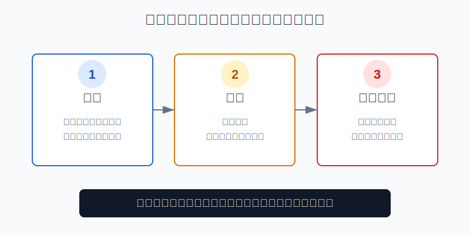
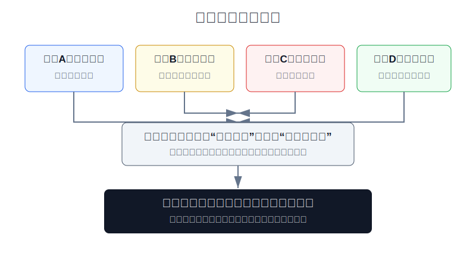
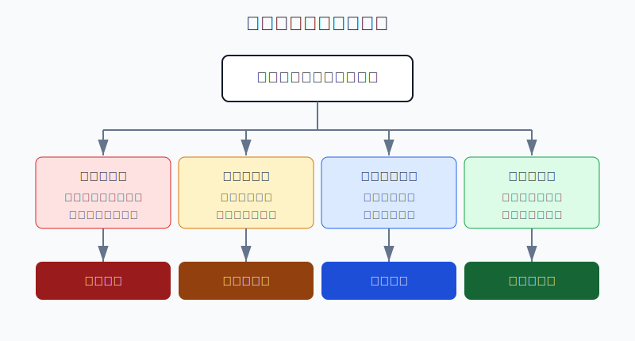

## 散户投资小白金融全品种操盘手册 - 14.3 期权为什么有门槛 - 复杂、杠杆、到期归零
  
### 作者  
digoal  
  
### 日期  
2026-06-07   
  
### 标签  
金融产品 , 金融工具 , 散户 , 投资小白 , 全品操盘手册  
  
----  
  
## 背景 
  

> 适用读者: 已经知道期权有认购、认沽、买方、卖方，但还觉得“开个权限而已，为什么这么麻烦”的小白投资者。  
> 本文定位: 投资教育框架，不构成个性化投资建议。

## 先问一个反直觉的问题

期权最像保险，却最容易被当成彩票。保险要先看条款、保额、期限和免赔条件；彩票只看赔率。**期权设置门槛的原因，正是为了防止你拿一份需要读合同的工具，去做只想押涨跌的动作。**

## 核心概念: 门槛不是收益门票，是风险过滤器

期权的门槛，主要不是在说“有钱人才能玩”。它真正过滤的是四件事: 你是否看得懂合同，是否承受得了权利金归零，是否知道卖方义务和保证金压力，是否明白不同策略需要不同权限。

复杂，是因为期权不是一个涨跌按钮。股票涨了你大概率赚钱，跌了你大概率亏钱；期权还要同时看方向、到期日、行权价、权利金、波动率和买卖方身份。波动率可以简单理解为“市场预期价格会剧烈摆动的程度”。波动率变了，期权价格会变，即使标的价格没怎么动。

杠杆，是因为你用较小的权利金控制一份较大的价格暴露。买入期权时，单张合约最大亏损通常是权利金，看起来亏损有限；但如果你连续买、重仓买、临近到期买，权利金归零会高频发生。卖出期权时更不能只看“收权利金”，因为卖方承担履约义务，可能需要保证金，也可能在极端行情里承受远大于权利金的亏损。

到期归零，是期权和股票最不一样的地方。股票跌了以后，只要公司没退市，理论上还可能等；期权过了到期日，合同就结束。虚值期权到期没有价值，权利金就没了。虚值就是“现在行权不划算”的状态。

本节行动结论先放在前面: **小白不要把期权权限当成炫耀，也不要把低权利金当成低风险。期权的正确学习顺序是: 先能解释门槛，再能翻译合约，再能算最大亏损和归零情景，最后才谈策略。任何一项说不清，就退回模拟盘或ETF工具。**

## 逻辑推导链

【论证链标题】: 因为期权同时具有合同复杂性、隐含杠杆、到期归零和卖方义务，所以交易所和券商必须设置知识、经验、资金和权限门槛；小白也必须把这些门槛内化成自己的下单前检查。

── 第一步: 前提陈述

前提A: 期权是标准化合同，不是普通资产买卖。这是常量。它像一份有期限、有触发条件的保险合同，先读条款，再谈使用。

前提B: 期权买方的权利金较小，但价格波动可能很大。这是常量。它像用很小的票钱进入一场高波动比赛，输的时候票钱可能全部没了，赢的时候也要扣掉票钱成本才算真赚。

前提C: 期权有到期日，虚值到期会归零。这是常量。它像一张优惠券，过期以后不能说“我方向长期是对的”，合同已经结束。

前提D: 期权卖方承担义务，很多卖方或组合策略涉及保证金和权限分级。这是变量。你从买方切到卖方，不是从“风险小”切到“胜率高”，而是从“付费买权利”切到“收钱承担义务”。

── 第二步: 逻辑推导

由A可得: 因为期权是合同，所以看不懂标的、到期日、行权价、权利金、行权方式和交收规则，就等于没看合同就签字。

由A+B可得: 因为权利金只是入场成本，不是收益保证，所以“几百元买一张”不能推出“风险很小”。如果你一次买很多张，或者连续用权利金试错，有限亏损也会累积成大亏。

由B+C可得: 因为期权会到期，所以方向对也不够。你还必须在到期前达到足够幅度，覆盖行权价和权利金成本；否则可能出现“方向看对一点，账户仍然亏钱”。

再由A+B+C+D可得: 因为买方会归零、卖方有义务、组合策略还可能有保证金压力，所以期权门槛不是形式主义。**门槛是在要求你先证明自己能理解风险结构，再允许你使用更复杂的工具。**

── 第三步: 正常情景下的操作结论

✅ 正常情景: 你是个人投资者，刚学期权；目标是理解保险和风险管理，不是靠末日期权短线翻倍；你没有成熟策略、没有卖方风控经验，也不熟悉行权交收。

对应操作: 不急着开权限。先用纸面推演或模拟盘完成三件事: 翻译10张期权合约，计算每张买方最大亏损和盈亏平衡点，复盘到期时为什么实值、平值或虚值。未来若符合适当性要求并开通权限，也只用极小金额学习买方或保护性策略，不做裸卖、重仓末日期权和自己说不清保证金的组合。

── 第四步: 数据和案例证实

证据1: 上交所《股票期权试点投资者适当性管理指引（2017年修订）》要求，个人投资者申请参与期权交易，需要满足申请开户前20个交易日日均托管证券市值与资金账户可用余额合计不低于50万元，证券账户或期货账户相关开户经历满6个月，并具备期权基础知识、通过测试、具有认可的模拟交易经历和相应风险承受能力。这对应前提A、B、C、D: A股场内期权从制度上就把资金、经验、知识和模拟经历放在下单之前。

证据2: SEC 的投资者教育材料提醒，期权可能让投资者损失全部初始投入，甚至更多；如果持有人的期权到期时处于虚值状态，已支付的全部权利金会损失。它还特别提醒，临近到期的剧烈波动可能导致期权到期无价值。这对应前提B和C: 到期归零不是小概率故事，而是期权买方必须预先接受的机制。

证据3: FINRA 在 Regulatory Notice 21-15 中说明，美国券商在接受客户期权订单前，必须对客户账户作出期权交易批准或不批准决定，并收集客户知识、投资经验、年龄、财务状况、投资目标等信息；FINRA Rule 2360 也要求账户批准时了解客户财务状况和投资目标，并记录账户被批准的交易类型。这对应前提D: 权限分级不是券商随意设置，而是监管框架里对不同风险等级的过滤。

证据4: OCC 的《Characteristics and Risks of Standardized Options》页面说明，投资者在买卖期权前应阅读 ODD，2024年6月版 ODD 更新并取代此前版本；页面同时提示期权有风险，并不适合所有投资者。这对应前提A: 成熟市场把“先读风险披露”放在期权交易之前。

证据5: Cboe 在《The State of the Options Industry: 2025》中披露，2025年有21个交易日的单日美国期权成交量超过7000万张，SPX 0DTE 期权日均成交230万张，占该产品总成交量59%。0DTE 是“当天到期”的期权。这个数据说明期权市场很活跃，也说明短期限交易已经非常普遍；但活跃不等于适合小白，期限越短，对时间衰减和盘中波动的要求越高。

失败情景: 一个新手看到某ETF认购期权只要0.03元，合约单位10000份，以为一张只要300元，“亏也亏不了多少”。他连续买10张，就是3000元权利金。如果到期前ETF没有涨过行权价加权利金，或者只是小涨但没覆盖成本，10张合约都可能归零。这个失败不是方向判断单点错误，而是把“单张亏损有限”误解成“连续重仓也安全”。

历史不代表未来。上面数据仍有参考价值，是因为它们验证的是期权制度规律: 期权交易前需要适当性过滤，买方可能损失全部权利金，卖方和复杂策略需要更高权限和保证金管理，短期限期权的时间压力更强。

── 第五步: 前提变化时的替代结论

若前提A不成立，也就是你不能把一张期权合约翻译成标的、认购认沽、买方卖方、到期日、行权价、权利金和盈亏平衡点，推导路径变为: 因为合同读不懂，所以任何下单都是盲签。新结论: 不开实盘，只做合约翻译练习。

若前提B被你低估，也就是你觉得“反正一张才几百元”，推导路径变为: 因为你忽视了张数和频率，所以有限亏损会被重复交易放大。新结论: 所有买方学习仓按总账户0.5%-1%封顶，不能用连续补仓摊薄来对抗时间衰减。

若前提C变强，也就是离到期只剩几天甚至当天到期，推导路径变为: 因为时间窗口极短，方向、幅度、速度都要同时正确，所以容错极低。新结论: 小白不碰末日期权和0DTE，先学30天以上到期结构的纸面推演。

若前提D出现，也就是你想卖期权、做价差或组合策略，推导路径变为: 因为你已经从“买权利”进入“承担义务或保证金约束”，所以必须先确认权限、保证金、指派和强平规则。新结论: 不裸卖，不越级，不做说不清最大亏损的组合。

## 实操例子: 10万元账户想开期权权限，先怎么自检

这个例子对应论证链的正常结论: **门槛要先变成自己的检查表，而不是等券商审核时才被动回答。**

假设小林有10万元投资资金，其中6万元是宽基ETF核心仓，2万元是现金和短债防守仓，2万元是学习仓。他看到网上有人用期权一天翻倍，想开通权限。

第一步，先判断资金前提。按上交所场内期权适当性要求，小林的资金规模本身就不满足50万元门槛，因此不能把“开不了权限”理解成错过机会。对应前提A和D: 工具复杂，制度门槛就是第一层过滤。他现在该做的是模拟盘和纸面推演，不是找旁门路径。

第二步，做合约翻译练习。小林选10张真实期权报价，逐张写清: 标的、认购或认沽、买方或卖方、到期日、行权价、权利金、合约单位、盈亏平衡点。只要有一张说不清，就不进入下一步。这对应前提A。

第三步，算归零承受度。假设一张ETF期权权利金0.05元，合约单位10000份，一张成本500元。若小林未来只做学习，单次最大亏损上限设为总账户0.5%，也就是500元，那么最多只能买一张，不能因为“便宜”买5张、10张。这对应前提B和C。

第四步，拒绝末日期权诱惑。假设某张当天到期期权只要0.01元，一张100元，看起来很便宜。但它当天必须快速越过行权价并覆盖成本，否则就可能归零。小林的动作不是买来体验，而是在模拟盘记录价格如何衰减。这对应前提C: 到期日越近，容错越低。

第五步，暂不碰卖方。小林看到卖出期权能收权利金，觉得“胜率更高”。但他还不知道指派、保证金和极端行情下的亏损路径，所以不能把卖方当起点。这对应前提D: 卖方不是收租，而是承保。

如果前提不成立，操作要切换。资金不满足门槛，就不实盘；合约翻译不过关，就不下单；单次归零亏损超过预算，就缩小到模拟；只想短线翻倍，就停止期权学习，先复盘自己是不是在赌。

如果操作错误，后果很直接。小林若绕过门槛、用不合适账户或高频买入短期限虚值期权，可能每次只亏几百元，却在几十次交易后把学习仓磨掉。更严重的是，如果他跳到卖方，以为“多数期权到期没价值，所以卖方稳赚”，一旦遇到标的快速大涨或大跌，亏损会集中爆发。

## 可复用框架

【四门自检】

适用前提: 你准备开通期权权限，或已经能看到期权报价，想判断自己是否适合继续学。

核心逻辑: 因为期权风险来自复杂、杠杆、到期归零和卖方义务，所以先过四道门，再谈策略。

操作步骤:

1. 合同门: 能否翻译标的、类型、身份、到期日、行权价、权利金。
2. 资金门: 单次权利金归零是否低于总账户0.5%-1%。
3. 时间门: 是否避开临近到期、当天到期和自己看不懂的短期限合约。
4. 权限门: 策略是否匹配账户权限，是否知道保证金、指派和行权交收规则。

前提失效时: 任意一道门过不了，不下单；已经持有就只允许按计划减仓或退出，不加仓证明自己。

举一反三: 这个框架也适用于期货、黄金T+D、杠杆ETF和任何带保证金或到期日的工具。

【先保险后彩票】

适用前提: 你已经理解期权基本概念，但还容易被高倍收益吸引。

核心逻辑: 因为期权本质更接近风险转移合同，所以学习顺序应先从保险目的出发，而不是从短线翻倍出发。

操作步骤:

1. 先问目的: 是保护已有持仓，还是单纯押方向。
2. 先算成本: 权利金归零是否可承受。
3. 先看期限: 到期日是否给判断留出足够时间。
4. 先写失效: 标的没走到、时间不够、权利金太贵时如何退出。

前提失效时: 如果你发现自己只是想用小钱搏大钱，退回模拟盘；如果你说不清保险对象，不做保护性策略。

举一反三: 后面学习买入看跌期权、备兑开仓和领口策略时，都要先问“我在保护什么风险”，而不是先问“这单能赚几倍”。

## 本节行动清单

| 动作 | 合格标准 |
|---|---|
| 解释门槛 | 能说清复杂、杠杆、到期归零、卖方义务四个原因 |
| 翻译合约 | 至少连续翻译10张期权合约无遗漏 |
| 计算归零损失 | 权利金 × 合约单位 × 张数，写出最坏亏损 |
| 设置学习仓 | 单次归零亏损不超过总账户0.5%-1% |
| 避开末日期权 | 不碰当天到期和临近到期的虚值合约 |
| 拒绝裸卖起步 | 不把收权利金当无风险收入 |
| 检查权限匹配 | 不越级做账户未批准或自己说不清的策略 |

## 一句话总结

期权门槛不是为了挡住机会，而是为了挡住误用；先过知识、资金、时间和权限四道门，才有资格把期权当保险工具，而不是彩票。

## 参考资料

- 上海证券交易所: 《上海证券交易所股票期权试点投资者适当性管理指引（2017年修订）》，https://www.sse.com.cn/lawandrules/sselawsrules2025/option/c/c_20250610_10781453.shtml
- 上海证券交易所: 期权投资“一件事”，2026年访问，https://one.sse.com.cn/onething/qqtz/
- SEC Investor.gov: Investor Bulletin: An Introduction to Options, 2015年3月18日，https://www.investor.gov/index.php/introduction-investing/general-resources/news-alerts/alerts-bulletins/investor-bulletins-63
- SEC Investor.gov: Investor Bulletin: Opening an Options Account, 2015年3月18日，https://www.investor.gov/introduction-investing/general-resources/news-alerts/alerts-bulletins/investor-bulletins-77
- FINRA: Regulatory Notice 21-15, 2021年4月9日，https://www.finra.org/rules-guidance/notices/21-15
- FINRA: Rule 2360 Options, 2026年访问，https://www.finra.org/finramanual/rules/r2360/
- OCC: Characteristics and Risks of Standardized Options, 2024年6月版，https://www.theocc.com/company-information/documents-and-archives/options-disclosure-document
- Cboe: The State of the Options Industry: 2025, 2026年发布，https://www.cboe.com/insights/posts/the-state-of-the-options-industry-2025/

> ⚠️ **声明**：本文内容为投资教育目的，所有历史数据、策略框架均为辅助学习工具，不构成证券投资建议。市场有风险，投资需谨慎。实际操作请结合自身风险承受能力，必要时咨询专业投顾。
  
#### [PostgreSQL 解决方案集合](../201706/20170601_02.md "40cff096e9ed7122c512b35d8561d9c8")
  
  
#### [德哥 / digoal's Github - 公益是一辈子的事.](https://github.com/digoal/blog/blob/master/README.md "22709685feb7cab07d30f30387f0a9ae")
  
  
#### [About 德哥](https://github.com/digoal/blog/blob/master/me/readme.md "a37735981e7704886ffd590565582dd0")
  
  

  
