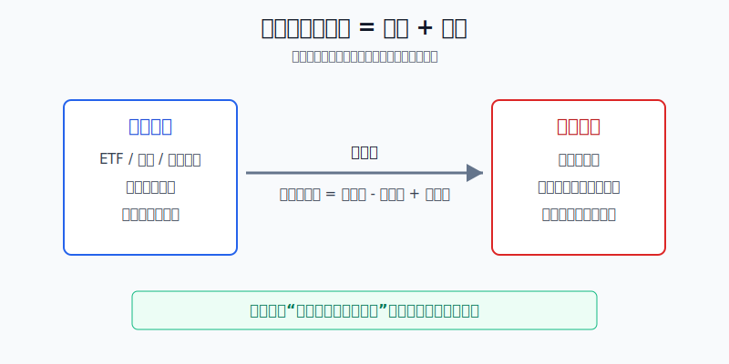
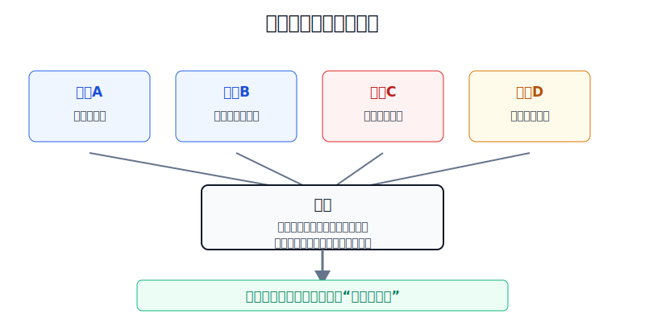
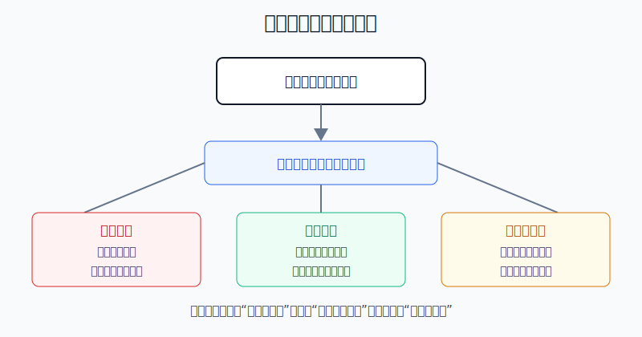

## 散户投资小白金融全品种操盘手册 - 14.4 买入看跌期权 - 给持仓买保险
  
### 作者  
digoal  
  
### 日期  
2026-06-07   
  
### 标签  
金融产品 , 金融工具 , 散户 , 投资小白 , 全品操盘手册  
  
----  
  
## 背景 
  

> 适用读者: 已经学完期权的权利、义务、到期日和行权价，想知道“买认沽到底有什么正经用途”的小白投资者。  
> 本文定位: 投资教育框架，不构成个性化投资建议。

## 先问一个反直觉的问题

保险的最好结果是什么？不是出险后赔钱，而是没出事，保险费白花。买入看跌期权也是这样: **它的正常用途不是靠暴跌发财，而是让你持有资产时知道最坏能亏到哪里。**

## 核心概念: 买认沽不是“看空彩票”，而是“持仓保险”

看跌期权，在 A 股通常叫认沽期权，在美股常叫 Put。买入看跌期权的意思是: 你先付一笔权利金，获得在约定到期日、按约定行权价卖出标的资产的权利。

把它翻译成生活里的话，就是你给车买保险。车没有撞坏，保险费花掉；车真的撞坏，保险能帮你把损失限制在合同写好的范围内。期权也是这个逻辑: 标的没跌，权利金可能损失；标的大跌，认沽期权的价值上升，用来抵消持仓下跌。

本节行动结论先放前面: **买入看跌期权只适合保护“已经有、暂时不想卖、但担心短期大跌”的持仓。没有持仓时买认沽，是方向交易；保险费太贵时买认沽，是用确定成本换不划算的保护。**

## 逻辑推导链

【论证链标题】: 因为看跌期权能把下跌损失变成可计算成本，所以它适合作为持仓保险；但保险费过高或没有持仓时，策略会变成低胜率押注。

── 第一步: 前提陈述

前提A: 你已经有一笔需要保护的持仓。这是常量前提。没有现货、ETF或股票仓位，就谈不上“保险”，只是在单独赌下跌。

前提B: 这笔持仓短期不适合直接卖掉。这是变量。原因可能是你仍看好长期逻辑、卖出会打乱配置、或者只是想穿过一个财报、议息会议、政策窗口等短期风险。

前提C: 你担心的是“短期大跌”，不是普通波动。这是变量。保险应该用在小概率但杀伤力大的风险上，而不是每天涨跌几个点就买一次。

前提D: 权利金成本可承受。这是变量。保险不是免费的，买入认沽的成本会直接降低组合收益。

── 第二步: 逻辑推导

由A+B可得: 因为你有持仓，而且短期不想卖，所以直接清仓不是唯一选择。你需要的是“保留上涨可能，同时限制下跌损失”的工具。

由C可得: 因为你担心的是短期大跌，所以普通止损可能遇到跳空、流动性不足或情绪恐慌；看跌期权的行权价相当于提前写好的保护线。

再由A+B+C+D可得: 因为看跌期权能用确定的权利金换取下跌保护，所以当保险费合理时，它可以把“无限焦虑”变成“最大亏损可计算”。但如果D不成立，保险费太贵，组合会被成本拖累；如果A不成立，没有持仓，买认沽就不再是保险，而是短线看空押注。

── 第三步: 正常情景下的操作结论

✅ 正常情景: 你持有 10 万元 ETF 或股票，长期逻辑没有破坏，但未来 1 到 2 个月有明显事件风险；你愿意付出一小部分成本，换取跌破某个价位后的保护。

对应操作: 买入与持仓标的相关、到期日覆盖风险窗口、行权价接近你能承受损失线的看跌期权。下单前必须写清三件事: 保护哪笔持仓、最多愿意付多少保险费、到期前什么情况下平仓或放弃。

── 第四步: 数据和案例证实

证据1: 美国 Options Industry Council 的 Protective Put 页面（2026年6月6日访问）把该策略定义为“持有股票 + 买入看跌期权”来限制下跌风险，并给出最大亏损公式: 股票买入价 - 看跌期权行权价 + 权利金。这个定义直接对应前提A和结论: 保护性认沽的核心是“先有持仓，再买保护”。

证据2: OCC 的《标准化期权特征与风险》（2026年6月6日访问）说明，期权买方可能损失全部权利金，期权到期时若没有价值会失效。这个规则对应前提D: 买保险的成本是真实成本；哪怕每次只亏 1 笔权利金，连续买错也会把“小成本”累积成组合亏损。

证据3: 上交所上证50ETF期权合约基本条款（2023年3月3日）显示，50ETF期权有认购和认沽两类，合约单位为 10000 份，到期日为到期月份第四个星期三，行权方式为到期日行权。这个规则对应操作层面: 小白买认沽前不能只看权利金价格，必须确认一张合约到底保护多少份标的、覆盖多久、保护线在哪里。

证据4: Cboe 设置了 S&P 500 5% Put Protection Index（PPUT，2026年6月6日访问）这类指数，用标普500指数持仓叠加 5% 保护性看跌期权来观察保护效果。它说明保护性认沽不是散户自创偏方，而是机构研究中常见的风险管理框架。历史不代表未来，但“持仓 + 认沽保护”的结构有明确市场定义。

失败案例: 2008 年金融危机、2020 年疫情冲击这类极端下跌后，很多投资者才想起买保护，但那时市场恐慌已经推高了期权权利金。前提D会被破坏: 保险费太贵，买入后即使方向略微看对，也可能因为成本太高而不划算。保险最好在风险窗口前设计，而不是在恐慌最高点临时补票。

── 第五步: 前提变化时的替代结论

若前提A改变，也就是你没有持仓，只是觉得市场会跌，推导路径变为: 因为没有需要保护的资产，所以认沽不再抵消持仓损失，而是单独押方向。新结论: 这不是保险策略，不适合小白默认实盘。

若前提B改变，也就是你本来就愿意卖掉持仓，推导路径变为: 因为直接减仓能立刻降低风险，而且没有权利金成本，所以买认沽不一定优于卖出。新结论: 先减仓，再谈保护。

若前提C改变，也就是你只是害怕普通波动，推导路径变为: 因为普通波动是长期持仓必须承受的成本，所以每次波动都买保险，会把组合收益交给权利金。新结论: 用仓位上限解决普通波动，用期权处理短期尾部风险。

若前提D改变，也就是权利金明显偏贵，推导路径变为: 因为保险费会吃掉未来收益，所以保护本身可能变成亏损来源。新结论: 降低仓位、拉开行权价、缩短保护期，或者放弃买保险。

## 实操例子: 给 50ETF 持仓买一层保护

这个例子对应论证链的正常结论: **已有持仓、短期不想卖、担心事件风险、保险费可承受时，才考虑买认沽。**

假设你持有 50ETF 10000 份，买入成本为 2.80 元，持仓市值约 28000 元。未来一个月你担心市场出现短期大跌，但你不想卖掉核心仓位。你看到一张 50ETF 认沽期权，行权价 2.70 元，权利金 0.04 元，合约单位 10000 份。

第一步，确认保护对象。你持有 10000 份 50ETF，而一张合约单位是 10000 份，所以一张认沽大致对应这笔持仓。判断依据来自前提A: 没有持仓就不是保护。

第二步，计算保险费。0.04 元 × 10000 份 = 400 元。不考虑手续费，这就是你为这一个月保护付出的确定成本。判断依据来自前提D: 保险费必须先算出来，不能只看单价很小。

第三步，计算保护后的最大亏损。你买入成本 2.80 元，行权价 2.70 元，权利金 0.04 元。若到期时价格大跌，简单估算的最大亏损约为: (2.80 - 2.70 + 0.04) × 10000 = 1400 元。不买保险时，若 50ETF 跌到 2.40 元，浮亏约为 (2.80 - 2.40) × 10000 = 4000 元。买保险后，亏损被行权价附近的保护线限制住，但你付出了 400 元保险费。

第四步，写出三种结果。

| 到期情景 | 现货结果 | 认沽结果 | 组合理解 |
|---|---:|---:|---|
| 50ETF涨到2.95元 | 现货盈利 | 认沽大概率归零 | 赚上涨的钱，但少赚400元保险费 |
| 50ETF在2.75元附近 | 现货小亏或接近不亏 | 认沽价值有限 | 保险费成为主要成本 |
| 50ETF跌到2.40元 | 现货大亏 | 认沽明显增值或可行权 | 保险发挥作用，把大跌损失限制住 |

第五步，提前写纠偏规则。如果风险事件过去、价格没有跌破保护线，而且你仍打算长期持有，就接受保险费损失，不为了“把400元赚回来”再买一张更短期、更虚值的认沽。如果市场已经下跌，但期权权利金暴涨，下一次不要在恐慌最高点追保险，而是复盘为什么没有提前设计。

如果操作错误，后果有两种。第一种是过度保险: 每个月都买认沽，持仓没怎么跌，权利金却长期流出，组合收益被磨掉。第二种是保险不足: 持有 10 万元资产，只买能保护 2 万元的认沽，却误以为全仓都有保护；市场真跌时，心理预期和真实损失会对不上。

## 可复用框架

【四问保险】

适用前提: 你已经有股票、ETF或指数相关持仓，想判断是否需要买入看跌期权。

核心逻辑: 因为保护性认沽是“确定成本换下跌保护”，所以先确认保护对象和风险窗口，再计算保险费是否值得。

操作步骤:

1. 问保护什么: 标的、数量、持仓成本是否和期权合约匹配。
2. 问防哪段: 到期日是否覆盖你担心的事件窗口。
3. 问防到哪: 行权价是否接近你的最大可承受亏损线。
4. 问花多少: 权利金占持仓金额的比例是否可承受。

前提失效时: 没有持仓就不按保险处理；能直接减仓就先减仓；保险费太贵就不要硬买。

举一反三: 这个框架也适用于美股个股、指数ETF、港股相关ETF以及后面要讲的领口策略。

【先减后保】

适用前提: 你担心下跌，但还没判断该卖出、持有还是买保护。

核心逻辑: 因为减仓是最简单的降风险动作，买认沽是有成本的精细保护，所以先判断能不能卖，再判断要不要保。

操作步骤:

1. 长期逻辑破坏: 直接减仓或清仓，不用买保险掩盖错误。
2. 长期逻辑还在、短期风险升高: 考虑买入看跌期权保护。
3. 长期逻辑还在、只是普通波动: 保持仓位纪律，不频繁买保险。

前提失效时: 如果你说不清为什么不能卖，只是舍不得亏损，那买认沽可能是在拖延止损。

举一反三: 所有风险管理都先问“能不能减少暴露”，再问“用什么工具对冲”。

## 本节行动清单

| 动作 | 合格标准 |
|---|---|
| 确认保护对象 | 写出标的、数量、持仓成本 |
| 匹配合约单位 | 一张期权保护多少份标的要算清 |
| 选择风险窗口 | 到期日覆盖事件风险，不买无意义超短期 |
| 计算保险费 | 权利金 × 合约单位，先确认确定成本 |
| 计算最大亏损 | 现货买入价 - 行权价 + 权利金 |
| 写前提失效动作 | 能卖就减仓，保险费太贵就放弃 |
| 复盘保险结果 | 区分“保险没用上”和“策略错误” |

## 一句话总结

买入看跌期权的正经用法，是用一笔确定的保险费，把已有持仓的短期大跌风险锁进可计算范围；没有持仓、不会算成本、保险费太贵时，不要把它当成彩票。

## 参考资料

- Options Industry Council: Protective Put (Married Put), https://www.optionseducation.org/strategies/all-strategies/protective-put-married-put
- OCC: Characteristics and Risks of Standardized Options, https://www.theocc.com/company-information/documents-and-archives/options-disclosure-document
- 上海证券交易所: 上证50ETF期权合约基本条款，2023年3月3日，https://big5.sse.com.cn/site/cht/www.sse.com.cn/assortment/options/contract/c/c_20230303_5717359.shtml
- Cboe: S&P 500 5% Put Protection Index (PPUT), https://www.cboe.com/us/indices/dashboard/PPUT/

> ⚠️ **声明**：本文内容为投资教育目的，所有历史数据、策略框架均为辅助学习工具，不构成证券投资建议。市场有风险，投资需谨慎。实际操作请结合自身风险承受能力，必要时咨询专业投顾。
  
#### [PostgreSQL 解决方案集合](../201706/20170601_02.md "40cff096e9ed7122c512b35d8561d9c8")
  
  
#### [德哥 / digoal's Github - 公益是一辈子的事.](https://github.com/digoal/blog/blob/master/README.md "22709685feb7cab07d30f30387f0a9ae")
  
  
#### [About 德哥](https://github.com/digoal/blog/blob/master/me/readme.md "a37735981e7704886ffd590565582dd0")
  
  

  
