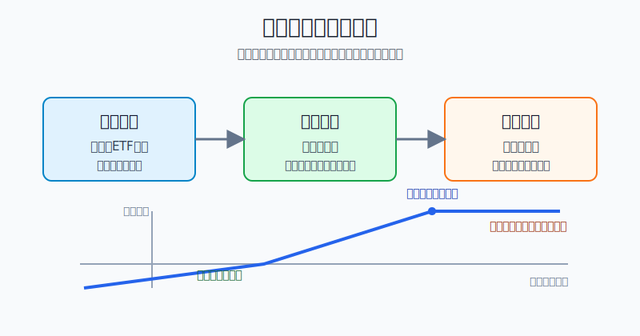
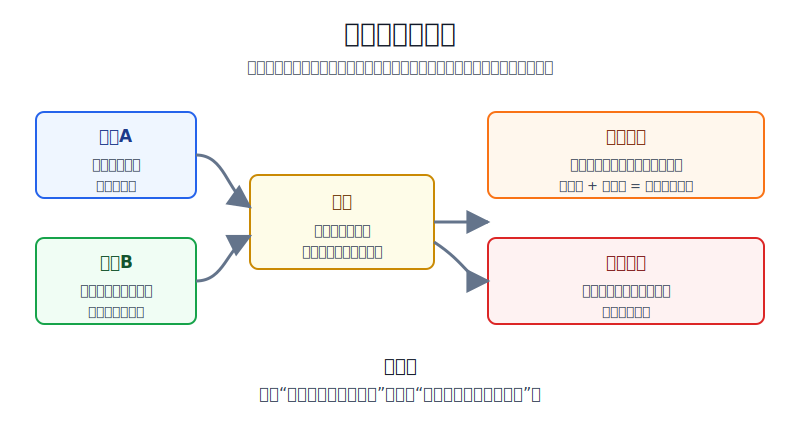
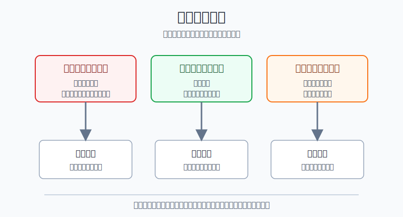

## 散户投资小白金融全品种操盘手册 - 14.5 备兑开仓 - 有现货时卖出认购期权
  
### 作者  
digoal  
  
### 日期  
2026-06-07   
  
### 标签  
金融产品 , 金融工具 , 散户 , 投资小白 , 全品操盘手册  
  
----  
  
## 背景 
  

> 适用读者: 已经听过“卖期权收权利金”，但还分不清备兑开仓、裸卖认购和股票止盈之间关系的小白投资者。  
> 本文定位: 投资教育框架，不构成个性化投资建议。

## 先问一个反直觉的问题

备兑开仓最容易骗过小白的地方，是它看起来像“躺着收租”。但真实情况是: **你收的不是白来的租金，而是把现货未来一段上涨空间卖给别人。**

## 核心概念: 备兑开仓是一张“提前写好的卖出计划”

备兑开仓，用一句话说就是: **你已经持有股票或ETF份额，再卖出对应数量的认购期权；如果到期被行权，你按行权价把现货卖给对方，同时保留已经收到的权利金。**

认购期权，就是买方有权按行权价买入标的资产。你作为卖方，收了权利金，就承担“对方要买时你要卖”的义务。备兑两个字的意思是: 这份义务不是空手承担的，你手里已经有对应现货，可以拿来交割。

这和裸卖认购完全不同。裸卖认购是没有现货却卖出认购，标的越涨，风险越大。备兑开仓因为手里有现货，上涨时最多是把现货交出去，不会出现“越涨越补洞”的裸卖认购风险。但它也不是无风险，因为现货下跌的亏损仍然在你身上，权利金只能抵掉一小段。

本节行动结论先放在前面: **备兑开仓只适合一个场景: 你本来就愿意在某个目标价卖出现货，并且愿意用上方上涨空间换取当下权利金。只想收权利金、不愿卖出现货、又怕现货下跌的人，不该做备兑开仓。**

## 逻辑推导链

【论证链标题】: 因为备兑开仓是“持有现货 + 卖出认购”的组合，所以它不是无风险收息，而是用有限上行空间换取权利金和计划卖出价格。

── 第一步: 前提陈述

前提A: 备兑开仓必须先有足额现货。这是常量。它像你已经有一套房，才签一份“到某个价格就卖”的合同；你不是空手承诺交房。

前提B: 卖出认购期权会收到权利金，同时承担按行权价卖出现货的义务。这是常量。权利金像定金，但收了定金就不能只享受好处，不接受合同结果。

前提C: 标的价格到期可能低于行权价、接近行权价，也可能大幅高于行权价。这是变量。价格走不同路径，备兑开仓的结果完全不同。

前提D: 小白最容易误解备兑开仓，把它当成“稳定收租”，却没有提前写明自己是否愿意被行权卖出现货。这是行为变量。它像你签了卖房合同，涨价后又后悔。

── 第二步: 逻辑推导

由A+B可得: 因为你有现货并卖出认购，所以你收权利金的代价，是让别人获得按行权价买走你现货的权利。

由B+C可得: 因为到期价格有三种结果，所以备兑开仓不是单一收益工具。标的下跌时，权利金只能降低一点损失；标的横盘或小涨时，权利金改善收益；标的大涨并超过行权价时，你会放弃行权价以上的上涨收益。

再由A+B+C+D可得: 因为最大矛盾不是“能不能收到权利金”，而是“被行权时你愿不愿卖”，所以备兑开仓的第一问题不是选哪张期权，而是确定目标卖出价。**行权价 + 权利金必须是你可以接受的卖出价格。**

── 第三步: 正常情景下的操作结论

✅ 正常情景: 你已经持有一只股票或ETF；它是你的卫星仓或计划止盈仓，不是绝对不想卖的核心仓；你认为未来一个期权周期内更大概率是横盘、小涨或温和上涨；你愿意在某个目标价卖出。

对应操作: 只卖出不高于现货数量覆盖能力的认购期权；选择你愿意卖出的行权价；把“行权价 + 权利金”当作有效卖出价；如果被行权，按计划卖出，不把它当事故。

── 第四步: 数据和案例证实

证据1: 上交所《股票期权试点交易规则》对备兑开仓的定义是，投资者提前锁定足额合约标的作为将来行权交割所应交付的证券，并据此卖出相应数量的认购期权。规则还写明，备兑开仓时备兑备用证券数量不足的，该备兑开仓指令无效。这对应前提A: 备兑开仓的底层不是“信用”，而是足额现货锁定。

证据2: 上交所上证50ETF期权合约基本条款显示，50ETF期权合约单位为10000份，买卖类型包含备兑开仓、备兑平仓等。也就是说，如果一张50ETF认购期权对应10000份ETF，小白不能持有3000份却卖出一张完整备兑认购。这对应前提A和B: 数量匹配是风险控制的第一步。

证据3: Options Industry Council 对 Covered Call 的说明中，用“持有100股股票 + 卖出1张认购期权”作为基础例子，并明确该策略适合愿意在行权价卖出股票的持有人；其最大亏损虽然有限，但仍然很大，最坏情况是股票归零，权利金只能降低一部分成本。这对应前提B和C: 备兑开仓不是消灭股票风险，而是拿权利金换取有限缓冲。

证据4: Cboe 的期权策略指数资料显示，Cboe S&P 500 BuyWrite Index（BXM，持有标普500并卖出认购期权的代表性指数）在其统计样本中年化收益为9.0%，低于标普500的10.3%；年化波动率为10.6%，低于标普500的14.9%；最大回撤为-35.8%，低于标普500的-50.9%。这组数据说明一个现实规律: 备兑类策略可以降低部分波动和回撤，但上行收益也会被放弃。历史不代表未来，但这个数据验证的是策略结构，而不是预测未来一定跑赢。

失败情景: 如果你持有一只股票或ETF，成本3.00元，卖出行权价3.10元的认购期权，收到0.04元权利金。到期价格涨到3.30元时，你的有效卖出收入是3.10 + 0.04 = 3.14元；现货从3.14元到3.30元的上涨收益不再属于你。这个结果不是券商坑你，也不是市场和你作对，而是你卖出认购时已经交换出去的上方收益。

── 第五步: 前提变化时的替代结论

若前提A不成立，也就是你没有足额现货，推导路径变为: 因为卖出认购没有现货覆盖，所以它已经不是备兑开仓，而是裸卖认购或保证金卖出。新结论: 小白不做。

若前提B没有被接受，也就是你收权利金但不愿按行权价卖出现货，推导路径变为: 因为你只接受收入，不接受义务，所以一旦标的大涨，你会被迫高价买回期权或后悔交割。新结论: 不卖认购；改用普通止盈单或继续持有。

若前提C变成大跌，也就是现货价格明显跌破成本，推导路径变为: 因为权利金只能提供小缓冲，所以组合仍然亏损。新结论: 按股票或ETF原本的卖出规则处理，不用继续卖更低行权价的认购来掩盖亏损。

若前提C变成大涨，也就是现货快速越过行权价，推导路径变为: 因为认购买方行权有利，所以你被行权或需要高价买回期权。新结论: 如果行权价加权利金是可接受目标价，就接受卖出；如果事前不能接受这个结果，说明当初不该开仓。

## 实操例子: 10万元ETF持仓怎样做一次备兑推演

这个例子对应论证链的正常结论: **只有当“被行权卖出”也是你能接受的结果时，备兑开仓才成立。**

假设小林持有某ETF 30000份，成本价3.00元，现价3.02元，市值约9.06万元。她原本的计划是: 如果未来一个月涨到3.12元附近，就愿意减掉三分之一仓位，回收一部分现金。

第一步，确认覆盖数量。假设该ETF期权一张合约单位是10000份，小林最多只能用其中10000份做一张备兑认购。她不能因为想多收权利金，就卖出4张认购。判断依据来自前提A: 备兑开仓必须由足额现货覆盖。

第二步，选择愿意卖出的行权价。她选择行权价3.10元、一个月后到期的认购期权。这里的核心不是“3.10元看起来权利金多不多”，而是她是否愿意在3.10元卖出10000份ETF。判断依据来自前提B: 卖出认购就是承担按行权价卖出的义务。

第三步，计算有效卖出价。假设这张认购期权权利金为0.04元，合约单位10000份，那么她收取权利金0.04 × 10000 = 400元。不考虑费用时，如果到期被行权，她的有效卖出价是3.10 + 0.04 = 3.14元；对这10000份ETF而言，较3.00元成本的总收益是0.14 × 10000 = 1400元。

第四步，写清三种到期结果。

如果到期价格是2.85元，认购期权通常没有行权价值，小林保留400元权利金，但10000份ETF账面亏损是0.15 × 10000 = 1500元，组合仍亏1100元。结论: 权利金不是保险，只是减震垫。

如果到期价格是3.08元，低于3.10元行权价，小林大概率保留ETF，也保留400元权利金。结论: 横盘或小涨，是备兑开仓最舒服的情景。

如果到期价格是3.30元，小林按3.10元卖出10000份ETF，同时保留400元权利金。她拿到的有效价是3.14元，不再享有3.14元到3.30元之间的上涨。结论: 大涨时收益封顶，这是策略成本，不是临时意外。

第五步，设置前提失效处理。如果小林在卖出认购后突然发现基本面增强，自己不愿意卖出ETF，就不应继续假装这是“增强收益”。她要么买回认购期权平仓，承认这次权利金交易成本；要么接受到期被行权。不能一边收权利金，一边要求保留全部上涨空间。

如果操作错误，后果也很清楚。她若只盯着400元权利金，连续在下跌过程中卖出更低行权价认购，最后可能把自己的止盈价越压越低；她若在大涨后高价买回认购，只为保住现货，又可能把前面收到的权利金和一部分现货上涨收益都交回去。

## 可复用框架

【愿卖再卖】

适用前提: 你已经持有足额股票或ETF，且这部分持仓不是必须长期持有的核心仓。

核心逻辑: 因为卖出认购会换来权利金，也会交出行权价以上的上行收益，所以先确认卖出价，再确认权利金。

操作步骤:

1. 定现货: 只拿计划止盈或可减仓的现货做备兑。
2. 定数量: 期权合约对应多少现货，就最多覆盖多少，不超卖。
3. 定价格: 行权价 + 权利金必须高于你的可接受卖出价。
4. 定结果: 到期被行权就执行卖出，不临时反悔。

前提失效时: 如果你不愿意卖出现货，停止卖认购；如果你已经卖出但不想交割，提前评估买回期权平仓的成本。

举一反三: 这个框架也适用于美股100股备兑认购、ETF备兑策略、计划减仓型个股和后面要讲的领口策略。

【三情景表】

适用前提: 你准备卖出一张备兑认购，但还没有下单。

核心逻辑: 因为备兑开仓到期结果取决于标的价格，所以必须先把下跌、横盘、大涨三种结局写出来。

操作步骤:

1. 下跌情景: 算现货亏损减去权利金后还亏多少。
2. 横盘情景: 算权利金对持仓收益的改善。
3. 大涨情景: 算被行权后的有效卖出价，以及放弃了多少上方收益。
4. 接受测试: 三种情景中有任何一种不能接受，不开仓。

前提失效时: 如果你只想看到横盘收权利金的好处，却不愿看大跌和大涨的代价，说明这笔交易不是计划，而是侥幸。

举一反三: 所有期权组合都要先写三情景表，包括保护性看跌、领口策略和价差策略。

## 本节行动清单

| 动作 | 合格标准 |
|---|---|
| 区分备兑和裸卖 | 能说清“有足额现货覆盖”才是备兑 |
| 确认可卖仓位 | 只用计划减仓或可止盈的现货，不拿核心仓随便卖认购 |
| 计算覆盖数量 | 合约单位对应多少现货，就锁定多少现货，不超卖 |
| 计算有效卖出价 | 有效卖出价 = 行权价 + 权利金 |
| 写三情景表 | 下跌、横盘、大涨三种结果都能接受再开仓 |
| 接受被行权 | 被行权是策略结果，不是临时事故 |
| 不用权利金掩盖亏损 | 现货逻辑坏了，按现货规则卖出，不靠继续卖认购硬撑 |

## 一句话总结

备兑开仓不是“白收权利金”，而是把你愿意卖出的现货提前挂上一个目标价；愿意卖，才卖认购，不愿卖，就别收这笔钱。

## 参考资料

- 上海证券交易所: 《上海证券交易所股票期权试点交易规则》，2025年6月10日页面更新，https://www.sse.com.cn/lawandrules/sselawsrules2025/option/c/c_20250610_10781448.shtml
- 上海证券交易所: 上证50ETF期权合约基本条款，2023年3月3日，https://big5.sse.com.cn/site/cht/www.sse.com.cn/assortment/options/contract/c/c_20230303_5717359.shtml
- Options Industry Council: Covered Call (Buy/Write), https://www.optionseducation.org/strategies/all-strategies/covered-call-buy-write
- Cboe: Performance Analysis of Options-Based Equity Mutual Funds, https://cdn.cboe.com/resources/education/research_publications/performance-options-based-funds.pdf

> ⚠️ **声明**：本文内容为投资教育目的，所有历史数据、策略框架均为辅助学习工具，不构成证券投资建议。市场有风险，投资需谨慎。实际操作请结合自身风险承受能力，必要时咨询专业投顾。
  
#### [PostgreSQL 解决方案集合](../201706/20170601_02.md "40cff096e9ed7122c512b35d8561d9c8")
  
  
#### [德哥 / digoal's Github - 公益是一辈子的事.](https://github.com/digoal/blog/blob/master/README.md "22709685feb7cab07d30f30387f0a9ae")
  
  
#### [About 德哥](https://github.com/digoal/blog/blob/master/me/readme.md "a37735981e7704886ffd590565582dd0")
  
  

  
