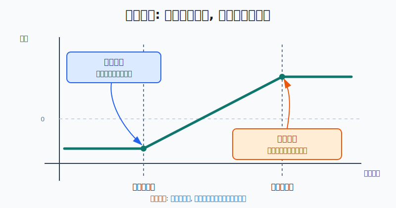
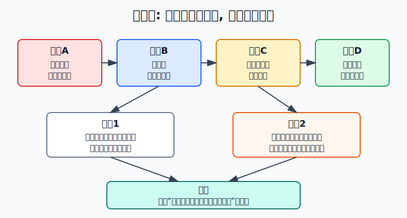
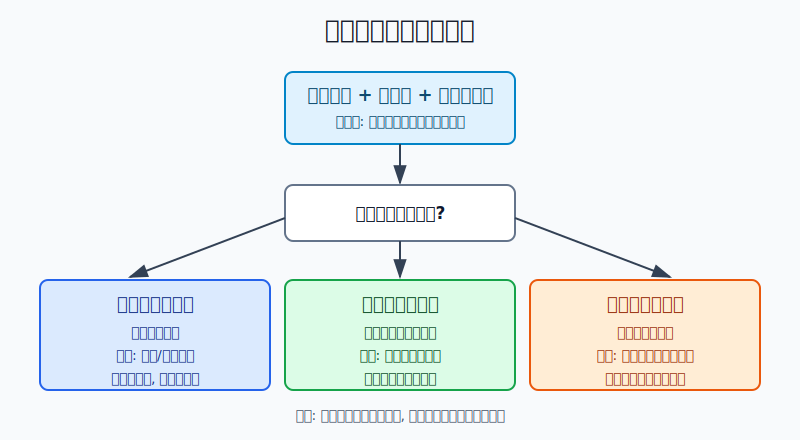

## 散户投资小白金融全品种操盘手册 - 14.6 领口策略 - 用有限成本控制下跌风险
  
### 作者  
digoal  
  
### 日期  
2026-06-07   
  
### 标签  
金融产品 , 金融工具 , 散户 , 投资小白 , 全品操盘手册  
  
----  
  
## 背景 
  

> 适用读者: 已经知道认沽期权能做保险、备兑开仓能收权利金，但还不知道两者为什么可以组合在一起的小白投资者。  
> 本文定位: 投资教育框架，不构成个性化投资建议。

## 先问一个反直觉的问题

很多人买保险时想少花钱，做投资时又想保住下跌、保留上涨。领口策略听起来正好满足这个愿望。问题是: **它不是免费保险，而是用一部分未来上涨收益，去换现在的下跌保护。**

## 核心概念: 领口就是给持仓同时装“地板”和“天花板”

领口策略，英文叫 collar。最小白的说法是: **你已经持有股票或 ETF，同时买入一张较低行权价的认沽期权，再卖出一张较高行权价的备兑认购期权。**

认沽期权是地板。它给你一个权利: 如果标的跌得太狠，你可以按约定价格卖出，或者卖掉这张认沽来补偿持仓亏损。它的作用像保险，但保险要花权利金。

备兑认购是天花板。你卖出认购，收一笔权利金，用来补贴认沽成本。但代价也清楚: 标的涨过认购行权价后，你的上涨收益会被封顶，甚至可能要把持仓卖出去。

所以领口策略的行动结论先放在前面: **只有在你已经有持仓、短期怕跌、愿意放弃一部分上涨空间、并且能处理到期行权或被指派时，才考虑领口。小白不要把它当成低成本套利，更不要在没有现货的情况下卖认购。**

## 逻辑推导链

【论证链标题】: 因为领口策略用卖出上方收益来补贴下方保险，所以它适合“想控制短期下跌、愿意接受上涨封顶”的持仓管理，不适合追求暴涨。

── 第一步: 前提陈述

前提A: 你先有现货持仓，这是常量。领口不是凭空造收益，而是围绕已有股票或 ETF 做保护。没有现货，卖认购就可能变成裸卖认购，风险结构完全变味。

前提B: 买入认沽期权能给持仓装下跌保护，这是常量。它像给车买保险，真出事时能赔一部分，但保费先扣掉。

前提C: 卖出备兑认购能收权利金，但会封住上涨空间，这是常量。它像你提前签了一个“涨到某个价就愿意卖”的约定。你拿了钱，就要接受这个约定。

前提D: 期权的权利金、行权价、到期日、流动性会变化，这是变量。保险太贵、认购收入太少、买卖价差太大、到期日太近，都会让领口策略失去性价比。

── 第二步: 逻辑推导

由A+B可得: 因为你持有现货，现货下跌会造成亏损；又因为认沽能在低位提供卖出权，所以认沽行权价附近会形成一条亏损地板。地板不是让你不亏，而是让你知道最坏亏多少。

由B+C可得: 因为买认沽要付钱，卖备兑认购能收钱，所以卖认购可以降低保险成本。再因为卖认购会带来交付现货的义务，所以你不能既想少付保险费，又不接受上涨封顶。

再由A+B+C+D可得: 因为领口同时改变下跌风险和上涨收益，所以它不是方向赌博，而是区间管理。**正常使用时，它把“我不知道短期会不会大跌”变成“我接受这段时间的最大亏损和最大收益边界”。**

── 第三步: 正常情景下的操作结论

✅ 正常情景: 你持有一篮子 ETF 或流动性较好的股票，长期仍想持有，但短期担心市场下跌；你能接受如果价格涨到目标位就卖出或被动减仓；你能看懂合约单位、行权价、到期日和权利金。

对应操作: 用同一标的、同一到期日附近的认沽和认购组合领口。认沽行权价由“最多能亏多少”决定，认购行权价由“涨到哪里愿意卖”决定。下单前先算净成本、最大亏损、最大收益和到期处理动作。

── 第四步: 数据和案例证实

证据1: Fidelity 转引 Cboe Options Institute 的领口示例显示，领口由持有或买入股票、买入保护性认沽、卖出备兑认购构成。示例中，买入 100 股 XYZ，股价 100 美元；卖出 105 美元认购，权利金 1.80 美元；买入 95 美元认沽，权利金 1.60 美元。因为净收 0.20 美元，所以到期最大收益为每股 5.20 美元，最大风险为每股 4.80 美元，不含费用。这个例子证明: 领口的核心不是提高暴利，而是把收益和亏损都压进一个可计算的区间。

证据2: Cboe 的 S&P 500 95-110 Collar Index 方法文件说明，CLL 指数持有 S&P 500 组合，按规则卖出 110% 附近的 SPX 认购期权，并买入 95% 附近的 SPX 认沽期权；指数基准日为 1986 年 6 月 30 日，发布日为 2008 年 9 月 4 日。Cboe 的组合保护页面列出 1987 到 2023 年间 S&P 500 单季跌幅超过 13.8% 的六个季度: 3Q2001、3Q2002、4Q2008、3Q2011、1Q2020、2Q2022。对应季度里，S&P 500 分别下跌 -14.7%、-17.3%、-21.9%、-13.9%、-19.6%、-16.1%；CLL 分别为 -0.7%、-8.1%、-5.9%、-11.6%、-5.0%、-6.7%。这说明领口可以缓冲大跌，但不是保本。

证据3: 上交所上证 50ETF 期权基本条款显示，合约类型包括认购和认沽，合约单位为 10000 份，到期月份为当月、下月及随后两个季月，到期日为到期月份的第四个星期三。这对应前提D: 在 A 股 ETF 期权里做领口，不能只看方向，要先匹配持仓数量和合约单位。你持有 3000 份 ETF，却按一张 10000 份合约去做，保护和义务就不匹配。

失败案例: 仍用 Fidelity 的 100 美元股票示例。如果到期股价涨到 109 美元，未做领口的现货每股赚 9 美元；但领口因为卖出了 105 美元认购，组合收益仍被限制在每股约 5.20 美元。这不是策略失败，而是前提兑现: 你拿认购权利金补贴了保险费，就必须接受上涨被封顶。真正的失败是你建仓时没有承认这件事，涨上去以后又后悔。

历史不代表未来。上面的数据仍有参考价值，是因为它们验证的是期权结构规律: 认沽提供下跌保护，认购收入降低保险成本，认购义务封住上涨空间。它不是预测下一次下跌会发生在哪一天。

── 第五步: 前提变化时的替代结论

若前提A改变，也就是你没有现货持仓却卖出认购，推导路径变为: 因为卖认购没有现货覆盖，所以上涨时可能变成裸卖认购风险。新结论: 停止，不做领口；先学备兑开仓和保证金规则。

若前提C改变，也就是你不愿意在认购行权价卖出持仓，推导路径变为: 因为你拿了权利金却不接受被卖出，所以到期或临近到期会被迫买回认购，可能把补贴成本吐回去。新结论: 不用领口，改用单纯买入认沽或直接降仓位。

若前提D变差，也就是认沽权利金很贵、认购收入很少、买卖价差很宽，推导路径变为: 因为保险成本覆盖不了风险收益边界，所以领口不再“低成本”。新结论: 放弃建仓，或者缩短观察期、降低仓位，而不是硬凑组合。

若市场强势突破，也就是价格快速涨过认购行权价，推导路径变为: 因为上涨空间已经被封顶，所以继续持有领口不再享受完整上涨。新结论: 如果愿意卖，就接受行权或被指派；如果不愿意卖，就提前买回认购并承认这是一笔保险成本。

## 实操例子: 1 万份 50ETF 持仓如何做一个教学版领口

这个例子对应论证链的正常结论: **用领口前，先把最大亏损和最大收益算成数字。**

假设小林持有 10000 份 50ETF，持仓成本 2.80 元。最近市场波动变大，他长期仍想持有，但未来一个月不想承受太大下跌。他能接受如果 50ETF 涨到 3.00 元附近就卖出。

第一步，确认数量匹配。上交所 50ETF 期权一张合约对应 10000 份 ETF。小林刚好持有 10000 份，所以教学上可以用一张认沽和一张认购覆盖这一笔持仓。如果他只持有 3000 份，就不该用一张合约硬套。

第二步，确定下跌地板。小林能接受 50ETF 从 2.80 元跌到 2.65 元附近，所以选择买入一张 2.65 元行权价的认沽。假设这张认沽权利金为 0.030 元，每张成本为 0.030 × 10000 = 300 元。

第三步，确定上涨天花板。小林愿意在 3.00 元附近卖出，所以选择备兑开仓卖出一张 3.00 元行权价的认购。假设这张认购权利金为 0.025 元，每张收入为 0.025 × 10000 = 250 元。

第四步，计算净成本。买认沽花 300 元，卖认购收 250 元，净成本为 50 元，也就是每份 0.005 元。这个 50 元不是手续费，而是保险没有完全被认购收入覆盖后的净支出。

第五步，计算最大亏损。若到期 50ETF 跌到 2.65 元以下，认沽开始提供保护。忽略手续费和滑点，最大亏损约为: (2.80 - 2.65 + 0.005) × 10000 = 1550 元。没有领口时，如果跌到 2.50 元，现货亏损是 (2.80 - 2.50) × 10000 = 3000 元。领口把下跌损失压住了，但没有让亏损消失。

第六步，计算最大收益。若到期 50ETF 涨到 3.00 元以上，卖出的认购会封住上涨。最大收益约为: (3.00 - 2.80 - 0.005) × 10000 = 1950 元。若 50ETF 涨到 3.20 元，未做领口的现货可赚 2000 元更多；领口会少赚，因为你提前卖出了上方收益。

第七步，写到期动作。如果到期价格低于 2.65 元，小林选择卖出认沽或按规则行权来处理保护；如果价格在 2.65 到 3.00 元之间，两个期权大概率不产生实质行权价值，他复盘是否续做；如果价格高于 3.00 元，他接受持仓被卖出，或者提前买回认购，但买回认购的成本必须计入结果。

如果操作错误，后果很直接。小林如果不愿意卖出 50ETF，却卖了 3.00 元认购，价格涨上去后会陷入两难: 要么接受卖出，要么花钱买回认购。小林如果只有 3000 份现货却卖一张 10000 份认购，超出的 7000 份没有现货覆盖，风险就不再是领口，而是混入了裸卖认购。

## 可复用框架

【上下限法】

适用前提: 你已经持有股票或 ETF，短期想降低下跌风险，并且愿意在某个价格卖出或减仓。

核心逻辑: 因为认沽决定下限、认购决定上限，所以领口策略先选价格边界，再看权利金是否划算。

操作步骤:

1. 先定下限: 跌到哪里是你不想继续裸露的风险区。
2. 再定上限: 涨到哪里是你愿意卖出或减仓的目标区。
3. 计算净成本: 买认沽成本 - 卖认购收入。
4. 计算边界: 最大亏损和最大收益都写成金额。
5. 写到期处理: 低于认沽、高于认购、夹在中间分别怎么做。

前提失效时: 如果你不愿意卖出持仓，就不要卖认购；如果认沽太贵，就不要硬做领口，直接降仓位通常更简单。

举一反三: 这个框架也适用于美股股票期权、ETF 期权、指数期权，以及持仓保护型的组合管理。

【三问领口】

适用前提: 你准备下单前，想快速判断这是不是一次合格的领口。

核心逻辑: 因为领口不是单腿期权，而是现货、认沽、认购三者绑定，所以必须先问清目标、数量和到期。

操作步骤:

1. 问目标: 我是在保护已有持仓，还是在赌方向？如果是赌方向，停。
2. 问数量: 现货数量是否覆盖认购义务？如果不覆盖，停。
3. 问到期: 到期前和到期日，三种价格情景怎么处理？如果没写，停。

前提失效时: 任意一问答不清，不建仓；已经建仓但发现数量错配，先把风险腿平掉，再复盘。

举一反三: 所有期权组合都可以用“三问”过滤: 目标是否清楚，数量是否匹配，到期动作是否提前写好。

## 本节行动清单

| 动作 | 合格标准 |
|---|---|
| 确认已有持仓 | 领口围绕现货或 ETF 持仓，不用裸卖认购伪装领口 |
| 匹配合约单位 | A 股 ETF 期权常见一张对应 10000 份，数量不匹配不硬做 |
| 选择认沽行权价 | 由“最多愿意亏多少”决定，不由便宜不便宜决定 |
| 选择认购行权价 | 由“涨到哪里愿意卖”决定，不愿卖就不要卖认购 |
| 计算净成本 | 买认沽权利金 - 卖认购权利金，写成金额 |
| 计算最大亏损和最大收益 | 两个数字都能说清，才算看懂策略 |
| 写到期动作 | 低于认沽、夹在中间、高于认购三种情况都有处理方案 |

## 一句话总结

领口策略不是免费保险，而是用“上涨封顶”换“下跌有底”；只有当你愿意接受这两个边界时，它才是风险控制工具，否则就是披着保险外衣的复杂交易。

## 参考资料

- Fidelity / The Options Institute at Cboe: Collar (long stock + long put + short call), https://www.fidelity.com/learning-center/investment-products/options/options-strategy-guide/collar
- Cboe Global Indices: Cboe Collar Indices Methodology, https://cdn.cboe.com/api/global/us_indices/governance/Cboe_Collar_Indices_Methodology.pdf
- Cboe: Portfolio Protection, https://www.cboe.com/us/index_protection/
- 上海证券交易所: 上证50ETF期权合约基本条款，2023年3月3日，https://big5.sse.com.cn/site/cht/www.sse.com.cn/assortment/options/contract/c/c_20230303_5717359.shtml

> ⚠️ **声明**：本文内容为投资教育目的，所有历史数据、策略框架均为辅助学习工具，不构成证券投资建议。市场有风险，投资需谨慎。实际操作请结合自身风险承受能力，必要时咨询专业投顾。
  
#### [PostgreSQL 解决方案集合](../201706/20170601_02.md "40cff096e9ed7122c512b35d8561d9c8")
  
  
#### [德哥 / digoal's Github - 公益是一辈子的事.](https://github.com/digoal/blog/blob/master/README.md "22709685feb7cab07d30f30387f0a9ae")
  
  
#### [About 德哥](https://github.com/digoal/blog/blob/master/me/readme.md "a37735981e7704886ffd590565582dd0")
  
  

  
