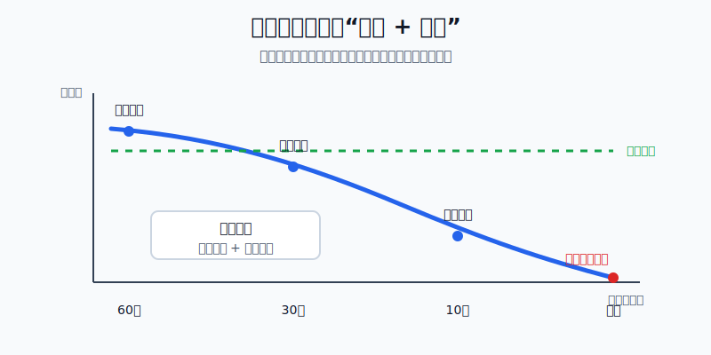
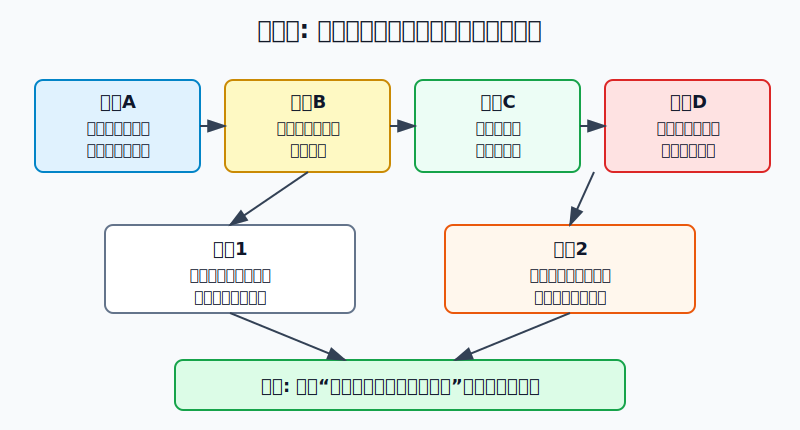
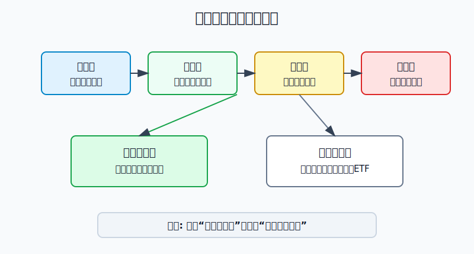

## 散户投资小白金融全品种操盘手册 - 14.7 期权买方的坑 - 方向对了也可能亏时间价值
  
### 作者  
digoal  
  
### 日期  
2026-06-07   
  
### 标签  
金融产品 , 金融工具 , 散户 , 投资小白 , 全品操盘手册  
  
----  
  
## 背景 
  

> 适用读者: 已经知道认购、认沽和买方概念，但容易把“买期权”理解成“小钱押方向”的小白投资者。  
> 本文定位: 投资教育框架，不构成个性化投资建议。

## 先问一个反直觉的问题

买股票时，你方向看对，通常就有赚钱机会。买期权时，方向看对仍然会亏钱。原因很简单: **你买的不是方向本身，而是一份带到期日的方向门票。门票每天都在变薄，到期那天时间价值归零。**

## 核心概念: 时间价值就是“等行情发生”的门票钱

期权权利金可以拆成两块: 内在价值和时间价值。

内在价值，就是现在立刻行权已经有的价值。比如一张行权价3.00元的认购期权，标的现价3.05元，理论上已经有0.05元内在价值。

时间价值，就是市场愿意为“到期前还会继续变化”付的钱。它像一张一个月内有效的门票。今天离到期还有30天，门票里还有想象空间；只剩3天时，如果行情还没来，门票就会迅速失去价值；到期时，时间价值归零。

Theta（时间损耗）就是衡量期权价格会被时间流逝拖下去多少的指标。小白不需要先背复杂公式，只要记住一句话: **期权买方不是只和市场方向比赛，还在和日历比赛。**

本节行动结论先放在前面: **小白买期权，不能只问“会不会涨”或“会不会跌”。必须先算四件事: 盈亏平衡点在哪里、到期前时间够不够、权利金是不是已经太贵、这笔权利金亏光是否仍在预算内。四件事有一件说不清，不买。**

## 逻辑推导链

【论证链标题】: 因为期权买方先付权利金，而且时间价值会在到期前持续衰减，所以方向正确只有在“幅度够、速度够、成本低、仓位小”同时成立时才有交易价值。

── 第一步: 前提陈述

前提A: 期权买方先付权利金，最大损失通常就是这笔权利金。这是常量。它像先买一张票，票没用上，票钱不会自动退。

前提B: 期权有到期日，时间价值会随到期临近而减少，到期时归零。这是常量。它像一张有截止日期的优惠券，越接近截止日，剩余选择权越少。

前提C: 买方真正赚钱要越过盈亏平衡点。这是常量。认购期权的简单盈亏平衡点 = 行权价 + 权利金；认沽期权的简单盈亏平衡点 = 行权价 - 权利金。方向对但没有越过盈亏平衡点，仍然亏。

前提D: 权利金会被波动率、事件预期和市场情绪抬高。这是变量。财报、政策、指数大波动前，期权看起来“机会大”，但门票钱也会变贵。

── 第二步: 逻辑推导

由A+B可得: 因为买方先付权利金，而时间价值每天减少，所以行情没有快速兑现时，买方账户会先承受权利金缩水。

由B+C可得: 因为到期时只剩内在价值，所以标的价格即使朝你判断的方向走，只要没有越过盈亏平衡点，最后仍然亏钱。

再由C+D可得: 因为权利金越贵，盈亏平衡点越远，所以热门事件前买入期权，常常不是买到便宜机会，而是买到昂贵门票。

最后由A+B+C+D可得: 因为买方同时要跑赢方向、速度、幅度和成本，所以买期权不能用“我最多亏权利金”来安慰自己。**最大亏损可控，不等于胜率高；亏损上限清楚，不等于值得下单。**

── 第三步: 正常情景下的操作结论

✅ 正常情景: 你只是学习期权，没有成熟的波动率判断能力，也没有稳定复盘过几十笔期权交易。

对应操作: 先用模拟盘或纸面推演。若一定要用实盘学习，只能用极小金额，把单笔权利金亏光也控制在总投资资金的0.5%以内；优先选择能说清盈亏平衡点、到期日和失效条件的合约；不碰临近到期的深度虚值期权，不用补仓摊薄权利金亏损。

── 第四步: 数据和案例证实

证据1: SEC 投资者教育公告《Investor Bulletin: An Introduction to Options》用“ABC December 70 Call $2.20”解释期权报价。一张美国股票期权通常对应100股，因此2.20美元权利金对应220美元合同成本；如果到期时股价低于70美元行权价，买方损失全部220美元。这个例子验证前提A和C: 买方亏损边界清楚，但只要没有越过行权价和权利金成本，方向判断就无法转成利润。

证据2: 上交所上证50ETF期权合约基本条款显示，50ETF期权合约单位为10000份，到期月份包括当月、下月及随后两个季月，行权价格设置9个，到期日为到期月份第四个星期三。这个规则验证前提B和C: A股场内期权也不是“想拿多久拿多久”的资产，而是合约单位、行权价和到期日写死的标准化合同。权利金每份0.05元时，一张合约就是0.05 × 10000 = 500元成本。

证据3: OCC 2026年1月5日发布的年度数据中，2025年美国清算期权合约总量为15,207,163,554张，比2024年增长24.4%。这说明期权是成熟市场里的高活跃工具，但交易量大只证明工具常用，不证明小白买方有天然优势。

证据4: 《上海证券交易所股票期权市场发展报告（2025）》披露，2025年上交所上证50ETF期权总成交量为27,290.614万张，沪深300ETF期权总成交量为27,612.506万张。这个数据说明国内ETF期权也有真实流动性和活跃参与者，但活跃市场里同时存在专业做市、机构套保和波动率交易者，小白不能只按“涨跌判断”参与。

失败情景: 你买入一张50ETF认购期权，行权价3.00元，权利金0.08元，合约单位10000份，成本800元。到期时50ETF从2.98元涨到3.04元，你方向看对了，标的也站上行权价，但内在价值只有0.04元，每张价值400元；扣掉800元权利金，仍亏400元。失败原因不是方向错，而是涨幅没有覆盖时间价值成本。

历史不代表未来。上面数据仍有参考价值，是因为它们验证的是期权制度本身: 买方先付权利金，合约有到期日，盈亏平衡点高于简单方向判断，市场活跃不等于小白买方容易赚钱。

── 第五步: 前提变化时的替代结论

若前提B变得更差，也就是离到期只剩几天，推导路径变为: 因为时间价值衰减加快，所以标的必须立刻大幅运动才够覆盖成本。新结论: 不买临近到期的虚值期权；已经持有时，不用“再等等”替代止损。

若前提C不成立，也就是你算不清盈亏平衡点，推导路径变为: 因为你不知道需要涨到哪里或跌到哪里才赚钱，所以这不是交易，是猜。新结论: 不下单，先回到纸面计算。

若前提D变贵，也就是权利金被热门事件和波动率抬高，推导路径变为: 因为买入成本上升，盈亏平衡点被推远，所以方向小幅正确也会亏。新结论: 只做观察，不在情绪最热时买贵门票。

反例/失败案例: 很多人喜欢买“便宜”的末日虚值期权，因为单张权利金低。它的真实问题不是绝对价格低，而是到期时间极短、行权价离现价太远。只要行情没有立刻剧烈运动，时间价值就会迅速归零。

## 实操例子: 10万元账户如何判断一张认购期权能不能买

这个例子对应论证链的正常结论: **只有方向、幅度、时间、成本和仓位同时过关，买方才有学习价值。**

假设小林有10万元投资资金，想用期权学习指数上涨行情。他看到一张50ETF认购期权: 标的现价2.98元，行权价3.00元，到期还有25个自然日，权利金0.08元，合约单位10000份。

第一步，先算最大亏损。0.08 × 10000 = 800元。小林的单笔学习亏损上限设为总资金0.5%，也就是500元。只买一张已经超过预算，所以这笔实盘不合格。若坚持学习，只能换更小成本的合约、减少交易，或继续模拟盘。

第二步，算盈亏平衡点。认购期权盈亏平衡点 = 3.00 + 0.08 = 3.08元。50ETF从2.98元涨到3.03元，方向是对的，但不到3.08元，仍不合格。

第三步，检查时间。25天不是很长。小林必须写明: 买入理由不是“以后会涨”，而是“25天内能有效突破3.08元”。如果他说不出为什么25天内会发生，就不买。

第四步，检查权利金是否太贵。如果这张期权是重大事件前被抢高的，买入后即使标的上涨，权利金也会被波动率回落拖住。小白可以不计算复杂隐含波动率，但必须问一句: “我是不是在所有人都兴奋时买门票？”答案是是，就降低仓位或放弃。

第五步，写前提失效动作。买入后若到期只剩7天，50ETF仍在3.00元附近，小林不能补仓摊薄。因为论证链里的前提B已经恶化，时间价值正在加速消失。正确动作是按计划止损或放弃，不把一张快过期的门票变成更大的仓位。

如果操作错误，后果很直接。小林若觉得800元不多，连续买10张，总权利金就是8000元，占总资金8%。单张最大亏损有限，组合层面已经变成重仓押短期波动。方向对一次可能很刺激，但长期复盘看，这不是保险，也不是配置，而是用可控单笔亏损制造不可控的重复亏损。

## 可复用框架

【四门检查】

适用前提: 你准备买入认购或认沽期权，并且自己是买方。

核心逻辑: 因为买方必须同时跑赢方向、幅度、时间和权利金成本，所以每次下单前先过四道门。

操作步骤:

1. 方向门: 标的为什么会涨或跌，依据不是情绪和消息截图。
2. 幅度门: 认购算行权价 + 权利金，认沽算行权价 - 权利金，判断到期前能否越过。
3. 时间门: 到期日前是否有足够交易日让逻辑兑现，临近到期自动降低仓位或不做。
4. 仓位门: 权利金亏光是否低于总资金0.5%，超过就不买。

前提失效时: 任意一门不过，不下单；已经持有且时间门失效，不补仓，只按原计划处理。

举一反三: 这个框架也适用于买入美股期权、ETF期权、指数期权和后面要讲的保护性看跌策略。

【不补门票】

适用前提: 你买入期权后出现权利金快速缩水，想通过补仓摊低成本。

核心逻辑: 因为时间价值不是股票价格，它会随着到期确定性消失，所以补仓不一定降低风险，反而会买入更多正在过期的时间。

操作步骤:

1. 先判断亏损来自哪里: 方向错、涨跌幅不够、时间流逝，还是买入时权利金太贵。
2. 若亏损来自时间流逝，不补仓；因为新增资金买到的仍是更少的剩余时间。
3. 若原买入理由仍成立，只允许在仓位预算内换到更合适的期限，不把旧亏损带进新仓。
4. 若说不清亏损原因，退出并复盘，不用第二笔钱证明第一笔判断。

前提失效时: 如果你开始用“都跌这么多了”作为补仓理由，说明交易已经离开论证链，停止加仓。

举一反三: 所有会过期的工具都不能用股票补仓思维处理，包括末日期权、涡轮类产品和临近到期的结构化票据。

## 本节行动清单

| 动作 | 合格标准 |
|---|---|
| 拆权利金 | 能说清内在价值和时间价值 |
| 算盈亏平衡点 | 认购 = 行权价 + 权利金；认沽 = 行权价 - 权利金 |
| 检查到期日 | 买入理由必须在到期前能兑现 |
| 控制单笔亏损 | 权利金亏光低于总资金0.5% |
| 拒绝末日虚值冲动 | 不因“便宜”买临近到期深度虚值期权 |
| 不补时间坑 | 时间门失效后不补仓摊薄 |
| 做到期复盘 | 记录亏损来自方向、幅度、时间还是权利金过贵 |

## 一句话总结

期权买方最大的坑不是亏损无限，而是你方向看对了，却没有跑赢时间价值和权利金成本；先算清四道门，再决定是否买这张门票。

## 参考资料

- SEC Investor.gov: Investor Bulletin: An Introduction to Options, 2015年3月18日，https://www.investor.gov/introduction-investing/general-resources/news-alerts/alerts-bulletins/investor-bulletins-63
- 上海证券交易所: 上证50ETF期权合约基本条款，2023年3月3日，https://big5.sse.com.cn/site/cht/www.sse.com.cn/assortment/options/contract/c/c_20230303_5717359.shtml
- OCC: OCC Annual 2025 and December 2025 Volume, 2026年1月5日，https://www.theocc.com/newsroom/views/2026/01-05-occ-annual-2025-and-december-2025-volume
- 上海证券交易所: 《上海证券交易所股票期权市场发展报告（2025）》，https://big5.sse.com.cn/site/cht/www.sse.com.cn/aboutus/research/report/c/10814750/files/d1800de82bbe4613a2fe93e0853b7a3a.pdf
- Options Industry Council: Theta, https://www.optionseducation.org/advancedconcepts/theta

> ⚠️ **声明**：本文内容为投资教育目的，所有历史数据、策略框架均为辅助学习工具，不构成证券投资建议。市场有风险，投资需谨慎。实际操作请结合自身风险承受能力，必要时咨询专业投顾。
  
#### [PostgreSQL 解决方案集合](../201706/20170601_02.md "40cff096e9ed7122c512b35d8561d9c8")
  
  
#### [德哥 / digoal's Github - 公益是一辈子的事.](https://github.com/digoal/blog/blob/master/README.md "22709685feb7cab07d30f30387f0a9ae")
  
  
#### [About 德哥](https://github.com/digoal/blog/blob/master/me/readme.md "a37735981e7704886ffd590565582dd0")
  
  

  
