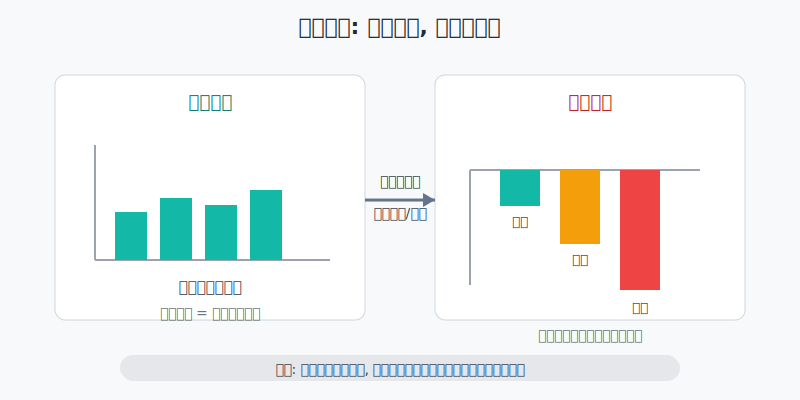
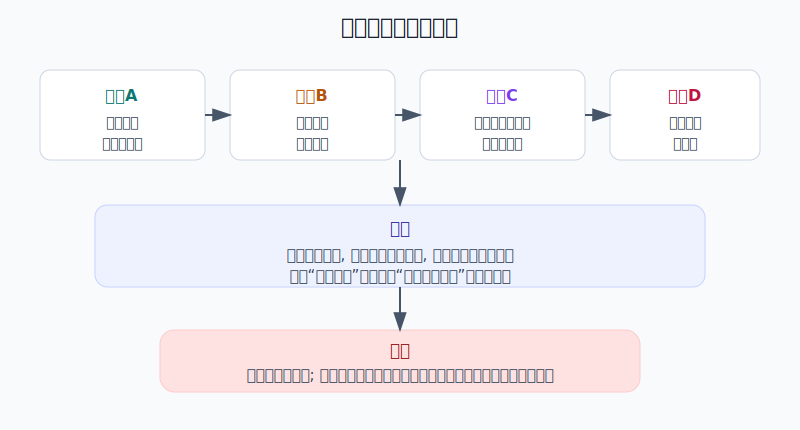
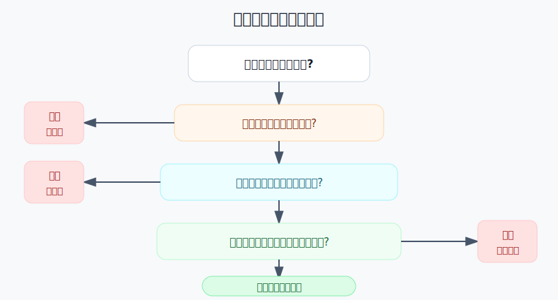

## 散户投资小白金融全品种操盘手册 - 14.8 期权卖方的坑 - 小赚很多次, 一次亏很大
  
### 作者  
digoal  
  
### 日期  
2026-06-07   
  
### 标签  
金融产品 , 金融工具 , 散户 , 投资小白 , 全品操盘手册  
  
----  
  
## 背景 
  

> 适用读者: 已经知道期权买方和卖方的区别, 但开始觉得“卖期权收权利金更稳”的小白投资者。  
> 本文定位: 风险边界教育, 不构成任何期权交易建议。

## 先问一个反直觉的问题

期权卖方最迷惑人的地方, 是它经常看起来很顺。你卖出一张期权, 标的没有大动, 权利金到手; 再卖一次, 可能又到手。问题是: **卖方赚的是小额权利金, 承担的却是被行权、追加保证金、强行平仓这些大义务。**

## 核心概念: 卖方不是收租, 是卖保险

很多人把卖期权叫“收租”。这个比喻只说对了一半。收租的前提是房子在那里, 租客按月付钱; 卖期权更像卖保险, 平时你收保费, 事故发生时你要赔。

卖出认购期权, 就是收权利金后承诺: 如果买方行权, 你要按行权价卖出标的。你没有标的还卖, 就是裸卖认购。标的越涨, 你要补回或履约的压力越大。

卖出认沽期权, 就是收权利金后承诺: 如果买方行权, 你要按行权价买入标的。你没有足额现金还卖, 就是未现金担保的卖认沽。标的越跌, 你越可能用高于市场价的价格接货。

保证金, 是卖方给交易所和券商看的履约担保。它不是最大亏损。市场越剧烈, 保证金要求越可能上升; 账户保证金不足, 就可能被要求补钱、减仓或被强行平仓。

本节行动结论先放在前面: **小白默认不做裸卖期权。只有同时满足四个条件, 才能把卖方当作学习对象: 有现货覆盖或现金担保, 单笔最坏亏损写得清, 保证金压力扛得住, 退出规则提前写好。四个条件缺一个, 不下单。**

## 逻辑推导链

【论证链标题】: 因为期权卖方收入封顶, 但履约义务和保证金压力会随标的大幅波动放大, 所以小白不能把“高胜率收权利金”当成稳定收益。

── 第一步: 前提陈述

前提A: 期权卖方最大收益通常就是收到的权利金。这是常量。它像卖保险收保费, 保费一开始就确定, 不会因为你承担了更大风险而自动变多。

前提B: 卖方承担履约义务。这是常量。认购卖方可能要交出标的, 认沽卖方可能要接入标的; 裸卖时, 这个义务没有现货、现金或保护腿兜底。

前提C: 保证金和期权价格会随标的波动、波动率和到期时间变化。这是变量。平静时看起来够用的保证金, 在极端行情里可能突然不够。

前提D: 小白容易被“多数时候期权到期归零”“卖方胜率高”吸引, 只看赚钱次数, 不看单次最大亏损。这是行为偏差。它像每天捡硬币, 却没有看见前方来车。

── 第二步: 逻辑推导

由A+B可得: 因为卖方收入上限是权利金, 但义务来自合约本身, 所以卖方不是“赚多少亏多少对称”的交易。你最多赚一小段权利金, 却可能在标的大涨或大跌时承担远超权利金的损失。

由B+C可得: 因为履约义务要用保证金支撑, 而保证金会跟着风险重估, 所以卖方真正怕的不是一次小亏, 而是标的快速运动后, 期权价格变贵、保证金不足、被迫补钱或平仓。

再由A+B+C+D可得: 因为“多次小赚”会让人低估尾部风险, 所以小白不能用胜率安慰自己。**卖方策略先问最坏会怎样, 再问平时能收多少。**

── 第三步: 正常情景下的操作结论

✅ 正常情景: 你是小白, 没有多年期权复盘记录, 没有全天盯盘能力, 也没有足够资金处理指派和追加保证金。

对应操作: 不做裸卖认购, 不做未现金担保的卖认沽, 不做重仓卖方。若只是学习, 先用模拟盘; 若未来一定要接触卖方, 只能从备兑开仓、现金担保认沽或有保护腿的限亏组合开始, 且单笔最坏损失必须低于总资金可承受范围。

── 第四步: 数据和案例证实

证据1: OCC《Characteristics and Risks of Standardized Options》2024年6月版说明, 期权并不适合所有投资者; 对未覆盖认购卖方而言, 潜在亏损没有上限。这个证据对应前提A和B: 权利金收入有上限, 裸卖认购的亏损却可能随标的上涨继续扩大。

证据2: FINRA 的期权基础教育材料也提醒, 未覆盖认购卖方的最大亏损在理论上是无限的。它还强调期权杠杆可以放大收益能力, 也会带来重大亏损风险。这个证据对应前提B和D: “卖方胜率高”不能替代风险边界计算。

证据3: 上交所《上海证券交易所股票期权试点交易规则》第一百四十一条规定, 客户保证金不足或者备兑证券不足, 且未在期权经营机构规定时间内补足或自行平仓, 期权经营机构应当实施强行平仓。这个证据对应前提C: 卖方不是想扛就能一直扛, 保证金和备兑证券不足会触发强制处理。

证据4: 上交所《股票期权市场发展报告（2025）》披露, 2025年上交所股票期权合约累计成交12.75亿张, 日均权利金成交30.14亿元; 同年个人投资者买入开仓占其开仓交易60.98%, 机构投资者卖出开仓占其开仓交易79.62%。这说明期权市场活跃, 但卖方开仓更多由机构承担。小白不能只复制机构的“卖方”表象, 却没有机构的资金、系统和风控。

失败案例: StoneX 在提交给 SEC 的披露文件中说明, 2018年11月16日当周, 其 FCM 部门约300个由 OptionSellers.com 管理的账户, 因天然气市场显著且意外的价格波动, 余额跌破维持保证金要求, 相关头寸被清算; 后续披露还提到账户进入 deficit balances, 客户协议要求账户持有人承担账户亏损并偿还赤字。这个案例对应前提B和C: 卖方尾部风险不是“把本金亏完就结束”, 在保证金账户里还可能变成倒欠和追偿。

历史不代表未来。上面数据仍有参考价值, 是因为它们验证的是制度和结构: 期权卖方收权利金, 承担履约义务, 保证金会在风险变大时约束账户; 不是因为某一次天然气行情一定会重演。

── 第五步: 前提变化时的替代结论

若前提B改变, 也就是你卖认购时有足额现货覆盖, 推导路径变为: 因为最坏情况下可以交出现货, 所以风险从“无限裸露义务”变成“股票被按行权价卖出, 放弃上方收益”。新结论: 可以研究备兑开仓, 但不要把它当无风险收租。

若前提B以另一种方式改变, 也就是你卖认沽时已经准备好足额现金, 推导路径变为: 因为最坏情况下可以按行权价接入标的, 所以风险从“保证金裸露压力”变成“买入资产后继续下跌”。新结论: 只能在你本来愿意买入该标的、且现金不影响生活资金时研究。

若前提C恶化, 也就是标的突然大涨、大跌或波动率飙升, 推导路径变为: 因为期权价格和保证金同时变得不利, 所以卖方亏损会集中暴露。新结论: 不补仓硬扛, 先按预案减仓或平仓。

若前提D出现, 也就是你开始用“我前面卖了十次都赚钱”证明策略安全, 推导路径变为: 因为你只统计胜率, 没统计最大亏损和保证金压力, 所以复盘是失真的。新结论: 暂停实盘, 重新计算最坏情景。

反例: 备兑开仓和现金担保认沽不是本节要禁止的对象。它们的共同点是先准备好履约资源, 再收权利金。真正危险的是没有资源兜底还卖, 或者仓位大到一次波动就逼你补保证金。

## 实操例子: 10万元账户如何识别卖方陷阱

这个例子对应论证链的正常结论: **卖方先算最坏情景, 再看权利金是否值得。**

假设你有10万元投资资金, 看到某 ETF 现价3.00元。你想卖出10张行权价3.10元、一个月后到期的认购期权, 每份权利金0.02元, 合约单位10000份。

第一步, 先算最多赚多少。0.02 × 10000 × 10 = 2000元。这个数字很诱人, 但它只是收入上限, 不是收益保证。

第二步, 问有没有现货覆盖。10张合约对应100000份 ETF。如果你没有这些 ETF, 这就是裸卖认购。根据前提B, 一旦 ETF 大涨, 你要用更高价格买回期权或承担交付压力。

第三步, 做压力测试。若 ETF 从3.00元快速涨到3.40元, 简单估算卖方损失为 (3.40 - 3.10 - 0.02) × 10000 × 10 = 28000元, 不含手续费、滑点和保证金追加压力。你本来想赚2000元, 实际暴露的是可接近3万元的压力亏损。

第四步, 检查账户承受力。10万元账户承受一次2.8万元压力亏损, 等于一次交易可能打掉28%本金。即使券商没有立刻强平, 你的心理和现金流也已经被这笔交易绑架。根据前提C, 保证金不足时你没有资格说“再等等”。

第五步, 写动作: 没有现货覆盖, 不下单。若你本来持有100000份 ETF, 这笔交易才变成备兑开仓。即使是备兑, 也要写清: ETF 涨过3.10元被行权时是否愿意卖出; ETF 下跌时是否能承受持仓回撤; 权利金不是保本垫。

如果操作错误, 后果很直接。你若只看见2000元权利金, 会觉得一个月收2%很舒服; 但只要标的突然上涨, 这笔交易就从“收钱”变成“堵风险”。卖方最常见的亏法, 不是每次都亏, 而是前面小赚给你信心, 最后一次大亏改变账户命运。

## 可复用框架

【四问卖方】

适用前提: 你准备卖出认购或认沽期权。

核心逻辑: 因为卖方收入封顶、义务放大, 所以下单前先问履约资源和最坏亏损。

操作步骤:

1. 问覆盖: 卖认购有没有现货, 卖认沽有没有足额现金。
2. 问上限: 最多赚多少, 权利金是不是唯一收益来源。
3. 问下限: 标的跳涨或跳跌5%、10%时, 账户亏多少。
4. 问强平: 保证金不足、备兑证券不足、券商要求处理时, 你怎么做。

前提失效时: 覆盖说不清、最坏亏损说不清、保证金压力扛不住, 一律不下单。

举一反三: 这个框架也适用于期货、融资融券、杠杆ETF和任何“先收一点钱, 后承担大义务”的工具。

【小赚大亏表】

适用前提: 你已经连续几次卖方盈利, 开始觉得策略很稳。

核心逻辑: 因为卖方风险常藏在尾部, 所以不能只统计胜率, 必须统计单次最大亏损。

操作步骤:

1. 记录每次权利金收入。
2. 记录每次最大浮亏, 不只记录最终盈亏。
3. 记录保证金占用和是否收到风险提醒。
4. 用“最大单次亏损 / 平均单次盈利”计算一次大亏会吃掉多少次小赚。

前提失效时: 如果一次压力亏损能吃掉10次以上权利金收入, 这不是稳定收益, 是尾部风险暴露。

举一反三: 做网格、可转债高频摊薄、期货短线和卖波动率策略时, 都要用这张表看尾部风险。

## 本节行动清单

| 动作 | 合格标准 |
|---|---|
| 区分卖方类型 | 能说清备兑、现金担保、裸卖的区别 |
| 先算收入上限 | 权利金 × 合约单位 × 张数 |
| 再算压力亏损 | 标的跳涨或跳跌5%、10%时账户亏多少 |
| 检查履约资源 | 卖认购有现货, 卖认沽有足额现金 |
| 检查保证金 | 保证金不足时先减仓或平仓, 不借钱硬扛 |
| 记录最大浮亏 | 不只统计赚钱次数, 还统计最坏时刻 |
| 默认不裸卖 | 没有覆盖、没有现金、没有保护腿, 不做卖方 |

## 一句话总结

期权卖方的核心坑不是“每次都危险”, 而是“平时小赚很多次, 极端时一次亏很大”; 小白先守住不裸卖、不重仓、不硬扛保证金这三条线, 再谈学习卖方策略。

## 参考资料

- OCC: Characteristics and Risks of Standardized Options, 2024年6月版, https://www.theocc.com/company-information/documents-and-archives/options-disclosure-document
- FINRA: Options A-Z: The Basics to the Greeks, https://www.finra.org/investors/insights/options-z-basics-greeks
- 上海证券交易所: 《上海证券交易所股票期权试点交易规则》, https://www.sse.com.cn/lawandrules/sselawsrules2025/option/c/c_20250610_10781448.shtml
- 上海证券交易所: 《上海证券交易所股票期权市场发展报告（2025）》, https://big5.sse.com.cn/site/cht/www.sse.com.cn/aboutus/research/report/c/10814750/files/d1800de82bbe4613a2fe93e0853b7a3a.pdf
- SEC EDGAR: INTL FCStone Inc. Form 10-Q, 2019年3月31日, OptionSellers 相关披露, https://www.sec.gov/Archives/edgar/data/913760/000091376019000080/intl0331201910-q.htm
- SEC EDGAR: StoneX Group Inc. Form 10-K, 2022年9月30日, OptionSellers 后续披露, https://www.sec.gov/Archives/edgar/data/913760/000091376022000174/intl-20220930.htm

> ⚠️ **声明**：本文内容为投资教育目的，所有历史数据、策略框架均为辅助学习工具，不构成证券投资建议。市场有风险，投资需谨慎。实际操作请结合自身风险承受能力，必要时咨询专业投顾。
  
#### [PostgreSQL 解决方案集合](../201706/20170601_02.md "40cff096e9ed7122c512b35d8561d9c8")
  
  
#### [德哥 / digoal's Github - 公益是一辈子的事.](https://github.com/digoal/blog/blob/master/README.md "22709685feb7cab07d30f30387f0a9ae")
  
  
#### [About 德哥](https://github.com/digoal/blog/blob/master/me/readme.md "a37735981e7704886ffd590565582dd0")
  
  

  
