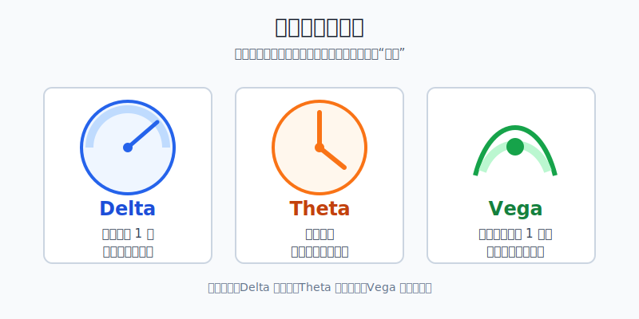
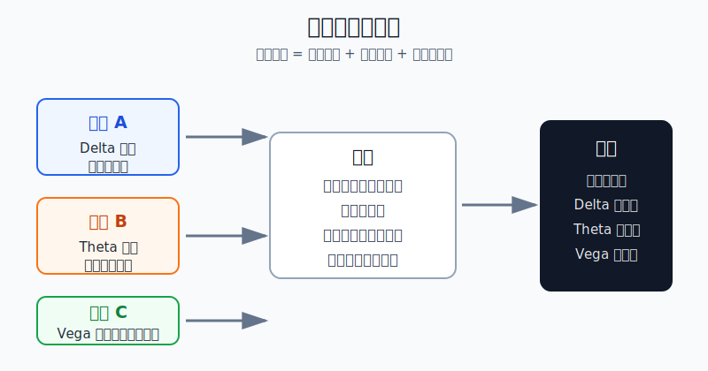
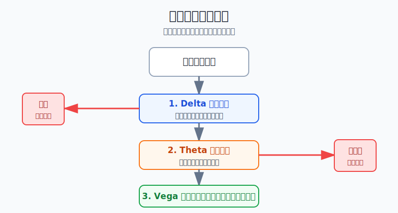

## 散户投资小白金融全品种操盘手册 - 14.9 希腊字母小白版 - Delta、Theta、Vega
  
### 作者  
digoal  
  
### 日期  
2026-06-07   
  
### 标签  
金融产品 , 金融工具 , 散户 , 投资小白 , 全品操盘手册  
  
----  
  
## 背景 
  

> 适用读者: 已经知道期权有认购、认沽、买方、卖方，但一看到 Delta、Theta、Vega 就觉得“这是专业人士才看的公式”的小白投资者。  
> 本文定位: 投资教育框架，不构成个性化投资建议。

## 先问一个反直觉的问题

期权最坑人的地方，不是方向难猜，而是你方向猜对了，账户还是亏钱。原因很简单: **期权不是只押涨跌，它还在押时间够不够、权利金买得贵不贵。**

## 核心概念: 希腊字母就是期权的仪表盘

不要把希腊字母当成数学考试。对小白来说，它们先是三块仪表盘。

Delta 是方向仪表。它回答的问题是: 标的资产涨跌 1 元，期权价格理论上大约跟着动多少。认购期权的 Delta 通常是正数，认沽期权的 Delta 通常是负数。比如一张认购期权 Delta 是 0.50，粗略理解就是标的上涨 1 元，在其他条件不变时，期权理论价格大约上涨 0.50 元。

Theta 是倒计时仪表。它回答的问题是: 时间过去 1 天，期权理论价值大约损耗多少。买方通常是负 Theta，因为买方买了时间，时间每天都在消耗；卖方通常是正 Theta，因为卖方收了权利金，但卖方同时承担义务，不能把它理解成无风险收租。

Vega 是波动率仪表。它回答的问题是: 隐含波动率变动 1 个百分点，期权价格理论上大约变多少。隐含波动率可以简单理解为市场给“未来会不会大幅波动”开的价格。市场越怕大波动，权利金越贵；事件落地后波动率下降，权利金会被压缩。

本节行动结论先放在前面: **小白每次看期权，先不要问“买涨还是买跌”，而要问三句话: Delta 够不够、Theta 扛不扛、Vega 贵不贵。三句话里有两句答不上来，不下单。**

## 逻辑推导链

【论证链标题】: 因为期权盈亏同时受方向、时间和波动率影响，所以 Delta、Theta、Vega 是小白下单前必须看的三块仪表。

── 第一步: 前提陈述

前提A: 期权价格会跟随标的价格变化，Delta 衡量这种方向敏感度。这是常量，但 Delta 数值本身会变化。它像汽车油门，踩下去会动，但不同车速下反应不同。

前提B: 期权有到期日，时间价值会随着到期临近而消耗，Theta 衡量这种时间损耗。这是常量，但损耗速度是变量，临近到期时通常更紧。

前提C: 期权权利金包含市场对未来波动的定价，Vega 衡量权利金对隐含波动率的敏感度。这是变量。它像保险费，大家越担心出事，保险越贵。

前提D: 小白最常见的错误，是只判断方向，忽视时间和买入价格。这是行为变量。它像只看目的地，不看油量和路况。

── 第二步: 逻辑推导

由A可得: 因为 Delta 只是方向敏感度，所以标的上涨不代表所有认购期权都会大涨。Delta 太低的深度虚值期权，标的小涨时可能跟不动。

由A+B可得: 因为 Theta 每天扣时间分，所以方向慢慢对，不等于买方赚钱。如果标的上涨速度慢于时间损耗速度，期权买方仍然会亏。

再由A+B+C可得: 因为 Vega 会让权利金随隐含波动率变化，所以事件前买入很贵的期权，事件后即使方向对，也会被“波动率回落”压低价格。

最后由A+B+C+D可得: 因为方向、时间、波动率三项任何一项都能改变期权盈亏，所以小白不能把期权当成便宜彩票。**正确动作是先读三块仪表，再决定是否小仓学习，而不是先押方向。**

── 第三步: 正常情景下的操作结论

✅ 正常情景: 你是期权小白，只打算学习工具；你没有成熟期权系统；这笔钱亏掉不能影响生活；你做的是买方小仓学习，不做裸卖。

对应操作: 下单前写下三行: Delta 是否能覆盖你的方向判断，Theta 每天损耗多少钱，Vega 是否处在事件前偏贵状态。若 Delta 太低、Theta 太高、Vega 太贵三项里出现两项，不买；若只出现一项，也必须减小仓位并写出退出日期。

── 第四步: 数据和案例证实

证据1: SEC 投资者教育公告《Investor Bulletin: An Introduction to Options》用 “ABC December 70 Call $2.20” 举例说明，一张股票期权通常对应 100 股，2.20 美元权利金对应 220 美元合约成本；如果到期时股价为 65 美元，低于 70 美元行权价，认购期权到期虚值，220 美元权利金全部损失。这个例子对应前提A和B: 方向、行权价、到期日一起决定买方结果，不是“看涨就一定赚钱”。

证据2: OCC 2026年1月5日发布的年度数据披露，2025年美国清算期权合约总量为 15,207,163,554 张，比2024年增长 24.4%。这个数据说明期权是成熟市场里的大品种，但交易量大只说明工具常见，不说明小白可以跳过定价和风险。

证据3: 《上海证券交易所股票期权市场发展报告（2025）》披露，2025年上交所上证50ETF期权总成交量为 27,290.614 万张，沪深300ETF期权总成交量为 27,612.506 万张。报告同时列示权利金成交额、持仓量和行权量。这个数据对应前提C: 场内期权真实交易的是权利金、持仓和行权，不只是“看涨看跌”。

证据4: The Options Industry Council 的投资者教育材料把 Delta、Theta、Vega 列为常用 Greeks，用来衡量期权价格对标的价格、时间和波动率变化的敏感度。这对应整条论证链: 希腊字母不是炫技术语，而是把期权价格拆成可观察的风险来源。

历史不代表未来。上面数据仍有参考价值，是因为它们验证的是期权制度和定价机制: 期权有到期日，权利金会变化，标的方向、时间和波动率都会进入价格；不是因为某一年成交活跃，下一年就一定适合买入期权。

── 第五步: 前提变化时的替代结论

若前提A变差，也就是你买的是低 Delta 深度虚值期权，推导路径变为: 因为标的小幅上涨难以带动期权上涨，所以你不是在买方向，而是在买极端行情。新结论: 不把“便宜”当安全；若没有明确大幅波动理由，不买低 Delta 彩票型期权。

若前提B变差，也就是到期日很近、Theta 很高，推导路径变为: 因为每天损耗太快，所以标的必须快速朝你有利方向移动才够。新结论: 不碰临近到期的买方合约，除非你能接受权利金按计划归零。

若前提C变差，也就是事件前隐含波动率很高、Vega 风险很大，推导路径变为: 因为你买入时权利金已经很贵，所以事件落地后波动率下降会压缩期权价值。新结论: 不在“大家都等大消息”的时候盲目买短期期权；要么等待事件后，要么只用极小仓位做学习。

反例/失败案例: 财报、议息会议、重大政策发布前，短期期权权利金常因隐含波动率上升而变贵。小白买入短期虚值认购后，即使标的小幅上涨，也可能因为 Delta 不够、Theta 继续损耗、Vega 在事件后回落而亏钱。这个失败不是方向判断单点失败，而是三块仪表同时不合格。

## 实操例子: 用 3000 元学习资金看一张 ETF 认购期权

这个例子对应论证链的正常结论: **先读三块仪表，再决定是否允许小仓学习。**

假设你有 3000 元期权学习资金，不动生活费，不做卖方。你看到一张 ETF 认购期权: 标的现价 3.00 元，行权价 3.10 元，离到期还有 20 个交易日，权利金 0.060 元，合约单位 10000 份，所以买一张成本约 600 元。软件显示 Delta 约 0.35，Theta 约 -0.003，Vega 约 0.010。

第一步，看 Delta 够不够。Delta 0.35 的意思是，标的上涨 0.01 元，在其他条件不变时，期权理论价格大约上涨 0.0035 元。合约单位 10000 份，对应约 35 元。你的判断若只是“ETF可能从3.00涨到3.03”，那方向收益约 105 元，不足以覆盖很多天的时间损耗。结论: 这不是一个适合慢涨判断的合约。

第二步，看 Theta 扛不扛。Theta -0.003 的意思是，其他条件不变时，每过 1 天，单份期权理论价值大约少 0.003 元；乘以 10000 份，就是每天约 30 元。若你计划持有 10 个交易日，时间损耗预算约 300 元。600 元权利金里，10天可能被时间吃掉一半。结论: 你必须写清楚“几天不动就退出”，不能拿到到期。

第三步，看 Vega 贵不贵。Vega 0.010 的意思是，隐含波动率上升 1 个百分点，单份期权理论价值大约增加 0.010 元；下降 1 个百分点，则大约减少 0.010 元。若这张期权是在重大消息前买入，事件后隐含波动率下降 5 个百分点，理论上会带来每份约 0.050 元的压力，乘以 10000 份就是约 500 元。结论: 如果权利金贵是因为事件前情绪抬高，不适合买方重仓。

第四步，合并判断。Delta 不高、Theta 每天约 30 元、Vega 对事件后回落敏感，这三项里至少两项不友好。对应操作: 不下单，或者只用模拟盘记录。如果一定用实盘学习，最多买 1 张，买入当天就写好退出条件: 标的未在 3 个交易日内向上突破 3.06 元就退出；亏损达到 300 元就退出；事件前一天不再加仓。

如果前提不成立，操作必须切换。若买入后标的没有上涨，Theta 会继续扣分，不能补仓摊低成本。若标的涨了但权利金没涨，说明 Vega 或时间损耗在抵消 Delta，不能用“我方向对了”安慰自己。若隐含波动率突然上升、权利金上涨，也不能把一次运气当能力，复盘时要拆清楚到底赚的是 Delta、Theta 还是 Vega。

如果操作错误，后果很直接。你若只看到“600 元不贵”，连续买 5 张，就是 3000 元全部暴露在同一类时间和波动率风险里。单张最大亏损有限，不代表组合最大亏损小；期权买方最常见的亏损方式，就是每次都说“小钱试试”，最后被多次归零拖走本金。

## 可复用框架

【三问仪表】

适用前提: 你准备看任何一张期权，尤其是买方合约。

核心逻辑: 因为期权价格同时受方向、时间和波动率影响，所以下单前先检查三块仪表。

操作步骤:

1. Delta 够不够: 标的需要涨跌多少，期权才可能覆盖权利金和时间损耗。
2. Theta 扛不扛: 每天损耗多少钱，计划持有几天，总损耗是否在预算内。
3. Vega 贵不贵: 隐含波动率是否因事件或情绪被抬高，事件后是否会回落。

前提失效时: Delta 太低不买彩票型虚值期权；Theta 太高不碰临近到期买方；Vega 太贵不在事件前追买短期期权。

举一反三: 这个框架也适用于保护性看跌、领口策略、备兑开仓中的买入或卖出腿，只是买方和卖方对 Theta、Vega 的受益方向不同。

【拆账复盘】

适用前提: 你已经做过一笔期权交易，想知道自己到底赚亏在哪里。

核心逻辑: 因为期权盈亏不是单一方向结果，所以复盘不能只写“看对/看错”。

操作步骤:

1. 记录标的涨跌: 这是 Delta 贡献。
2. 记录持有天数: 这是 Theta 成本。
3. 记录隐含波动率变化: 这是 Vega 贡献。
4. 比较实际盈亏: 看利润来自哪一项，亏损由哪一项造成。

前提失效时: 如果你查不到下单时的 Delta、Theta、Vega，说明这笔交易没有复盘条件；下一笔先截图或记录，不再凭感觉复盘。

举一反三: 这个框架还可以用在期权组合。组合不是把风险变没，而是把 Delta、Theta、Vega 重新分配。

## 本节行动清单

| 动作 | 合格标准 |
|---|---|
| 解释 Delta | 能说清“标的动 1 元，期权大约动多少” |
| 解释 Theta | 能算出每天时间损耗约多少钱 |
| 解释 Vega | 能理解隐含波动率上升或下降对权利金的影响 |
| 下单前三问 | Delta 够不够、Theta 扛不扛、Vega 贵不贵 |
| 避开两项不友好 | 三项里有两项不合格，不下单 |
| 写退出日期 | 买方合约必须写清持有几天无效就退出 |
| 做拆账复盘 | 每笔交易拆成 Delta、Theta、Vega 三项贡献 |

## 一句话总结

Delta、Theta、Vega 不是专业人士的装饰词，而是期权小白的三块仪表盘: 看不懂仪表，就不要把方向判断拿去冒险。

## 参考资料

- SEC Investor.gov: Investor Bulletin: An Introduction to Options, 2015年3月18日，https://www.investor.gov/introduction-investing/general-resources/news-alerts/alerts-bulletins/investor-bulletins-63
- OCC: OCC Annual 2025 and December 2025 Volume, 2026年1月5日，https://www.theocc.com/newsroom/views/2026/01-05-occ-annual-2025-and-december-2025-volume
- 上海证券交易所: 《上海证券交易所股票期权市场发展报告（2025）》，https://big5.sse.com.cn/site/cht/www.sse.com.cn/aboutus/research/report/c/10814750/files/d1800de82bbe4613a2fe93e0853b7a3a.pdf
- The Options Industry Council: Volatility & the Greeks, https://www.optionseducation.org/advancedconcepts/volatility-the-greeks

> ⚠️ **声明**：本文内容为投资教育目的，所有历史数据、策略框架均为辅助学习工具，不构成证券投资建议。市场有风险，投资需谨慎。实际操作请结合自身风险承受能力，必要时咨询专业投顾。
  
#### [PostgreSQL 解决方案集合](../201706/20170601_02.md "40cff096e9ed7122c512b35d8561d9c8")
  
  
#### [德哥 / digoal's Github - 公益是一辈子的事.](https://github.com/digoal/blog/blob/master/README.md "22709685feb7cab07d30f30387f0a9ae")
  
  
#### [About 德哥](https://github.com/digoal/blog/blob/master/me/readme.md "a37735981e7704886ffd590565582dd0")
  
  

  
