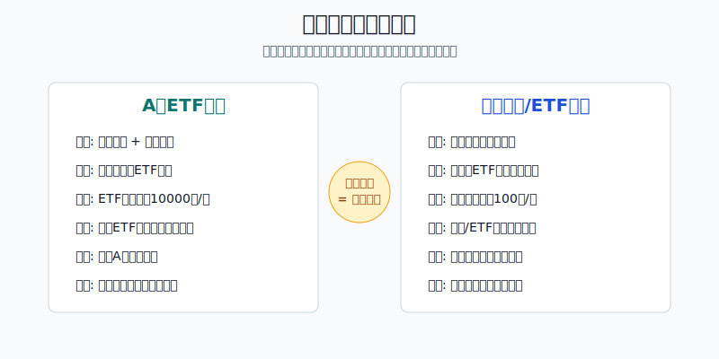
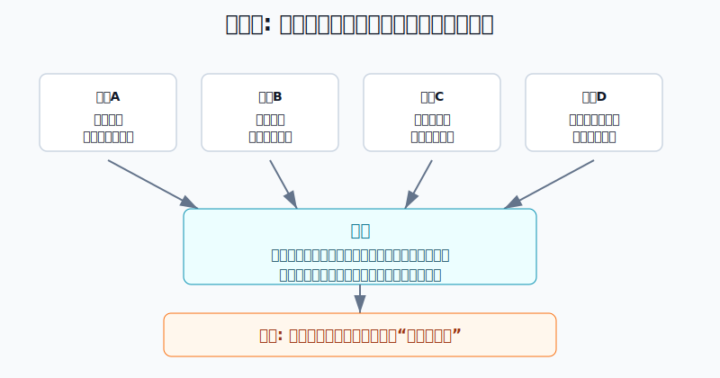
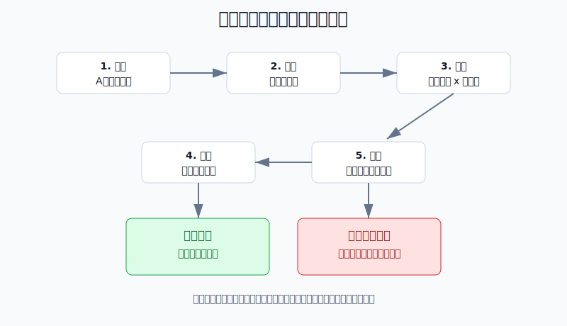

## 散户投资小白金融全品种操盘手册 - 14.10 A股期权、美股期权的规则差异
  
### 作者  
digoal  
  
### 日期  
2026-06-07   
  
### 标签  
金融产品 , 金融工具 , 散户 , 投资小白 , 全品操盘手册  
  
----  
  
## 背景 
  

> 适用读者: 已经知道认购、认沽、买方、卖方，但准备把A股期权和美股期权放在一起比较的小白投资者。  
> 本文定位: 投资教育框架，不构成个性化投资建议。

## 先问一个反直觉的问题

同样是“买一张看涨期权”，在A股和美股里，可能不是同一件事。你以为自己只是在换市场，其实换掉的是账户门槛、合约单位、到期节奏、行权方式和可交易品种。**规则一变，风险就变。**

## 核心概念: 规则不是背景，是仓位的一部分

很多小白比较A股期权和美股期权，只会问一句: 哪个更赚钱？这个问法不对。期权不是普通股票，规则会直接改变你的风险。

合约单位，就是一张期权背后对应多少标的。A股ETF期权常见是一张对应10000份ETF，美股股票或ETF期权通常一张对应100股。权利金看起来都是“小数”，但乘上合约单位后，真实金额完全不同。

行权方式，就是买方什么时候可以使用权利。欧式期权通常只能在到期日行权；美式期权通常可以在到期日前任一交易日行权。对买方来说，这影响权利的灵活度；对卖方来说，这影响被提前指派的风险。指派，就是卖方被要求履行期权合约义务。

交易时段，就是你能在什么时候处理仓位。A股ETF期权跟随A股日盘节奏，美股期权按美国市场时间交易。你人在中国，看美股期权时还叠加时差、夜间波动和隔夜消息。

本节行动结论先放在前面: **小白不要把A股期权策略和美股期权策略互相照搬。每次跨市场交易前，先写一张“规则翻译表”: 账户权限、标的、合约单位、到期日、行权方式、交易时间、手续费和最大亏损。七项说不清，不下单。**

## 逻辑推导链

【论证链标题】: 因为A股期权和美股期权在账户、合约、行权和交易节奏上不同，所以同名策略不能直接跨市场复制。

── 第一步: 前提陈述

前提A: A股期权和美股期权的账户准入不是同一套规则。这是常量。A股场内股票期权通常有较明确的适当性要求；美股券商则按客户信息、经验、资金和风险承受能力审批不同期权交易等级。

前提B: 合约单位不同会改变真实资金暴露。这是常量。A股ETF期权常见合约单位为10000份ETF，美股标准股票期权通常一张对应100股。它像同样写着“每斤价格”，但一边默认买10000份，一边默认买100份。

前提C: 到期日、行权方式和指派风险不同。这是变量中的核心。A股ETF期权多为到期日行权；美股股票和ETF期权多为美式，卖方可能面对提前指派。

前提D: 标的数量、交易时段和流动性结构不同。这是变量。美股股票和ETF期权品种更多，周权更常见，但选择多不等于胜率高；A股ETF期权标的更集中，交易节奏更接近A股投资者日常作息。

── 第二步: 逻辑推导

由A可得: 因为账户准入不同，所以“能交易”不是同一件事。A股期权先看是否满足适当性、知识测试和交易经历要求；美股期权先看券商给你的期权等级。权限越高，不代表越适合小白，只代表你被允许承担更复杂风险。

由B可得: 因为合约单位不同，所以不能只看权利金小数点。A股ETF期权权利金0.05元，一张按10000份计算就是500元；美股期权权利金2.20美元，一张按100股计算就是220美元。下单前不乘合约单位，就是没有算仓位。

由C可得: 因为行权方式不同，所以卖方风险尤其不能照搬。A股ETF期权卖方重点看保证金、到期行权和履约；美股股票或ETF期权卖方还要理解提前指派、除息日附近指派和股票交收。

再由A+B+C+D可得: 因为期权规则会直接改变资金占用、到期压力、履约方式和执行风险，所以小白的正确动作不是比较哪个市场“机会多”，而是先把规则翻译成人话。**规则翻译完成之前，所有策略名称都只是空壳。**

── 第三步: 正常情景下的操作结论

✅ 正常情景: 你是个人投资者，主要目标是学习期权规则；没有成熟期权策略；不会处理复杂保证金、提前指派和跨市场时差。

对应操作: A股期权先从ETF期权规则、合约单位、到期日和适当性要求学起；美股期权先从标准股票/ETF期权的一张100股、期权等级、到期日和美式行权学起。实盘学习只允许小仓买方或备兑类风险有限策略；不裸卖，不碰重仓末日期权，不把美股周权当彩票。

── 第四步: 数据和案例证实

证据1: 上交所上证50ETF期权合约基本条款显示，50ETF期权合约单位为10000份，合约到期月份为当月、下月及随后两个季月，到期日为到期月份第四个星期三，行权方式为到期日行权。这验证前提B和C: A股ETF期权的合约金额、到期节奏和行权方式先由交易所规则决定。

证据2: SEC投资者教育材料用“ABC December 70 Call $2.20”解释美股期权报价，并说明一张标准股票期权通常覆盖100股，所以2.20美元权利金对应220美元成本。这验证前提B: 美股期权看似一份报价，本质也是“报价 × 合约单位”的真实成本。

证据3: OCC在2026年1月5日发布的年度数据中披露，2025年美国清算期权合约总量为15,207,163,554张，比2024年增长24.4%。这验证前提D: 美股期权市场规模和品种深度更大，但市场更大只代表工具更多，不代表小白更容易盈利。

证据4: 《上海证券交易所股票期权市场发展报告（2025）》披露，2025年上交所上证50ETF期权总成交量为27,290.614万张，沪深300ETF期权总成交量为27,612.506万张。这验证前提D的另一面: A股ETF期权也是成熟交易品种，但其标的结构更集中，规则学习应围绕具体ETF合约展开。

失败案例: 小白把美股“买一张看涨期权”的经验搬到A股，看到A股ETF期权权利金只有0.04元，以为只花几分钱。实际一张按10000份计算，成本是400元；如果买10张，就是4000元权利金。若到期虚值，权利金归零。这个失败不是因为方向一定错，而是因为前提B没有翻译清楚。

另一个失败场景: 小白把A股ETF期权“到期日行权”的经验搬到美股卖方，卖出美股股票看涨期权后，只盯到期日，忽略美式期权可能提前指派。遇到除息、深度实值或流动性变化时，账户可能提前出现股票交收和资金占用。这里失效的是前提C。

历史不代表未来。上面数据仍有参考价值，是因为它们验证的是制度结构: 期权真实风险来自合约单位、到期节奏、行权方式和市场深度，而不是某一年成交量本身。

── 第五步: 前提变化时的替代结论

若前提A不成立，也就是你没有相应账户权限或只知道券商给了权限却不知道权限含义，推导路径变为: 因为你连自己被允许做什么、不能做什么都没弄清，所以无法定义最大风险。新结论: 不实盘，先读券商和交易所规则。

若前提B没有算清，也就是你没有把权利金乘以合约单位，推导路径变为: 因为你低估了单张合约金额，所以仓位会在不知不觉中放大。新结论: 先重算每张最大亏损和账户占比，超过学习资金1%就不下单。

若前提C发生变化，也就是你从A股ETF期权切到美股股票期权卖方，推导路径变为: 因为美式行权和提前指派改变了履约时间，所以卖方不能只等到期日。新结论: 小白不做裸卖；做备兑也要理解被提前卖出股票的后果。

若前提D变得不利，也就是品种成交稀疏、买卖价差很宽、你又处在夜间无法盯盘状态，推导路径变为: 因为退出成本和执行风险上升，所以不能把盘口价格当成真实可成交价格。新结论: 换流动性更好的合约，或回到模拟盘。

## 实操例子: 同样1000元学习资金，A股和美股怎么先算清

这个例子对应论证链的正常结论: **跨市场前先做规则翻译，再决定是否能用小仓学习。**

假设你拿1000元作为期权学习资金，只允许买方学习，不允许卖方裸卖。

第一步，翻译A股ETF期权。你看到某ETF认购期权权利金0.06元，合约单位10000份。单张成本 = 0.06 × 10000 = 600元。不考虑手续费，这张合约的买方最大亏损是600元，占1000元学习资金的60%。判断依据来自前提B: 单张金额由合约单位决定，不由小数点决定。结论: 这笔对1000元账户太大，不下单，改用模拟盘或等待更合适的学习资金。

第二步，翻译美股ETF期权。你看到某ETF Call权利金0.80美元，标准合约100股。单张成本 = 0.80 × 100 = 80美元。若按7.2人民币/美元粗略换算，约576元人民币。它同样接近1000元学习资金的58%。判断依据仍是前提B: 美股期权报价也必须乘100。结论: 不能因为“0.80美元”看起来小，就认为风险小。

第三步，检查行权方式。A股ETF期权若为到期日行权，你重点盯到期日和到期前平仓计划；美股股票或ETF期权若为美式，你还要知道卖方提前指派风险。你现在只做买方，所以指派风险不在你身上，但将来做备兑开仓时必须重新学习。

第四步，检查交易时段。A股期权在白天处理，美股期权主要在美国市场时间处理。若你不能熬夜，也没有预设止损和止盈指令，美股短期期权会把时间管理变成额外风险。结论: 不碰隔夜情绪单，不碰临近到期的短期期权。

第五步，写下纠偏动作。如果你已经买入，发现自己只是因为“便宜、刺激、想试试”而下单，纠偏不是补仓，而是立刻回到规则翻译表: 标的、合约单位、到期日、行权价、权利金、交易时段、最大亏损。任意一项说不清，退出或不再加仓。

如果操作错误，后果很直接。你以为A股0.06元或美股0.80美元只是“小钱”，连续买入几张，学习资金会很快变成期权损耗。你不是在学习策略，而是在用没有算清的仓位交学费。

## 可复用框架

【七项翻译】

适用前提: 你准备在A股期权和美股期权之间切换，或准备用一个市场的经验理解另一个市场。

核心逻辑: 因为规则会改变真实风险，所以每次交易前先把规则翻译成金额、时间和义务。

操作步骤:

1. 账户权限: A股看适当性和期权权限，美股看券商期权等级。
2. 标的资产: ETF、股票、指数或其他工具，先确认自己买的是什么风险。
3. 合约单位: A股ETF期权常见10000份，美股股票/ETF期权通常100股。
4. 权利金成本: 权利金乘合约单位，再换算成本币金额。
5. 到期和行权: 到期日是哪天，欧式还是美式，有没有提前指派风险。
6. 交易时段: 自己能不能在市场开放时处理仓位。
7. 最大亏损: 买方按权利金上限先算，卖方必须先算保证金和履约义务。

前提失效时: 任意一项无法翻译，不下单；翻译后单张最大亏损超过学习资金1%，不下单；涉及裸卖和复杂保证金，退回模拟盘。

举一反三: 这个框架也适用于港股期权、股指期权、商品期权和任何从一个市场迁移到另一个市场的衍生品。

【先规后策】

适用前提: 你听到某个期权策略，比如保护性看跌、备兑开仓、领口策略，想判断能不能在不同市场使用。

核心逻辑: 因为策略名称不等于规则相同，所以先确认规则，再复制策略。

操作步骤:

1. 先确认市场规则: 账户、标的、交易时间、行权方式。
2. 再确认策略结构: 买方还是卖方，最大亏损和最大收益在哪里。
3. 最后确认仓位: 单张成本、保证金、最坏情景和退出条件。

前提失效时: 如果策略需要卖方义务，而你不懂保证金和指派，就只做纸面推演；如果流动性差、买卖价差宽，就不实盘。

举一反三: 任何“国外很流行”的交易法，搬到A股前都要先过这一关；任何“A股能用”的经验，搬到美股也要重新过这一关。

## 本节行动清单

| 动作 | 合格标准 |
|---|---|
| 区分账户规则 | 能说清A股期权权限和美股期权等级不是同一套东西 |
| 计算单张成本 | 权利金 × 合约单位，不直接看报价小数 |
| 确认行权方式 | 能区分到期日行权和美式提前行权的影响 |
| 检查交易时段 | 能说明自己是否有时间处理仓位 |
| 避免策略照搬 | 同一策略跨市场前重做规则翻译表 |
| 控制学习仓位 | 单张最大亏损不超过学习资金1%，否则模拟盘 |
| 拒绝裸卖起步 | 不懂指派、保证金和交收前，不做卖方裸仓 |

## 一句话总结

A股期权和美股期权的差别，不是“哪个更刺激”，而是规则如何改变你的金额、时间和义务；小白先翻译规则，再谈策略。

## 参考资料

- 上海证券交易所: 上证50ETF期权合约基本条款，2023年3月3日，https://big5.sse.com.cn/site/cht/www.sse.com.cn/assortment/options/contract/c/c_20230303_5717359.shtml
- SEC Investor.gov: Investor Bulletin: An Introduction to Options，2015年3月18日，https://www.investor.gov/introduction-investing/general-resources/news-alerts/alerts-bulletins/investor-bulletins-63
- OCC: OCC Annual 2025 and December 2025 Volume，2026年1月5日，https://www.theocc.com/newsroom/views/2026/01-05-occ-annual-2025-and-december-2025-volume
- 上海证券交易所: 《上海证券交易所股票期权市场发展报告（2025）》，https://big5.sse.com.cn/site/cht/www.sse.com.cn/aboutus/research/report/c/10814750/files/d1800de82bbe4613a2fe93e0853b7a3a.pdf
- FINRA: Options，https://www.finra.org/investors/investing/investment-products/options
- The Options Industry Council: Options Disclosure Document and Supplement，https://www.optionseducation.org/referencelibrary/options-disclosure-document

> ⚠️ **声明**：本文内容为投资教育目的，所有历史数据、策略框架均为辅助学习工具，不构成证券投资建议。市场有风险，投资需谨慎。实际操作请结合自身风险承受能力，必要时咨询专业投顾。
  
#### [PostgreSQL 解决方案集合](../201706/20170601_02.md "40cff096e9ed7122c512b35d8561d9c8")
  
  
#### [德哥 / digoal's Github - 公益是一辈子的事.](https://github.com/digoal/blog/blob/master/README.md "22709685feb7cab07d30f30387f0a9ae")
  
  
#### [About 德哥](https://github.com/digoal/blog/blob/master/me/readme.md "a37735981e7704886ffd590565582dd0")
  
  

  
