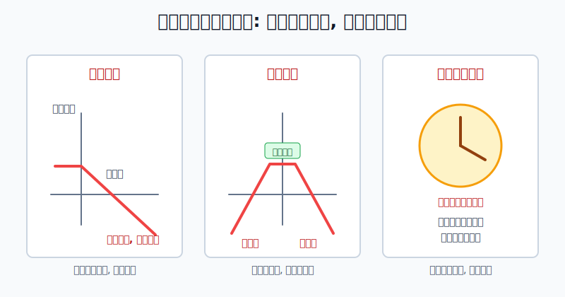
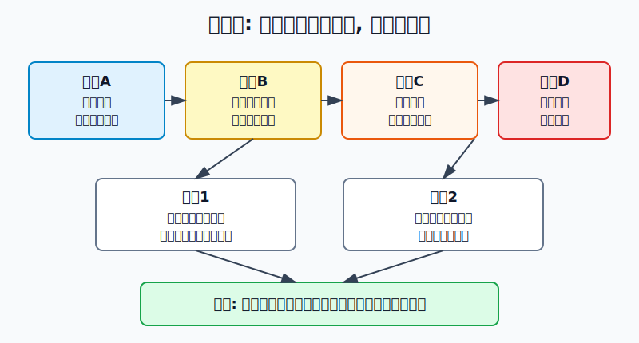
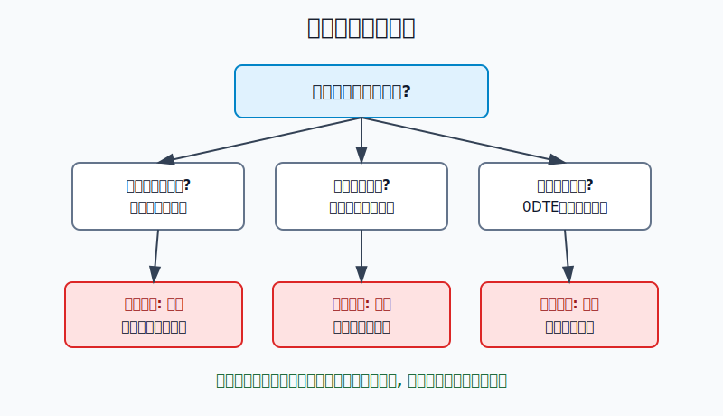

## 散户投资小白金融全品种操盘手册 - 14.11 不适合散户的策略 - 裸卖、跨式裸卖、重仓末日期权
  
### 作者  
digoal  
  
### 日期  
2026-06-07   
  
### 标签  
金融产品 , 金融工具 , 散户 , 投资小白 , 全品操盘手册  
  
----  
  
## 背景 
  

> 适用读者: 已经知道期权买方、卖方、到期日和权利金，但开始被“卖期权收租”“0DTE翻倍”“高胜率跨式”吸引的小白投资者。  
> 本文定位: 风险边界教育，不构成任何期权交易建议。

## 先问一个扎心的问题

期权里最危险的策略，往往不是看起来最复杂的，而是看起来“每天赚一点”的。散户最该警惕的不是亏一次小钱，而是用小权利金去换一个自己扛不住的大义务。

## 先把三个词翻译成人话

**裸卖**，就是你卖出期权、收取权利金，但没有足够的现货、现金或对冲头寸来接住履约义务。卖认购时，如果标的大涨，你可能要按低价交货；卖认沽时，如果标的大跌，你可能要按高价接货。

**跨式裸卖**，就是同时卖出同一标的、同一到期日、同一行权价附近的认购和认沽。它赌的是“标的别大涨，也别大跌”。听起来像收两份权利金，实际是把两边的大波动风险都收进账户。

**重仓末日期权**，通常指 0DTE 或临近到期的期权重仓交易。0DTE 是 zero days to expiration，意思是当天到期。它的特点不是“机会多”，而是“纠错时间极短”。

本节行动结论先放在前面: **小白把这三类策略列入禁用区。凡是最大亏损说不清、保证金追加扛不住、到期前没有退出规则的期权交易，一律不做。**

## 逻辑推导链

【论证链标题】: 因为裸卖和末日期权会把小额权利金变成账户级义务，所以散户必须先禁用，再学习。

── 第一步: 前提陈述

前提A: 期权卖方不是“收租人”，而是“承诺履约的人”。这是常量。你收了权利金，就像收了保险费，事故发生时要赔。

前提B: 裸卖缺少现货、现金或反向头寸兜底。这是变量，但小白账户里常见。没有兜底时，风险不是停在权利金上，而是跟着标的价格继续走。

前提C: 末日期权时间很短，价格变化和券商风控会压缩你的操作空间。这是变量，越接近到期越严酷。

前提D: 散户资金量、经验和风控系统弱于专业机构。这是常量。机构能用系统、保证金、现货和多腿组合管理风险，小白不能只抄“卖方胜率高”这半句话。

── 第二步: 逻辑推导

由A+B可得: 因为卖方承担履约义务，裸卖又没有兜底，所以权利金收入只是上限，亏损却会随标的大幅波动扩张。

由C+D可得: 因为末日期权只有很短时间纠错，而散户没有盘中风控系统，所以重仓末日期权会把一次判断错误放大成账户级亏损。

再由A+B+C+D可得: 因为这三类策略的共同结构都是“收益小、义务大、纠错时间短”，所以小白的正常操作不是降低一点仓位后尝试，而是直接列入禁用清单。

── 第三步: 正常情景下的操作结论

✅ 正常情景: 你没有成熟期权交易记录，没有足够资金处理指派和追加保证金，也不能全天盯盘。

对应操作: 不裸卖认购，不裸卖未现金担保的认沽，不做跨式裸卖，不把 0DTE 或临近到期期权做成重仓。学习期权时，只做模拟盘、保护性看跌、备兑开仓或领口策略这类风险边界更清楚的结构。

── 第四步: 数据和案例证实

证据1: OCC《Characteristics and Risks of Standardized Options》2024年6月版明确说明，裸卖认购的潜在亏损没有上限；同一文件的例子里，投资者卖出 XYZ 50 认购、收 4 美元权利金，股价涨到 69 美元附近后用 19 美元买回平仓，单张合约亏损 1500 美元。这对应前提A和B: 权利金是收入上限，不是风险上限。

证据2: OCC 同一风险披露文件还说明，卖出跨式时，投资者同时卖出认沽和认购；只要标的价格向上或向下越过行权价加减总权利金，卖方就会亏损，并且常规跨式裸卖的潜在风险没有上限。这对应前提B: 两边都裸卖，不是分散风险，而是同时暴露两边尾部。

证据3: FINRA 2026年6月4日发布的 0DTE 投资者教育文章给了两个数字例子。卖出 10 张当天到期、55 美元行权价认购，收 1 美元权利金，如果收盘价到 60 美元，亏损为 4000 美元；买入 10 张当天到期、55 美元行权价认购，付 2 美元权利金，如果收盘价只有 54 美元，则损失 2000 美元权利金。这对应前提C: 同一天里，方向、幅度和时间任何一项不够，亏损都会快速兑现。

证据4: 上交所《股票期权市场发展报告（2025）》披露，2025年上交所股票期权合约累计成交 12.75 亿张，日均权利金成交 30.14 亿元；同年个人投资者买入开仓占其开仓交易 60.98%，机构投资者卖出开仓占其开仓交易 79.62%。这说明期权市场确实活跃，但卖方交易更多由机构承担；散户不能把机构策略直接搬到小账户。

失败案例不是某个人运气差，而是结构本身会这样。只要你用裸卖或末日重仓去换小额权利金，平时很多次小胜，会被一次跳空、一根大阳线、一根大阴线、一次临收盘风控处理全部改写。

历史不代表未来。上面数据仍有参考价值，是因为它们验证的是期权机制: 卖方义务、保证金、到期日和权利金结构长期存在，而不是因为某一年某个市场一定重复同样行情。

── 第五步: 前提变化时的替代结论

若前提B改变，也就是卖方有现货或足额现金覆盖，推导路径变为: 因为最坏情况下可以交出现货或接入标的，所以风险从“裸露义务”变成“持仓机会成本或买入资产风险”。新结论: 这时可以研究备兑开仓或现金担保认沽，但仍然要有仓位上限。

若前提C改变，也就是不是临到期，而是还有较长时间，推导路径变为: 因为有更多时间调整，但波动率和标的方向仍会影响权利金，所以仍不能裸卖重仓。新结论: 只允许模拟或小仓学习有保护腿的价差策略。

若前提D改变，也就是你已经有多年期权记录、足额保证金、清楚的风控系统，推导路径变为: 你可以把卖方策略当作专业工具研究，但它仍不是“稳赢收租”。新结论: 先用组合和保证金压力测试证明自己能活过极端波动，再谈收益。

反例: “我卖了很多次都赚钱”不是证据。裸卖策略的典型问题就是胜率看起来高，但单次亏损足以覆盖多次小盈利。只统计赚钱次数，不统计最大单日亏损和追加保证金能力，是错误复盘。

## 实操例子: 看到高危策略时怎么拒绝

这个例子对应论证链的核心结论: **不能量化最大亏损，就不能下单。**

假设你有 10 万元账户，看到某 ETF 现价 3.00 元。有人建议你卖出 10 张行权价 3.10 元、当天到期的认购期权，每份权利金 0.01 元，合约单位 10000 份。

第一步，先算你最多赚多少。0.01 × 10000 × 10 = 1000 元。这是收入上限。

第二步，问有没有现货覆盖。如果你没有 10 张合约对应的 ETF 份额，一旦价格大涨，你就是裸卖认购。根据前提A和B，裸卖认购的亏损会随标的上涨扩大，不能用“只到期一天”来抵消。

第三步，做压力测试。若 ETF 当天突发上涨到 3.30 元，简单估算亏损为 (3.30 - 3.10 - 0.01) × 10000 × 10 = 19000 元，不含手续费和盘中平仓滑点。你本来想赚 1000 元，却暴露了接近 2 万元的压力。

第四步，检查时间。当天到期意味着券商可能在临收盘前评估你的履约能力并处理仓位。根据前提C，你的自由操作时间比想象中短。

第五步，写动作: 不下单。若想学习，只能在模拟盘记录这笔交易从开仓到收盘的权利金变化；若想增强收益，先回到备兑开仓章节，确认自己有现货、仓位上限和被行权后的计划。

如果你把这个策略改成跨式裸卖，也就是同时卖 3.10 认购和 3.10 认沽，问题没有消失。标的大涨，认购亏；标的大跌，认沽亏。你只是把“赌方向”换成“赌不动”，但市场从来没有义务配合你的窄区间。

如果你把它改成买入末日虚值期权重仓，风险结构从“无限或巨大义务”变成“权利金快速归零”。假设你用 3 万元买当天到期虚值认购，只要收盘没有越过行权价和权利金成本，这 3 万元就会变成学费。买方最大亏损有限，但重仓后仍然足以伤到账户。

## 可复用框架

【三不做】

适用前提: 你是散户，没有专业期权系统和全天风控能力。

核心逻辑: 因为裸卖、跨式裸卖和末日期权重仓都把小权利金连接到大亏损，所以先禁用，再学习原理。

操作步骤:

1. 没有现货或足额现金覆盖，不做卖方。
2. 同时卖出两边且没有保护腿，不做跨式。
3. 到期日在当天或很近，仓位不超过学习资金；做不到就不做。

前提失效时: 如果你已经拥有覆盖资产、保证金冗余和清楚退出规则，也只能研究备兑、现金担保或有保护腿的组合，不把裸卖当默认策略。

举一反三: 这个框架也适用于期货、杠杆ETF和融资交易。凡是收益上限小、亏损扩张快、强制平仓可能出现的工具，都先问“最坏会怎样”。

【先写后下】

适用前提: 你准备做任何期权交易。

核心逻辑: 因为期权亏损常来自没写清义务和到期规则，所以先写交易说明，再决定是否下单。

操作步骤:

1. 写最大盈利、最大亏损、盈亏平衡点。
2. 写是否可能被指派、是否需要追加保证金。
3. 写价格到哪里退出、时间剩多久退出、券商风控触发怎么办。

前提失效时: 任何一项写不出来，停止交易，改为模拟盘。

举一反三: 买个股、转债、期货也可以用这张纸。先写清楚风险，再让资金上桌。

## 本节行动清单

| 动作 | 合格标准 |
|---|---|
| 标记禁用策略 | 裸卖认购、未现金担保裸卖认沽、跨式裸卖、重仓末日期权 |
| 先算收入上限 | 权利金 × 合约单位 × 张数 |
| 再算压力亏损 | 标的跳涨或跳跌 5%、10% 时账户损失是多少 |
| 检查覆盖资产 | 卖认购是否有现货，卖认沽是否有足额现金 |
| 检查到期时间 | 0DTE 或临近到期，不做重仓 |
| 写退出规则 | 价格、时间、保证金三条线都写清 |

## 一句话总结

期权小白最重要的本事，不是找到高胜率策略，而是看见“收益有限、亏损放大、时间很短”的结构时，能立刻停手。

## 参考资料

- OCC: Characteristics and Risks of Standardized Options, 2024年6月版，https://www.theocc.com/getmedia/a151a9ae-d784-4a15-bdeb-23a029f50b70/riskstoc.pdf
- FINRA: Zeroing In on an Options Trading Strategy: 0DTE, 2026年6月4日，https://www.finra.org/investors/insights/zeroing-in-options-trading-strategy
- Cboe Global Markets: Cboe Begins Offering Daily Expirations for Dow Jones Industrial Average Index Options, 2026年5月18日，https://ir.cboe.com/news/news-details/2026/Cboe-Begins-Offering-Daily-Expirations-for-Dow-Jones-Industrial-Average-Index-Options/default.aspx
- 上海证券交易所: 《上海证券交易所股票期权市场发展报告（2025）》，https://big5.sse.com.cn/site/cht/www.sse.com.cn/aboutus/research/report/c/10814750/files/d1800de82bbe4613a2fe93e0853b7a3a.pdf
- 上海证券交易所: 《上海证券交易所股票期权试点投资者适当性管理指引（2017年修订）》，https://www.sse.com.cn/lawandrules/sselawsrules2025/option/c/c_20250610_10781453.shtml

> ⚠️ **声明**：本文内容为投资教育目的，所有历史数据、策略框架均为辅助学习工具，不构成证券投资建议。市场有风险，投资需谨慎。实际操作请结合自身风险承受能力，必要时咨询专业投顾。
  
#### [PostgreSQL 解决方案集合](../201706/20170601_02.md "40cff096e9ed7122c512b35d8561d9c8")
  
  
#### [德哥 / digoal's Github - 公益是一辈子的事.](https://github.com/digoal/blog/blob/master/README.md "22709685feb7cab07d30f30387f0a9ae")
  
  
#### [About 德哥](https://github.com/digoal/blog/blob/master/me/readme.md "a37735981e7704886ffd590565582dd0")
  
  

  
