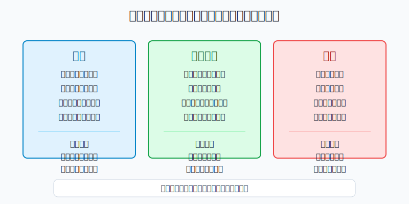
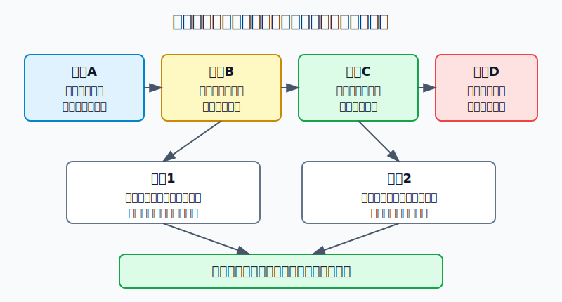
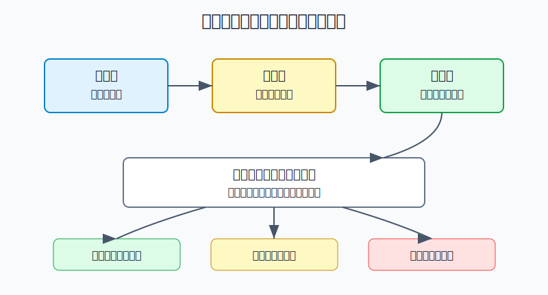

## 散户投资小白金融全品种操盘手册 - 14.12 期权复盘 - 你是在保险、增强收益，还是赌博
  
### 作者  
digoal  
  
### 日期  
2026-06-07   
  
### 标签  
金融产品 , 金融工具 , 散户 , 投资小白 , 全品操盘手册  
  
----  
  
## 背景 
  

> 适用读者: 已经学过保护性看跌、备兑开仓、领口策略、希腊字母和期权红线，但每次交易结束后只会看“赚了还是亏了”的小白投资者。  
> 本文定位: 投资教育框架，不构成个性化投资建议。

## 先问一个反直觉的问题

期权复盘里最没用的一句话是: “这次方向看错了。”因为期权交易亏钱，不一定是方向错；赚钱，也不一定是方法对。真正要问的是: **你这笔期权到底是在买保险、增强收益，还是拿时间和杠杆买彩票？**

## 核心概念: 期权复盘不是盈亏日记，而是目的审计

股票复盘可以先问“买入理由还在不在”。期权复盘要多问三层: 到期日有没有逼近、权利金有没有被时间吃掉、卖方义务有没有超出准备。

所以本节的行动结论先放在前面: **每一笔期权交易结束后，先贴标签，再看盈亏。能说清保护对象、权利金预算和止损动作的，是保险；能说清覆盖资产、行权价和履约准备的，是增强收益；只说“我觉得会大涨大跌”“这张便宜”“最多亏这点”的，就是赌博样本。赌博样本即使赚钱，也不能复制。**

## 逻辑推导链

【论证链标题】: 因为期权同时受方向、时间、权利金和义务影响，所以复盘必须先判断交易目的，再判断盈亏是否值得复制。

── 第一步: 前提陈述

前提A: 期权有到期日，时间会改变交易结果。这是常量。它像一张有有效期的保险单，过期以后再有道理也不能理赔。

前提B: 买方先付权利金，卖方先收权利金；权利金既是成本，也是风险边界的一部分。这是常量。你不能只说“看对了方向”，还要问买得贵不贵、卖出义务有没有被覆盖。

前提C: 期权的合理用途通常围绕已有资产或明确现金计划展开。这是变量。保护性看跌要有被保护的持仓；备兑开仓要有能交割的现货；现金担保卖出认沽要有愿意买入标的的现金。

前提D: 小白最容易把低权利金、临近到期和高杠杆混成“便宜机会”。这是行为变量。它看起来只是一次小额尝试，连续做就会变成系统性消耗。

── 第二步: 逻辑推导

由A+B可得: 因为期权有时间门槛和权利金成本，所以复盘不能只写“标的涨跌判断对不对”。同样上涨2%，买入近月虚值认购可能仍亏钱；同样权利金到账，裸卖期权和备兑开仓的风险完全不同。

由B+C可得: 因为权利金必须对应风险边界，所以一笔交易若没有保护对象、没有覆盖资产、没有履约准备，它就不能被归为保险或增强收益。

再由A+B+C+D可得: 因为小白会把“亏损有限的小票”误当成低风险，把“收权利金”误当成稳定收益，所以复盘第一步必须贴标签。**标签不清，盈亏没有教学价值；标签错位，赚钱也要降级处理。**

── 第三步: 正常情景下的操作结论

✅ 正常情景: 你学习期权的目标是管理组合风险或理解收益增强，不是靠末日期权翻倍；你还没有成熟期权系统。

对应操作: 每笔交易结束后按“保险、增强收益、赌博”三类归档。保险交易看是否降低组合回撤，不能因为权利金归零就判失败；增强收益看是否按计划承担行权义务，不能只看权利金收入；赌博交易不进入策略库，只进入红线样本库。

── 第四步: 数据和案例证实

证据1: SEC Investor.gov 的期权入门公告用“ABC December 70 Call $2.20”说明，一张美国股票期权通常对应100股，2.20美元每股权利金等于220美元合约成本；若到期股价为65美元，低于70美元行权价，买方会损失全部220美元权利金。这个案例对应前提A和B: 方向、时间、行权价和权利金必须一起复盘。

证据2: 上交所上证50ETF期权合约基本条款显示，50ETF期权合约单位为10000份，到期月份包括当月、下月及随后两个季月，到期日为到期月份第四个星期三。这个规则对应前提A和C: A股ETF期权不是随手押涨跌的小票，而是带合约单位、到期日和行权安排的标准化合同。

证据3: OCC 2026年1月5日发布的年度数据中，2025年美国清算期权合约总量为15,207,163,554张，比2024年增长24.4%。交易量说明期权是成熟市场的常用工具，但不能推出“小白适合频繁短线”。越是标准化、活跃的工具，越需要用复盘把用途和风险边界写清。

证据4: 《上海证券交易所股票期权市场发展报告（2025）》披露，2025年上交所上证50ETF期权总成交量为27,290.614万张，沪深300ETF期权总成交量为27,612.506万张。报告同时统计权利金成交额、持仓量和行权量。这对应前提B和C: 期权市场真实运行的是权利金、持仓和行权，不只是“猜涨猜跌”。

失败案例: 你买入临近到期的虚值认购，只因为它每张只要几十元。到期前标的确实上涨了1%，但仍没有越过行权价加权利金的盈亏平衡点，最后权利金归零。这不是“差一点就成功”，而是前提A和B共同失效: 时间不够，价格门槛太远，权利金买得没有胜率。

历史不代表未来。上面数据仍有参考价值，是因为它们验证的是期权的制度规律: 合约单位、到期日、行权价、权利金和履约义务决定交易性质；不是因为某一年成交量高，下一年就一定适合你参与。

── 第五步: 前提变化时的替代结论

若前提C改变，也就是你没有被保护的持仓，却买了大量认沽，推导路径变为: 因为没有保护对象，所以这不是保险，而是看跌投机。新结论: 只能按赌博样本复盘，下一次必须降低金额或退回模拟盘。

若前提B改变，也就是你卖出期权却没有现货或现金覆盖，推导路径变为: 因为权利金收入背后没有风险边界，所以这不是增强收益，而是裸卖风险。新结论: 停止同类实盘，先学习保证金、指派和强平规则。

若前提A变差，也就是距离到期只剩很短时间，推导路径变为: 因为时间价值会快速消耗，所以“便宜”反而可能代表胜率低。新结论: 不把临近到期虚值期权作为小白默认工具。

## 实操例子: 10万元ETF持仓如何复盘一笔期权

这个例子对应论证链的正常结论: **先判断交易目的，再判断结果。**

假设小林持有约9万元50ETF，价格3.00元，约30000份。他担心未来一个月下跌，但不想卖掉核心持仓。

第一步，交易前贴标签: 保险。保护对象是30000份50ETF，保险预算不超过持仓市值的1%，也就是900元。若某认沽期权权利金为0.03元，合约单位10000份，一张成本300元，买入3张刚好覆盖30000份，成本900元。判断依据来自前提C: 有明确保护对象，才叫保险。

第二步，交易后按保险口径复盘。若到期时50ETF上涨，认沽期权归零，小林亏掉900元权利金。这个结果不一定失败，因为保险的目标不是赚钱，而是在下跌时降低组合伤害。复盘要写: 保险费是否在预算内、是否覆盖了对应份额、是否因为恐慌买得过贵。

第三步，切换到增强收益样本。假设小林持有30000份50ETF，并且愿意在3.10元卖出一部分，于是做3张备兑开仓，收取每份0.02元权利金，总计600元。复盘时不能只写“赚了600元”，还要写: 如果被行权，是否愿意按3.10元卖出；如果标的大涨到3.30元，是否接受少赚的机会成本。判断依据来自前提B和C: 收权利金的同时，也卖出了部分上涨空间。

第四步，识别赌博样本。假设小林没有新增资金计划，也没有保护对象，却因为“快到期很便宜”买入10张虚值认购，每张权利金0.01元，总成本1000元。他如果亏完，不能写“市场不给机会”；他如果赚到，也不能写“策略有效”。正确复盘是: 目的不属于保险，也不属于增强收益，只是高杠杆短线押注。下一次动作是减少金额、停止连续实盘，或者退回模拟盘。

如果操作错误，后果很直接。你把保险复盘成“没赚钱所以失败”，下一次市场下跌前就会舍不得买保护；你把增强收益复盘成“收权利金很稳”，下一次就可能从备兑开仓滑向裸卖；你把赌博复盘成“只要方向对就行”，连续几次权利金归零后，亏损会从小额尝试变成习惯性损耗。

## 可复用框架

【三标签复盘】

适用前提: 任何一笔期权交易已经结束，或准备进入复盘表。

核心逻辑: 因为期权的同一笔盈亏可能来自不同目的，所以先按目的分类，再看结果。

操作步骤:

1. 保险: 写清保护对象、保护期限、权利金预算和最大可接受成本。
2. 增强收益: 写清覆盖资产或现金、行权价、被行权后的动作。
3. 赌博: 只要没有保护对象、没有履约准备、没有止损规则，就归入赌博样本。

前提失效时: 如果一笔交易无法归入保险或增强收益，不能因为金额小就放行；如果连续出现3笔赌博样本，暂停期权实盘。

举一反三: 这个框架也适用于期货、杠杆ETF、黄金T+D和所有带时间损耗或保证金义务的工具。

【四因归位】

适用前提: 你已经知道这笔交易亏了或赚了，但不知道该改什么。

核心逻辑: 因为期权结果由方向、时间、权利金和义务共同决定，所以错因不能都归为“看错方向”。

操作步骤:

1. 方向错: 标的没有按预期运行，下次先降低方向判断权重。
2. 时间错: 到期太近或持有太久，下次延长观察期或不碰末日期权。
3. 成本错: 权利金太贵，盈亏平衡点太远，下次先算胜率和成本。
4. 义务错: 卖方风险没有覆盖，下次停止裸卖，只做有资产或现金支持的结构。

前提失效时: 如果你无法分清四个错因，说明还不能复盘期权实盘，先回到模拟盘和合约翻译练习。

举一反三: ETF、个股和转债复盘也可以用“方向、成本、时间、仓位”四因归位。

## 本节行动清单

| 动作 | 合格标准 |
|---|---|
| 每笔先贴标签 | 保险、增强收益、赌博三选一，不能空着 |
| 保险看保护效果 | 写清保护对象、期限、预算，不以权利金归零判失败 |
| 增强收益看义务 | 写清被行权后的交割动作，不只看收了多少权利金 |
| 赌博样本不复制 | 即使赚钱，也不进入策略库 |
| 复盘四个错因 | 方向、时间、成本、义务至少归因一个 |
| 连续失控就暂停 | 连续3笔赌博样本或裸卖冲动，停止实盘复盘一周 |

## 一句话总结

期权复盘不是问“这次赚没赚”，而是问“这笔交易的目的和风险边界是否清楚”；保险看保护，增强收益看义务，赌博样本只负责提醒你停手。

## 参考资料

- SEC Investor.gov: Investor Bulletin: An Introduction to Options, 2015年3月18日，https://www.investor.gov/introduction-investing/general-resources/news-alerts/alerts-bulletins/investor-bulletins-63
- 上海证券交易所: 上证50ETF期权合约基本条款，2023年3月3日，https://big5.sse.com.cn/site/cht/www.sse.com.cn/assortment/options/contract/c/c_20230303_5717359.shtml
- OCC: OCC Annual 2025 and December 2025 Volume, 2026年1月5日，https://www.theocc.com/newsroom/views/2026/01-05-occ-annual-2025-and-december-2025-volume
- 上海证券交易所: 《上海证券交易所股票期权市场发展报告（2025）》，https://big5.sse.com.cn/site/cht/www.sse.com.cn/aboutus/research/report/c/10814750/files/d1800de82bbe4613a2fe93e0853b7a3a.pdf

> ⚠️ **声明**：本文内容为投资教育目的，所有历史数据、策略框架均为辅助学习工具，不构成证券投资建议。市场有风险，投资需谨慎。实际操作请结合自身风险承受能力，必要时咨询专业投顾。
  
#### [PostgreSQL 解决方案集合](../201706/20170601_02.md "40cff096e9ed7122c512b35d8561d9c8")
  
  
#### [德哥 / digoal's Github - 公益是一辈子的事.](https://github.com/digoal/blog/blob/master/README.md "22709685feb7cab07d30f30387f0a9ae")
  
  
#### [About 德哥](https://github.com/digoal/blog/blob/master/me/readme.md "a37735981e7704886ffd590565582dd0")
  
  

  
