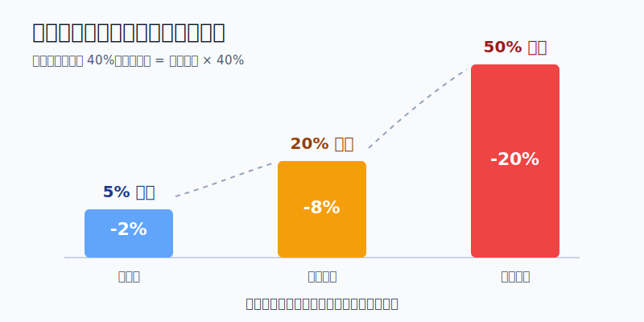
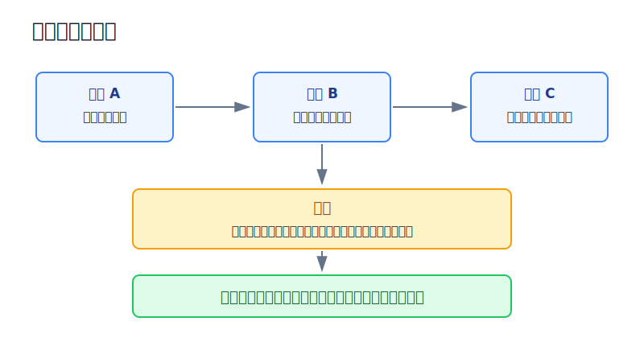
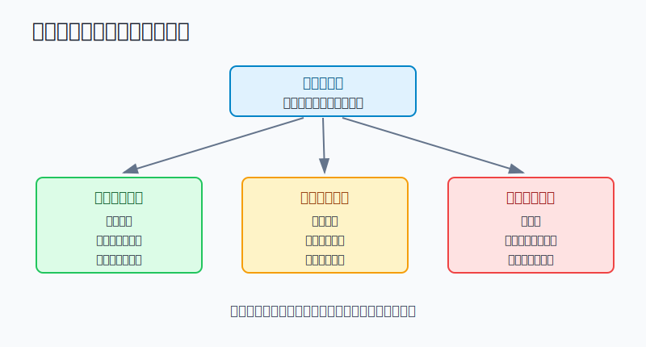

## 散户投资小白金融全品种操盘手册 - 15.1 为什么大多数亏损不是看错，而是仓位错
  
### 作者  
digoal  
  
### 日期  
2026-06-07   
  
### 标签  
金融产品 , 金融工具 , 散户 , 投资小白 , 全品操盘手册  
  
----  
  
## 背景 
  

> 适用读者: 已经买过基金、ETF或个股，但经常出现“一笔亏损把前面收益吐回去”的小白投资者。  
> 本文定位: 投资教育框架，不构成个性化投资建议。

## 先问一个反直觉的问题

同样买错一只股票，为什么有人只是亏一顿饭钱，有人却亏到睡不着？答案通常不是谁更聪明，而是谁把仓位开得太大。**市场让你亏钱，仓位决定你亏到什么程度。**

## 核心概念: 仓位不是“买了多少”，而是“错了伤多深”

仓位，就是某个资产占你总投资账户的比例。10万元账户买了2万元沪深300ETF，仓位就是20%。买了5万元某只个股，仓位就是50%。

很多小白看仓位，只看“我有多看好”。这很危险。专业一点的看法是: **仓位不是信心表达，而是风险预算。** 风险预算就是你提前规定: 这笔交易如果错了，最多允许它伤到账户多少。

举个简单例子。10万元账户，某资产下跌40%:

| 仓位 | 资产亏损 | 账户亏损 | 结果 |
|---|---:|---:|---|
| 5% | -40% | -2% | 难受，但能复盘 |
| 20% | -40% | -8% | 需要纠偏 |
| 50% | -40% | -20% | 心态容易变形 |

这就是仓位管理的第一性原理: **你无法保证判断永远正确，但可以保证一次错误不把账户打穿。**

本节行动结论先放在前面: 买入任何品种前，先写下三个数字: 这笔资产最大仓位、如果买错的预估跌幅、这笔错误最多允许亏掉账户多少。三个数字算不出来，不下单；算出来超过预算，先缩仓位，不靠“我很看好”硬上。

## 逻辑推导链

【论证链标题】: 因为判断错误不可避免，而仓位会把同一个判断错误放大或缩小，所以散户要先定最大可承受亏损，再反推仓位上限。

── 第一步: 前提陈述

前提A: 投资判断一定会错，这是常量。再认真研究，也会遇到财报变脸、政策变化、流动性冲击、行业竞争恶化、市场整体杀估值。它像开车一定会遇到红灯，不能假设一路绿灯。

前提B: 账户亏损由“仓位 × 标的跌幅”决定，这是常量。你看错一只股票下跌40%，如果只买5%仓位，账户亏2%；如果买50%仓位，账户亏20%。同样判断错误，伤口大小完全不同。

前提C: 单个资产和单一赛道存在不可分散风险，这是变量，但会反复出现。不可分散风险，是指只押一个公司、一个行业、一个国家或一种风格时，某个局部问题就能伤到整个账户。

前提D: 小白亏损后最容易加仓、扛单、找理由，这是行为偏差。仓位越大，人越难承认错误；因为承认错误等于承认账户已经受伤。

── 第二步: 逻辑推导

由A可得: 因为判断一定会错，所以买入计划不能建立在“这次我肯定对”上，而要建立在“如果错了，我能不能承受”上。

由A+B可得: 因为账户亏损等于仓位乘以标的跌幅，所以第一件事不是预测它能涨多少，而是计算它跌到哪里时账户亏多少。

再由A+B+C可得: 因为单个资产存在永久性大跌和长期跑输的风险，所以越是个股、行业ETF、主题基金、可转债、REITs、黄金或海外单一资产，越不能用全部资金表达观点。

最后由A+B+C+D可得: 因为仓位过大会让心理失控，所以仓位规则必须写在买入前。**先把错误封在小范围内，再讨论胜率和收益率。**

── 第三步: 正常情景下的操作结论

✅ 正常情景: 你是普通散户，投资资金不是无限的；你没有稳定验证过的择时系统；你买入的资产存在波动和回撤；这笔钱亏掉太多会影响睡眠、生活或后续决策。

对应操作: 对每一笔买入先设账户级亏损上限。小白可以把单笔错误亏损先限制在总账户的1%-2%以内。公式是:

> 单个资产仓位上限 = 单笔账户亏损上限 ÷ 该资产可能跌幅

如果你认为某只个股买错后可能跌40%，而你只允许账户为这笔错误亏2%，那仓位上限就是2% ÷ 40% = 5%。如果你想买20%仓位，就等于默认这只股票下跌40%时账户亏8%；这个结果你承受不了，就说明20%不是投资，是情绪下注。

── 第四步: 数据和案例证实

证据1: FINRA 在2022年6月15日的投资者教育文章中，把集中风险定义为: 当投资组合中很大一部分集中在某个投资、资产类别或市场板块时，亏损会被放大。它给出的管理方法包括跨资产和资产内部做分散、定期再平衡、检查基金和ETF底层持仓是否重叠。这对应前提B和C: 亏损放大不是因为你一定买了坏资产，而是因为风险暴露太集中。

证据2: SEC 的《资产配置、分散化和再平衡入门指南》说明，股票、债券、现金等资产在不同市场环境下表现不会完全同步；把资金放在多个资产类别里，可以降低组合整体亏损和波动。SEC 还提醒，股票部分如果只买四五只个股，并不能算真正分散；总股票市场指数基金可以一次持有数千家公司。这对应前提C: 分散不是为了追求花样，而是为了防止单一错误控制账户。

证据3: Hendrik Bessembinder 的论文《Do Stocks Outperform Treasury Bills?》研究1926年以来美国普通股表现，结论是约七分之四的普通股终身买入持有收益低于一个月期美国国库券；从财富创造角度看，表现最好的4%上市公司解释了美国股票市场自1926年以来的净财富增长。这对应前提A和C: 长期看，市场整体能赚钱，不代表随便挑一只股票重仓就能赚钱。

证据4: J.P. Morgan Wealth Management 的《The Agony & The Ecstasy》2021年报告统计，1980-2020年曾进入 Russell 3000 的公司中，44%经历过“灾难性股价损失”，即从高点下跌70%且未恢复；42%的股票在这段时间为负绝对收益，66%跑输 Russell 3000，只有10%被定义为“超级赢家”。这对应前提B和C: 单股长期持有的结果分布非常偏，重仓押错一个资产，伤害会长期留在账户里。

证据5: S&P Global 在2020年5月市场回顾中记录，S&P 500 从2020年2月19日高点到2020年3月23日低点下跌33.9%。这对应前提A: 即使是高度分散的宽基指数，也会在极端市场里快速回撤。如果宽基都可能一个月左右跌三成，单一股票、行业、主题和杠杆工具更不能默认“跌不到哪里去”。

失败案例: 一个10万元账户，5万元买入单只热门成长股，理由是“公司好、赛道大、大家都看好”。如果股价从高点下跌50%，账户直接亏25%。这时他很难冷静复盘，因为本金已经受伤；他更容易补仓、骂市场、等回本，最后把一次仓位错误拖成长期套牢。问题不在于他当初是否完全不懂公司，而在于他让单一判断承担了半个账户的命运。

历史不代表未来。上面数据仍有参考价值，是因为它们验证的是结构规律: 判断会错，个股和行业结果高度分化，宽基也会大幅回撤，集中仓位会放大账户亏损。仓位管理不是预测哪只股票会跌，而是承认任何资产都有跌错、跌深、跌久的可能。

── 第五步: 前提变化时的替代结论

若前提B被低估，也就是你只看“这个资产最多跌多少”，却没算“它占账户多少”，推导路径变为: 因为你忽略了仓位乘数，所以小跌幅也能造成大伤口。新结论: 立刻重算账户级亏损，超过预算就减仓。

若前提C变强，也就是你买的是个股、行业ETF、主题基金、转债、REITs、黄金、商品或跨境资产，而不是宽基核心仓，推导路径变为: 因为局部风险更高，所以仓位上限必须低于宽基核心仓。新结论: 单一资产先按小仓位试错，不用核心仓比例买非核心资产。

若前提D出现，也就是你开始说“跌了这么多不能卖”“再补一点就回本”“我研究过不会错”，推导路径变为: 因为情绪已经替代规则，所以继续加仓会放大错误。新结论: 停止加仓，只允许按计划减仓、止损或等待下一次复盘。

反例: 如果你买的是分散宽基ETF，并且这笔资金有10年以上不用，短期回撤并不等于逻辑失效。此时仓位规则不是“跌了就卖”，而是回到资产配置表: 宽基核心仓是否超过上限、现金和债券防守仓是否足够、生活资金是否没有被动用。前提不同，操作也不同。

## 实操例子: 10万元账户如何把“看错”关进笼子

这个例子对应论证链的正常结论: **先定单笔账户亏损上限，再反推仓位，而不是先买满再祈祷。**

假设小陈有10万元投资资金，另外已经留足6个月生活费。他想买一只新能源行业ETF，同时还想买一只自己看好的个股。

第一步，设账户级亏损上限。小陈规定: 任何单一非核心资产，如果买错，最多只允许让总账户亏2%。10万元账户，2%就是2000元。这对应前提A: 先承认判断会错。

第二步，估算资产可能跌幅。行业ETF波动比宽基大，小陈按买错后可能跌30%估算；个股波动更大，按买错后可能跌40%估算。这个数字不是预测，而是压力测试。压力测试就是先假设坏情况发生，看看账户能不能扛住。

第三步，反推仓位。行业ETF仓位上限 = 2000 ÷ 30% = 6667元，约占账户6.7%；个股仓位上限 = 2000 ÷ 40% = 5000元，占账户5%。如果他想买2万元个股，就要承认: 个股跌40%时账户亏8000元，也就是8%。如果8%会让他失眠，那2万元仓位就是错误。

第四步，写下触发动作。行业ETF如果跌到预估压力区，同时行业基本逻辑没有恶化，可以暂停买入、等待复盘；如果个股财报、竞争格局或现金流逻辑被破坏，不用等跌满40%，按计划减仓或退出。这对应前提C: 不同资产的失效条件不同。

第五步，禁止亏损后加倍。小陈不能因为亏了10%就把个股从5%加到15%，除非原先买入逻辑被新证据增强，而且总账户最大亏损仍在2%预算内。否则这不是加仓，是让情绪接管账户。

如果前提切换，操作也切换。若小陈买的是沪深300、中证A500、标普500这类宽基核心ETF，仓位可以比个股更高，但仍要受总资产配置约束；若买的是单一主题、单一行业、单只股票、带杠杆或流动性差的工具，仓位就要更低。若他无法估算可能跌幅，说明工具还没看懂，动作不是少买一点，而是先不买。

如果操作错误，后果很直接。小陈若把10万元中的5万元买成单只个股，遇到50%回撤，账户亏25%。要从亏25%回到原点，需要上涨33.3%。这时他不只需要判断正确，还需要时间、运气和情绪稳定。仓位错，会让普通亏损变成长期负担。

## 可复用框架

【先定亏损】

适用前提: 你准备买入任何有波动的资产，包括ETF、个股、转债、黄金、REITs、QDII、港股、美股、期权或期货。

核心逻辑: 因为判断会错，仓位会放大错误，所以先定账户最多亏多少，再反推可以买多少。

操作步骤:

1. 定账户亏损上限: 单笔错误先用总账户1%-2%作为小白默认上限。
2. 估资产可能跌幅: 宽基、行业、个股、杠杆工具分别做压力测试。
3. 反推仓位: 仓位上限 = 账户亏损上限 ÷ 资产可能跌幅。
4. 写失效条件: 价格、逻辑、时间三个维度至少写一个。
5. 执行复盘: 到触发点先处理风险，再讨论观点。

前提失效时: 如果你无法估算跌幅、流动性和失效条件，不下单；如果算出的仓位太小，说明这个资产不适合用大钱买。

举一反三: 这个框架后面可以直接用于单品种仓位上限、金字塔加仓、分批买入、止损和再平衡。

【仓位红线】

适用前提: 你已经有持仓，想判断是否过度集中。

核心逻辑: 因为集中风险会让单一错误控制账户，所以任何资产超过上限都要被解释，而不是被情绪默许。

操作步骤:

1. 单只个股不替代核心资产，先按5%以内学习仓处理。
2. 单一行业或主题不当成全市场，超过10%要写清理由和退出条件。
3. 防守资产不能被进攻仓挤掉，生活钱和现金垫不参与冒险。
4. 盈利导致仓位被动变大时，靠再平衡把风险拉回计划。

前提失效时: 如果你持有的是长期宽基核心仓，可以用更高比例，但必须有现金、防守资产和投资期限支撑；如果你持有的是高波动、杠杆、低流动性工具，上限要继续下调。

举一反三: 这个框架也适用于家庭资产，不要让房产、公司股权、单一股票或单一币种控制全部财务命运。

## 本节行动清单

| 动作 | 合格标准 |
|---|---|
| 写总账户金额 | 知道所有投资资金合计是多少，不把生活费算进冒险资金 |
| 定单笔亏损上限 | 小白先用总账户1%-2%作为单笔错误上限 |
| 估算压力跌幅 | 宽基、行业、个股、杠杆工具分别估，不混用 |
| 反推仓位 | 用“账户亏损上限 ÷ 资产可能跌幅”算出买入金额 |
| 写失效条件 | 至少写清价格跌到哪、逻辑坏在哪里、多久不验证就复盘 |
| 检查集中度 | 单股、单行业、单主题、单国家、单币种是否过度集中 |
| 禁止亏损加倍 | 跌了以后不靠补仓证明自己，必须重新通过仓位公式 |

## 一句话总结

看错是投资的一部分，仓位错才会把一次看错变成账户事故；先定亏损，再定买多少。

## 参考资料

- FINRA: Concentrate on Concentration Risk, 2022年6月15日，https://www.finra.org/investors/insights/concentration-risk
- SEC: Beginners' Guide to Asset Allocation, Diversification, and Rebalancing，2009年8月28日更新，https://www.sec.gov/investor/pubs/assetallocation.htm
- Hendrik Bessembinder: Do Stocks Outperform Treasury Bills?, Journal of Financial Economics / SSRN, 2018年5月28日，https://papers.ssrn.com/sol3/papers.cfm?abstract_id=2900447
- J.P. Morgan Wealth Management: The Agony & The Ecstasy, 2021年3月15日，https://assets-uat-new.jpmprivatebank.com/content/dam/jpm-wm-aem/global/pb/en/insights/eye-on-the-market/agony-ecstasy-2021.pdf
- S&P Global: U.S. Equities May 2020，2020年6月，https://www.spglobal.com/en/research-insights/market-insights/u-s-equities-may-2020

> ⚠️ **声明**：本文内容为投资教育目的，所有历史数据、策略框架均为辅助学习工具，不构成证券投资建议。市场有风险，投资需谨慎。实际操作请结合自身风险承受能力，必要时咨询专业投顾。
  
#### [PostgreSQL 解决方案集合](../201706/20170601_02.md "40cff096e9ed7122c512b35d8561d9c8")
  
  
#### [德哥 / digoal's Github - 公益是一辈子的事.](https://github.com/digoal/blog/blob/master/README.md "22709685feb7cab07d30f30387f0a9ae")
  
  
#### [About 德哥](https://github.com/digoal/blog/blob/master/me/readme.md "a37735981e7704886ffd590565582dd0")
  
  

  
